# Find the Insertion Index

You are given a sorted array that contains unique values, along with an integer target.

- If the array contains the target value, return its index.

- Otherwise, **return the insertion index**. This is the index where the target would be if it were inserted in order, maintaining the sorted sequence of the array.

#### Example 1:

```python
Input: nums = [1, 2, 4, 5, 7, 8, 9], target = 4
Output: 2

```

#### Example 2:

```python
Input: nums = [1, 2, 4, 5, 7, 8, 9], target = 6
Output: 4

```

Explanation: 6 would be inserted at index 4 to be positioned between 5 and 7: `[1, 2, 4, 5, 6, 7, 8, 9]`.

## Intuition

The goal of this problem varies depending on whether the sorted input array contains the target value or not. If it does, we should return its index. If it doesn’t, we return its insertion index.

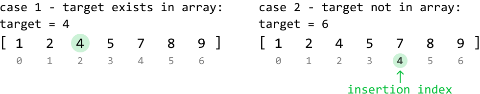

When the target doesn’t exist in the array, we observe the insertion index is found at the first value in the array greater than the target, as can be seen in the second diagram above, where the first value larger than the target of 6, is 7.

Since we don’t know if the target exists in the array before we start looking for it, we can combine both cases by finding the **first value greater than or equal to the target**. This gives us a universal objective regardless of whether the target is in the array or not.

As the array is sorted, we can use **binary search** to find the desired index.

**Binary search**

In this binary search, we’re effectively looking for the first value that matches a **condition**, where the condition is that the number is greater than or equal to the target. Let’s visualize which values of the array meet this condition and which don’t:

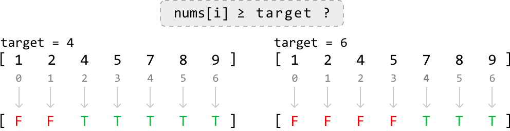

From this diagram, we can see the value we want to find is effectively the **lower bound** of values that satisfy this condition:

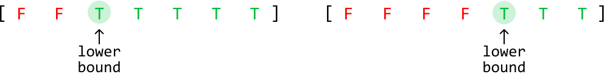

Note that finding the lower bound is equivalent to finding the leftmost value. With this in mind, let’s come up with an algorithm.

First, **define the search space**. If the target exists in the array, it could be located at any index within the range from 0 to n - 1. However, if the target is not in the array and is larger than all the elements, its insertion index is n. Therefore, our search space should cover all indexes in the range **[0, n]**.

To figure out how we **narrow the search space**, let’s first explore an example array that contains the target, then dive into an example where the array doesn’t contain the target.

**Target exists in the array**

Consider searching for target value 4 in the following sorted array.

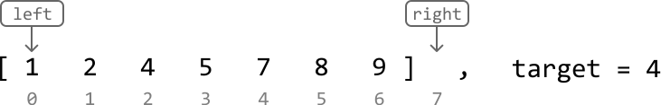

---

Initially, the midpoint is positioned at element 5, which is a number that satisfies our condition of being greater than or equal to the target. This means the lower bound is either at this midpoint, or to its left since the lower bound is the leftmost value that satisfies the condition.

So, narrow the search space toward the left, while including the midpoint (i.e., `right = mid`):

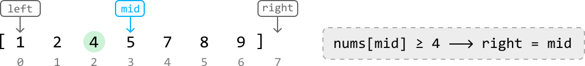

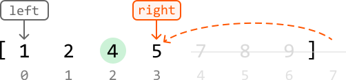

---

Now, the midpoint is positioned at element 2. The lower bound should be a value greater than or equal to the target (4), which means the current midpoint is too small. To look for a larger value, we need to search to the right of the midpoint.

So, narrow the search space toward the right while excluding the midpoint:

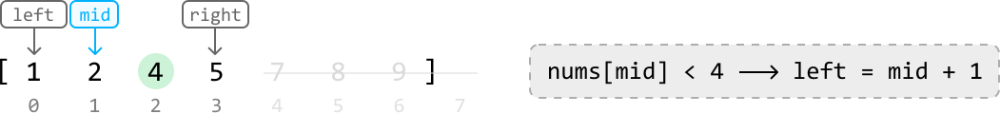

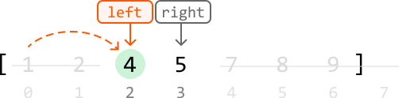

---

Now, the midpoint is positioned at element 4, which satisfies the condition of being greater than or equal to the target. So, narrow the search space toward the left while including the midpoint:

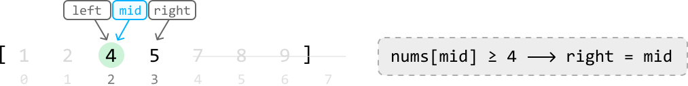

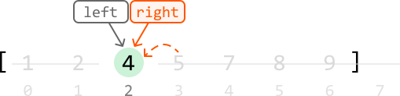

Once the left and right pointers meet, the lower bound is located, which is the first value greater than or equal to the target. Now, we just return `left` to return this value’s index.

---

**Target doesn’t exist in the array**

Let’s test the above logic in the following example where the target is not in the array:

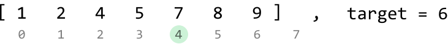

---

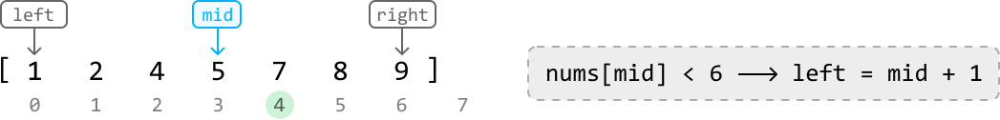

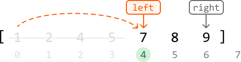

---

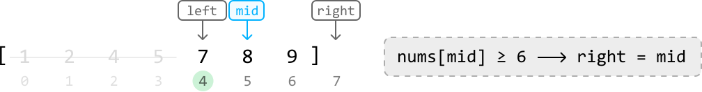

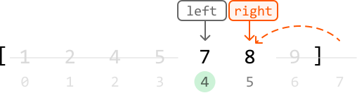

---

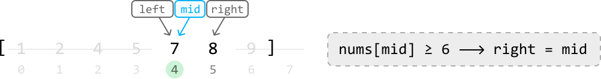

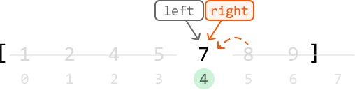

As we can see, by the end of the binary search, we’ve narrowed down the search space to a single value, identifying index 4 as the insertion index. Return `left`.

---

**Summary**

For clarity, let’s summarize the two main scenarios we encounter while narrowing down the search space.

Case 1: The midpoint value is greater than or equal to the target, indicating the lower bound is either at the midpoint, or to its left. In this case, we narrow the search space toward the left, ensuring the midpoint is included:

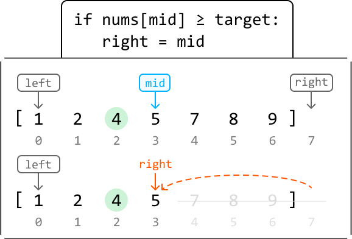

Case 2: The midpoint value is less than the target, indicating the lower bound is somewhere to the right. In this case, we narrow the search space toward the right, ensuring the midpoint is excluded:

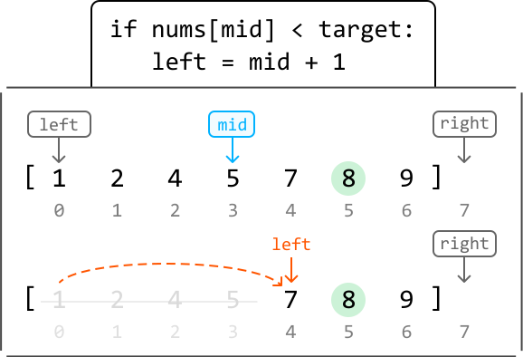

## Implementation

```python
from typing import List
    
def find_the_insertion_index(nums: List[int], target: int) -> int:
    left, right = 0, len(nums)
    while left < right:
        mid = (left + right) // 2
        # If the midpoint value is greater than or equal to the target, the lower
        # bound is either at the midpoint, or to its left.
        if nums[mid] >= target:
            right = mid
        # The midpoint value is less than the target, indicating the lower bound is
        # somewhere to the right.
        else:
            left = mid + 1
    return left

```

```javascript
export function find_the_insertion_index(nums, target) {
  let left = 0
  let right = nums.length
  while (left < right) {
    const mid = Math.floor((left + right) / 2)
    // If the midpoint value is greater than or equal to the target, the lower
    // bound is either at the midpoint, or to its left.
    if (nums[mid] >= target) {
      right = mid
    }
    // The midpoint value is less than the target, indicating the lower bound is
    // somewhere to the right.
    else {
      left = mid + 1
    }
  }
  return left
}

```

```java
import java.util.ArrayList;

public class Main {
    public int find_the_insertion_index(ArrayList<Integer> nums, int target) {
        int left = 0, right = nums.size();
        while (left < right) {
            int mid = (left + right) / 2;
            // If the midpoint value is greater than or equal to the target, the lower
            // bound is either at the midpoint, or to its left.
            if (nums.get(mid) >= target) {
                right = mid;
            }
            // The midpoint value is less than the target, indicating the lower bound is
            // somewhere to the right.
            else {
                left = mid + 1;
            }
        }
        return left;
    }
}

```

### Complexity Analysis

**Time complexity:** The time complexity of `find_the_insertion_index` is O(log(n)) because it performs a binary search over a search space of size n+1.

**Space complexity:** The space complexity is O(1).