# First and Last Occurrences of a Number

Given an array of integers sorted in non-decreasing order, return the **first and last indexes** of a target number. If the target is not found, return `[-1, -1]` .

#### Example 1:

```python
Input: nums = [1, 2, 3, 4, 4, 4, 5, 6, 7, 8, 9, 10, 11],
       target = 4
Output: [3, 5]

```

Explanation: The first and last occurrences of number 4 are indexes 3 and 5, respectively.

## Intuition

A brute-force solution to this problem involves a linear search to find the first and last occurrences of the target number. However, since the array is sorted, we can try searching for these two occurrences using **binary search**.

The challenge of using binary search here is that we need to find two separate occurrences of the same number. This means that a standard binary search alone isn’t sufficient.

To help us find a solution, it’s important to understand that the problem is effectively asking us to find the lower and upper bound of a number in the array:

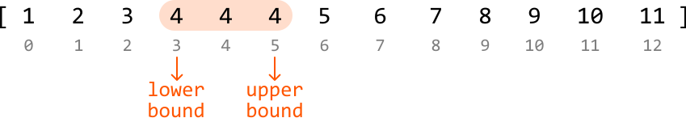

This indicates we can solve this problem in two main steps:

- Perform a binary search to find the lower bound of the target.

- Perform a binary search to find the upper bound of the target.

**Lower-bound binary search**

To find the start position of the target, let’s first **define the** **search space**. The target could be anywhere in the array, so the search space should encompass all the array’s indexes.

Next, let’s figure out how to **narrow the search space**. At each point in the binary search, there are three conditions to consider based on the midpoint value:

- when it's greater than the target

- when it's less than the target

- when it’s equal to the target

In each of these cases, think about where the target is in relation to the midpoint. Note that we’re effectively looking for the **leftmost occurrence** of the target value.

---

Midpoint value is greater than the target

If the midpoint value is greater, it means the target is to the left of this number. So, narrow the search space toward the left.

When we do this, we can exclude the midpoint from the search space (i.e., `right = mid - 1`) because its value is not equal to the target:

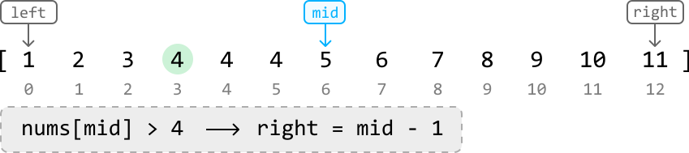

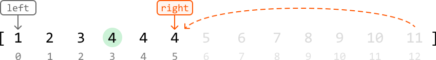

---

Midpoint value is less than the target

If the midpoint value is smaller, it means the target is to the right of this number. So, narrow the search space toward the right. Again, we can exclude the midpoint from the search space (i.e., `left = mid + 1`) because its value is not equal to the target:

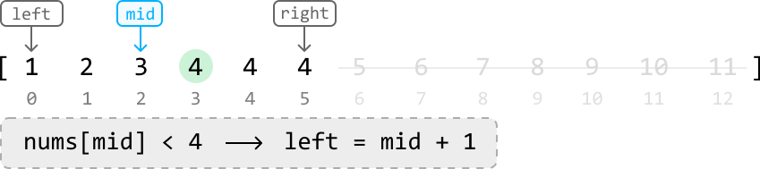

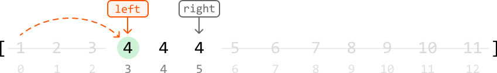

---

Midpoint value is equal to the target

Now is when things get interesting. When the midpoint value is equal to the target, there are two possibilities:

- This is the lower bound of the target value.

- This is not the lower bound, so the lower bound is somewhere further to the left.

We don’t know which possibility is true at the moment, so we should narrow the search space toward the left to continue looking for the lower bound, while also including the midpoint itself in the search space (i.e., `right = mid`).

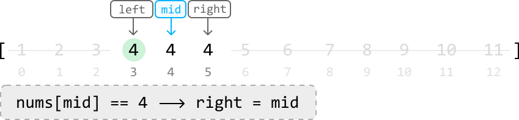

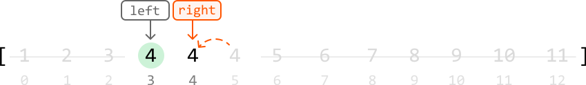

Continue this reasoning for the next midpoint as it’s also equal to the target:

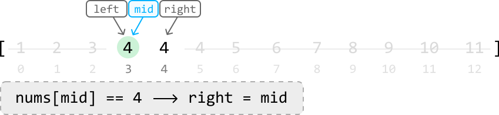

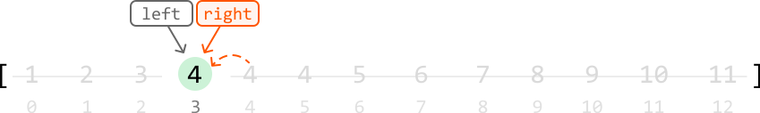

The final value, once the left and right pointers meet, is the lower bound of the target.

---

**Upper-bound binary search**

There’s a lot of similarity between this and lower-bound binary search. For starters, the search space is identical. Additionally, the cases when the midpoint value is greater than or less than the target are handled the same. This makes sense because, in both binary searches, we’re seeking the same target value. So, when the midpoint value is not equal to the target, the actions we take will be the same as the actions taken in the lower-bound binary search.

The difference in logic occurs when the midpoint is equal to the target, as we’re now looking for the **rightmost value of the target,** instead of the leftmost value. As such, let’s just focus on the logic for when the midpoint value is equal to the target.

---

Midpoint value is equal to the target

Similar to lower-bound binary search, there are two possibilities: either this is the upper bound, or it’s not. Again, we’re not sure which is true. So, let’s narrow the search space toward the right to continue looking for an upper bound while including the midpoint in the search space (i.e., `left = mid`):


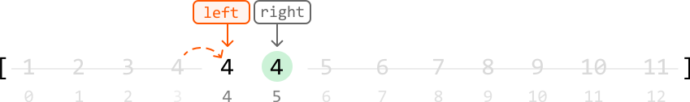

When we continue this logic for the next midpoint values, we notice something peculiar happen:


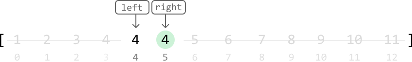

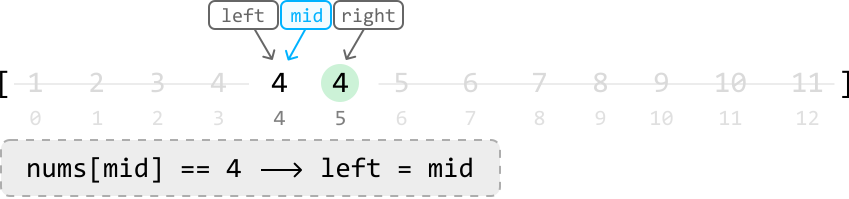

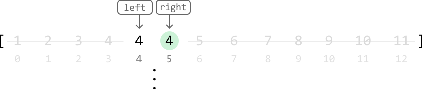

It looks like we just got **stuck in an infinite loop**, where the position of the
left pointer keeps getting set to `mid` when they’re both at the same index. Why
does this happen? 

---

Debugging the infinite loop

When the left and right pointers are directly next to each other, `mid` ends up being positioned where the left pointer is:

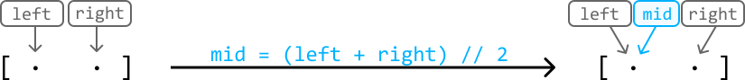

Since one of our operations is `left = mid`, we get stuck in an infinite loop where `left` and `mid` are continuously set to each other’s positions, which means progress cannot be made. The reason this wasn’t a problem during lower-bound binary search was that we never had `left = mid` as an operation in the logic. One way to avoid this issue is by **biasing the midpoint to the right**.

When the midpoint is biased to the right, we avoid an infinite loop during upper-bound binary search.

- We no longer need to worry about the left pointer since `mid` is now being positioned at the right pointer when the search space has two elements.

- We won’t encounter any infinite loops with the right pointer because it never gets set to the midpoint’s position, as we use `right = mid - 1`.

A right bias of the midpoint can be achieved using `mid = (left + right) // 2 `**`+ 1`**:

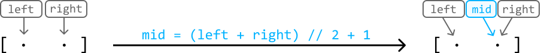

Now, performing `left = mid` allows us to properly narrow the search space.

> 
> 
> As a general rule, in upper-bound binary search, we should bias `mid` to the right.
> 
> 

---

Let’s apply this change to the same example and see what happens:

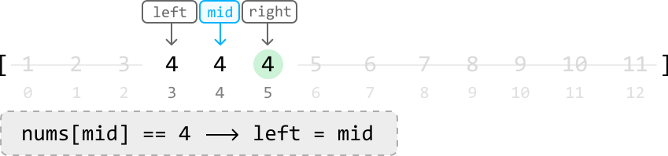

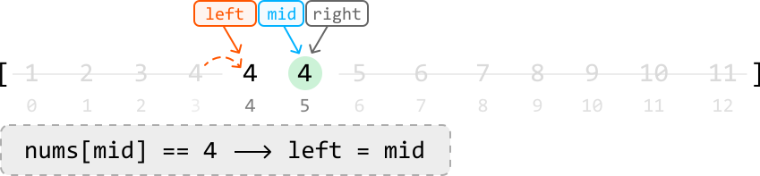

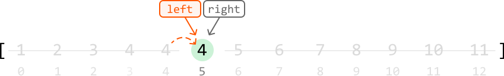

As we can see, we’ve avoided an infinite loop, with the left and right pointers meeting at the upper bound of the target.

---

**If the target doesn’t exist**

The last step in both algorithms is to check that the final values located are equal to the target. If the target does not exist in the array, the final values in both binary search algorithms won’t be equal to the target. In this case, we should return -1.

## Implementation

```python
from typing import List
    
def first_and_last_occurrences_of_a_number(nums: List[int], target: int) -> List[int]:
    lower_bound = lower_bound_binary_search(nums, target)
    upper_bound = upper_bound_binary_search(nums, target)
    return [lower_bound, upper_bound]
    
def lower_bound_binary_search(nums: List[int], target: int) -> int:
    left, right = 0, len(nums) - 1
    while left < right:
        mid = (left + right) // 2
        if nums[mid] > target:
            right = mid - 1
        elif nums[mid] < target:
            left = mid + 1
        else:
            right = mid
    return left if nums and nums[left] == target else -1
    
def upper_bound_binary_search(nums: List[int], target: int) -> int:
    left, right = 0, len(nums) - 1
    while left < right:
        # In upper-bound binary search, bias the midpoint to the right.
        mid = (left + right) // 2 + 1
        if nums[mid] > target:
            right = mid - 1
        elif nums[mid] < target:
            left = mid + 1
        else:
            left = mid
    # If the target doesn’t exist in the array, then it's possible that
    # 'left = mid + 1' places the left pointer outside the array when `mid == n - 1`.
    # So, we use the right pointer in the return statement instead.
    return right if nums and nums[right] == target else -1

```

```javascript
export function first_and_last_occurrences_of_a_number(nums, target) {
  const lowerBound = lowerBoundBinarySearch(nums, target)
  const upperBound = upperBoundBinarySearch(nums, target)
  return [lowerBound, upperBound]
}

function lowerBoundBinarySearch(nums, target) {
  let left = 0
  let right = nums.length - 1
  while (left < right) {
    const mid = Math.floor((left + right) / 2)
    if (nums[mid] > target) {
      right = mid - 1
    } else if (nums[mid] < target) {
      left = mid + 1
    } else {
      right = mid
    }
  }
  return nums.length && nums[left] === target ? left : -1
}

function upperBoundBinarySearch(nums, target) {
  let left = 0
  let right = nums.length - 1
  while (left < right) {
    // In upper-bound binary search, bias the midpoint to the right.
    const mid = Math.floor((left + right) / 2) + 1
    if (nums[mid] > target) {
      right = mid - 1
    } else if (nums[mid] < target) {
      left = mid + 1
    } else {
      left = mid
    }
  }
  // Handle out-of-bound access if the target doesn’t exist
  return nums.length && nums[right] === target ? right : -1
}

```

```java
import java.util.ArrayList;

public class Main {
    public ArrayList<Integer> first_and_last_occurrences_of_a_number(ArrayList<Integer> nums, int target) {
        int lower = lower_bound_binary_search(nums, target);
        int upper = upper_bound_binary_search(nums, target);
        ArrayList<Integer> result = new ArrayList<>();
        result.add(lower);
        result.add(upper);
        return result;
    }

    public int lower_bound_binary_search(ArrayList<Integer> nums, int target) {
        int left = 0, right = nums.size() - 1;
        while (left < right) {
            int mid = (left + right) / 2;
            if (nums.get(mid) > target) {
                right = mid - 1;
            } else if (nums.get(mid) < target) {
                left = mid + 1;
            } else {
                right = mid;
            }
        }
        return !nums.isEmpty() && nums.get(left) == target ? left : -1;
    }

    public int upper_bound_binary_search(ArrayList<Integer> nums, int target) {
        int left = 0, right = nums.size() - 1;
        while (left < right) {
            // In upper-bound binary search, bias the midpoint to the right.
            int mid = (left + right) / 2 + 1;
            if (nums.get(mid) > target) {
                right = mid - 1;
            } else if (nums.get(mid) < target) {
                left = mid + 1;
            } else {
                left = mid;
            }
        }
        // If the target doesn’t exist in the array, then it's possible that
        // 'left = mid + 1' places the left pointer outside the array when `mid == n - 1`.
        // So, we use the right pointer in the return statement instead.
        return !nums.isEmpty() && nums.get(right) == target ? right : -1;
    }
}

```

## Complexity Analysis

**Time complexity:** The time complexity of both the `lower_bound_binary_search` and `upper_bound_binary_search` helper functions is O(log(n)), where n is the length of the input array. This is because each function performs a binary search over the entire array. Therefore, `first_and_last_occurrences_of_a_number` is also O(log(n)) because it calls each helper function once.

**Space complexity:** The space complexity is O(1).

## Interview Tip

*Tip: Always test your algorithm.*

Binary search can be a tricky algorithm to implement. The best way to uncover unexpected errors is to test your code. The infinite loop encountered during the upper-bound binary search problem is quite easy to miss while designing the algorithm. If you're unable to recognize this issue during implementation, manual testing can help reveal it. In binary search, an infinite loop can be uncovered when testing a search space that contains just two elements, similar to what we did in the explanation.