# Cutting Wood

You are given an array representing the heights of trees, and an integer `k` representing the total length of wood that needs to be cut.

For this task, a woodcutting machine is set to a certain height, `H`. The machine cuts off the top part of all trees taller than `H`, while trees shorter than `H` remain untouched. **Determine the highest possible setting** of the woodcutter (`H`) so that it cuts **at least `k` meters** of wood.

Assume the woodcutter cannot be set higher than the height of the tallest tree in the array.

#### Example:

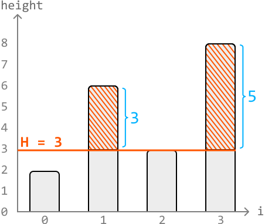

```python
Input: heights = [2, 6, 3, 8], k = 7
Output: 3

```

Explanation: The highest possible height setting that yields at least `k = 7` meters of wood is 3, which yields 8 meters of wood. Any height setting higher than this will yield less than 7 meters of wood.

#### Constraints:

- It's always possible to attain at least `k` meters of wood.

- There's at least one tree.

## Intuition

At first, it might strike you as strange that this problem is in the *Binary Search* chapter. The given input array isn't necessarily sorted, so how is binary search applicable here? Well, this is an example of a common application of binary search, where the search space does not encompass the input array.

Let’s consider a visualization of four trees of heights `[2, 6, 3, 8]` and assume k = 7:

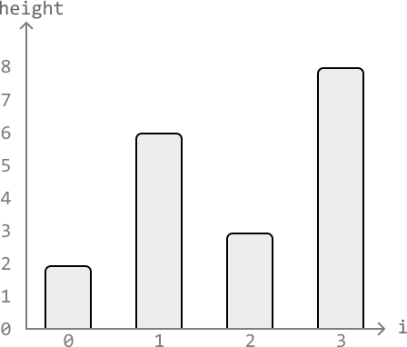

The tallest tree above has a height of 8. So the height setting, H, can be set to any height between 0 and 8.

- The most amount of wood is cut at H = 0, where all trees are cut from the bottom.

- The least amount of wood is cut at H = 8, where no wood is cut at all.

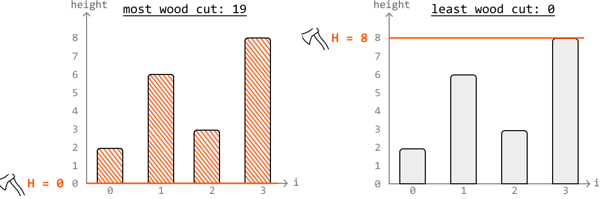

Gradually increasing the height setting of the woodcutter from H = 0 to H = 8 yields less and less wood, and our goal is to find the highest value of H that gives us at least k meters of wood.

**Determining if a height setting yields enough wood**

We need a function that determines if any given height setting H yields at least k meters of wood.

Let’s name this function **`cuts_enough_wood(H, k)`**, which will calculate the total wood obtained by cutting the trees taller than H, and return true if this total meets or exceeds k. Below is a visual representation of how to determine if a height setting of 3 yields enough wood in the example:


Applying this function to all possible values of H (from 0 to 8) gives us the outcome below, where heights 0 to 3 yield at least k meters of wood and heights 4 to 8 are too high and don’t yield enough. Note that here, we visualize which H values make the function `cuts_enough_wood` return true, and which will result in false.

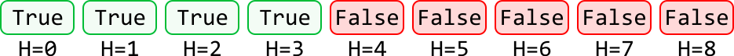

We could call `cuts_enough_wood` on each value of H from 0 to 8 until we reach the highest value that still causes `cuts_enough_wood` to return true. However, a key observation is that the above sequence of boolean outcomes is effectively a **sorted sequence**, since all true outcomes are positioned before false ones.

As this is a sorted sequence, we should try using binary search.

**Binary search**

The goal is to find the last value of H that cuts at least k meters of wood. In other words, we’re looking for the upper bound value of H that satisfies this condition.

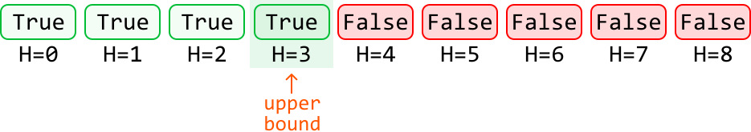

As such, we should use **upper-bound binary search**. This means we’ll need to calculate
the midpoint using **`mid = (left + right) // 2 + 1`**, as mentioned in the *First
and Last Occurrences of a Number* problem.

Let’s first **define the search space**. Our search space should encompass all values of H between 0 and the height of the tallest tree in the array, as these are all possible answers.

To figure out how to **narrow the search space**, let's use the example below, setting left and right pointers at the ends of the search space:

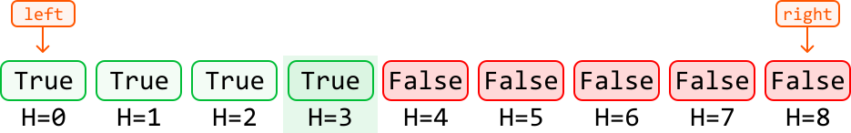

---

Initially, the midpoint is set to H = 4. When we call `cuts_enough_wood(4, k)`, it returns false. This means the height setting is not yielding enough wood and is, hence, set too high. To find a lower height setting, we should narrow our search space toward the left:

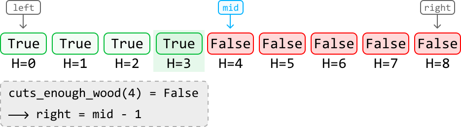

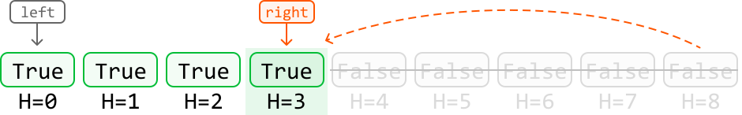

---

The next midpoint is set to H = 2. When we call `cuts_enough_wood(2, k)`, it returns true. This means the upper bound is either at the midpoint or to its right, as the upper bound is the rightmost height setting that cuts enough wood.

So, narrow the search space toward the right while including the midpoint:

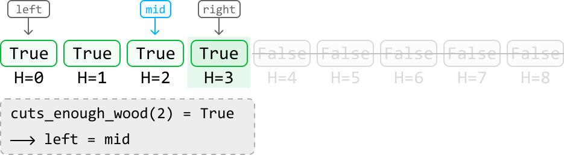

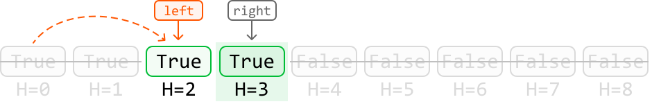

---

The next midpoint is set to H = 3. When we call `cuts_enough_wood(3, k)`, it returns true. So, narrow the search space toward the right while including the midpoint:

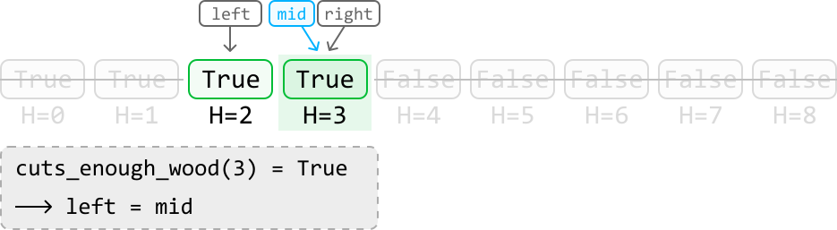

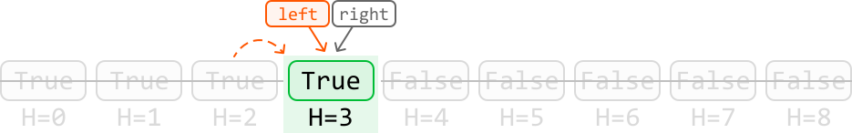

Once the left and right pointers meet, we have located the upper bound height setting that yields at least k meters of wood.

---

**Summary**

Case 1: The midpoint is set at a height that allows us to cut at least k meters of wood, indicating the upper bound is somewhere to the right. Narrow the search space to the right while including the midpoint:


Case 2: The midpoint is at a height that doesn’t allow us to cut enough wood, indicating the upper bound is somewhere to the left. Narrow the search space to the left while excluding the midpoint:

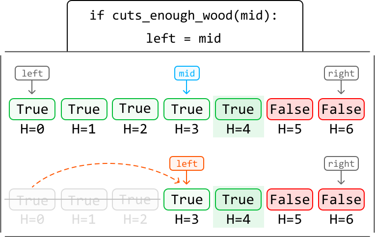

## Implementation

```python
from typing import List
    
def cutting_wood(heights: List[int], k: int) -> int:
    left, right = 0, max(heights)
    while left < right:
        # Bias the midpoint to the right during the upper-bound binary search.
        mid = (left + right) // 2 + 1
        if cuts_enough_wood(mid, k, heights):
            left = mid
        else:
            right = mid - 1
    return right
    
# Determine if the current value of 'H' cuts at least 'k' meters of wood.
def cuts_enough_wood(H: int, k: int, heights: List[int]) -> bool:
    wood_collected = 0
    for height in heights:
        if height > H:
            wood_collected += (height - H)
    return wood_collected >= k

```

```javascript
export function cutting_wood(heights, k) {
  let left = 0
  let right = Math.max(...heights)
  while (left < right) {
    // Bias the midpoint to the right during the upper-bound binary search.
    const mid = Math.floor((left + right) / 2) + 1

    if (cutsEnoughWood(mid, k, heights)) {
      left = mid
    } else {
      right = mid - 1
    }
  }
  return right
}

// Determine if the current value of 'H' cuts at least 'k' meters of wood.
function cutsEnoughWood(H, k, heights) {
  let wood_collected = 0
  for (const height of heights) {
    if (height > H) {
      wood_collected += height - H
    }
  }
  return wood_collected >= k
}

```

```java
import java.util.ArrayList;

public class Main {
    public int cutting_wood(ArrayList<Integer> heights, int k) {
        int left = 0;
        int right = max(heights);
        while (left < right) {
            // Bias the midpoint to the right during the upper-bound binary search.
            int mid = (left + right) / 2 + 1;
            if (cutsEnoughWood(mid, k, heights)) {
                left = mid;
            } else {
                right = mid - 1;
            }
        }
        return right;
    }

    // Determine if the current value of 'H' cuts at least 'k' meters of wood.
    public boolean cutsEnoughWood(int H, int k, ArrayList<Integer> heights) {
        int wood_collected = 0;
        for (int height : heights) {
            if (height > H) {
                wood_collected += (height - H);
            }
        }
        return wood_collected >= k;
    }

    private int max(ArrayList<Integer> list) {
        int maxVal = Integer.MIN_VALUE;
        for (int num : list) {
            if (num > maxVal) {
                maxVal = num;
            }
        }
        return maxVal;
    }
}

```

## Complexity Analysis

**Time complexity:** The time complexity of `cutting_wood` is O(nlog(m)), where m is the maximum height of the trees. This is because we perform a binary search over the range [0, m]. Each iteration of the binary search calls the `cuts_enough_wood` function, which runs in O(n) time, where n is the number of trees. This results in an overall time complexity of O(log(m))O(n)=O(nlog(m)).

**Space complexity:** The space complexity is O(1).