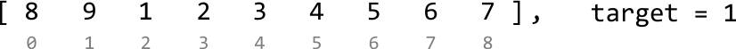
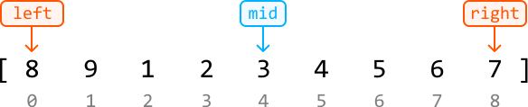
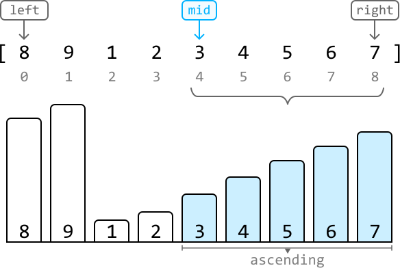
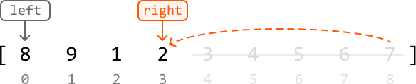
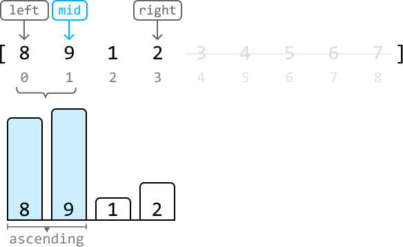
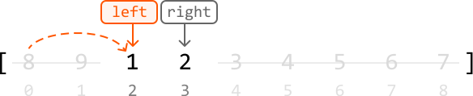
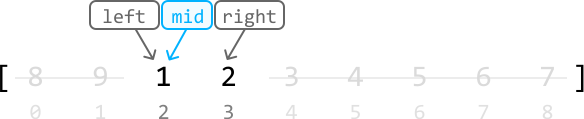
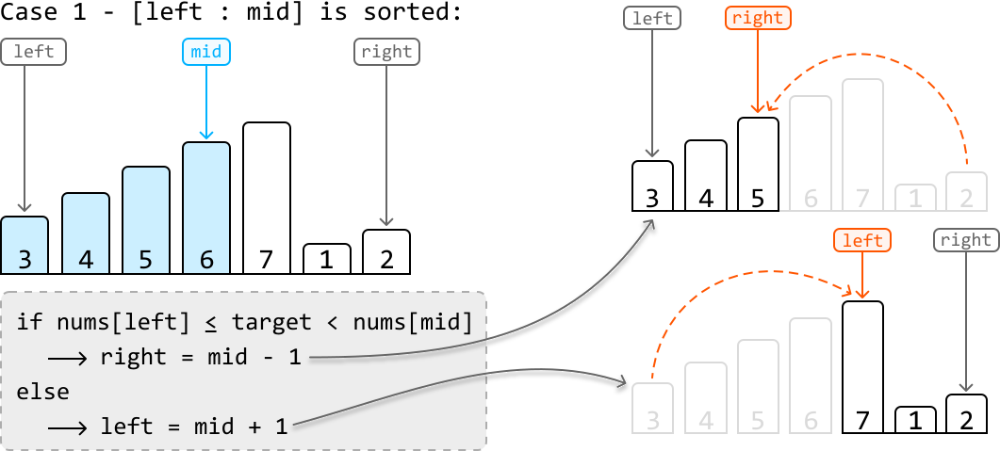
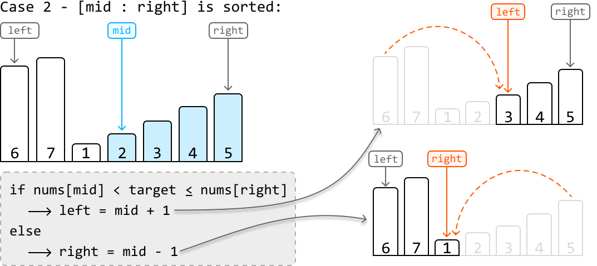

# Find the Target in a Rotated Sorted Array

A rotated sorted array is an array of numbers sorted in ascending order, in which a portion of the array is moved from the beginning to the end. For example, a possible rotation of `[1, 2, 3, 4, 5]` is `[3, 4, 5, 1, 2]` , where the first two numbers are moved to the end.

Given a rotated sorted array of unique numbers, return the index of a target value. If the target value is not present, return -1.

#### Example:

```python
Input: nums = [8, 9, 1, 2, 3, 4, 5, 6, 7], target = 1
Output: 2

```

## Intuition

A naive solution is to iterate through the input array until we find the target number. This strategy takes linear time, and doesn’t take into account that the input is a rotated sorted array. Given the array was sorted before it was rotated, we should figure out how **binary search** might be useful in finding the target.

First, let’s **define the search space** for the binary search. Since the target value could exist anywhere in the array, the search space should encompass the entire array.

Now, let’s figure out how to **narrow the search space**, which is an interesting challenge considering the array isn’t perfectly sorted. Let’s work through this by exploring an example:



Let’s set left and right pointers at the boundaries of the array and consider the first midpoint value:



In a normal sorted array, we’d be able to logically assess whether to search to the left or the right of the midpoint, based solely on the midpoint value and the target. In a rotated sorted array, it’s much less straightforward to determine which side the target value is on.

---

To decide whether to narrow the search space toward the left or right of the midpoint, let’s visualize the height of each number in the array and pay attention to subarrays `[left : mid]` and `[mid : right]` separately. Note, we include the midpoint in both subarrays since the midpoint is used to decide which subarray to narrow the search space towards:



Here, we see the subarray `[mid : right]` is sorted in ascending order. Since it’s sorted, we know what the smallest and largest numbers in that range are: 3 and 7, respectively. This means we can check if the target is in this subarray by checking if it’s in between 3 and 7. The target (1) is not in this range, so therefore, it must be in the left subarray.

So, we should narrow the search space toward the left, excluding the midpoint (`right = mid - 1`):



The reason we excluded the midpoint value was because it wasn’t equal to the target, and so should no longer be considered in the search space.

---

Let’s continue with the example.



This time, the sorted subarray is the left subarray, `[left : mid]`. So, we can use this subarray to check where the target value is. Since the target (1) doesn't fall within the range between 8 and 9, it indicates the target resides in the right subarray. Therefore, we narrow our search space toward the right, excluding the midpoint (`left = mid + 1`):



Again, we excluded the midpoint value (9) as it was not equal to the target.

---

Finally, we’ve found the target at the midpoint, so we can return its index (`mid`):



---

**Summary**

From our discussion above, an important strategy emerges: between the two subarrays, `[left : mid]` and `[mid : right]`, we can use the sorted one to determine where the target is.

Before examining the subarrays, let’s first **compare the target with the value at the midpoint**. If they match, we've found our target at `mid`. If not, then we decide where to adjust our search depending on which subarray is sorted, as detailed in the following two test cases:

**Case 1: the left subarray, `[left : mid]`, is sorted**

- If the target falls in the range of this left subarray, we narrow the search space toward the left.

- Otherwise, we narrow the search space toward the right.



**Case 2: the right subarray, `[mid : right]` is sorted**

- If the target falls in the range of this right subarray, we narrow the search space toward the right.

- Otherwise, narrow the search space toward the left.



It’s possible to encounter a situation where both subarrays are sorted. In this case, it doesn’t matter which subarray we use to check where the target is.

One final thing to note is that the array might not contain the target value at all. In this case, once the binary search terminates and narrows down to a single value, we need to check if this value is the target. If not, it indicates the target is not present in the array, and we return -1.

## Implementation

```python
from typing import List
    
def find_the_target_in_a_rotated_sorted_array(nums: List[int], target: int) -> int:
    left, right = 0, len(nums) - 1
    while left < right:
        mid = (left + right) // 2
        if nums[mid] == target:
            return mid
        # If the left subarray [left : mid] is sorted, check if the target falls in
        # this range. If it does, search the left subarray. Otherwise, search the
        # right.
        elif nums[left] <= nums[mid]:
            if nums[left] <= target < nums[mid]:
                right = mid - 1
            else:
                left = mid + 1
        # If the right subarray [mid : right] is sorted, check if the target falls
        # in this range. If it does, search the right subarray. Otherwise, search the
        # left.
        else:
            if nums[mid] < target <= nums[right]:
                left = mid + 1
            else:
                right = mid - 1
    # If the target is found in the array, return it’s index. Otherwise, return -1.
    return left if nums and nums[left] == target else -1

```

```javascript
export function find_the_target_in_a_rotated_sorted_array(nums, target) {
  let left = 0
  let right = nums.length - 1
  while (left < right) {
    const mid = Math.floor((left + right) / 2)
    if (nums[mid] === target) {
      return mid
    }
    // If the left subarray [left : mid] is sorted, check if the target falls in this range.
    if (nums[left] <= nums[mid]) {
      if (nums[left] <= target && target < nums[mid]) {
        right = mid - 1
      } else {
        left = mid + 1
      }
    }
    // If the right subarray [mid : right] is sorted, check if the target falls in this range.
    else {
      if (nums[mid] < target && target <= nums[right]) {
        left = mid + 1
      } else {
        right = mid - 1
      }
    }
  }
  // If the target is found in the array, return its index. Otherwise, return -1.
  return nums[left] === target ? left : -1
}

```

```java
import java.util.ArrayList;

public class Main {
    public int find_the_target_in_a_rotated_sorted_array(ArrayList<Integer> nums, int target) {
        int left = 0, right = nums.size() - 1;
        while (left < right) {
            int mid = (left + right) / 2;
            if (nums.get(mid) == target) {
                return mid;
            }
            // If the left subarray [left : mid] is sorted, check if the target falls in
            // this range. If it does, search the left subarray. Otherwise, search the
            // right.
            else if (nums.get(left) <= nums.get(mid)) {
                if (nums.get(left) <= target && target < nums.get(mid)) {
                    right = mid - 1;
                } else {
                    left = mid + 1;
                }
            }
            // If the right subarray [mid : right] is sorted, check if the target falls
            // in this range. If it does, search the right subarray. Otherwise, search the
            // left.
            else {
                if (nums.get(mid) < target && target <= nums.get(right)) {
                    left = mid + 1;
                } else {
                    right = mid - 1;
                }
            }
        }
        // If the target is found in the array, return it’s index. Otherwise, return -1.
        return (!nums.isEmpty() && nums.get(left) == target) ? left : -1;
    }
}

```

### Complexity Analysis

**Time complexity:** The time complexity of `find_the_target_in_a_rotated_sorted_array` is O(log(n)) because we're performing a binary search over an array of length n.

**Space complexity:** The space complexity is O(1).