# Find the Median From Two Sorted Arrays

Given two sorted integer arrays, **find their median value** as if they were merged into a single sorted sequence.

#### Example 1:

```python
Input: nums1 = [0, 2, 5, 6, 8], nums2 = [1, 3, 7]
Output: 4.0

```

Explanation: Merging both arrays results in `[0, 1, 2, 3, 5, 6, 7, 8]`, which has a median of (3 + 5) / 2 = 4.0.

#### Example 2:

```python
Input: nums1 = [0, 2, 5, 6, 8], nums2 = [1, 3, 7, 9]
Output: 5.0

```

Explanation: Merging both arrays results in `[0, 1, 2, 3, 5, 6, 7, 8, 9]`, which has a median of 5.

#### Constraints:

- At least one of the input arrays will contain an element.

## Intuition

The brute force approach to this problem involves merging both arrays and finding the median in this merged array. This approach takes O((m+n)log(m+n)) time where m and n denote the lengths of each array, respectively. This complexity is primarily due to the cost of sorting the merged array of length m+n. This approach can be improved to O(m+n) time by merging both arrays in order, which is possible because both arrays are already sorted. However, is there a way to find the median without merging the two arrays?

In this explanation, we use "total length" to refer to the combined length of both input arrays. Let's discuss odd and even total lengths separately, as these result in two different types of medians.

Consider the following two arrays that have an even total length:


Below is what these two arrays would look like when merged. Let's see if we can draw any insights from this.

![Image represents a one-dimensional array labeled 'merged array:'.  The array is enclosed in square brackets `[]` and con](./images/2998350c_image-06-05-2-MGZLD4UC.svg)

Observe that the merged array can be divided into two halves, which reveals the median values on the inner edge of each half.

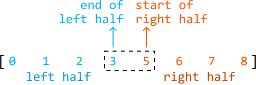

A challenge here is identifying which values in either input array belongs to the left half of the merged array, and which belong to the right half. One thing we do know is the size of each half of the merged array: **half of the total length**.

**Slicing both arrays**

To figure out which values belong to each half, we can try "slicing" both arrays into two segments, where the left segments of both arrays and the right segments of both arrays each have 4 total values. Let's refer to the values on the left and right of the slice as the "left partition" and "right partition." Below are three examples of what this slice could look like:

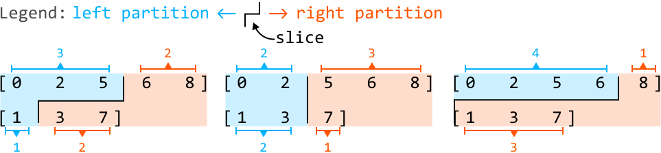

As we can see, there are several ways to slice the arrays to produce two partitions of equal size (4). However, only one of these slices corresponds to the halves of the merged array. In our example, it's this slice:

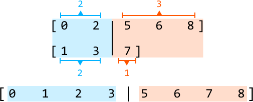

Let's refer to this as the "correct slice." We'll explain how to identify the correct slice shortly, but first, let's consider how to identify which slice correctly corresponds to the halves of the merged array.

**Determining the correct slice**

> 
> 
> An important observation is that all values in the left partition must be less than or equal to the values in the right partition.
> 
> 

We can assess this by comparing the two end values of the left partition with the start values of the right partition (illustrated below). Let's refer to the end values of the left partition as `L1` and `L2`, respectively. Similarly, let's call the start values of the right partition `R1` and `R2`.

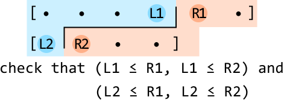

Since the values in each array are sorted, we know that conditions `L1 ≤ R1` and `L2 ≤ R2` are always true. Then, all we have to do is check that `L1 ≤ R2` and `L2 ≤ R1`. We can observe how this comparison reveals the correct slice from the previous three example slices:

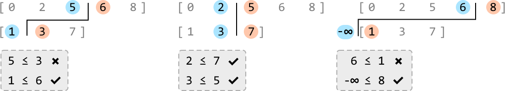

Notice that in the third example above, the second array does not contribute any values to the left partition. So, to work around this, we set the second array's left value to - so that `L2 ≤ R1` is true by default.

**Searching for the correct slice**

Now, our goal is to search through all possible slices until we find the correct one. We do this by searching through all possible placements of `L1`, `R1`, `L2`, and `R2`. Note that we only need to **search for `L1`** since the other three values can be inferred based on `L1`'s index.

Let's take a closer look at how this works. Once we identify `L1`'s index, we can calculate `L2`'s index based on `L1`'s index, which is demonstrated in the diagram below. `R1` and `R2` are just the values immediately to the right of `L1` and `L2`, respectively.

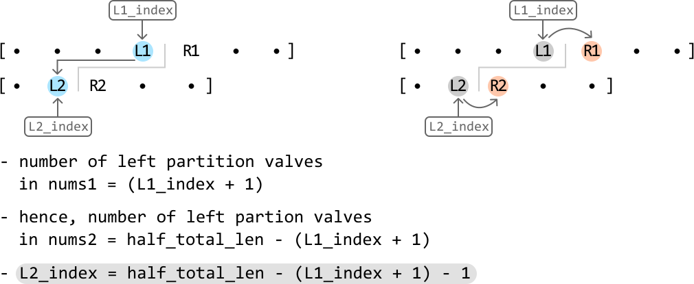

Since we search for `L1` over `nums1`, which is a sorted array, we can use **binary search** instead of searching for it linearly. The **search space** will encompass all values of the `nums1`.

Let's figure out how to **narrow the search space**. Here, we'll define the midpoint as `L1_index`, since it's also the index of `L1`. Let's discuss how the search space is narrowed based on these conditions:

- **If `L1 > R2`**, then `L1` is larger than it should be because we expect `L1` to be less than or equal to `R2`. To search for a smaller `L1`, narrow the search space toward the left:
  
  
  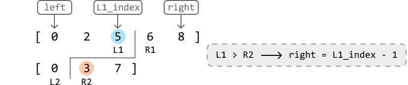

- **If `L2 > R1`**, then `R1` is smaller than it should be because we expect `R1` to be less than or equal to `L2`. To search for a larger `R1`, narrow the search space toward the right:
  
  
  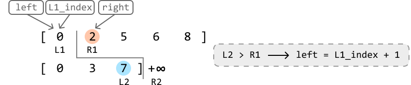

- **If `L1 ≤ R2`, and `L2 ≤ R1`**, the correct slice has been located:
  
  
  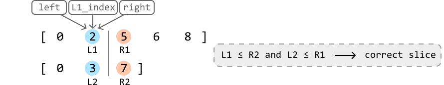

**Search space optimization**
A small optimization here is to ensure that `nums1` is the smallest array between the two input arrays. This ensures our search space is as small as possible. If `nums2` is smaller than `nums1`, we can just swap the two arrays, allowing `nums1` to always be the smaller array.

**Returning the median**

Once binary search has identified the correct slice, we need to return the median. With an even total length, the median is calculated using the array's two middle values. From our set of partition slice values (`L1`, `R1`, `L2`, and `R2`), which of them are the middle two? We know one of the median values is from the left partition and the other is from the right partition. From the left partition, the largest value between `L1` and `L2` will be closest to the middle. From the right, the smallest value between `R1` and `R2` is closer to the middle:

![Image represents a visual explanation of a merge sort algorithm step.  Two arrays, `[0 2 5 6 8]` and `[0 3 7]`, are show](./images/599f1a3e_image-06-05-12-EH53SBS2.svg)

So, to return the median, we just return the sum of these two values, divided by 2 using floating-point division.

**What if the total length of both arrays is odd?**

The main difference when the total length of both arrays is odd compared to an even length is that we can no longer slice the arrays into two equal halves. One half must have an additional value.


The diagram above shows that the right half ends up with one extra value. This is because when we calculate the slice position, we ensure the left half has a size of half the total length. In this example, this calculation using integer division gives us a left half size of (5 + 4) // 2 = 4. Consequently, this means the right half ends up with 5 values. When the total length is odd, the median can be found in the right half:

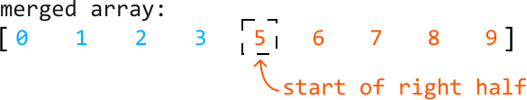

So, after the binary search narrows down the correct slice, we can just return the smallest value between `R1` and `R2`.

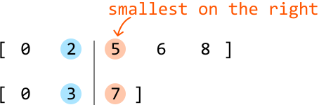

## Implementation

```python
from typing import List
   
def find_the_median_from_two_sorted_arrays(nums1: List[int], nums2: List[int]) -> float:
    # Optimization: ensure 'nums1' is the smaller array.
    if len(nums2) < len(nums1):
        nums1, nums2 = nums2, nums1
    m, n = len(nums1), len(nums2)
    half_total_len = (m + n) // 2
    left, right = 0, m - 1
    # A median always exists in a non-empty array, so continue binary search until
    # it's found.
    while True:
        L1_index = (left + right) // 2
        L2_index = half_total_len - (L1_index + 1) - 1
        # Set to -infinity or +infinity if out of bounds.
        L1 = float('-inf') if L1_index < 0 else nums1[L1_index]
        R1 = float('inf') if L1_index >= m - 1 else nums1[L1_index + 1]
        L2 = float('-inf') if L2_index < 0 else nums2[L2_index]
        R2 = float('inf') if L2_index >= n - 1 else nums2[L2_index + 1]
        # If 'L1 > R2', then 'L1' is too far to the right. Narrow the search space
        # toward the left.
        if L1 > R2:
            right = L1_index - 1
        # If 'L2 > R1', then 'L1' is too far to the left. Narrow the search space
        # toward the right.
        elif L2 > R1:
            left = L1_index + 1
        # If both 'L1' and 'L2' are less than or equal to both 'R1' and 'R2', we
        # found the correct slice.
        else:
            if (m + n) % 2 == 0:
                return (max(L1, L2) + min(R1, R2)) / 2.0
            else:
                return min(R1, R2)

```

```javascript
export function find_the_median_from_two_sorted_arrays(nums1, nums2) {
  // Optimization: ensure 'nums1' is the smaller array.
  if (nums2.length < nums1.length) {
    ;[nums1, nums2] = [nums2, nums1]
  }
  const m = nums1.length
  const n = nums2.length
  const halfTotalLen = Math.floor((m + n) / 2)
  let left = 0,
    right = m - 1
  // A median always exists in a non-empty array, so continue binary search until
  // it's found.
  while (true) {
    const L1Index = Math.floor((left + right) / 2)
    const L2Index = halfTotalLen - (L1Index + 1) - 1
    // Set to -infinity or +infinity if out of bounds.
    const L1 = L1Index < 0 ? -Infinity : nums1[L1Index]
    const R1 = L1Index >= m - 1 ? Infinity : nums1[L1Index + 1]
    const L2 = L2Index < 0 ? -Infinity : nums2[L2Index]
    const R2 = L2Index >= n - 1 ? Infinity : nums2[L2Index + 1]
    // If 'L1 > R2', then 'L1' is too far to the right. Narrow the search space
    // toward the left.
    if (L1 > R2) {
      right = L1Index - 1
    }
    // If 'L2 > R1', then 'L1' is too far to the left. Narrow the search space
    // toward the right.
    else if (L2 > R1) {
      left = L1Index + 1
    }
    // If both 'L1' and 'L2' are less than or equal to both 'R1' and 'R2', we
    // found the correct slice.
    else {
      if ((m + n) % 2 === 0) {
        return (Math.max(L1, L2) + Math.min(R1, R2)) / 2
      } else {
        return Math.min(R1, R2)
      }
    }
  }
}

```

```java
import java.util.ArrayList;

public class Main {
    public double find_the_median_from_two_sorted_arrays(ArrayList<Integer> nums1, ArrayList<Integer> nums2) {
        if (nums2.size() < nums1.size()) {
            ArrayList<Integer> temp = nums1;
            nums1 = nums2;
            nums2 = temp;
        }
        int m = nums1.size();
        int n = nums2.size();
        int half_total_len = (m + n) / 2;
        int left = 0, right = m;
        // A median always exists in a non-empty array, so continue binary search until it's found.
        while (true) {
            int L1_index = (left + right) / 2 - 1;
            int L2_index = half_total_len - (L1_index + 1) - 1;
            // Set to -infinity or +infinity if out of bounds.
            int L1 = (L1_index < 0) ? Integer.MIN_VALUE : nums1.get(L1_index);
            int R1 = (L1_index + 1 >= m) ? Integer.MAX_VALUE : nums1.get(L1_index + 1);
            int L2 = (L2_index < 0) ? Integer.MIN_VALUE : nums2.get(L2_index);
            int R2 = (L2_index + 1 >= n) ? Integer.MAX_VALUE : nums2.get(L2_index + 1);
            // If 'L1 > R2', then 'L1' is too far to the right. Narrow the search space toward the left.
            if (L1 > R2) {
                right = (L1_index + 1) - 1;
            }
            // If 'L2 > R1', then 'L1' is too far to the left. Narrow the search space toward the right.
            else if (L2 > R1) {
                left = (L1_index + 1) + 1;
            }
            // If both 'L1' and 'L2' are less than or equal to both 'R1' and 'R2', we found the correct slice.
            else {
                if ((m + n) % 2 == 0) {
                    return (Math.max(L1, L2) + Math.min(R1, R2)) / 2.0;
                } else {
                    return Math.min(R1, R2);
                }
            }
        }
    }
}

```

### Complexity Analysis

**Time complexity:** The time complexity of `find_the_median_from_two_sorted_arrays` is O(log(min(m,n))) because we perform binary search over the smaller of the two input arrays.

**Space complexity:** The space complexity is O(1).

*Note: this explanation refers to the two middle values as "median values" to keep things simple. However, it's important to understand that these two values aren't technically "medians," as there's only ever one median. These are just the two values used to calculate the median.*