# Matrix Search

Determine if a target value exists in a matrix. **Each row of the matrix is sorted** in non-decreasing order, and the first value of each row is greater than or equal to the last value of the previous row.

#### Example:

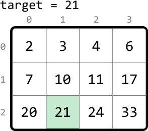

```python
Output: True

```

## Intuition

A naive solution to this problem is to linearly scan the matrix until we encounter the target value. However, this isn’t taking advantage of the sorted properties of the matrix.

A key observation is that all values in a given row are greater than or equal to all values in the previous row. This indicates the entire matrix can be considered as a single, continuous, sorted sequence of values:

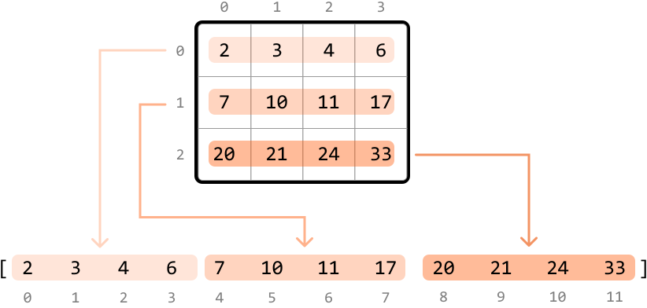

If we were able to flatten this matrix into a single, sorted array, we could perform a **binary search** on the array. Creating a separate array and populating it with the matrix’s values still takes O(m· n) time, and also takes O(m· n) space, where m and n are the dimensions of the matrix. Is there a way to perform a binary search on the matrix without flattening it?

Let’s map the indexes of the flattened array to their corresponding cells in the matrix:

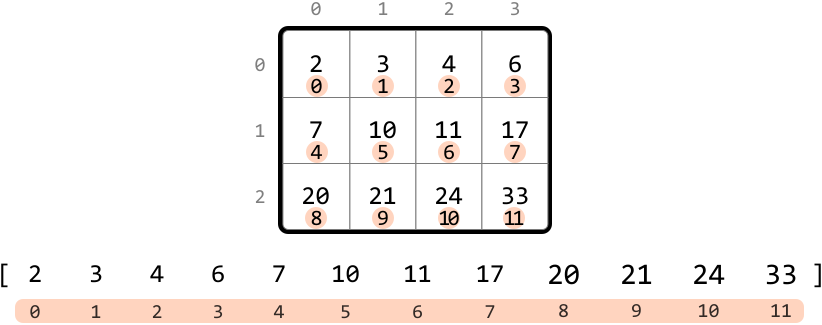

This index mapping would give us a way to access the elements of the matrix in a similar way to how we would access them in the flattened array. To figure out how to do this, let’s find a way to map any cell (`r`, `c`) to its corresponding index in the flattened array.

Let’s start by examining the mapped indexes of each row of the matrix:

- Row 0 starts at index 0.

- Row 1 starts at index `n`.

- Row 2 starts at index 2`n`.

From the above observations, we see a pattern: for any row `r`, the first cell of the row corresponds to the index `r⋅n`.

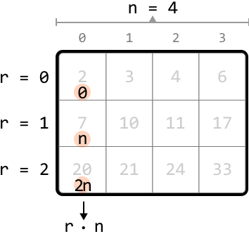

When we also consider the column value `c`, we can conclude that for any cell (`r`, `c`), the corresponding index in the flattened array is `r⋅n + c`.

Now that we understand how the 2D matrix maps to the 1D flattened array, let’s work backward to obtain the row and column indexes from an index in the flattened array. Let `i = r⋅n + c`. The row and column values are:

- **`r = i // n`**

- **`c = i % n`**

We can see how these are obtained below:

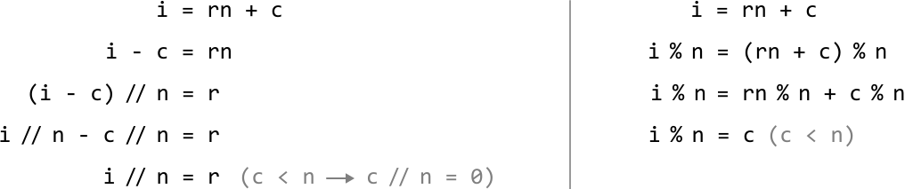

Now that we have these formulas, let’s use binary search to find the target.

**Binary search**

To define the **search space**, we need the first and last indexes of the flattened array. The first index is 0, and the last index is `m⋅n - 1`. So, we set the left and right pointers to 0 and `m⋅n - 1` respectively.

To figure out how to **narrow the search space**, let’s explore an example matrix that contains the target of 21.

We can calculate mid using the formula: `mid = (left + right) // 2`. Then, determine the corresponding row and column values. Here, the value at the midpoint (10) is less than the target, which means the target is to the right of the midpoint. So, let’s narrow the search space toward the right:

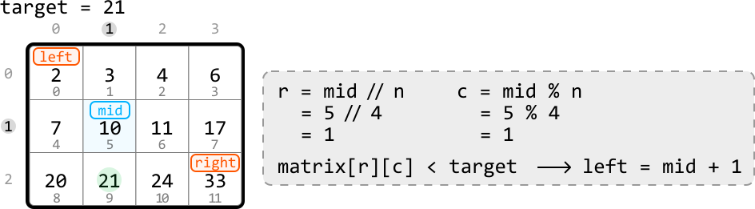

---

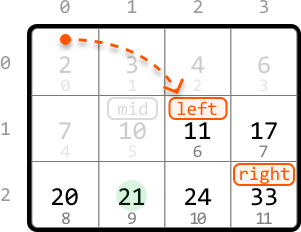

---

The new midpoint value is still less than the target, so let’s narrow the search space towards the right:

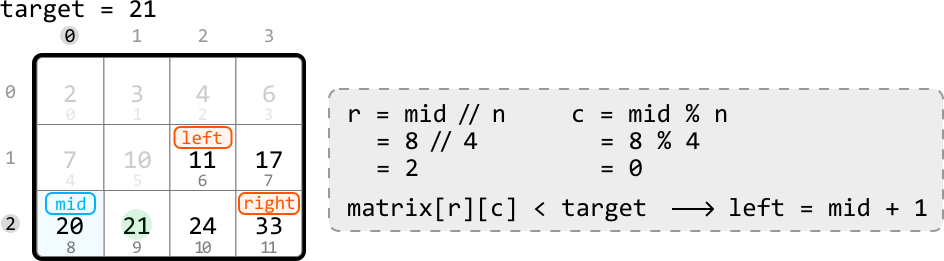

---

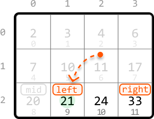

---

The midpoint value is now larger than the target, which means the target is to the left of the midpoint. So, let’s move the search space to the left:

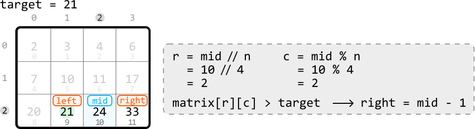

---

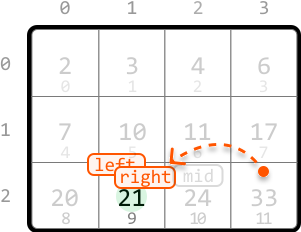

---

Now, the midpoint is equal to the target, so we return true to conclude the search.

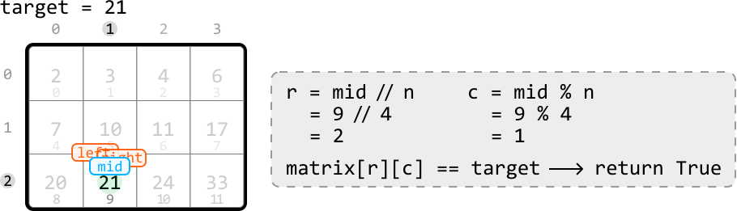

Note that our **exit condition** should be `while left ≤ right` in order to also examine the above search space when `left == right`.

## Implementation

```python
from typing import List
    
def matrix_search(matrix: List[List[int]], target: int) -> bool:
    m, n = len(matrix), len(matrix[0])
    left, right = 0, m * n - 1
    # Perform binary search to find the target.
    while left <= right:
        mid = (left + right) // 2
        r, c = mid // n, mid % n
        if matrix[r][c] == target:
            return True
        elif matrix[r][c] > target:
            right = mid - 1
        else:
            left = mid + 1
    return False

```

```javascript
export function matrix_search(matrix, target) {
  const m = matrix.length
  const n = matrix[0].length
  let left = 0,
    right = m * n - 1
  // Perform binary search to find the target.
  while (left <= right) {
    const mid = Math.floor((left + right) / 2)
    const r = Math.floor(mid / n)
    const c = mid % n
    if (matrix[r][c] === target) {
      return true
    } else if (matrix[r][c] > target) {
      right = mid - 1
    } else {
      left = mid + 1
    }
  }
  return false
}

```

```java
import java.util.ArrayList;

public class Main {
    public static boolean matrix_search(ArrayList<ArrayList<Integer>> matrix, int target) {
        int m = matrix.size();
        int n = matrix.get(0).size();
        int left = 0, right = m * n - 1;
        // Perform binary search to find the target.
        while (left <= right) {
            int mid = (left + right) / 2;
            int r = mid / n;
            int c = mid % n;
            int value = matrix.get(r).get(c);
            if (value == target) {
                return true;
            } else if (value > target) {
                right = mid - 1;
            } else {
                left = mid + 1;
            }
        }
        return false;
    }
}

```

### Complexity Analysis

**Time complexity:** The time complexity of `matrix_search` is O(log(m· n)) because it performs a binary search over a search space of size m· n.

**Space complexity:** The space complexity is O(1).