# Local Maxima in Array

A local maxima is a value **greater than both its immediate neighbors**. Return any local maxima in an array. You may assume that an element is always considered to be strictly greater than a neighbor that is outside the array.

#### Example:

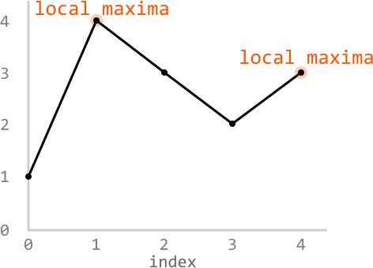

```python
Input: nums = [1, 4, 3, 2, 3]
Output: 1 # index 4 is also acceptable

```

#### Constraints:

- No two adjacent elements in the array are equal.

## Intuition

A naive way to solve this problem is to linearly search for a local maxima by iteratively comparing each value to its neighbors and returning the first local maxima we find. A linear solution isn't terrible, but since we can return *any* maxima, there’s likely a more efficient approach.

The first important thing to notice is that since this is an array with no adjacent duplicates, it will always contain at least one local maxima. If it's not at one of the edges of the array, there'll be at least one somewhere in the middle:

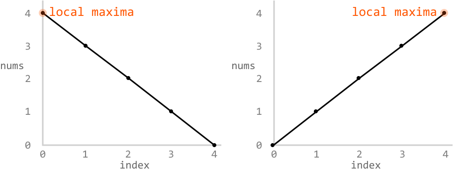

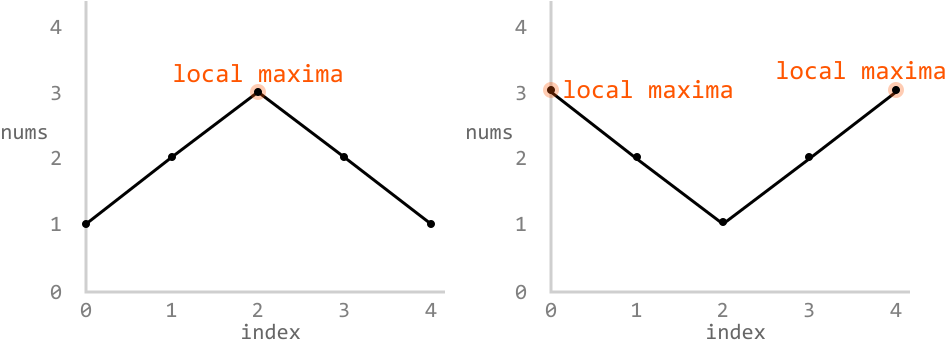

Now, let's say we're at some random index in the array, index `i`. An interesting observation is that if the next number (at index `i + 1`) is greater than the current, there’s definitely a local maxima somewhere to the right of `i`. This is because the two points at index `i` and `i + 1` form an **ascending slope**, and this slope would be heading upwards towards some maxima:

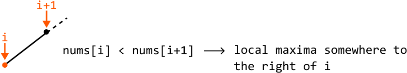

The opposite applies if points `i` and `i + 1` form a **descending slope**. This would imply a maxima exists somewhere to the left or at `i`. Notice here that the point at index `i` itself could be a maxima too:

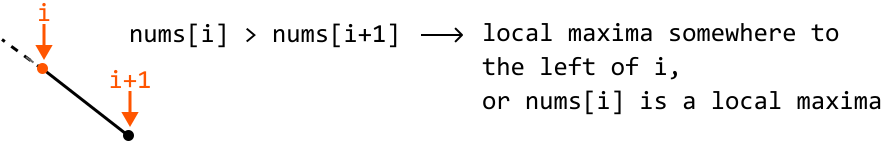

Once we know whether a local maxima exists to the left or to the right, we can continue searching in that direction until we find it. In other words, we narrow our search toward the direction of the maxima. Doesn't this type of reasoning sound similar to how we narrow search space in a binary search? This indicates that it might be possible to find a local maxima using binary search.

**Binary search**

First, let’s define the **search space**. A local maxima could exist at any index of the array. So, the search space should encompass the entire array.

To figure out how we **narrow the search space**, let’s use the below example, setting left and right pointers at the boundaries of the array:

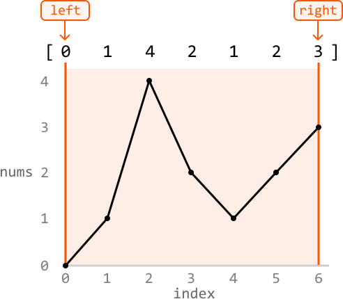

---

The midpoint is initially set at index 3, which forms a descending slope with its right neighbor since `nums[mid] > nums[mid + 1]`. This suggests that either a maxima exists to the left of index 3 or that index 3 itself is a maxima). So, we should continue our search to the left, while including the midpoint in the search space:

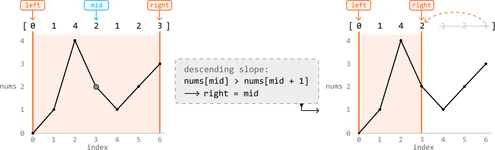

---

The next midpoint is set at index 1, which forms an ascending slope with its right neighbor since `nums[mid] < nums[mid + 1]`. This suggests that a maxima exists somewhere to the right of the midpoint. So, let’s continue the search to the right, while excluding the midpoint:

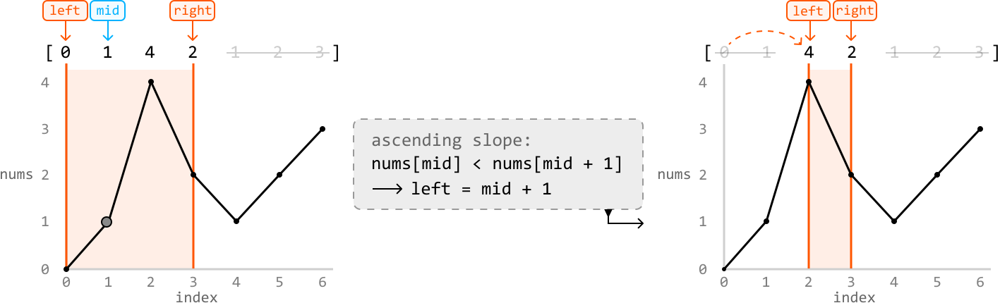

---

The next midpoint is set at index 2, which forms a descending slope with its right neighbor. So, we continue by searching to the left, while including the midpoint:

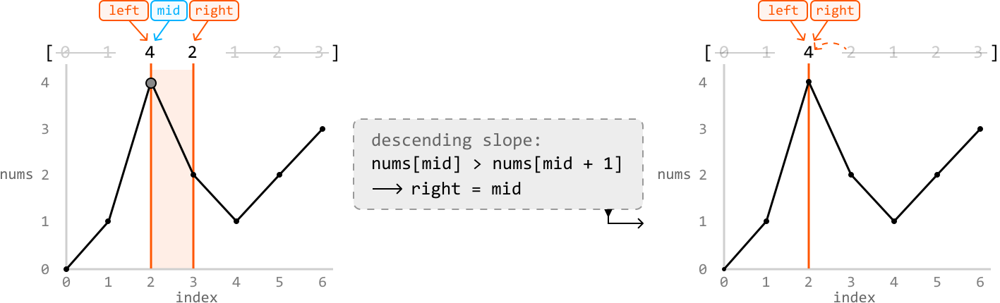

Now that the left and right pointers have met, locating index 2 as a local maxima, we return this maxima’s index (`left`).

---

**Summary**

Case 1: The midpoint forms a descending slope with its right neighbor, indicating the midpoint is a local maxima, or that a local maxima exists to the left. Narrow the search space toward the left while including the midpoint:

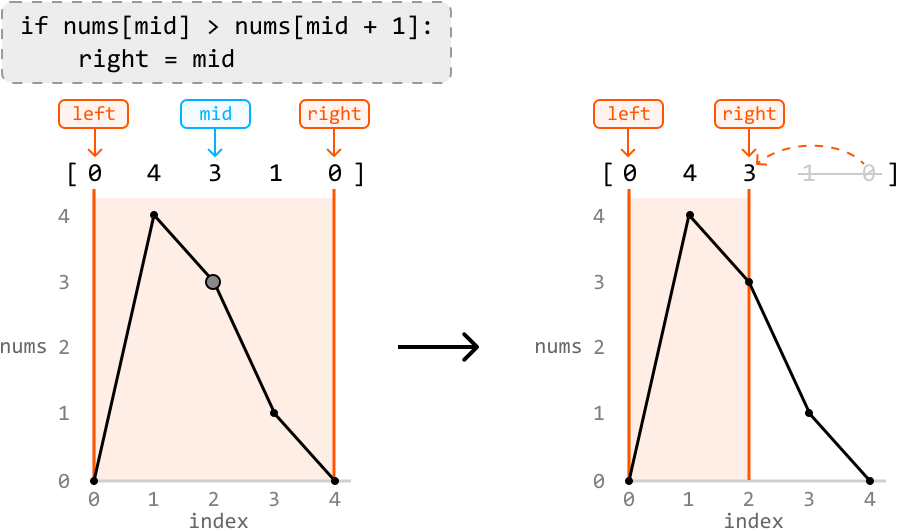

Case 2: The midpoint forms an ascending slope with its right neighbor, indicating a local maxima exists to the right. Narrow the search space toward the right while excluding the midpoint:

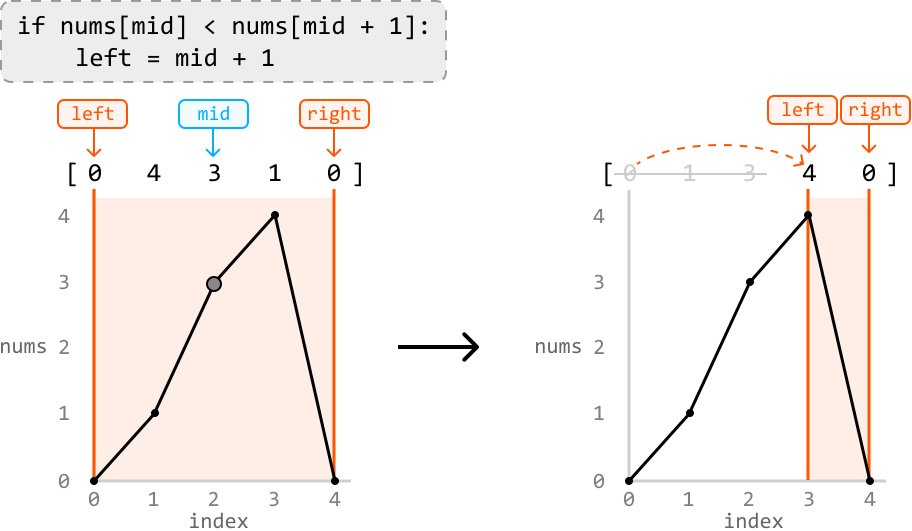

## Implementation

```python
from typing import List
    
def local_maxima_in_array(nums: List[int]) -> int:
    left, right = 0, len(nums) - 1
    while left < right:
        mid = (left + right) // 2
        if nums[mid] > nums[mid + 1]:
            right = mid
        else:
            left = mid + 1
    return left

```

```javascript
export function local_maxima_in_array(nums) {
  let left = 0
  let right = nums.length - 1
  while (left < right) {
    const mid = Math.floor((left + right) / 2)
    if (nums[mid] > nums[mid + 1]) {
      right = mid
    } else {
      left = mid + 1
    }
  }
  return left
}

```

```java
import java.util.ArrayList;

public class Main {
    public int local_maxima_in_array(ArrayList<Integer> nums) {
        int left = 0, right = nums.size() - 1;
        while (left < right) {
            int mid = (left + right) / 2;
            if (nums.get(mid) > nums.get(mid + 1)) {
                right = mid;
            } else {
                left = mid + 1;
            }
        }
        return left;
    }
}

```

### Complexity Analysis

**Time complexity:** The time complexity of `local_maxima_in_array` is O(log(n)), where n denotes the length of the array. This is because we use binary search to find a local maxima.

**Space complexity:** The space complexity is O(1).