# Weighted Random Selection

Given an array of items, each with a corresponding weight, implement a function that **randomly selects an item from the array**, where the probability of selecting any item is proportional to its weight.

In other words, the probability of picking the item at index `i` is:

`weights[i] / sum(weights)`.

Return the index of the selected item.

#### Example:

```python
Input: weights = [3, 1, 2, 4]

```

Explanation:

`sum(weights) = 10`

3 has a 3/10 probability of being selected.

1 has a 1/10 probability of being selected.

2 has a 2/10 probability of being selected.

4 has a 4/10 probability of being selected.

For example, we expect index 0 to be returned 30% of the time.

#### Constraints:

- The `weights` array contains at least one element.

## Intuition

A completely uniform random selection implies every index has an equal chance of being selected. A *weighted* random selection means some items are more likely to be picked than others. If we repeatedly perform a random selection many times, the frequency of each index being picked will match their expected probabilities.

The challenge with this problem is determining a method to randomly select an index based on its probability.

Let’s say we had weights 1 and 4 for indexes 0 and 1, respectively:


Here, index 1 should be selected with a probability of 4/5, significantly higher than index 0’s probability of 1/5:

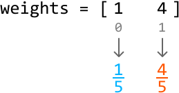

A useful observation is that all probabilities have the same denominator (which is 5 in this case). Now, imagine we had a line with the same length as this denominator, and we divided this line into two segments of size 1 and 4, respectively:

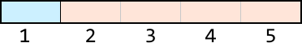

If we were to randomly pick a number on this line, we’d pick the first segment with a probability of 1/5 and the second segment 4/5 times. Now, imagine index 0 represents the first segment, and index 1 represents the second segment:

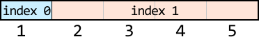

If we **randomly select a number on this line**, we’ll select index 0 with a probability of 1/5, and index 1 with a probability of 4/5. This reflects their expected probabilities.

What we need now is a way to identify which numbers on the number line correspond to which index so that when we pick a random number on this line, we know which index to return.

Before we continue, let’s establish the definitions of terms used in this explanation:

- “Weights” refers to the values of the elements in the weights array.

- “Indexes” refers to the indexes of the weights array.

- “Numbers” or “numbers on the number line” refers to the numbers from 1 to sum(weights).

**Determining which numbers on the number line correspond to which indexes**

As mentioned before, to know which index to return, we need a way to tell which index our random number line number corresponds to. Consider a larger distribution of weights:

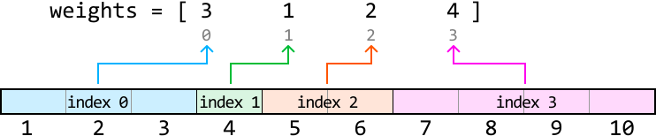

One strategy is to use a hash map. In this hash map, each number on the line is a key, and its corresponding index is the value:

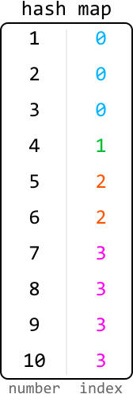

This method uses a lot of space because we need to store a key-value pair for each number on the number line. Let's consider some other more space-efficient methods.

A more efficient strategy is to store only the **endpoints of each segment** instead.

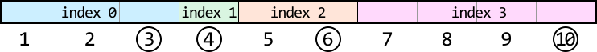

Naturally, the endpoint of a segment marks where that segment ends. It also helps us know where the next segment begins, as each new segment starts right after the previous one ends. This way, we can determine the start and end of each index’s segment.

By storing only the endpoints, we need to keep just `n` values, one for each endpoint. When storing these endpoints in an array, the array index of each endpoint is the same as its index value on the number line:

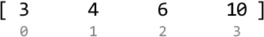

The question now is, how do we find these endpoints?

**Obtaining the endpoints of each index’s segment on the line**

A key observation is that the endpoint of a segment is equal to the length of all previous segments, plus the length of the current segment. We can see how this works below:

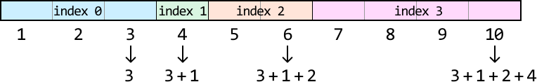

This demonstrates that each endpoint is a cumulative sum, suggesting we can obtain the endpoint of each segment by obtaining the **prefix sums** of the array of weights:

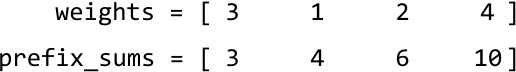

As we can see, the prefix sums array stores the endpoint of each segment.

Now, let's see how the prefix sums array helps us. When we pick a random number from 1 to 10, we need to determine which index it corresponds to using the prefix sum array. Let's see how we can do this.

**Using the prefix sums to determine which numbers correspond to which indexes**

Let’s say we pick a random number from 1 to 10 and get 5. How can we use the prefix sum array to determine which index that 5 corresponds to? To determine the segment, we’ll need to find its corresponding endpoint. We know that:

- Either 5 itself is the endpoint, since 5 could be the endpoint of its own segment, or:

- The endpoint is somewhere to the right of 5 since its endpoint cannot be to the left.

Among all the endpoints to the right of 5, the closest one to 5 will be the endpoint of its segment. Endpoints farther away belong to different segments:

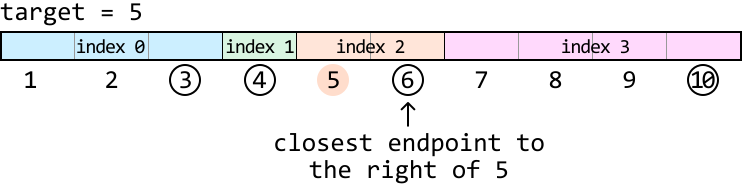

This means for any target, we’re looking for the **first prefix sum (endpoint) greater than or equal to the target**. Below, we can see which prefix sum first meets this condition for a target of 5:

![Image represents a depiction of prefix sums, showing an array `prefix_sums` initialized with values [3, 4, 6, 10].  The ](./images/d97314da_image-06-08-12-OL7XXR2Z.svg)

As we can see, the first prefix sum that satisfies this condition is the same as the lower-bound prefix sum that satisfies this condition. Therefore, we can perform a **lower-bound binary search** to find it.

Let’s see how this works over our example with a random target of 5. The **search space** should encompass all prefix sum values:

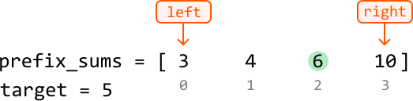

Let’s begin narrowing the search space. Remember that we’re looking for the lower-bound prefix sum which satisfies the condition **`prefix_sums[mid] ≥ target`**.

---

The initial midpoint value is 4, which is less than the target of 5. This means the lower bound is somewhere to the right of the midpoint, so let’s narrow the search space toward the right:

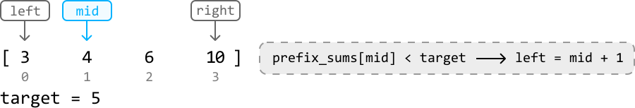

---

![Image represents a visual depiction of a binary search algorithm's step.  A sorted array `[3, 4, 6, 10]` is shown with i](./images/b1114e39_image-06-08-15-JMX3OC5G.svg)

---

The midpoint value is now 6, which is greater than the target. This midpoint satisfies our condition, so it could be the lower bound. If it isn’t, then the lower bound is somewhere further to the left. So, let’s narrow the search space toward the left while including the midpoint:

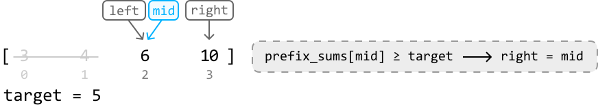

---

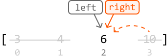

---

Now, the left and right pointers have met with the search space consisting of a single value which represents the lower bound. So, we can exit the binary search and return the index that corresponds to this prefix sum: left:

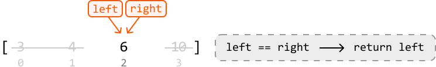

## Implementation

```python
from typing import List
import random
    
class WeightedRandomSelection:
    def __init__(self, weights: List[int]):
        self.prefix_sums = [weights[0]]
        for i in range(1, len(weights)):
            self.prefix_sums.append(self.prefix_sums[-1] + weights[i])
      
    def select(self) -> int:
        # Pick a random target between 1 and the largest endpoint on the number
        # line.
        target = random.randint(1, self.prefix_sums[-1])
        left, right = 0, len(self.prefix_sums) - 1
        # Perform lower-bound binary search to find which endpoint (i.e., prefix
        # sum value) corresponds to the target.
        while left < right:
            mid = (left + right) // 2
            if self.prefix_sums[mid] < target:
                left = mid + 1
            else:
                right = mid
        return left

```

```javascript
export class WeightedRandomSelection {
  constructor(weights) {
    this.prefixSums = [weights[0]]
    for (let i = 1; i < weights.length; i++) {
      this.prefixSums.push(this.prefixSums[i - 1] + weights[i])
    }
  }

  select() {
    // Pick a random target between 1 and the largest endpoint on the number line.
    const total = this.prefixSums[this.prefixSums.length - 1]
    const target = Math.floor(Math.random() * total) + 1
    let left = 0
    let right = this.prefixSums.length - 1
    // Perform lower-bound binary search to find which endpoint (i.e., prefix sum value) corresponds
    // to the target.
    while (left < right) {
      const mid = Math.floor((left + right) / 2)
      if (this.prefixSums[mid] < target) {
        left = mid + 1
      } else {
        right = mid
      }
    }
    return left
  }
}

```

```java
import java.util.ArrayList;
import java.util.Random;

class WeightedRandomSelection {
    private ArrayList<Integer> prefixSums;
    private Random rand;

    public WeightedRandomSelection(ArrayList<Integer> weights) {
        // Initialize prefix sums
        prefixSums = new ArrayList<>();
        prefixSums.add(weights.get(0));
        for (int i = 1; i < weights.size(); i++) {
            prefixSums.add(prefixSums.get(i - 1) + weights.get(i));
        }
        rand = new Random();
    }

    public int select() {
        // Pick a random target between 1 and the largest endpoint on the number line.
        int target = rand.nextInt(prefixSums.get(prefixSums.size() - 1)) + 1;

        // Perform lower-bound binary search to find which endpoint (i.e., prefix sum value) corresponds to the target.
        int left = 0, right = prefixSums.size() - 1;
        while (left < right) {
            int mid = (left + right) / 2;
            if (prefixSums.get(mid) < target) {
                left = mid + 1;
            } else {
                right = mid;
            }
        }
        return left;
    }
}

```

### Complexity Analysis

**Time complexity:** The time complexity of the constructor is O(n) because we iterate through each weight in the weights array once. The time complexity of select is O(log(n)) since we perform binary search over the `prefix_sums` array.

**Space complexity:** The space complexity of the constructor is O(n) due to the `prefix_sums` array. The space complexity of select is O(1).