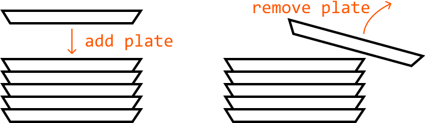
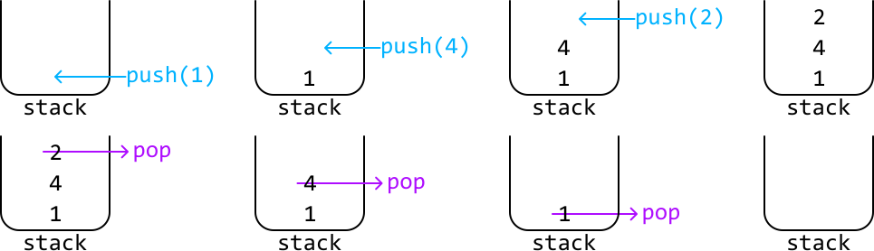
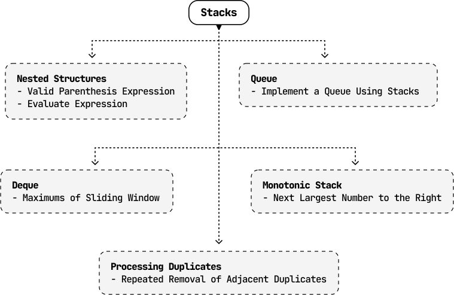

# Introduction to Stacks

## Intuition

Imagine a stack of plates. You can only add a new plate to the top of the stack, and when you need a plate, you take the one from the top. It’s not possible to take a plate from the bottom or middle without first removing all the plates above it.

This analogy encapsulates the essence of the stack data structure. Adding a plate to and taking a plate from the top of the stack, physically demonstrates the two main stack operations:

- **Push** (adds an element to the top of the stack).

- **Pop** (removes and returns the element at the top of the stack).

**LIFO (Last‐In‐First‐Out)**
Stacks follow the LIFO principle, meaning the most recently added item is the first to be removed. This unique characteristic makes stacks particularly useful in various scenarios where the order of processing or removal is critical. Here are a few key applications:

- Handling nested structures: Stacks are a good option for parsing or validating nested structures such as nested parentheses in a string (e.g., "`(())()`"). They allow us to process the innermost nested structures first due to the LIFO principle.

- Reverse order: When elements are added (pushed) onto a stack and then removed (popped), they come out in the reverse order of how they were added. This property is useful for reversing sequences.

- Substitute for recursion: Recursive algorithms use the recursive call stack to manage recursive calls. Ultimately, this recursive call stack is itself a stack. As such, we can often implement recursive functions iteratively using the stack data structure.
  • Monotonic stacks: These special‐purpose stacks maintain elements in a consistent, increasing or decreasing sorted order. Before adding a new element to the stack, any elements that break this order are removed from the top of the stack, ensuring the stack remains sorted.

Some examples of the above applications are explored in this chapter.

Below is a time complexity breakdown of common stack operations:

| Operation | Worst case | Description |
| --- | --- | --- |
| Push | O(1) | Adds an element to the top of the stack. |
| Pop | O(1) | Removes and returns the element at the top of the stack. |
| Peek | O(1) | Returns the element at the top of the stack without removing it. |
| IsEmpty | O(1) | Checks if the stack is empty. |

## Real-world Example

**Function call management:** As hinted above, a common real‐world example of stacks is in function call management within operating systems or programming languages.

When a function is called, the program pushes the function’s state (including its parameters, local variables, and the return address) onto the call stack. As functions call other functions, their states are also pushed onto the stack. When a function completes, its state is popped off the stack, and the program returns to the calling function. This stack‐based approach ensures that functions return control in the correct order, managing nested or recursive function calls efficiently.

## Chapter Outline

This chapter explores a variety of problems, offering detailed explanations for how to use stacks in problem solving. Additionally, we briefly introduce queues and deques, which are two data structures that share similarities with stacks, but operate on different principles.