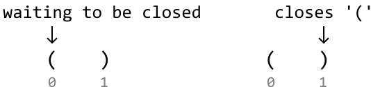
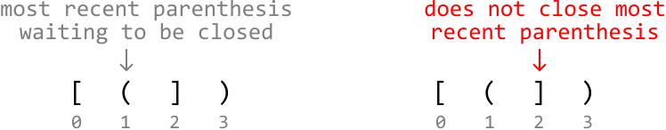
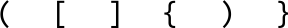
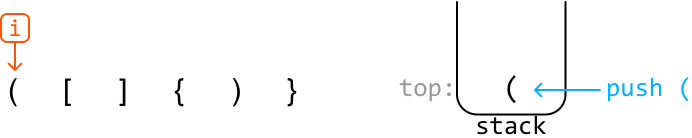
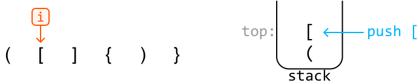
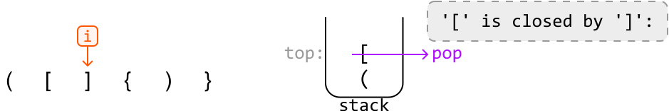
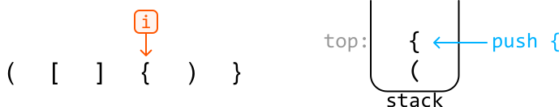
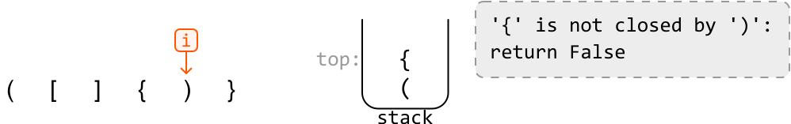
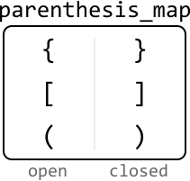

# Valid Parenthesis Expression

Given a string representing an expression of parentheses containing the characters `'('`, `')'`, `'['`, `']'`, `'{'`, or `'}'`, determine if the expression forms a **valid sequence of parentheses**.

A sequence of parentheses is valid if every opening parenthesis has a corresponding closing parenthesis, and no closing parenthesis appears before its matching opening parenthesis.

#### Example 1:

```python
Input: s = '([]{})'
Output: True

```

#### Example 2:

```python
Input: s = '([]{)}'
Output: False

```

Explanation: The `'('` parenthesis is closed before its nested `'{'` parenthesis is closed.

## Intuition

An early observation is that for each type of parenthesis, the number of opening and closing parenthesis must be identical. However, to check if an expression is valid, this observation alone isn’t enough. For example, the string "`())(`" has the same number of opening and closing parentheses, but is still invalid. This means we need a way to account for the order of parentheses.

Consider the string “`()`”. The first parenthesis is opening, and we’re waiting for it to be closing. Upon reaching the second parenthesis, the first parenthesis gets closed.



Now, consider the string “`[(])`”. When we reach index 1, we have two opening parentheses waiting to be closed. In particular, we expect ‘`(`‘ to be closed before ‘`[`’. The first closing parenthesis we encounter is ‘`]`’, which does not close ‘`(`’. Therefore, this string is invalid.



The key observation here is that **the most recent opening parenthesis we encounter should be the first parenthesis that gets closed**. So, opening parentheses are processed from most recent to least recent, which is indicative of a last-in-first-out (LIFO) dynamic. This leads to the idea that a **stack** can be used to solve this problem.

**Stack**

Here’s a high-level strategy:

- Add each opening parenthesis we encounter to the stack. This way, the most recent parenthesis is always at the top of the stack.

- When encountering a closing parenthesis, check if it can close the most recent opening parenthesis.
  
  
  
  - If it can, close that pair of parenthesis by popping off the top of the stack.
  
  - If not, the string is invalid.

Let’s see how this strategy works over an example:



---

For each opening parenthesis we encounter, push it to the top of the stack:





---

Next, we encounter a closing parenthesis. Comparing it to the opening parenthesis at the top of the stack, we see that it correctly closes that opening parenthesis. So, we can pop off the opening parenthesis at the top of the stack:



---

The next character is an opening parenthesis, which we just push to the top of the stack:



---

The next character is a closing parenthesis, ‘`)`’, which does not close the opening parenthesis at the top of the stack, ‘`{`’. This means this parenthesis expression is invalid. As such, we return false.



---

If we’ve iterated over the entire string without returning false, that means we’ve accounted for all closing parentheses in the string.

**Edge case: extra opening parentheses**

We only check for invalidity at closing parenthesis, so need to perform a final check to ensure there aren’t any opening parentheses in the string left unclosed. This can be done by checking if the stack is empty after processing the whole input string, as a non-empty stack indicates opening parentheses remain in the stack.

**Managing three types of parentheses**

In our algorithm, we need a way to ensure we compare the correct types of opening and closing parentheses. We can use a **hash map** for this, which maps each type of opening parenthesis to its corresponding closing parenthesis:



This hash map can also be used as a way to check if a parenthesis is an opening or a closing one: if the parenthesis exists in this hash map as a key, it’s an opening parenthesis.

## Implementation

```python
def valid_parenthesis_expression(s: str) -> bool:
    parentheses_map = {'(': ')', '{': '}', '[': ']'}
    stack = []
    for c in s:
        # If the current character is an opening parenthesis, push it onto the stack.
        if c in parentheses_map:
            stack.append(c)
        # If the current character is a closing parenthesis, check if it closes the
        # opening parenthesis at the top of the stack.
        else:
            if stack and parentheses_map[stack[-1]] == c:
                stack.pop()
            else:
                return False
    # If the stack is empty, all opening parentheses were successfully closed.
    return not stack

```

```javascript
export function valid_parenthesis_expression(s) {
  const parenthesesMap = { '(': ')', '{': '}', '[': ']' }
  const stack = []
  for (const c of s) {
    // If the current character is an opening parenthesis, push it onto the stack.
    if (c in parenthesesMap) {
      stack.push(c)
    } else {
      // If the current character is a closing parenthesis, check if it closes
      // the opening parenthesis at the top of the stack.
      if (stack.length && parenthesesMap[stack[stack.length - 1]] === c) {
        stack.pop()
      } else {
        return false
      }
    }
  }
  // If the stack is empty, all opening parentheses were successfully closed.
  return stack.length === 0
}

```

```java
import java.util.HashMap;
import java.util.Stack;

public class Main {
    public Boolean valid_parenthesis_expression(String s) {
        HashMap<Character, Character> parenthesesMap = new HashMap<>();
        parenthesesMap.put('(', ')');
        parenthesesMap.put('{', '}');
        parenthesesMap.put('[', ']');
        Stack<Character> stack = new Stack<>();
        for (char c : s.toCharArray()) {
            // If the current character is an opening parenthesis, push it onto the stack.
            if (parenthesesMap.containsKey(c)) {
                stack.push(c);
            }
            // If the current character is a closing parenthesis, check if it closes the
            // opening parenthesis at the top of the stack.
            else {
                if (!stack.isEmpty() && parenthesesMap.get(stack.peek()) == c) {
                    stack.pop();
                } else {
                    return false;
                }
            }
        }
        // If the stack is empty, all opening parentheses were successfully closed.
        return stack.isEmpty();
    }
}

```

### Complexity Analysis

**Time complexity:** The time complexity of `valid_parenthesis_expression` is O(n) because we traverse the entire string once. For each character, we perform a constant-time operation, either pushing an opening parenthesis onto the stack or popping it off for a matching closing parenthesis.

**Space complexity:** The space complexity is O(n) because the stack stores at most n characters, and the hash map takes up O(1) space.