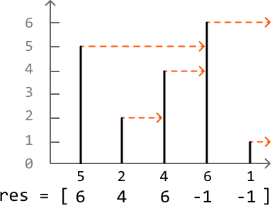
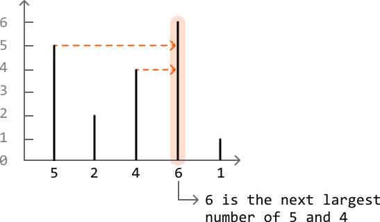
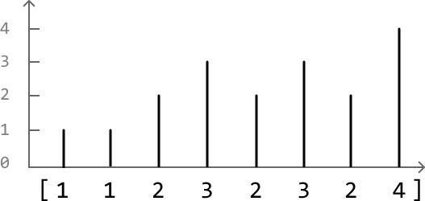
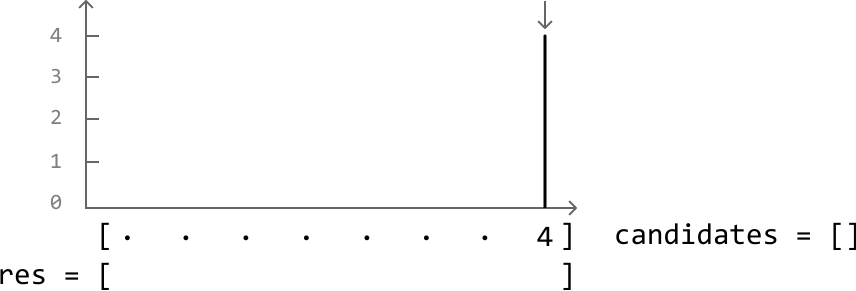
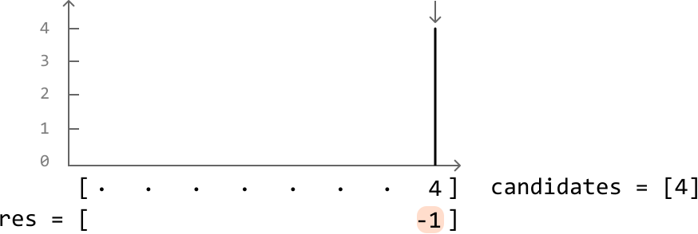
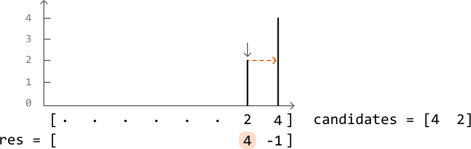
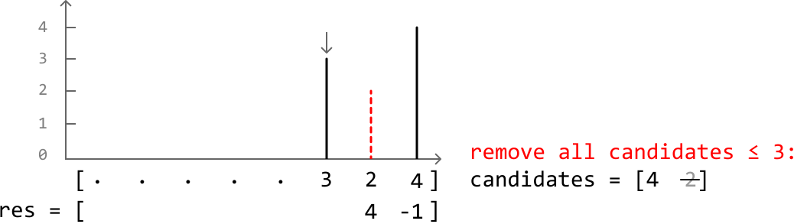
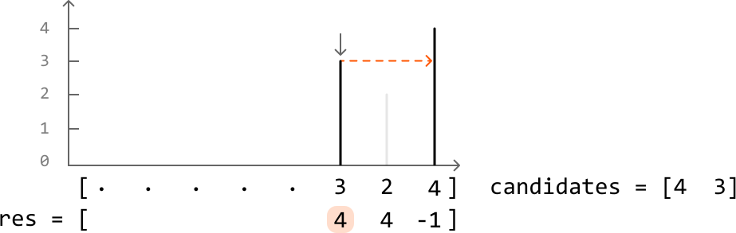
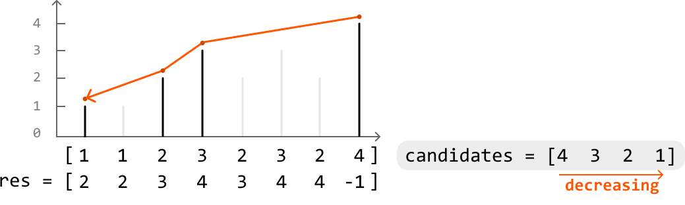

# Next Largest Number to the Right

Given an integer array `nums`, return an output array res where, for each value `nums[i]`, `res[i]` is the first number to the right that's larger than `nums[i]`. If no larger number exists to the right of `nums[i]`, set `res[i]` to ‐1.

#### Example:



```python
Input: nums = [5, 2, 4, 6, 1]
Output: [6, 4, 6, -1, -1]

```

## Intuition

A brute-force solution to this problem involves iterating through each number in the array and, for each of these numbers, linearly searching to their right to find the first larger number. This approach takes O(n^2) time, where n denotes the length of the array. Can we think of something better?

Let’s approach this problem from a different perspective. Instead of finding the next largest number for each value, what if we **check whether the value itself is the next largest number for any value(s) to its left**? For example, can we figure out which values in the following example have 6 as their next largest number?:



With this shift in perspective, we should search the array from right to left: certain values we encounter from the right could potentially be the next largest number of values to their left. Let’s call these values “**candidates**.” But how do we determine which numbers qualify as candidates?

Consider the example below:



---

Let’s start at the rightmost index, where the only value we know initially is 4:



Right now, we can say 4 is a candidate as it might be the next largest number of values to its left. No candidates have been encountered before 4 because it’s the rightmost element, so we should mark the result for 4 in res as -1:



---

Next, we encounter a 2. The next largest number of 2 is the most recently added candidate that’s larger than it. In this case, the rightmost candidate in the candidates list represents the most recently added candidate, which is 4 in this case.

Record 4 as the next largest number of 2 in res, and then add 2 to the candidates list because it could be the next largest number of elements to its left:



---

The next number is 3. Notice that with the introduction of 3, number 2 should no longer be considered a candidate. This is because it’s now impossible for 2 to be the next largest number of any value to its left. Since 3 is both larger and further to the left, it will always be prioritized over 2 as the next largest number. So, let’s remove 2 from the candidates list, as well as any other candidate that’s less than or equal to 3:



Since we removed all candidates smaller than 3, the rightmost candidate is now 4. So, let’s record 4 as the next largest number of 3 in res and add 3 to the candidates list:



---

This provides a crucial insight:

> 
> 
> Whenever we move to a new number, all candidates less than or equal to this number should be removed from the candidates list.
> 
> 

Another key observation is that **the list of candidates always maintains a strictly decreasing order of values**. This is because we always remove candidates less than or equal to each new value, ensuring values are added in decreasing order. We can see this more clearly in the final state of the candidates list of the previous example:



This indicates a **stack** is the ideal data structure for storing the candidates list, since stacks can be used to efficiently maintain a **monotonic decreasing order** of values, as mentioned in the introduction.

The top of the stack represents the most recent candidate to the right of each new number encountered. Given this, here’s how to use the stack to add and remove candidates at each value:

- Pop off all candidates from the top of the stack less than or equal to the current value.

- The top of the stack will then represent the next largest number of the current value.

- Record the top of the stack as the answer for the current value.

- If the stack is empty, there’s no next largest number for the current value. So, record -1.

- Add the current value as a new candidate by pushing it to the top of the stack.

## Implementation

```python
from typing import List
    
def next_largest_number_to_the_right(nums: List[int]) -> List[int]:
    res = [0] * len(nums)
    stack = []
    # Find the next largest number of each element, starting with the rightmost
    # element.
    for i in range(len(nums) - 1, -1, -1):
        # Pop values from the top of the stack until the current value's next largest
        # number is at the top.
        while stack and stack[-1] <= nums[i]:
            stack.pop()
        # Record the current value's next largest number, which is at the top of the
        # stack. If the stack is empty, record -1.
        res[i] = stack[-1] if stack else -1
        stack.append(nums[i])
    return res

```

```javascript
export function next_largest_number_to_the_right(nums) {
  const res = new Array(nums.length).fill(0)
  const stack = []
  // Find the next largest number for each element, starting from the right.
  for (let i = nums.length - 1; i >= 0; i--) {
    // Pop values from the stack until the current value's next largest
    // number is found or the stack is empty.
    while (stack.length && stack[stack.length - 1] <= nums[i]) {
      stack.pop()
    }
    // If the stack is empty, no greater number to the right exists.
    res[i] = stack.length ? stack[stack.length - 1] : -1

    // Push the current number onto the stack.
    stack.push(nums[i])
  }
  return res
}

```

```java
import java.util.ArrayList;
import java.util.Stack;

public class Main {
    public ArrayList<Integer> next_largest_number_to_the_right(ArrayList<Integer> nums) {
        ArrayList<Integer> res = new ArrayList<>();
        Stack<Integer> stack = new Stack<>();
        // Initialize result list with zeros.
        for (int i = 0; i < nums.size(); i++) {
            res.add(0);
        }
        // Find the next largest number of each element, starting with the rightmost
        // element.
        for (int i = nums.size() - 1; i >= 0; i--) {
            // Pop values from the top of the stack until the current value's next largest
            // number is at the top.
            while (!stack.isEmpty() && stack.peek() <= nums.get(i)) {
                stack.pop();
            }
            // Record the current value's next largest number, which is at the top of the
            // stack. If the stack is empty, record -1.
            res.set(i, stack.isEmpty() ? -1 : stack.peek());
            stack.push(nums.get(i));
        }
        return res;
    }
}

```

### Complexity Analysis

**Time complexity:** The time complexity of `next_largest_number_to_the_right` is O(n). This is because each value of `nums` is pushed and popped from the stack at most once.

**Space complexity:** The space complexity is O(n) because the stack can potentially store all n values.