# Evaluate Expression

Given a string representing a mathematical expression containing integers, parentheses, addition, and subtraction operators, evaluate and return the result of the expression.

#### Example:

```python
Input: s = '18-(7+(2-4))'
Output: 13

```

## Intuition

At first, it might seem overwhelming to deal with expressions that include a variety of elements like negative numbers, nested expressions inside parentheses, and numbers with multiple digits. The key to managing this complexity is to break down the problem into smaller, more manageable parts. Let's first focus on evaluating simple expressions that contain no parentheses.

**Handling positive and negative signs**

Consider the following expression:

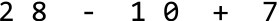

There's already some complexity in this expression with there being two signs to consider: plus and minus. An immediate simplification we can make is to **treat all expressions as ones of pure addition**. This is possible when we assign signs to each number (1 representing + and -1 representing -). This sign can be multiplied by the number to attain its correct value. This allows us to just focus on performing additions:

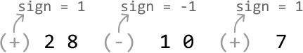

**Processing numbers with multiple digits**

Another complexity in this expression is that some numbers have multiple digits. We’ll need a way to build numbers digit by digit until we reach the end of the number. We can build a number using the variable `curr_num`, which is initially set to 0. Every time we encounter a new digit, we multiply `curr_num` by 10 and add the new digit to it, effectively shifting all digits to the left and appending the new digit.

We can see this process play out for the string “123” in the following illustration:

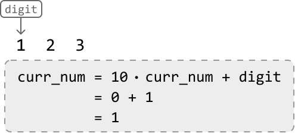

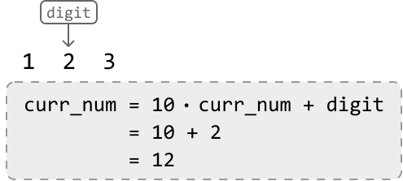

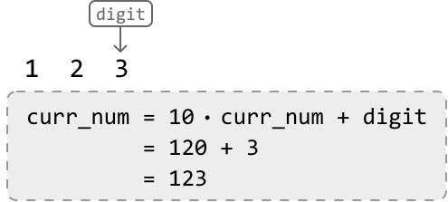

We can stop building this number once we encounter a non-digit character, indicating the end of the number.

**Evaluating an expression without parentheses**

With the information from the section above, let's evaluate the following expression, which contains no parentheses. We’ll start off with a sign of 1:

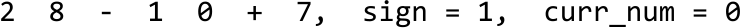

---

Upon reaching the ‘-’ operator, we’ve reached the end of the first number (28). So, let’s:

- Multiply the current number (28) by its sign (1).

- Add the resulting product (28) to the result.

- Update the sign to -1 since the current operator is a minus sign.

- Reset `curr_num` to 0 before building the next number.

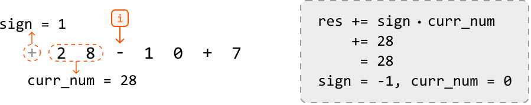

---

Once we reach the second operator, we multiply the current number (10) by its sign of -1 before adding the resulting product (-10) to the result. This effectively subtracts 10 from the result:

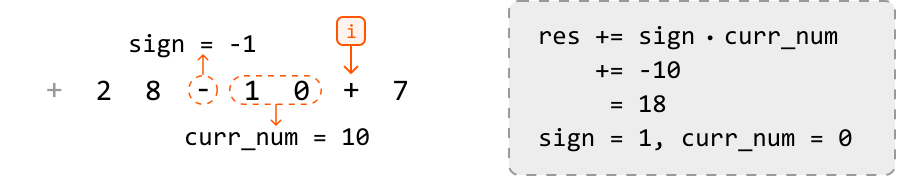

---

Finally, once we’ve reached the end of the string, we just add the final number (7) to the result after multiplying it by its sign of 1:

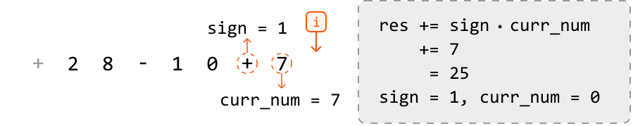

**Evaluating expressions containing parentheses**

Now that we can solve simple expressions, it's time to bring parentheses into the discussion. Moving forward, we define a nested expression as one that’s inside a pair of parentheses.

One challenge is that we need to evaluate the results of nested expressions before we can calculate the original expression. Once all nested expressions are evaluated, we can evaluate the original expression.

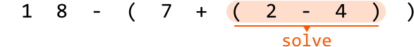

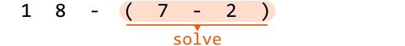

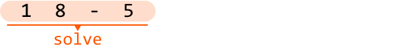

Consider another problem in this chapter that also contains parentheses: *Valid Parenthesis Expression*. In that problem, we used a **stack** to process nested parentheses in the right order. This suggests a stack might also help us evaluate nested expressions in the right order. Let’s explore this idea further.

Similar to *Valid Parenthesis Expression*, an opening parenthesis ‘`(`‘ indicates the start of a new nested expression, whereas a closing parenthesis ‘`)`’ indicates the end of one. Understanding this, let’s try to use a stack to solve the following expression.

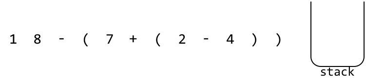

---

We already know how to evaluate expressions without parentheses, so let’s just focus on what to do when we encounter a parenthesis.

At the first opening parenthesis, we know a nested expression has started. Before we evaluate the nested expression, we’ll need to save the running result (`res`) of the current expression, as well as the sign of this upcoming nested expression. This way, once we’re done evaluating the nested expression, we can resume where we were in the current expression.

Here are the steps for when we encounter an opening parenthesis:

- `stack.push(res)`: Save the running result on the stack.

- `stack.push(sign)`: Save the sign of the upcoming nested expression on the stack.

- `res = 0`, `sign = 1`: Reset these variables because we’re about to begin calculating a new expression.

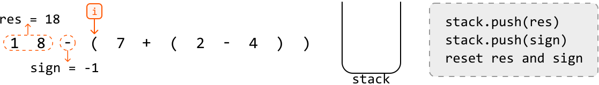


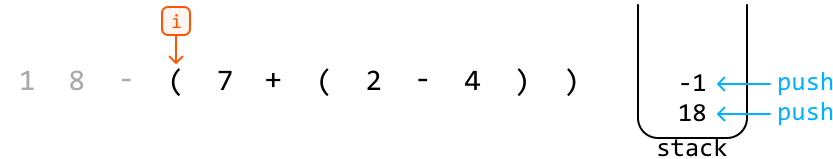

---

The next parenthesis we encounter is an opening parenthesis. Again, this indicates the start of a new nested expression. Let’s save the current result and sign on the stack, before resetting them to evaluate the upcoming nested expression:

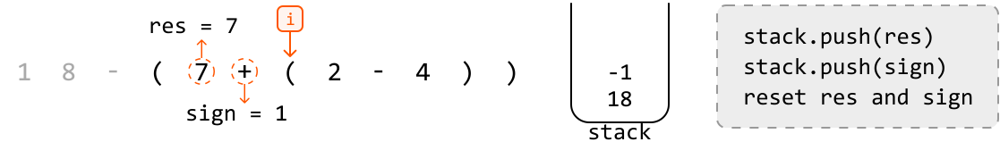


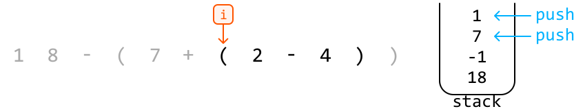

---

The next parenthesis we encounter is a closing parenthesis. This means the current nested expression just ended, and we need to merge its result with the outer expression. Here’s how we do this:

- `res *= stack.pop()`: Apply the sign of the current nested expression to its result.

- `res += stack.pop()`: Add the result of the outer expression to the result of the current nested expression.

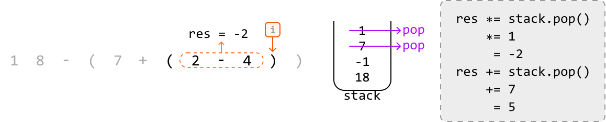

After applying those operations, the value of `res` will be 5, representing the result of the highlighted part of the expression below:

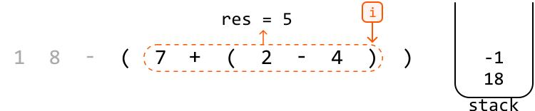

---

At the final closing parenthesis, we can apply the same steps:

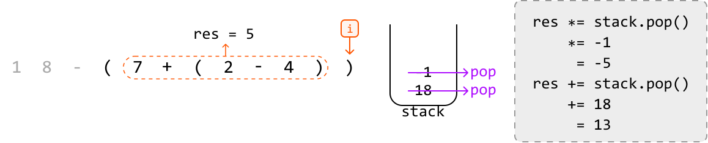

Finally, the value of `res` will be 13, representing the result of the entire expression:

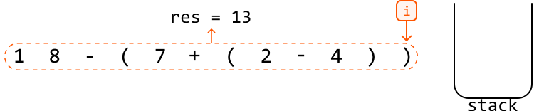

Now that we’ve reached the end of the string, we can return `res`.

## Implementation

```python
def evaluate_expression(s: str) -> int:
    stack = []
    curr_num, sign, res = 0, 1, 0
    for c in s:
        if c.isdigit():
            curr_num = curr_num * 10 + int(c)
        # If the current character is an operator, add 'curr_num' to the result
        # after multiplying it by its sign.
        elif c == '+' or c == '-':
            res += curr_num * sign
            # Update the sign and reset 'curr_num'.
            sign = -1 if c == '-' else 1
            curr_num = 0
        # If the current character is an opening parenthesis, a new nested expression
        # is starting.
        elif c == '(':
            # Save the current 'res' and 'sign' values by pushing them onto
            # the stack, then reset their values to start calculating the new nested
            # expression.
            stack.append(res)
            stack.append(sign)
            res, sign = 0, 1
        # If the current character is a closing parenthesis, a nested expression has
        # ended.
        elif c == ')':
            # Finalize the result of the current nested expression.
            res += sign * curr_num
            # Apply the sign of the current nested expression’s result before adding
            # this result to the result of the outer expression.
            res *= stack.pop()
            res += stack.pop()
            curr_num = 0
    # Finalize the result of the overall expression.
    return res + curr_num * sign

```

```javascript
export function evaluate_expression(s) {
  const stack = []
  let currNum = 0,
    sign = 1,
    res = 0
  for (let c of s) {
    if (/\d/.test(c)) {
      currNum = currNum * 10 + parseInt(c)
    }
    // If the current character is an operator, add 'currNum' to the result
    // after multiplying it by its sign.
    else if (c === '+' || c === '-') {
      res += currNum * sign
      // Update the sign and reset 'currNum'.
      sign = c === '-' ? -1 : 1
      currNum = 0
    }
    // If the current character is an opening parenthesis, a new nested expression
    // is starting.
    else if (c === '(') {
      // Save the current 'res' and 'sign' values by pushing them onto
      // the stack, then reset their values to start calculating the new nested
      // expression.
      stack.push(res)
      stack.push(sign)
      res = 0
      sign = 1
    }
    // If the current character is a closing parenthesis, a nested expression has
    // ended.
    else if (c === ')') {
      // Finalize the result of the current nested expression.
      res += sign * currNum
      // Apply the sign of the current nested expression’s result before adding
      // this result to the result of the outer expression.
      res *= stack.pop()
      res += stack.pop()
      currNum = 0
    }
  }
  // Finalize the result of the overall expression.
  return res + currNum * sign
}

```

```java
import java.util.Stack;

public class Main {
    public Integer evaluate_expression(String s) {
        Stack<Integer> stack = new Stack<>();
        int currNum = 0, sign = 1, res = 0;
        for (char c : s.toCharArray()) {
            if (Character.isDigit(c)) {
                currNum = currNum * 10 + (c - '0');
            }
            // If the current character is an operator, add 'currNum' to the result
            // after multiplying it by its sign.
            else if (c == '+' || c == '-') {
                res += currNum * sign;
                // Update the sign and reset 'currNum'.
                sign = (c == '-') ? -1 : 1;
                currNum = 0;
            }
            // If the current character is an opening parenthesis, a new nested expression
            // is starting.
            else if (c == '(') {
                // Save the current 'res' and 'sign' values by pushing them onto
                // the stack, then reset their values to start calculating the new nested
                // expression.
                stack.push(res);
                stack.push(sign);
                res = 0;
                sign = 1;
            }
            // If the current character is a closing parenthesis, a nested expression has
            // ended.
            else if (c == ')') {
                // Finalize the result of the current nested expression.
                res += sign * currNum;
                // Apply the sign of the current nested expression’s result before adding
                // this result to the result of the outer expression.
                res *= stack.pop();
                res += stack.pop();
                currNum = 0;
            }
        }
        // Finalize the result of the overall expression.
        return res + currNum * sign;
    }
}

```

### Complexity Analysis

**Time complexity:** The time complexity of `evaluate_expression` is O(n) because we traverse each character of the expression once, processing nested expressions using the stack, where each stack push or pop operation takes O(1) time.

**Space complexity:** The space complexity is O(n) because the stack can grow proportionally to the length of the expression.