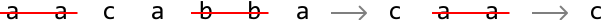
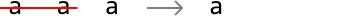
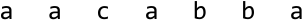
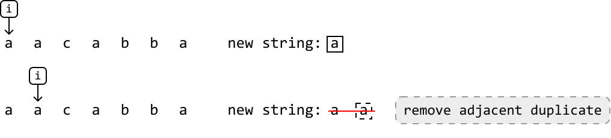
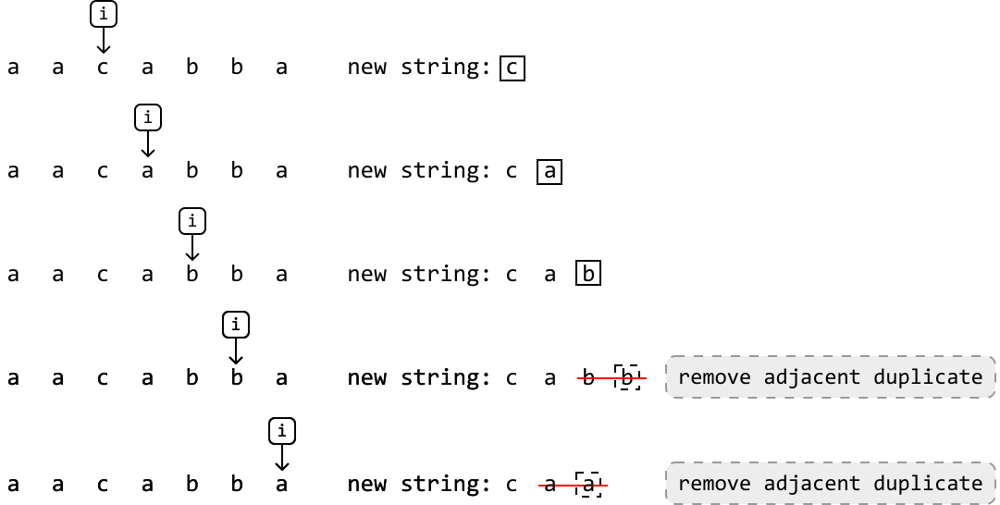

# Repeated Removal of Adjacent Duplicates

Given a string, continually perform the following operation: **remove a pair of adjacent duplicates** from the string. Continue performing this operation until the string no longer contains pairs of adjacent duplicates. Return the final string.

#### Example 1:



```python
Input: s = 'aacabba'
Output: 'c'

```

#### Example 2:



```python
Input: s = 'aaa'
Output: 'a'

```

## Intuition

One challenge in solving this problem is how we handle characters which aren’t currently adjacent duplicates but will be in the future.

A solution we can try is to iteratively **build the string character by character** and immediately remove each pair of adjacent duplicates that get formed as we’re building the string.

It’s also possible an adjacent duplicate may be formed after another adjacent duplicate gets removed. For example, with the string “abba”, removing “bb” will result in “aa”. Building the string character by character ensures the formation of “aa” gets noticed and removed. To better understand how this works, let’s dive into an example.

Consider the following string:



---



At the second ‘a’, we notice that adding it would result in an adjacent duplicate forming (i.e., “aa”). So, let’s remove this duplicate before adding any new characters. We’ll do this for all adjacent duplicates we come across as we build the string:



Once the smoke clears, the resulting string we were building ends up just being “c”, which is the expected output.

---

Now that we know how this strategy works, we just need a data structure that'll allow us to:

- Add letters to one end of it.

- Remove letters from the same end.

The **stack** data structure is a strong option because it allows for both operations.

As we push characters onto the stack, the top of the stack will represent the previous/most recently added character. Given this, to mimic the process of building the “new string” as shown in the example, we:

- Push the current character onto the stack if it’s different from the character at the top (i.e., not a duplicate character.)

- Pop off the character at the top of the stack if it's the same as the current character (i.e., a duplicate.)

Once all characters have been processed, the last thing to do is return the content of the stack as a string, since the final state of the stack will contain all characters that weren’t removed.

## Implementation

```python
def repeated_removal_of_adjacent_duplicates(s: str) -> str:
    stack = []
    for c in s:
        # If the current character is the same as the top character on the stack,
        # a pair of adjacent duplicates has been formed. So, pop the top character
        # from the stack.
        if stack and c == stack[-1]:
            stack.pop()
        # Otherwise, push the current character onto the stack.
        else:
            stack.append(c)
    # Return the remaining characters as a string.
    return ''.join(stack)

```

```javascript
export function repeated_removal_of_adjacent_duplicates(s) {
  const stack = []
  for (let c of s) {
    // If the current character is the same as the top character on the stack,
    // a pair of adjacent duplicates has been formed. So, pop the top character
    // from the stack.
    if (stack.length && c === stack[stack.length - 1]) {
      stack.pop()
    }
    // Otherwise, push the current character onto the stack.
    else {
      stack.push(c)
    }
  }
  // Return the remaining characters as a string.
  return stack.join('')
}

```

```java
import java.util.Stack;

public class Main {
    public static String repeated_removal_of_adjacent_duplicates(String s) {
        Stack<Character> stack = new Stack<>();
        for (char c : s.toCharArray()) {
            // If the current character is the same as the top character on the stack,
            // a pair of adjacent duplicates has been formed. So, pop the top character
            // from the stack.
            if (!stack.isEmpty() && c == stack.peek()) {
                stack.pop();
            }
            // Otherwise, push the current character onto the stack.
            else {
                stack.push(c);
            }
        }
        // Return the remaining characters as a string.
        StringBuilder result = new StringBuilder();
        for (char c : stack) {
            result.append(c);
        }
        return result.toString();
    }
}

```

### Complexity Analysis

**Time complexity:** The time complexity of the `repeated_removal_of_adjacent_duplicates` function is O(n) where n denotes the length of the string. This is because we traverse the entire string, and we perform a join operation of up to n characters in the stack. The stack `push` and `pop` operations contribute O(1) time.

**Space complexity:** The space complexity is O(n) because the stack can store at most n characters.