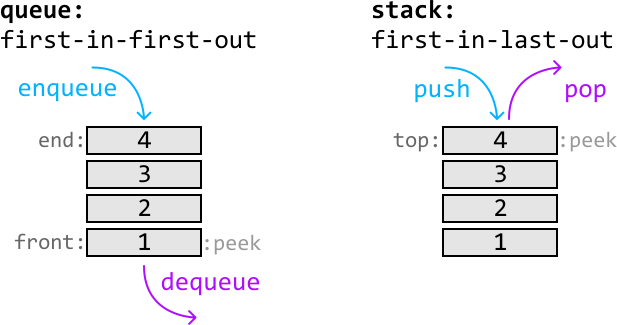
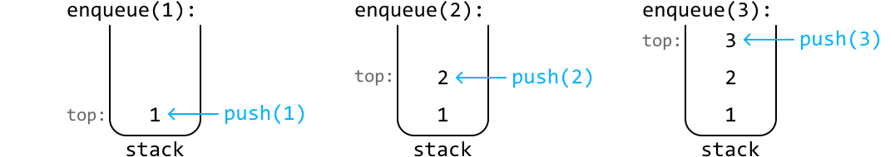
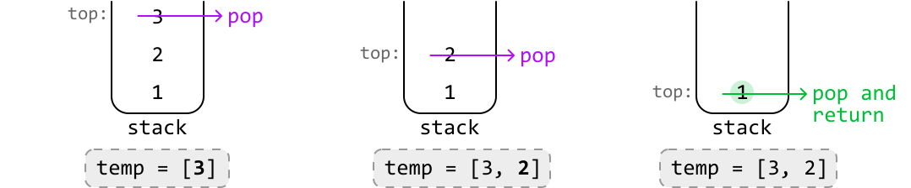
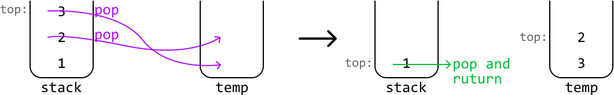
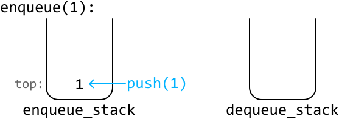
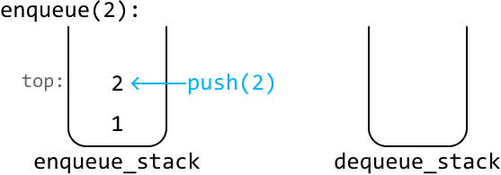
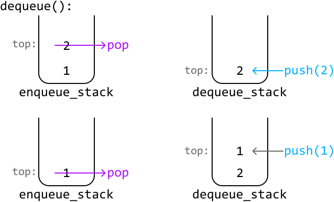
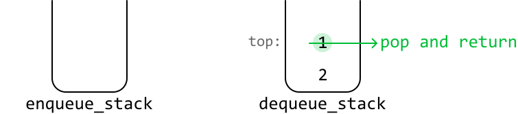
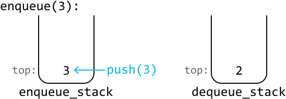
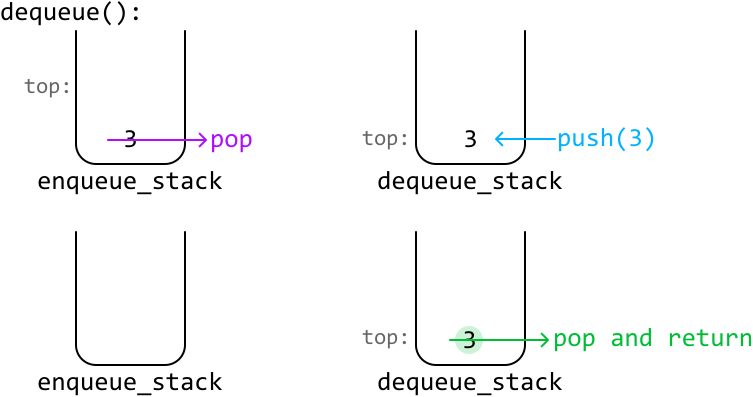

# Implement a Queue using Stacks

Implement a **queue** using the stack data structure. Include the following functions:

- `enqueue(x: int) -> None`: adds `x` to the end of the queue.

- `dequeue() -> int`: removes and returns the element from the front of the queue.

- `peek() -> int`: returns the front element of the queue.

You may not use any other data structures to implement the queue.

#### Example

```python
Input: [enqueue(1), enqueue(2), dequeue(), enqueue(3), peek()]
Output: [1, 2]

```

#### Constraints:

- The `dequeue` and `peek` operations will only be called on a non-empty queue.

## Intuition

A queue is a first-in-first-out (FIFO) data structure, whereas stacks are a first-in-last-out (FILO) data structure:



The main difference between these data structures is how items are evicted from them. In a queue, the first value to enter is the first to leave, whereas it would be the last to leave in a stack.

Now that we understand how they work, let’s dive into the problem. Let’s start by seeing if it’s possible to replicate the functionality of a queue with just one stack.

---

Consider the following stack where we push values 1, 2, and 3 to it after receiving enqueue(1), enqueue(2), and enqueue(3):



We now encounter a problem with attempting a `dequeue` operation since popping off the top of the stack would return 3. The value we actually want popped off is 1, since it was the first value that entered the data structure. However, 1 is all the way at the bottom of the stack.

To get to the bottom, we need to pop off all the values from the top of the stack and temporarily store these values in a separate data structure (temp) so we can add them back to the stack later:



Once we've popped and returned the bottom value (1), push the values stored in temp back onto the stack in reverse order to ensure they're added back correctly:


We know that if we were to use a data structure such as temp, **it’d have to be a stack**, since the problem specifies only stacks can be used. In this temporary data structure, we remove values in the opposite order in which we added them. In other words, it follows the LIFO principle, which is conveniently how a stack works. This means we can use a stack for our temporary storage.

---

Now, even though we have a solution that works, having to pop off every single value from the top of the stack whenever we want to access the bottom value is quite time-consuming. To find a way around this, let’s have a closer look at the state of our two stacks right after we’ve moved the stack values to temp:



In our original solution, we would now move the values from temp back to the main stack. However, notice the top of the temp stack now contains the next value we expect to return. This is because it’s the second value to have entered the data structure, and according to the FIFO eviction policy, it should be the next one to be removed.

So, instead of adding these values back to the main stack, we could just leave them in temp and return the stack’s top value at the next dequeue call.

In the above logic, we ended up using two stacks which each serve a unique purpose. In particular, we used:

- A stack to push values onto during each enqueue call (`enqueue_stack`).

- A stack to pop values from during each dequeue call (`dequeue_stack`).

An important thing to realize here is that the dequeue stack won’t always be populated with values. So, what should we do when it’s empty? We can just populate it by moving all the values from the enqueue stack to the dequeue stack, just like we did in the example. To understand this more clearly, let’s dive into a full example.

---

Let’s start with two enqueue calls and push each number onto the enqueue stack.





---

Now, let's try processing a dequeue call. The first step is to pop off each element from the enqueue stack and push them onto the dequeue stack:



Then, we just return the top value from the dequeue stack:



---

Let’s enqueue one more value:



---

If we call dequeue again, we return the value from the top of the dequeue stack:


---

Now, what happens when we call dequeue and the dequeue stack is empty? We need to repopulate it by popping all the values from the enqueue stack and pushing them into the dequeue stack. Once this is done, we return the top of the dequeue stack as usual:



---

Regarding the `peek` function, we follow the same logic as the `dequeue` function, but instead, we return the top element of the dequeue stack without popping it.

## Implementation

As mentioned before, the `dequeue` and `peek` functions have mostly the same behavior, with the only difference being that `dequeue` pops the top value while `peek` does not. To avoid duplicate code, the common logic between these functions for transferring values from the enqueue stack to the dequeue stack has been extracted into a separate function, `transfer_enqueue_to_dequeue`.

```python
class Queue:
    def __init__(self):
        self.enqueue_stack = []
        self.dequeue_stack = []

    def enqueue(self, x: int) -> None:
        self.enqueue_stack.append(x)

    def transfer_enqueue_to_dequeue(self) -> None:
        # If the dequeue stack is empty, push all elements from the enqueue stack
        # onto the dequeue stack. This ensures the top of the dequeue stack
        # contains the most recent value.
        if not self.dequeue_stack:
            while self.enqueue_stack:
                self.dequeue_stack.append(self.enqueue_stack.pop())

    def dequeue(self) -> int:
        self.transfer_enqueue_to_dequeue()
        # Pop and return the value at the top of the dequeue stack.
        return self.dequeue_stack.pop() if self.dequeue_stack else None

    def peek(self) -> int:
        self.transfer_enqueue_to_dequeue()
        return self.dequeue_stack[-1] if self.dequeue_stack else None

```

```javascript
export class Queue {
  constructor() {
    this.enqueueStack = []
    this.dequeueStack = []
  }

  enqueue(x) {
    this.enqueueStack.push(x)
  }

  transferEnqueueToDequeue() {
    // If the dequeue stack is empty, push all elements from the enqueue stack
    // onto the dequeue stack. This ensures the top of the dequeue stack
    // contains the most recent value.
    if (this.dequeueStack.length === 0) {
      while (this.enqueueStack.length > 0) {
        this.dequeueStack.push(this.enqueueStack.pop())
      }
    }
  }

  dequeue() {
    this.transferEnqueueToDequeue()
    // Pop and return the value at the top of the dequeue stack.
    return this.dequeueStack.length > 0 ? this.dequeueStack.pop() : null
  }

  peek() {
    this.transferEnqueueToDequeue()
    return this.dequeueStack.length > 0
      ? this.dequeueStack[this.dequeueStack.length - 1]
      : null
  }
}

```

```java
import java.util.LinkedList;
import java.util.Deque;

class Queue {
    private Deque<Integer> enqueueStack;
    private Deque<Integer> dequeueStack;

    public Queue() {
        enqueueStack = new LinkedList<>();
        dequeueStack = new LinkedList<>();
    }

    public void enqueue(Integer x) {
        enqueueStack.push(x);
    }

    private void transferEnqueueToDequeue() {
        // If the dequeue stack is empty, push all elements from the enqueue stack
        // onto the dequeue stack. This ensures the top of the dequeue stack
        // contains the most recent value.
        if (dequeueStack.isEmpty()) {
            while (!enqueueStack.isEmpty()) {
                dequeueStack.push(enqueueStack.pop());
            }
        }
    }

    public Integer dequeue() {
        transferEnqueueToDequeue();
        // Pop and return the value at the top of the dequeue stack.
        return dequeueStack.isEmpty() ? null : dequeueStack.pop();
    }

    public Integer peek() {
        transferEnqueueToDequeue();
        return dequeueStack.isEmpty() ? null : dequeueStack.peek();
    }
}

```

### Complexity Analysis

**Time complexity:** The time complexity of:

- `enqueue` is O(1) because we add one element to the enqueue stack in constant time.

- `dequeue` is amortized O(1).
  
  
  
  - In the worst case, all elements from the enqueue stack are moved to the dequeue stack. This takes O(n) time, where n denotes the number of elements in the enqueue queue.
  
  - However, each element is only ever moved once during its lifetime. So, over n `dequeue` calls, at most n elements are moved between stacks, averaging the cost to O(1) time per `dequeue` operation.

- `peek` is amortized O(1) for the same reasons as `dequeue`.

**Space complexity:** The space complexity is O(n) since we maintain two stacks that collectively store all elements of the queue at any given time.