# Maximums of Sliding Window

There's a sliding window of size `k` that slides through an integer array from left to right. Create a new array that records the **largest number found in each window** as it slides through.

#### Example:

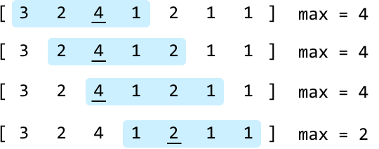

```python
Input: nums = [3, 2, 4, 1, 2, 1, 1], k = 4
Output: [4, 4, 4, 2]

```

## Intuition

A brute-force approach to solving this problem involves iterating through each element within a window to find the maximum value of that window. Repeating this for each window will take O(n· k) time because we traverse k elements for up to n windows.

The main issue is that as we slide the window, we keep re-examining the same elements we've already looked at in previous windows. This is because two adjacent windows share mostly the same values.

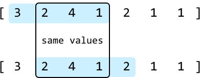

A more efficient solution likely involves keeping track of values we see in any given window so that at the next window, we don't have to iterate over previously seen values again. Specifically, at each window, we should only maintain a record of values that have the potential to become the maximum of a future window. Let's call these values **candidates**, where all the values that aren't candidates can no longer contribute to a maximum. How can we determine which numbers are candidates?

Consider the window of size 4 in the following array. We'll use left and right pointers to define the window:

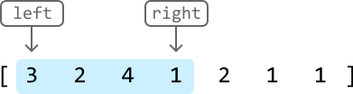

To identify the candidates for the next window, let's look at each number individually.

**3:** Number 3 is a candidate for the current window, but once we move to the next window, we can ignore it since it will no longer be included in the window.

**2:** Could number 2 be a maximum of a future window? The answer is no. This is because of the 4 to its right: all future windows which contain this 2 will also contain 4, and since 4 is larger, it means 2 could never be a maximum of any future windows.

**4:** This is the maximum value in the current window, and it'll be included in some future windows. Therefore, 4 could potentially be a maximum for a future window.

**1:** Could 1 become the maximum of a future window? The answer is yes. While 4 is larger in the current window, it's positioned to the left of 1. As the window shifts to the right, there will eventually be a point where 1 remains in the window while 4 is excluded, making 1 a potential maximum in the future.

Based on the above analysis, we can derive the following strategy whenever the window encounters a new candidate:

- **Remove smaller or equal candidates:** Any existing candidates less than or equal to the new candidate should be discarded because they can no longer be maximums of future windows.

- **Adding the new candidate**: Once smaller candidates are discarded, the new value can be added as a new candidate.

- **Removing outdated candidates**: When the window moves past a value, that value should be discarded to ensure we don't consider values outside the window.

Observe how this strategy is applied to the list of candidates below as the window advances one index to the right:

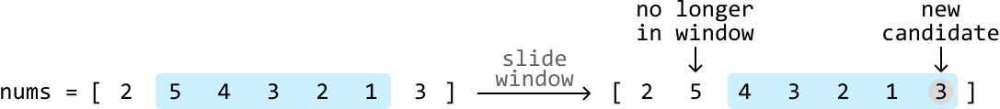

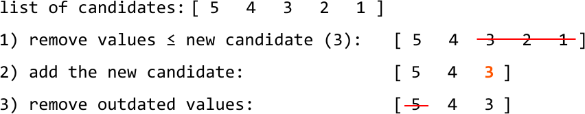

An important observation is that **candidate values always maintain a decreasing order**. This is because each new candidate we encounter removes smaller and equal candidates to its left, ensuring the list of candidates is kept in a decreasing order.

This consequently means **the maximum value for a window is always the first value in the candidate list.**

Therefore, to store the candidates, we need a data structure that can maintain a **monotonic decreasing order** of values.

**Deque**

We know that typically, a stack allows us to maintain a monotonic decreasing order of values, but in this case, it has a critical limitation: it doesn't provide a way to remove outdated candidates. A stack is a last-in-first-out (LIFO) data structure, which means we only have access to the last (i.e., most recent) end of the data structure. From the diagram above, we know we need access to both ends of the list of candidates, so a stack won't be sufficient.

Is there a data structure that allows us to add and remove from both ends? A **double-ended queue**, or deque for short, is a great candidate for this. A deque is essentially a doubly linked list under the hood. It allows us to push and pop values from both ends of the data structure in O(1) time.

Despite its name, it's easier to think of a deque as a double-ended stack:

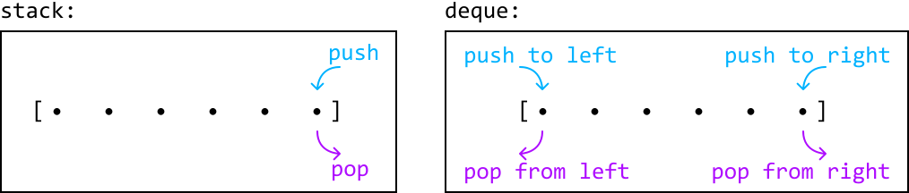

Now that we have our data structure, let's see how we can use it over the following example. Note that our deque will store tuples containing both a value and its corresponding index. We keep track of indexes in the deque because they allow us to determine whether a value has moved outside the window. We'll see how this works later in the example.

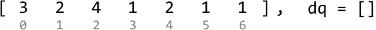

---

Start by expanding the window until it's of length k. For each candidate we encounter, we need to ensure the values in the deque maintain a monotonic decreasing order before pushing it in:

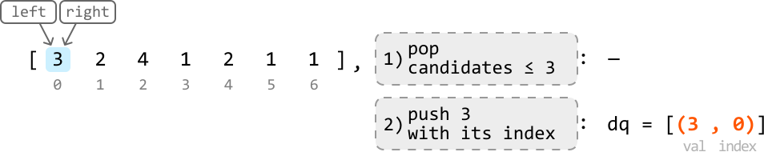

---

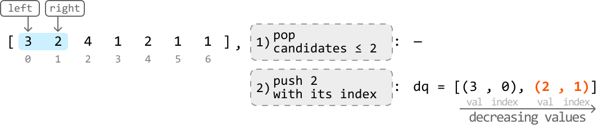

---

When we reach 4, we can't add it to the deque straight away because adding it would violate the decreasing order of the deque. So, let's pop any candidates from the right of the deque that are less than 4 before pushing 4 in.

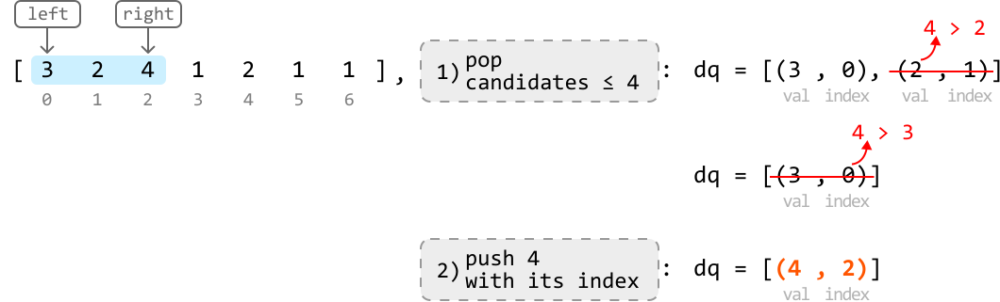

---

The next expansion of the window will set it at the expected fixed size of k:

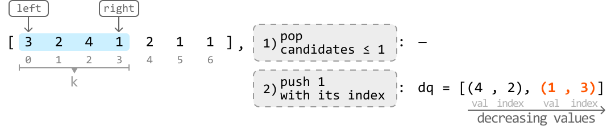

Now that the window is of length k, it's time to begin recording the maximum value of each window. As mentioned earlier, the maximum value is the first value in the candidate list (i.e., the leftmost value of the deque.) The maximum value of this window is 4 since it's the leftmost candidate value.

---

With the window now at a fixed size of k, our approach shifts from expanding the window to sliding it. As we slide, we should remove any values from the deque whose index is before the left pointer, since those values will be outside the window:

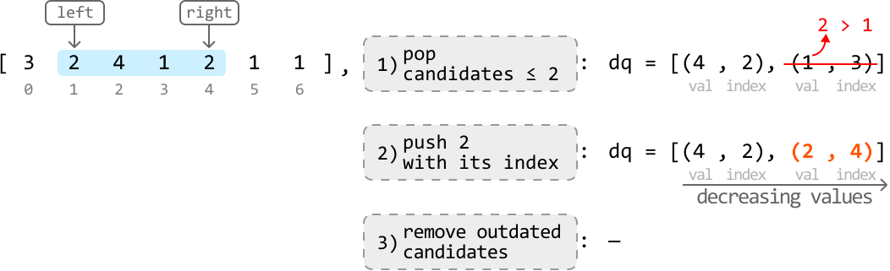

The maximum value of the above window after the three operations are performed is revealed to be 4, as it's the leftmost candidate value.

---

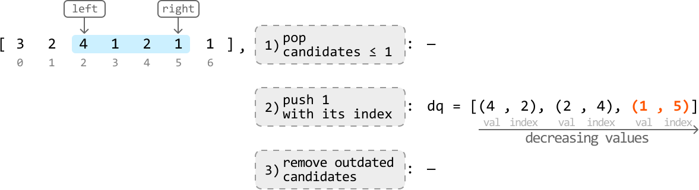

The maximum value of the above window after the three operations are performed is also 4, as it's the leftmost candidate value.

---

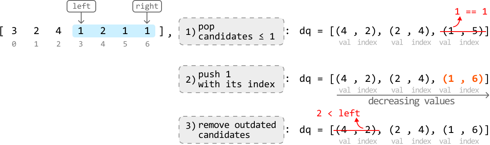

Before recording the maximum value of this window, we ensured 4 was removed from the deque because its index (index 2) occurs before the left pointer (index 3), indicating it's no longer within the current window. The maximum value for this window after this removal is revealed to be 2.

## Implementation

```python
from typing import List
from collections import deque
    
def maximums_of_sliding_window(nums: List[int], k: int) -> List[int]:
    res = []
    dq = deque()
    left = right = 0
    while right < len(nums):
        # 1) Ensure the values of the deque maintain a monotonic decreasing order
        # by removing candidates <= the current candidate.
        while dq and dq[-1][0] <= nums[right]:
            dq.pop()
        # 2) Add the current candidate.
        dq.append((nums[right], right))
        # If the window is of length 'k', record the maximum of the window.
        if right - left + 1 == k:
            # 3) Remove values whose indexes occur outside the window.
            if dq and dq[0][1] < left:
                dq.popleft()
            # The maximum value of this window is the leftmost value in the
            # deque.
            res.append(dq[0][0])
            # Slide the window by advancing both 'left' and 'right'. The right
            # pointer always gets advanced so we just need to advance 'left'
            left += 1
        right += 1
    return res

```

```javascript
export function maximums_of_sliding_window(nums, k) {
  const res = []
  const dq = []
  let left = 0,
    right = 0
  while (right < nums.length) {
    // 1) Ensure the values of the deque maintain a monotonic decreasing order
    // by removing candidates <= the current candidate.
    while (dq.length > 0 && dq[dq.length - 1][0] <= nums[right]) {
      dq.pop()
    }
    // 2) Add the current candidate.
    dq.push([nums[right], right])
    // If the window is of length 'k', record the maximum of the window.
    if (right - left + 1 === k) {
      // 3) Remove values whose indexes occur outside the window.
      if (dq.length > 0 && dq[0][1] < left) {
        dq.shift()
      }
      // The maximum value of this window is the leftmost value in the
      // deque.
      res.push(dq[0][0])
      // Slide the window by advancing both 'left' and 'right'. The right
      // pointer always gets advanced so we just need to advance 'left'
      left += 1
    }
    right += 1
  }
  return res
}

```

```java
import java.util.ArrayList;
import java.util.Deque;
import java.util.LinkedList;

public class Main {
    public ArrayList<Integer> maximums_of_sliding_window(ArrayList<Integer> nums, int k) {
        ArrayList<Integer> res = new ArrayList<>();
        Deque<int[]> dq = new LinkedList<>();
        int left = 0, right = 0;
        while (right < nums.size()) {
            // 1) Ensure the values of the deque maintain a monotonic decreasing order
            // by removing candidates <= the current candidate.
            while (!dq.isEmpty() && dq.peekLast()[0] <= nums.get(right)) {
                dq.pollLast();
            }
            // 2) Add the current candidate.
            dq.offerLast(new int[] {nums.get(right), right});
            // If the window is of length 'k', record the maximum of the window.
            if (right - left + 1 == k) {
                // 3) Remove values whose indexes occur outside the window.
                if (!dq.isEmpty() && dq.peekFirst()[1] < left) {
                    dq.pollFirst();
                }
                // The maximum value of this window is the leftmost value in the deque.
                res.add(dq.peekFirst()[0]);
                // Slide the window by advancing both 'left' and 'right'. The right
                // pointer always gets advanced so we just need to advance 'left'
                left++;
            }
            right++;
        }
        return res;
    }
}

```

### Complexity Analysis

**Time complexity:** The time complexity of `maximums_of_sliding_window` is O(n) because we slide over the array in linear time, and we push and pop values of `nums` into the deque at most once for each number.

**Space complexity:** The space complexity is O(k) because the deque can store up to k elements.

## Interview Tip

Tip: If you're unsure about what data structure to use for a problem, first identify what attributes or operations you want from the data structure. Use these attributes and operations to pinpoint a data structure that satisfies them and can be used to solve the problem. In this problem, we wanted a data structure that could add and remove elements from both ends of it efficiently, and the best data structure that matched these requirements was a deque.