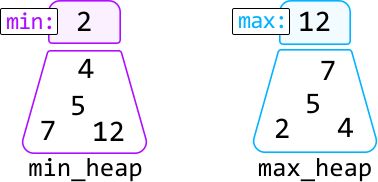
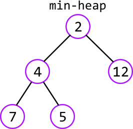
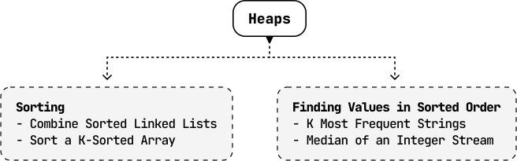

# Introduction to Heaps

## Intuition

A heap is a data structure that organizes elements based on priority, ensuring the highest-priority element is always at the top of the heap. This allows for efficient access to the highest-priority element at any time. There are two main types of heaps:

- **Min-heap**: prioritizes the smallest element by keeping it at the top of the heap.

- **Max-heap**: prioritizes the largest element by keeping it at the top of the heap.

Efficient prioritization is possible due to how heaps are structured. A heap is essentially a binary tree. In the case of a min-heap, for example, each node’s value is less than or equal to that of its children. This guarantees the root of this tree (the top of the heap) is always the smallest element:

Here’s a time complexity breakdown of common heap operations:

| Operation | Time complexity | Description |
| --- | --- | --- |
| Insert | O(log(n)) | Adds an element to the heap, ensuring the binary tree remains correctly ordered |
| Deletion | O(log(n)) | Removes the element at the top of the heap, then restructures the heap to replace the top element |
| Peek | O(1) | Retrieves the top element of the heap without removing it |
| Heapify | O(n) | Transforms an unsorted list of values into a heap [[1]](https://stackoverflow.com/questions/9755721/how-can-building-a-heap-be-on-time-complexity) |

 

This chapter discusses the practical uses of heaps. For a deeper understanding of how a heap works, we recommend diving into the details behind its internal implementation, and how its binary tree structure is consistently maintained during various operations [[2]](https://en.wikipedia.org/wiki/Binary_heap).

**Priority queue**

A priority queue is a special type of heap that follows the structure of min-heaps or max-heaps but allows customization in how elements are prioritized (e.g., prioritizing strings with a higher number of vowels).

## Real-world Example

**Managing tasks in operating systems:** Operating systems often use a priority queue to manage the execution of tasks, and a heap is commonly used to implement this priority queue efficiently.

For example, when multiple processes are running on a computer, each process might be assigned a priority level. The operating system needs to schedule the processes so that higher-priority tasks are executed before lower-priority ones. A heap is ideal for this because it allows the system to quickly access the highest-priority task and efficiently re-arrange the priorities as new tasks are added or existing tasks are completed.

## Chapter Outline

