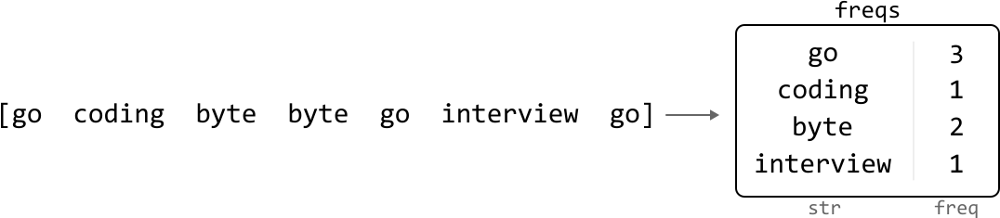
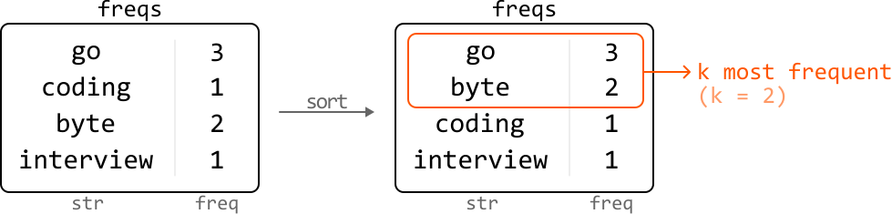
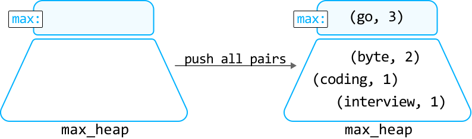
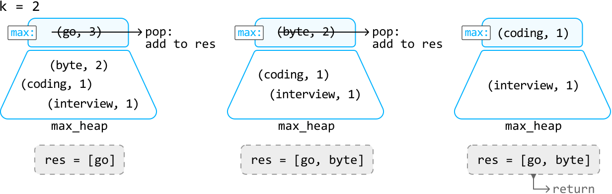
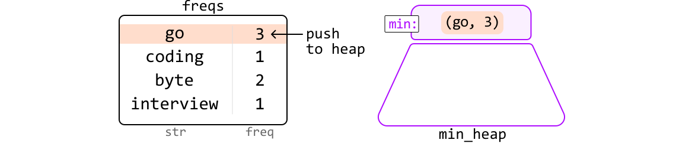
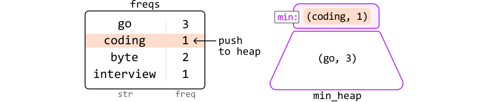
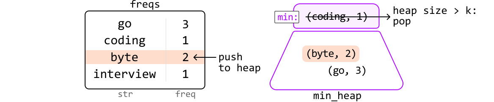
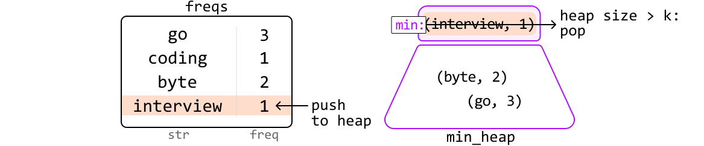
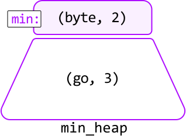
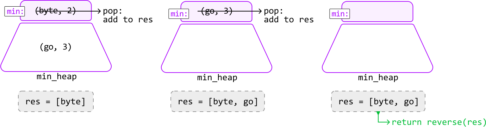

# K Most Frequent Strings

Find the `k` most frequently occurring strings in an array, and return them sorted by frequency in descending order. If two strings have the same frequency, sort them in lexicographical order.

### Example:

```python
Input: strs = ['go', 'coding', 'byte', 'byte', 'go', 'interview', 'go'], k = 2
Output: ['go', 'byte']

```

Explanation: The strings "go" and "byte" appear the most frequently, with frequencies of 3 and 2, respectively.

#### Constraints:

- `k ≤ n`, where `n` denotes the length of the array.

## Intuition - Max-Heap

The two main challenges to this problem are:

- Identifying the `k` most frequent strings.

- Sorting those strings first by frequency and then lexicographically.

For now, let's concentrate on identifying the most frequent strings and address lexicographical ordering afterward.

First, we need a way to keep track of the frequencies of each string. We can use a hash map for this, where the keys represent the strings and the values represent frequencies:



The most straightforward approach is to obtain an array containing the strings from the hash map, sorted by frequency in descending order. The `k` most frequent strings would be the first `k` strings in this array.



The main inefficiency of this solution is that it involves sorting all n strings, even though we only need the top `k` frequent ones to be sorted.

Something useful to consider: if we remove the most frequent string, the new most frequent string after this removal represents the second-most frequent overall. By repeatedly identifying and removing the most frequent string `k` times, we efficiently obtain our answer.

To implement this idea, we need a data structure that allows efficient access to the most frequent string at any time. A **max-heap** is perfect for this.

**Max-heap**

Let's find the `k` most frequent strings from the previous input, this time using a max-heap. First, populate the heap with each string along with their frequencies.



One way to populate the heap is to push all `n` strings into it one by one, which will take O(nlog(n)) time. Instead, we can perform the **heapify** operation on an array containing all the string-frequency pairs to create the max-heap in O(n) time.

---

To collect the `k` most frequent strings, pop off the top element from the heap `k` times and store the corresponding strings in the output array `res`:



---

Now, we just need to ensure that when two strings have the same frequency, the one that comes first lexicographically has a higher priority in the heap. To do this, we can define a custom comparator for the heap that prioritizes strings lexicographically when their frequencies match, as demonstrated in the implementation below.

## Implementation - Max-Heap

We create a Pair class for string-frequency pairs, enabling us to customize priority using a custom comparator.

```python
from typing import List
from collections import Counter
import heapq
    
class Pair:
   def __init__(self, str, freq):
       self.str = str
       self.freq = freq
    
   # Define a custom comparator.
   def __lt__(self, other):
       # Prioritize lexicographical order for strings with equal frequencies.
       if self.freq == other.freq:
           return self.str < other.str
       # Otherwise, prioritize strings with higher frequencies.
       return self.freq > other.freq
    
def k_most_frequent_strings_max_heap(strs: List[str], k: int) -> List[str]:
   # We use 'Counter' to create a hash map that counts the frequency of each string.
   freqs = Counter(strs)
   # Create the max heap by performing heapify on all string-frequency pairs.
   max_heap = [Pair(str, freq) for str, freq in freqs.items()]
   heapq.heapify(max_heap)
   # Pop the most frequent string off the heap 'k' times and return these 'k' most
   # frequent strings.
   return [heapq.heappop(max_heap).str for _ in range(k)]

```

```java
import java.util.ArrayList;
import java.util.HashMap;
import java.util.Map;
import java.util.PriorityQueue;

class Pair {
    String str;
    int freq;

    public Pair(String str, int freq) {
        this.str = str;
        this.freq = freq;
    }
}

public class Main {
    public ArrayList<String> k_most_frequent_strings_max_heap(ArrayList<String> strs, int k) {
        // We use a HashMap to count the frequency of each string.
        Map<String, Integer> freqs = new HashMap<>();
        for (String s : strs) {
            freqs.put(s, freqs.getOrDefault(s, 0) + 1);
        }
        // Create a max heap using a custom comparator.
        PriorityQueue<Pair> maxHeap = new PriorityQueue<>((a, b) -> {
            // Prioritize strings with higher frequencies.
            if (a.freq != b.freq) {
                return b.freq - a.freq;
            }
            // If frequencies are equal, prioritize lexicographically smaller strings.
            return a.str.compareTo(b.str);
        });
        // Add all string-frequency pairs to the max heap.
        for (Map.Entry<String, Integer> entry : freqs.entrySet()) {
            maxHeap.offer(new Pair(entry.getKey(), entry.getValue()));
        }
        // Pop the most frequent strings off the heap 'k' times.
        ArrayList<String> result = new ArrayList<>();
        for (int i = 0; i < k && !maxHeap.isEmpty(); i++) {
            result.add(maxHeap.poll().str);
        }
        return result;
    }
}

```

### Complexity Analysis

**Time complexity:** The time complexity of `k_most_frequent_strings_max_heap` is O(n+klog(n)).

- It takes O(n) time to count the frequency of each string using `Counter`, and to build the `max_heap`.

- We also pop off the top of the heap k times, with each `pop` operation taking O(log(n)) time.

Therefore, the overall time complexity is O(n)+kO(log(n))=O(n+klog(n)).

**Space complexity:** The space complexity is O(n) because the hash map and heap store at most n pairs. Note that the output array is not considered in the space complexity.

## Intuition - Min-Heap

As a follow up, your interviewer may ask you to modify your solution to reduce the space used by the heap.

In the previous approach, we ended up storing up to `n` items in the heap. However, since we only need the `k` most frequent characters, is there a way to maintain a heap with a space complexity of O(k)?

An important observation is that when our heap exceeds size k, we can **discard the lowest frequency strings until the heap's size is reduced to `k` again**. We can do this because those discarded strings definitely won't be among the k most frequent strings.

However, we can't implement this strategy with a max-heap because we won't have access to the lowest frequency string. Instead, we need to use a **min-heap**.

---

Let's observe how this works over an example:









---

In the end, the strings remaining in the heap are our top `k` frequent strings:



To retrieve these strings, pop them from the heap until it's empty. Because we're using a min-heap, we're popping off the less frequent strings first. So, we need to reverse the order of the retrieved strings before returning the result:



```python
from typing import List
from collections import Counter
import heapq
    
class Pair:
    def __init__(self, str, freq):
        self.str = str
        self.freq = freq
    # Since this is a min-heap comparator, we can use the same comparator as the one
    # used in the max-heap, but reversing the inequality signs to invert the priority.
    def __lt__(self, other):
        if self.freq == other.freq:
            return self.str > other.str
        return self.freq < other.freq
    
def k_most_frequent_strings_min_heap(strs: List[str], k: int) -> List[str]:
    freqs = Counter(strs)
    min_heap = []
    for str, freq in freqs.items():
        heapq.heappush(min_heap, Pair(str, freq))
        # If heap size exceeds 'k', pop the lowest frequency string to ensure the heap
        # only contains the 'k' most frequent words so far.
        if len(min_heap) > k:
            heapq.heappop(min_heap)
    # Return the 'k' most frequent strings by popping the remaining 'k' strings from
    # the heap. Since we're using a min-heap, we need to reverse the result after
    # popping the elements to ensure the most frequent strings are listed first.
    res = [heapq.heappop(min_heap).str for _ in range(k)]
    res.reverse()
    return res

```

```java
import java.util.ArrayList;
import java.util.HashMap;
import java.util.Map;
import java.util.PriorityQueue;

class Pair {
    String str;
    int freq;

    public Pair(String str, int freq) {
        this.str = str;
        this.freq = freq;
    }
}

public class Main {
    public ArrayList<String> k_most_frequent_strings_min_heap(ArrayList<String> strs, int k) {
        // Count the frequency of each string.
        Map<String, Integer> freqs = new HashMap<>();
        for (String s : strs) {
            freqs.put(s, freqs.getOrDefault(s, 0) + 1);
        }
        // Min-heap with a custom comparator: lower frequencies have higher priority.
        PriorityQueue<Pair> minHeap = new PriorityQueue<>((a, b) -> {
            // If frequencies are equal, prioritize lexicographically larger strings.
            if (a.freq == b.freq) {
                return b.str.compareTo(a.str);
            }
            return a.freq - b.freq;
        });
        // Maintain a heap of size 'k' with the most frequent strings so far.
        for (Map.Entry<String, Integer> entry : freqs.entrySet()) {
            minHeap.offer(new Pair(entry.getKey(), entry.getValue()));
            if (minHeap.size() > k) {
                minHeap.poll();
            }
        }
        // Pop elements from the heap and reverse the result to return most frequent first.
        ArrayList<String> res = new ArrayList<>();
        while (!minHeap.isEmpty()) {
            res.add(minHeap.poll().str);
        }
        // Reverse the list since it's a min-heap and we want the most frequent first.
        ArrayList<String> reversed = new ArrayList<>();
        for (int i = res.size() - 1; i >= 0; i--) {
            reversed.add(res.get(i));
        }
        return reversed;
    }
}

```

### Complexity Analysis

**Time complexity:** The time complexity of `k_most_frequent_strings_min_heap` is O(nlog(k)).

- It takes O(n) time to count the frequency of each string using `Counter`.

- To populate the heap, we push n words onto it, with each `push` and `pop` operation taking O(log(k)) time. This takes O(nlog(k)) time.

- Then, we extract k strings from the heap by performing the `pop` operation k times. This takes O(klog(k)) time.

- Finally, we reverse the output array, which takes O(k) time.

Therefore, the overall time complexity is O(n)+O(nlog(k))+O(klog(k))+O(k)=O(nlog(k)).

**Space complexity:** The space complexity is O(n) because the hash map stores at most n pairs, whereas the heap only takes up O(k) space. The `res` array is not considered in the space complexity.