# Combine Sorted Linked Lists

Given `k` singly linked lists, each sorted in ascending order, **combine them** into one sorted linked list.

#### Example:


## Intuition

A good place to start with this problem is by figuring out how to merge just two sorted linked lists. We can do this by initiating a pointer at the start of both linked lists. Comparing the nodes at these pointers, add the smaller one to the output linked list and advance the corresponding pointer. This results in a combined sorted linked list:

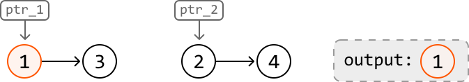

---

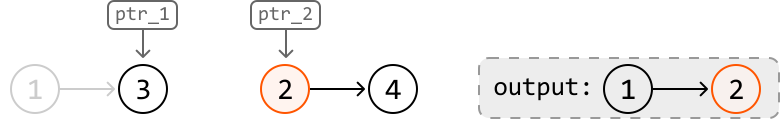

---

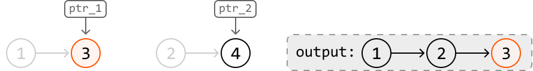

---

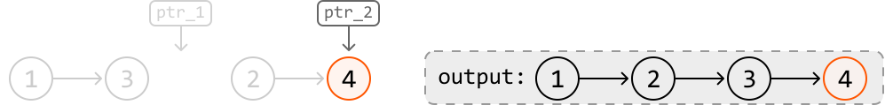

But what if we have more than two linked lists? Combining two linked lists involves comparing two nodes at each iteration, but combining k linked lists would require k comparisons per iteration.

The reason we need to make so many comparisons is that we don't know which node has the smallest value at any point in the iteration, requiring us to search for it. Wouldn't it be nice to have an efficient way to access the smallest-valued node at any given point? A **min-heap** is perfect for this.

We can essentially do the same thing as in our initial approach, but instead of using pointers to determine the smallest node, we use a min-heap. Let’s see how this works over the three sorted linked lists below:

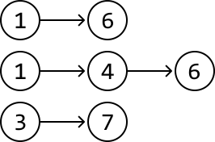

---

To start, populate the heap with the head nodes of all the linked lists, so they're ready for comparison:

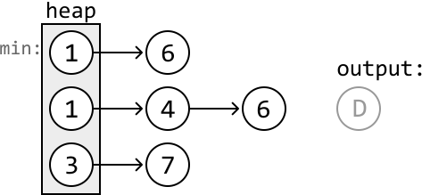

Then, let’s implement our strategy of adding the smallest-valued node to the output linked list, using the heap to identify it. We'll use a dummy node to help build the output linked list (denoted as ‘node D’ in the above diagram).

After a node is popped off, the subsequent node from its linked list is added to the heap.

---

Now, let’s go through the example. First, we pop off the smallest-valued node from the heap and connect it to the tail of the output list:

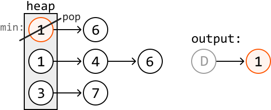

Then, add the subsequent node from the same linked list to the heap:

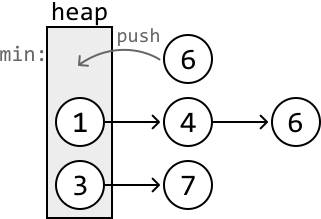

---

Continue this until we’ve added each node from all k linked lists to the output linked list:

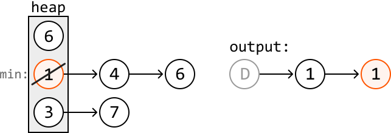

---

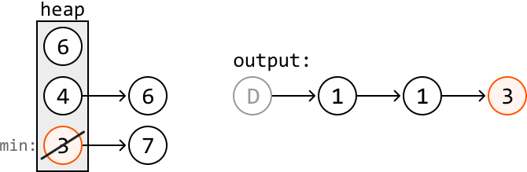

---

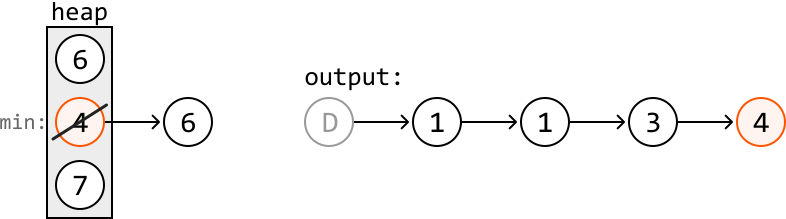

---

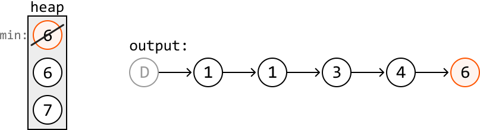

---

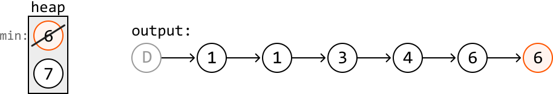

---

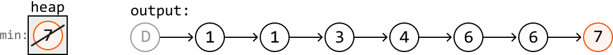

---

Once the heap is empty, we can return `dummy.next`, which is the head of the combined linked list.

## Implementation

Note that in the implementation below, we modify the `ListNode` class globally to simplify the solution. It's important to confirm with your interviewer that global variables are acceptable.

```python
from typing import List
from ds import ListNode
import heapq
    
def combine_sorted_linked_lists(lists: List[ListNode]) -> ListNode:
    # Define a custom comparator for 'ListNode', enabling the min-heap to prioritize
    # nodes with smaller values.
    ListNode.__lt__ = lambda self, other: self.val < other.val
    heap = []
    # Push the head of each linked list into the heap.
    for head in lists:
        if head:
            heapq.heappush(heap, head)
    # Set a dummy node to point to the head of the output linked list.
    dummy = ListNode(-1)
    # Create a pointer to iterate through the combined linked list as we add nodes to
    # it.
    curr = dummy
    while heap:
        # Pop the node with the smallest value from the heap and add it to the output
        # linked list.
        smallest_node = heapq.heappop(heap)
        curr.next = smallest_node
        curr = curr.next
        # Push the popped node's subsequent node to the heap.
        if smallest_node.next:
            heapq.heappush(heap, smallest_node.next)
    return dummy.next

```

```javascript
import { ListNode } from './ds.js'
import { MinPriorityQueue } from './helpers/heap/MinPriorityQueue.js'

export function combine_sorted_linked_lists(lists) {
  // Create a min-heap that compares nodes by their value
  const heap = new MinPriorityQueue((node) => node.val)
  // Push the head of each linked list into the heap
  for (const head of lists) {
    if (head) {
      heap.enqueue(head)
    }
  }
  // Set a dummy node to point to the head of the output linked list
  const dummy = new ListNode(-1)
  // Create a pointer to iterate through the combined linked list
  let curr = dummy
  while (!heap.isEmpty()) {
    // Pop the node with the smallest value from the heap and add it to the output
    const smallestNode = heap.dequeue()
    curr.next = smallestNode
    curr = curr.next
    // Push the popped node's next node into the heap (if it exists)
    if (smallestNode.next) {
      heap.enqueue(smallestNode.next)
    }
  }
  return dummy.next
}

```

```java
import java.util.ArrayList;
import java.util.PriorityQueue;
import core.LinkedList.ListNode;

class UserCode {
    public static ListNode<Integer> combineSortedLinkedLists(ArrayList<ListNode> lists) {
        // Define a custom comparator for 'ListNode', enabling the min-heap to prioritize
        // nodes with smaller values.
        PriorityQueue<ListNode<Integer>> heap = new PriorityQueue<>((a, b) -> a.val - b.val);
        // Push the head of each linked list into the heap.
        for (ListNode<Integer> head : lists) {
            if (head != null) {
                heap.offer(head);
            }
        }
        // Set a dummy node to point to the head of the output linked list.
        ListNode<Integer> dummy = new ListNode<>(-1);
        // Create a pointer to iterate through the combined linked list as we add nodes to
        // it.
        ListNode<Integer> curr = dummy;
        while (!heap.isEmpty()) {
            // Pop the node with the smallest value from the heap and add it to the output
            // linked list.
            ListNode<Integer> smallestNode = heap.poll();
            curr.next = smallestNode;
            curr = curr.next;

            // Push the popped node's subsequent node to the heap.
            if (smallestNode.next != null) {
                heap.offer(smallestNode.next);
            }
        }
        return dummy.next;
    }
}

```

### Complexity Analysis

**Time complexity:** The time complexity of `combine_sorted_linked_lists` is O(nlog(k)), where n denotes the total number of nodes across the linked lists. Here’s why:

- It takes O(klog(k)) time to create the heap initially because we insert k nodes into the heap.

- Then, for all n nodes, we perform a `push` and `pop` operation on the heap, each taking O(log(k)) time.

This results in a total time complexity of O(klog(k))+n· O(log(k))=O(nlog(k)).

**Space complexity:** The space complexity is O(k) because the heap stores up to one node from each of the k linked lists at any time.