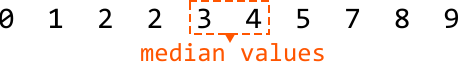
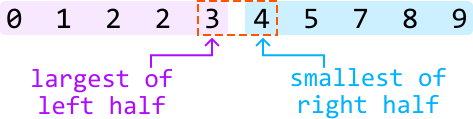
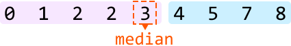
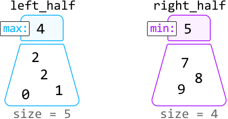
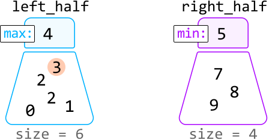
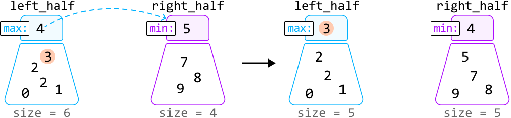
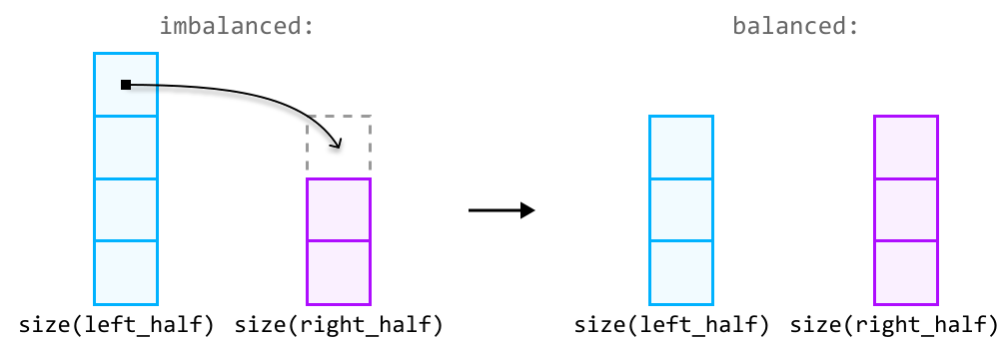
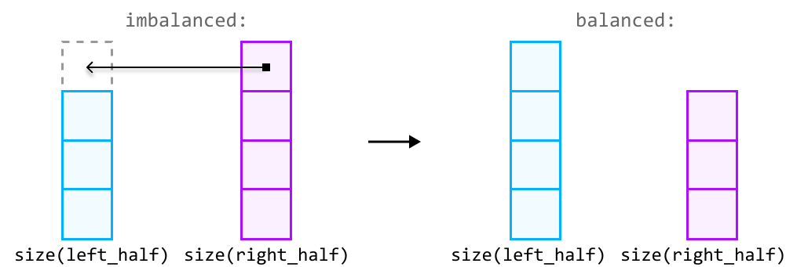

# Median of an Integer Stream

Design a data structure that supports adding integers from a data stream and retrieving the **median** of all elements received at any point.

- `add(num: int) -> None`: adds an integer to the data structure.

- `get_median() -> float`: returns the median of all integers so far.

#### Example:

```python
Input: [add(3), add(6), get_median(), add(1), get_median()]
Output: [4.5, 3.0]

```

Explanation:

```python
add(3)        # data structure contains [3] when sorted
add(6)        # data structure contains [3, 6] when sorted
get_median()  # median is (3 + 6) / 2 = 4.5
add(1)        # data structure contains [1, 3, 6] when sorted
get_median()  # median is 3.0

```

#### Constraints:

- At least one value will have been added before `get_median` is called.

## Intuition

The median is always found in the middle of a sorted list of values. The challenge with this problem is that it’s unclear how to keep all the values sorted as new values arrive, since the values don’t necessarily arrive in sorted order.

A useful point to recognize is that we don’t necessarily care if all the values are sorted. What really matters is that the median values are in their sorted positions. But is it possible to position these values in the middle without maintaining a fully sorted list of values? If it is, we’d need to find a way to differentiate the median values from the rest.

Consider the elements below, which contain an even number of values arranged in sorted order. The two values used to calculate the median are highlighted in the middle:



When a list contains two median values, we can make the following observations:

- The first median is the largest value in the left half of the sorted integers.

- The second median is the smallest value in the right half of the sorted integers.



If we had a way to split the data into two halves, with one half containing the smaller values and the other half containing the larger values, we would just need an efficient method to identify the largest value in the smaller half, and the smallest value in the larger half. This is where **heaps** come in.

We can use a combination of a min-heap and a max-heap:

- A **max-heap** manages the left half, where the top value represents the first median value.

- A **min-heap** manages the right half, where the top value represents the second median value.

If the total number of elements is **odd**, there’s only one median. In this case, we just need to use one of the heaps to store it. Let's designate the max-heap to store this median:



**Populating the heaps**

Before identifying how we populate each heap, it’s useful to understand the behavior they must follow. Here are a couple of observations we can make:

- All values in the left half must be less than or equal to any value in the right half.

- The two halves should contain an equal number of values, except when the total number of values is odd, in which case the left half has one more value, as specified earlier.

These observations help us define **two rules for managing the heaps**:

- The maximum value of the max-heap (left half) must be less than or equal to the minimum value of the min-heap (right half), ensuring all values in the left half are less than or equal to those in the right half.

- The heaps should be of equal size, but the max-heap can have one more element than the min-heap.

Let's figure out how to maintain these rules in an example in which we try to add number 3 to the heaps. Note, the heaps before adding this number meet the above rules.



Since 3 is less than the maximum value of `left_half` (4), it belongs in the `left_half` heap. So, let’s add 3 to this heap:



After adding 3, we notice rule 2 has been violated, since the size of the `left_half` heap is more than one element larger than the `right_half` heap. We can fix this by moving the max value of `left_half` to `right_half`:



---

So, to ensure the sizes of the heaps don’t violate rule 2, we need to *rebalance* the heaps after adding a value:

- If the `left_half` heap's size exceeds the `right_half` heap’s size by more than one, rebalance the heaps by transferring `left_half`‘s top value to `right_half`:



- If the `right_half` heap’s size exceeds the `left_half` heap’s size, rebalance the heaps by transferring its top value to the `left_half`:



**Returning the median**

With the median values at the top of the heaps, returning the median boils down to two cases:

- If the total number of elements is even, both median values can be found at the top of each heap. So, we return their sum divided by 2.

- If the total number of elements is odd, the median will be at the top of the `left_half` heap.

## Implementation

Note that in Python, heaps are min-heaps by default. To mimic the functionality of a max-heap, we can insert numbers as negatives in the `left_half` heap. This way, the largest original value becomes the smallest when negated, positioning it at the top of the heap. When we retrieve a value from this heap, we multiply it by -1 to get its original value.

```python
import heapq
    
class MedianOfAnIntegerStream:
    def __init__(self):
        # Max-heap for the values belonging to the left half.
        self.left_half = []
        # Min-heap for the values belonging to the right half.
        self.right_half = []
        
    def add(self, num: int) -> None:
        # If 'num' is less than or equal to the max of 'left_half', it belongs to the
        # left half.
        if not self.left_half or num <= -self.left_half[0]:
            heapq.heappush(self.left_half, -num)
            # Rebalance the heaps if the size of the 'left_half' exceeds the size of
            # the 'right_half' by more than one.
            if len(self.left_half) > len(self.right_half) + 1:
                heapq.heappush(self.right_half, -heapq.heappop(self.left_half))
        # Otherwise, it belongs to the right half.
        else:
            heapq.heappush(self.right_half, num)
            # Rebalance the heaps If 'right_half' is larger than 'left_half'.
            if len(self.left_half) < len(self.right_half):
                heapq.heappush(self.left_half, -heapq.heappop(self.right_half))
        
    def get_median(self) -> float:
        if len(self.left_half) == len(self.right_half):
            return (-self.left_half[0] + self.right_half[0]) / 2.0
        return -self.left_half[0]

```

```javascript
import { MaxPriorityQueue } from './helpers/heap/MaxPriorityQueue.js'
import { MinPriorityQueue } from './helpers/heap/MinPriorityQueue.js'

export class MedianOfAnIntegerStream {
  constructor() {
    // Max-heap for the values belonging to the left half.
    this.leftHalf = new MaxPriorityQueue((n) => n)
    // Min-heap for the values belonging to the right half.
    this.rightHalf = new MinPriorityQueue((n) => n)
  }

  add(num) {
    // If 'num' is less than or equal to the max of 'leftHalf', it belongs to the left half.
    if (this.leftHalf.isEmpty() || num <= this.leftHalf.front()) {
      this.leftHalf.enqueue(num)
      // Rebalance: if leftHalf has more than one extra element
      if (this.leftHalf.size() > this.rightHalf.size() + 1) {
        this.rightHalf.enqueue(this.leftHalf.dequeue())
      }
    } else {
      // Otherwise, it belongs to the right half.
      this.rightHalf.enqueue(num)
      // Rebalance: if rightHalf has more elements than leftHalf
      if (this.rightHalf.size() > this.leftHalf.size()) {
        this.leftHalf.enqueue(this.rightHalf.dequeue())
      }
    }
  }

  get_median() {
    if (this.leftHalf.size() === this.rightHalf.size()) {
      return (this.leftHalf.front() + this.rightHalf.front()) / 2.0
    }
    return this.leftHalf.front()
  }
}

```

```java
import java.util.PriorityQueue;
import java.util.Collections;

class MedianOfAnIntegerStream {
    // Max-heap for the values belonging to the left half.
    private PriorityQueue<Integer> leftHalf;
    // Min-heap for the values belonging to the right half.
    private PriorityQueue<Integer> rightHalf;

    public MedianOfAnIntegerStream() {
        leftHalf = new PriorityQueue<>(Collections.reverseOrder());
        rightHalf = new PriorityQueue<>();
    }

    public void add(Integer num) {
        // If 'num' is less than or equal to the max of 'leftHalf', it belongs to the
        // left half.
        if (leftHalf.isEmpty() || num <= leftHalf.peek()) {
            leftHalf.offer(num);
            // Rebalance the heaps if the size of the 'leftHalf' exceeds the size of
            // the 'rightHalf' by more than one.
            if (leftHalf.size() > rightHalf.size() + 1) {
                rightHalf.offer(leftHalf.poll());
            }
        } else {
            // Otherwise, it belongs to the right half.
            rightHalf.offer(num);
            // Rebalance the heaps If 'rightHalf' is larger than 'leftHalf'.
            if (rightHalf.size() > leftHalf.size()) {
                leftHalf.offer(rightHalf.poll());
            }
        }
    }

    public Double getMedian() {
        if (leftHalf.size() == rightHalf.size()) {
            return (leftHalf.peek() + rightHalf.peek()) / 2.0;
        }
        return (double) leftHalf.peek();
    }
}

```

### Complexity Analysis

**Time complexity:**

- The time complexity of `add` is O(log(n)), where n denotes the number of values added to the data structure. This is because we first push a number to one of the heaps, which takes O(log(n)) time. Then, if rebalancing is required, we also pop from one heap and push to the other, where both operations also take O(log(n)) time.

- The time complexity of `get_median` is O(1) because accessing the top element of a heap takes O(1) time.

**Space complexity:** The space complexity is O(n) because the two heaps together store n elements.

*Note: this explanation refers to the two middle values as "median values" to keep things simple. However, it’s important to understand that these two values aren’t technically “medians,” as there's only ever one median. These are just the two values used to calculate the median.*