# Sort a K-Sorted Array

Given an integer array where each element is at most `k` positions away from its sorted position, **sort the array** in a non-decreasing order.

#### Example:

```python
Input: nums = [5, 1, 9, 4, 7, 10], k = 2
Output: [1, 4, 5, 7, 9, 10]

```

## Intuition

In a k-sorted array, each element is at most k indexes away from where it would be in a fully sorted array. We can visualize this with the following example where k = 2, and no number is more than k indexes away from its sorted position:

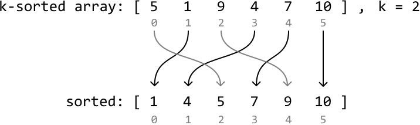

A trivial solution to this problem is to sort the array using a standard sorting algorithm. However, since the input is partially sorted (k-sorted), we should assume there's a faster way to sort the array.

We can think about this problem backward. For any index `i`, **the element that belongs at index `i` in the sorted array is located within the range [`i` - `k`, `i` + `k`]**. Below, we visualize how number 7, which is meant to be at index 3 when sorted, correctly falls within the range [3 - `k`, 3 + `k`] in the k-sorted array:

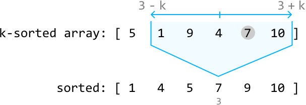

This is a good start, but we can reduce this range even further. Consider index 0 from the above array. We know the number which belongs at index 0 when sorted is somewhere in the range [0, 0 + `k`]:

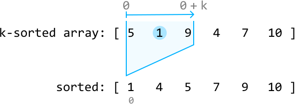

Note that the sorted array in the diagrams is purely provided as a reference point. We don't yet know which number in the range [0, 0 + `k`] belongs at index 0. However, one fact remains consistent: in a sorted array, index 0 always holds the smallest number. This means the value needed at index 0 is also the smallest number within the range [0, 0 + `k`] of the k-sorted array, which is 1 in this example.

So, let's swap 1 with the number at index 0 to position 1 as the first value in the sorted array:

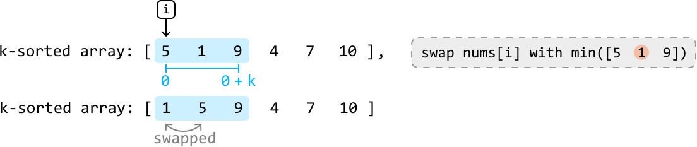

---

Now let's find the number that belongs at index 1: the second smallest number. Since index 0 currently contains the smallest value in the array, we won't need to consider index 0 in our search. Therefore, we can find the value that belongs at index 1 in the range [1, 1 + k]. The smallest value in this range will be the second smallest value overall, which is 4 in this case.

So, let's swap 4 with the number at index 1 to position 4 as the second value in the sorted array:

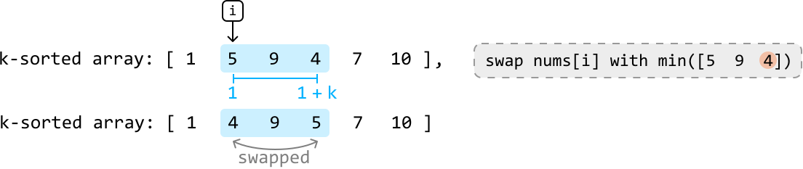

---

If we continue this process for the rest of the array, we'll successfully sort the k-sorted array.

The main inefficiency with this approach is finding the minimum number in the range [`i`, `i + k`] at each index `i`. Linearly searching for it will take O(k) time at each index.

To improve this approach, we'd need a way to efficiently access the minimum value at each of these ranges. A **min-heap** would be perfect for this.

**Min-heap**

For a min-heap to determine the minimum value within each range [`i`, `i + k`], it will always need to be populated with the values in these ranges as we iterate through the array. Let's see how this works over the same example.

---

Before we can determine which value belongs at index 0, we'll need to populate the heap with all the values in the range [0, `k`], which are the first `k + 1` values (where `k = 2` in this example):

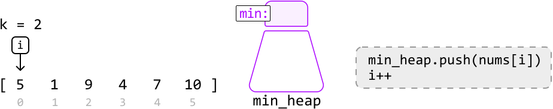

![Image represents a step-by-step illustration of building a min-heap from an array.  The array `[5, 1, 9, 4, 7, 10]` is s](./images/9139e69c_image-08-04-7-6KU6OADY.svg)

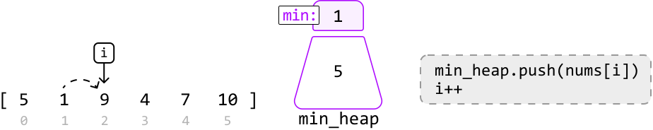

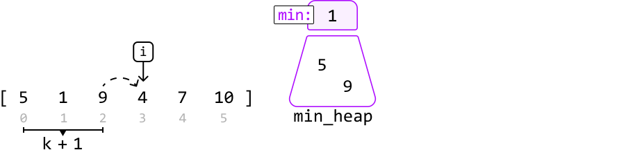

An alternative way to create a heap of the first `k + 1` elements is to heapify a list of the first `k + 1` elements.

---

Now, let's begin inserting the smallest elements from the heap into the array, using the `insert_index` pointer. The value that belongs at index 0 in sorted order is the value currently at the top of the heap, which is 1:

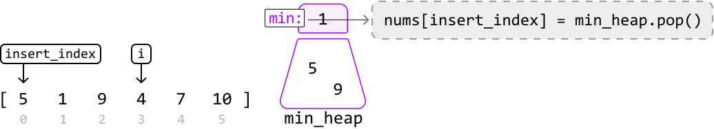

Once we insert 1 at index 0, push the value at index `i` to the heap before incrementing both pointers:

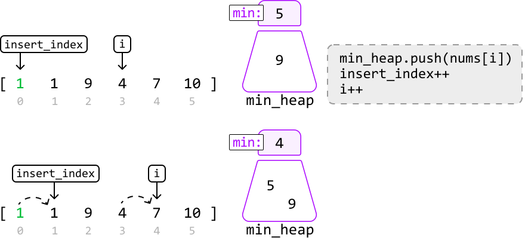

---

Let's continue this process for the remaining numbers:

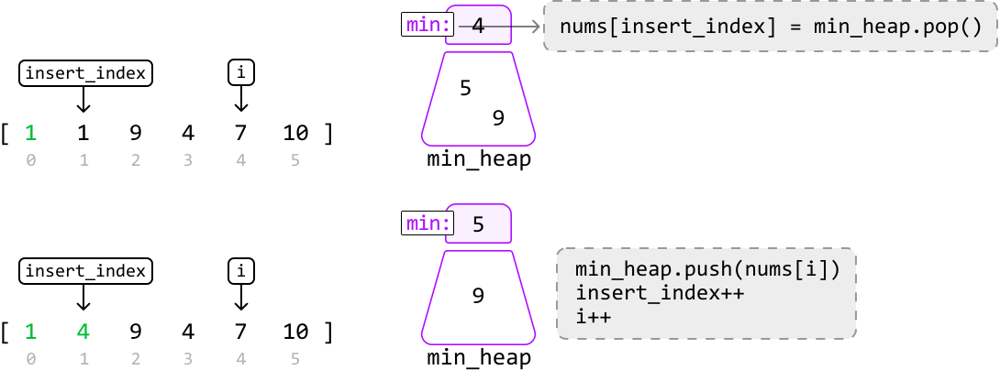

---

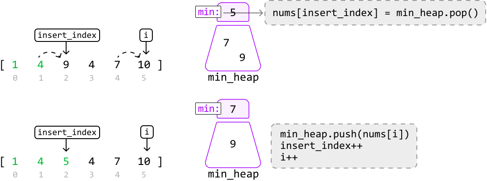

---

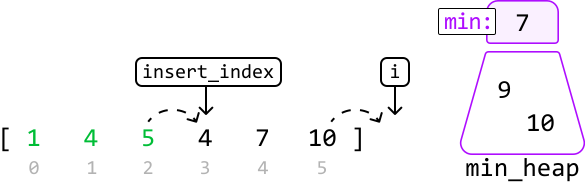

---

Once there are no more elements to push into the heap, the rest of the array can be sorted by inserting the remaining values from the heap:

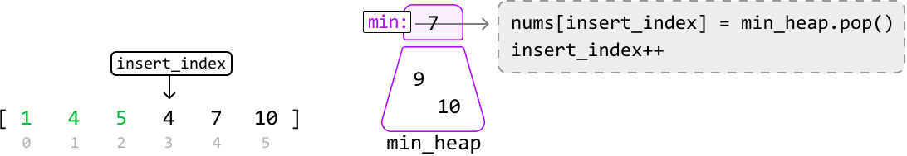

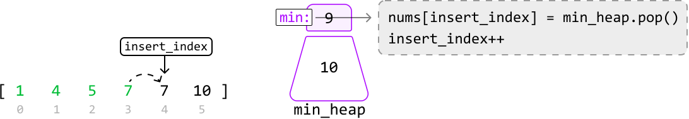

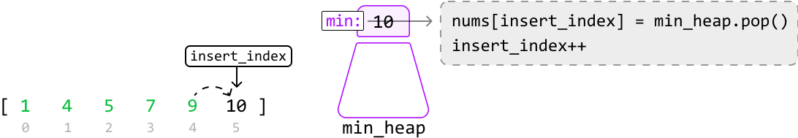

![Image represents a visual depiction of a min-heap data structure.  On the left, a green array `[1, 4, 5, 7, 9, 10]` is s](./images/6d30e596_image-08-04-18-DNZHUO7S.svg)

---

Once the heap is empty, the array is sorted.

## Implementation

```python
from typing import List
import heapq
        
def sort_a_k_sorted_array(nums: List[int], k: int) -> List[int]:
    # Populate a min-heap with the first k + 1 values in 'nums'.
    min_heap = nums[:k+1]
    heapq.heapify(min_heap)
    # Replace elements in the array with the minimum from the heap at each
    # iteration.
    insert_index = 0
    for i in range(k + 1, len(nums)):
        nums[insert_index] = heapq.heappop(min_heap)
        insert_index += 1
        heapq.heappush(min_heap, nums[i])
    # Pop the remaining elements from the heap to finish sorting the array.
    while min_heap:
        nums[insert_index] = heapq.heappop(min_heap)
        insert_index += 1
    return nums

```

```javascript
import { MinPriorityQueue } from './helpers/heap/index.js'

export function sort_a_k_sorted_array(nums, k) {
  // Populate a min-heap with the first k + 1 values in 'nums'.
  const minHeap = new MinPriorityQueue((x) => x)
  for (let i = 0; i <= k && i < nums.length; i++) {
    minHeap.enqueue(nums[i])
  }
  // Replace elements in the array with the minimum from the heap at each iteration.
  let insertIndex = 0
  for (let i = k + 1; i < nums.length; i++) {
    nums[insertIndex] = minHeap.dequeue()
    insertIndex++
    minHeap.enqueue(nums[i])
  }
  // Pop the remaining elements from the heap to finish sorting the array.
  while (!minHeap.isEmpty()) {
    nums[insertIndex] = minHeap.dequeue()
    insertIndex++
  }
  return nums
}

```

```java
import java.util.ArrayList;
import java.util.PriorityQueue;

class Main {
    public ArrayList<Integer> sort_a_k_sorted_array(ArrayList<Integer> nums, int k) {
        // Populate a min-heap with the first k + 1 values in 'nums'.
        PriorityQueue<Integer> minHeap = new PriorityQueue<>();
        int n = nums.size();
        for (int i = 0; i <= Math.min(k, n - 1); i++) {
            minHeap.offer(nums.get(i));
        }
        // Replace elements in the array with the minimum from the heap at each
        // iteration.
        int insertIndex = 0;
        for (int i = k + 1; i < n; i++) {
            nums.set(insertIndex++, minHeap.poll());
            minHeap.offer(nums.get(i));
        }
        // Pop the remaining elements from the heap to finish sorting the array.
        while (!minHeap.isEmpty()) {
            nums.set(insertIndex++, minHeap.poll());
        }
        return nums;
    }
}

```

### Complexity Analysis

**Time complexity:** The time complexity of `sort_a_k_sorted_array` is O(nlog(k)), where n denotes the length of the array. Here's why:

- We perform heapify on a min_heap of size k+1 which takes O(k) time. Note that k is upper-bounded by n in this operation since the heap won't have more than n values.

- Then, we perform `push` and `pop` operations on approximately n-k values using the heap. Since the heap can grow up to a size of k+1, each `push` and `pop` operations takes O(log(k)) time. Therefore, this loop takes O(nlog(k)) time in the worst case.

- The final while-loop runs in O(klog(k)) time since we pop k+1 values from the heap. Note that k here is also upper-bounded by n.

Therefore, the overall time complexity is O(k)+O(nlog(k))+O(klog(k))=O(nlog(k)).

**Space complexity:** The space complexity is O(k) since the heap can grow up to k+1 in size.