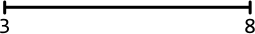
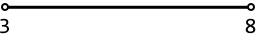
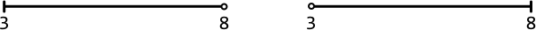
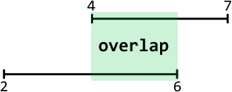
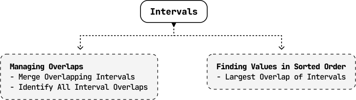

# Introduction to Intervals

## Intuition

An interval consists of two values: a start point and an end point. It represents a continuous segment on the number line that includes all values between these two points. It is often used to represent a line, time period, or a continuous range of values.

- An interval’s start point indicates where the interval begins.

- An interval’s end point indicates where the interval ends.


Intervals can be closed, open, or half-open, based on whether their start or end points are included in the interval.

- **Closed intervals:** Both the start and end points are included in the interval.



- **Open intervals:** The start and end points are not included in the interval.



- **Half-open intervals:** Either the start or the end point is included, while the other is not.



When presented with an interval problem in an interview, It’s important to clarify whether the intervals are open, closed, or half-open, as this can change the nature of how intervals overlap.

**Overlapping intervals**

Two intervals overlap if they share at least one common value.



The central challenge in most interval problems involves managing overlapping intervals
effectively. Whether identifying or merging overlapping intervals, it’s important
to determine how the overlap between intervals influences the desired outcome of
the problem. The problems in this chapter involve handling overlapping intervals
in varying situations.

**Sorting intervals**

In most interval problems, sorting the intervals before solving the problem is quite helpful since it allows them to be processed in a certain order.

We usually **sort intervals by their start point** so they can be traversed in chronological order. When two or more intervals have the same start point, we might also need to consider each interval’s end points during sorting.

**Separating start and end points**

In certain scenarios, it might be beneficial to process the start and end points of intervals separately. This usually involves creating two sorted arrays: one containing all start points and another containing all end points. For example, this is needed in the sweeping line algorithm, which is explored in the *Largest Overlap of Intervals* problem.


**Interval class definition**

For the problems in this chapter, intervals are represented using the class below.

```python
class Interval:
   def __init__(self, start, end):
       self.start = start
       self.end = end

```

```javascript
class Interval {
  constructor(start, end) {
    this.start = start
    this.end = end
  }
}

```

```java
class Interval {
    int start;
    int end;

    public Interval(int start, int end) {
        this.start = start;
        this.end = end;
    }
}

```

## Real-world Example

**Scheduling systems:** Intervals are widely used in scheduling systems. For instance, in a conference room booking system, each booking is represented as an interval. The interval representation is used if the system requires functionality, such as determining the maximum number of overlapping bookings to ensure sufficient room availability. By analyzing these intervals, the system can efficiently allocate resources and prevent double bookings.

## Chapter Outline

