# Merge Overlapping Intervals

**Merge** an array of intervals so there are no overlapping intervals, and return the resultant merged intervals.

#### Example:

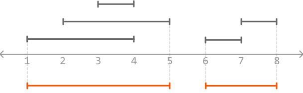

```python
Input: intervals = [[3, 4], [7, 8], [2, 5], [6, 7], [1, 4]]
Output: [[1, 5], [6, 8]]

```

#### Constraints:

- The input contains at least one interval.

- For every index `i` in the array, `intervals[i].start ≤ intervals[i].end`.

## Intuition

There are two main challenges to this problem:

- Identifying which intervals overlap each other.

- Merging those intervals.

Let's start by tackling the first challenge. Consider two intervals, A and B, where interval **A starts before B**. Below, we visualize the case when these two intervals don't overlap:

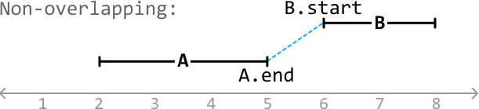

The dashed line above shows that interval A ends before interval B starts, which eliminates the possibility of B overlapping A. This indicates that **intervals A and B will never overlap when `A.end < B.start`**.

Now, consider a couple of cases where these two intervals do overlap:

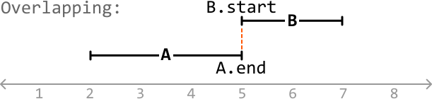

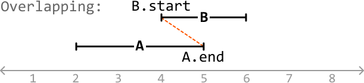

In these cases, we see that B starts before (or when) A ends (`A.end ≥ B.start`). In other words, some portion of B overlaps A since interval A hasn't ended before interval B starts. Therefore, **intervals A and B overlap when `A.end ≥ B.start`**.

We have now established the two cases that cover all overlapping and non-overlapping scenarios for two intervals, given interval A starts before interval B:

- If `A.end < B.start`, the intervals don't overlap.

- If `A.end ≥ B.start`, the intervals overlap.

To apply these conditions to any two intervals in the input, it's useful to have a way to identify which interval starts first. One idea is to **sort the intervals by their start value**, which will make it clear which one of each two adjacent intervals starts first.

**Merging intervals**

With the above logic in mind, let's tackle an example. Consider the following intervals:

![Image represents a sequence of five distinct arrays, each enclosed in square brackets `[]` and containing two integer el](./images/0dbc0c77_image-09-01-4-RWY6WP66.svg)

The first step is to sort these intervals by start value:

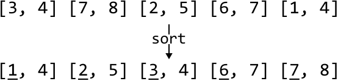

To aid the explanation, let's represent the intervals visually:

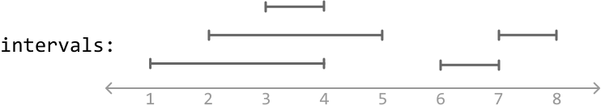

---

Let's add/merge each interval into a new array called merged, starting with the first one, which we can add to the merged array straight away as it's the first interval:

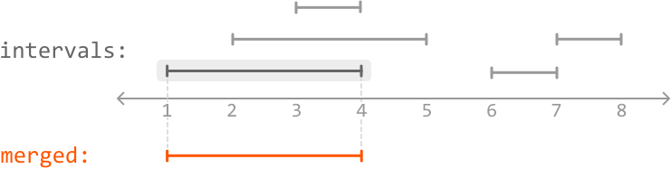

---

After the first interval is added, we start the process of merging. Let's define A as the last interval in the merged array and B as the current interval in the input. This makes sense since the interval in the merged array (A) starts before or at the same time as B.

We notice B starts before A ends, indicating an overlap. So, let's merge them:

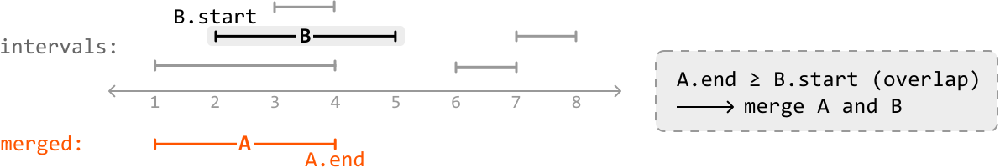

When merging A and B, we use the leftmost start value and the rightmost end value between them. Since A will always start before or at the same time as B, we always use `A.start` as the start point. This means we just need to **identify the end point**, which is the **largest value between the end points of A and B**:

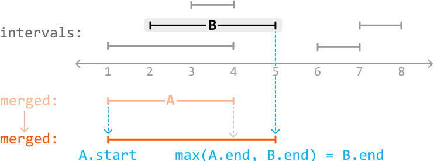

---

We can apply the same logic to the next interval:

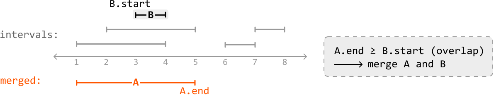

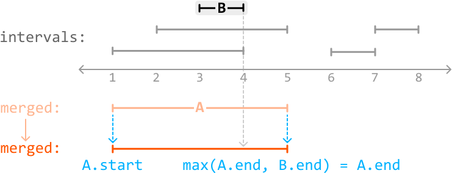

---

When we reach the fourth interval, we notice B starts after A ends, indicating there is no overlap.

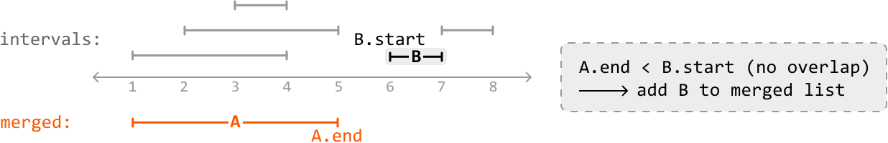

So, we just add it as a new interval to the merged array:

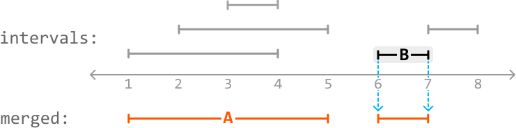

---

The next interval, B, overlaps the last interval in the merged array, A, since B starts when A ends (`A.end == B.start`).

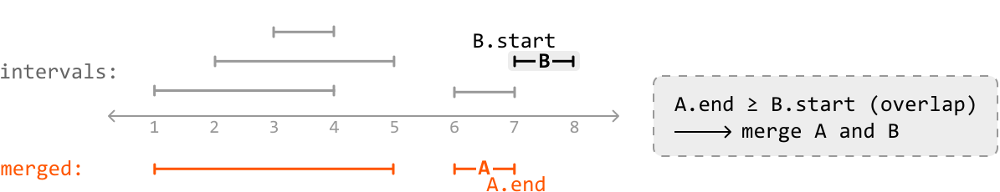

So, let's merge A with B:

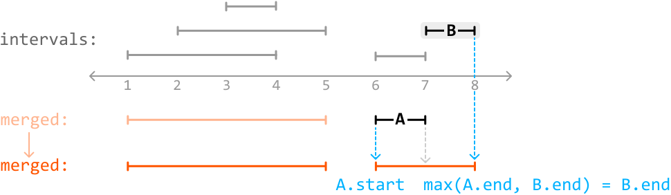

---

After processing the last interval, we've successfully merged all intervals.

## Implementation

```python
from typing import List
from ds import Interval
    
def merge_overlapping_intervals(intervals: List[Interval]) -> List[Interval]:
    intervals.sort(key=lambda x: x.start)
    merged = [intervals[0]]
    for B in intervals[1:]:
        A = merged[-1]
        # If A and B don't overlap, add B to the merged list.
        if A.end < B.start:
            merged.append(B)
        # If they do overlap, merge A with B.
        else:
            merged[-1] = Interval(A.start, max(A.end, B.end))
    return merged

```

```javascript
import { Interval } from './ds.js'

export function merge_overlapping_intervals(intervals) {
  if (intervals.length === 0) return []
  // Sort intervals by their start value
  intervals.sort((a, b) => a.start - b.start)
  const merged = [intervals[0]]
  for (let i = 1; i < intervals.length; i++) {
    const A = merged[merged.length - 1]
    const B = intervals[i]

    // If A and B don't overlap, add B to the merged list.
    if (A.end < B.start) {
      merged.push(B)
    } else {
      // If they do overlap, merge A with B.
      merged[merged.length - 1] = new Interval(A.start, Math.max(A.end, B.end))
    }
  }
  return merged
}

```

```java
import java.util.ArrayList;
import java.util.Collections;
import java.util.Comparator;
import core.Interval.Interval;

class Main {
    public static ArrayList<Interval> merge_overlapping_intervals(ArrayList<Interval> intervals) {
        if (intervals == null || intervals.size() == 0) return new ArrayList<>();
        // Sort intervals by their start time.
        intervals.sort(Comparator.comparingInt(a -> a.start));
        ArrayList<Interval> merged = new ArrayList<>();
        merged.add(intervals.get(0));
        for (int i = 1; i < intervals.size(); i++) {
            Interval B = intervals.get(i);
            Interval A = merged.get(merged.size() - 1);
            // If A and B don't overlap, add B to the merged list.
            if (A.end < B.start) {
                merged.add(B);
            }
            // If they do overlap, merge A with B.
            else {
                merged.set(merged.size() - 1, new Interval(A.start, Math.max(A.end, B.end)));
            }
        }
        return merged;
    }
}

```

### Complexity Analysis

**Time complexity:** The time complexity of merge_overlapping_intervals is O(nlog(n)), where n denotes the number of intervals. This is due to the sorting algorithm. The process of merging overlapping intervals itself takes O(n) time because we iterate over every interval.

**Space complexity:** The space complexity depends on the space used by the sorting algorithm. In Python, the built-in sorting algorithm, Tim sort, uses O(n) space. Note that the merged array is not considered in the space complexity calculation because we're only concerned with extra space used, not space taken up by the output.

### Interview Tip

*Tip: Visualize intervals to uncover logic and edge cases.*

Managing intervals and handling edge cases is much easier when visualizing example inputs. Drawing examples also helps your interviewer follow along with your reasoning and understand your thought process.