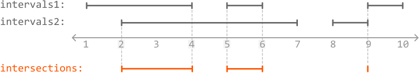
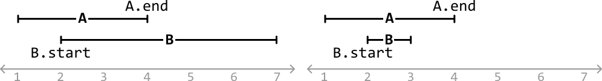
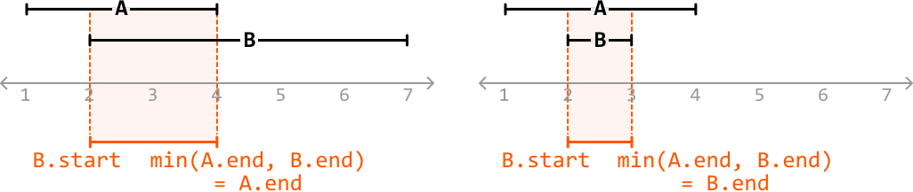
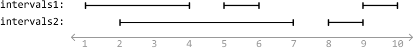
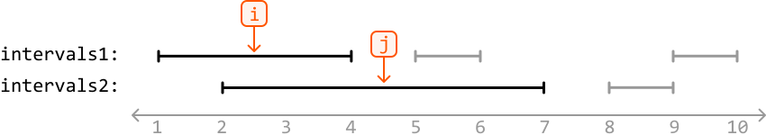
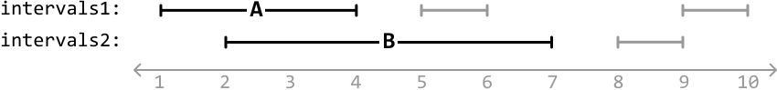
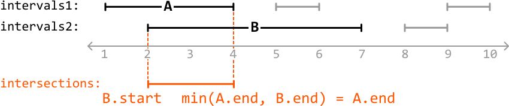
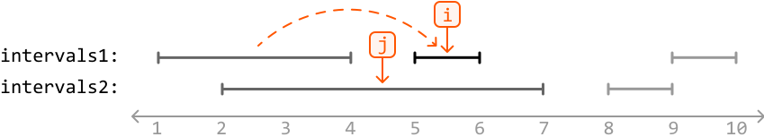

# Identify All Interval Overlaps

Return an array of **all overlaps** between two arrays of intervals; `intervals1` and `intervals2`. Each individual interval array is sorted by start value, and contains no overlapping intervals within itself.

#### Example:



```python
Input: intervals1 = [[1, 4], [5, 6], [9, 10]],
       intervals2 = [[2, 7], [8, 9]]
Output: [[2, 4], [5, 6], [9, 9]]

```

#### Constraints:

- For every index `i` in `intervals1`, `intervals1[i].start < intervals1[i].end`.

- For every index `j` in `intervals2`, `intervals2[j].start < intervals2[j].end`.

## Intuition

We’re given two arrays of intervals, each containing non-overlapping intervals. This implies an overlap can only occur between an interval from the first array and an interval from the second array.

Let’s start by learning how to identify an overlap between two overlapping intervals.

**Identifying the overlap between two overlapping intervals**

We know from the *Merge Overlapping Intervals* problem that two intervals, A and B, **overlap when `A.end ≥ B.start`, assuming we know A starts before B**. Let’s have a look at a couple of examples which each contain two overlapping intervals that match this condition:



To extract the overlap between these two overlapping intervals, we’ll need to identify when it starts and ends.

- The overlap starts at the furthest start point, which is always `B.start`.

- The overlap ends at the earliest end point (`min(A.end, B.end)`).



Therefore, when two intervals overlap, their overlap is defined by the range **[`B.start`, `min(A.end, B.end)`]**. Remember that in all these cases, interval A always starts first.

**Identifying all overlaps**

Now, let’s return to the two arrays of intervals. Consider this example:



---

Let’s start by considering the first interval from each array:



To check if these intervals overlap, we’ll need to identify which interval between `intervals1[i]` and `intervals2[j]` starts first, so we can assign that interval as interval A and the other as interval B. The code snippet for this is provided below:

```python
# Set A to the interval that starts first and B to the other interval.
if intervals1[i].start <= intervals2[j].start:
    A, B = intervals1[i], intervals2[j]
else:
    A, B = intervals2[j], intervals1[i]

```

In this example, `intervals1[i]` starts first:



A and B overlap when `A.end ≥ B.start`, which is true here. Since they overlap, let’s record their overlap: [`B.start`, `min(A.end, B.end)`]:



Now that we’ve identified the overlap between those two intervals, let’s move on to the next pair by advancing the pointer at one of the interval arrays. Since `intervals1[i]` ends before `intervals2[j]`, we know that `intervals1[i]` won’t overlap with any more intervals from the `intervals2` array, so let’s increment the `intervals1` pointer (`i`) to move to the next interval in this array:



Note, we use `intervals1[i]` and `intervals2[j]` instead of A and B since we don’t know which interval array A or B belongs to.

---

We’ve now identified a process that allows us to identify and record all overlaps while traversing the arrays of intervals. For the pair of intervals being considered at `i` and `j`:

- Set A as the interval that starts first, and B as the other interval.

- Check if `A.end ≥ B.start` to see if these intervals overlap. If they do, record the overlap as [`B.start`, `min(A.end, B.end)`].

- Whichever interval ends first, advance its corresponding pointer to move to the next interval.

Continue to apply these steps until either `i` or `j` have passed the end of their array. Once this happens, we know there won’t be any more overlapping intervals.

---

## Implementation

```python
from typing import List
from ds import Interval
   
def identify_all_interval_overlaps(intervals1: List[Interval], intervals2: List[Interval]) -> List[Interval]:
   overlaps = []
   i = j = 0
   while i < len(intervals1) and j < len(intervals2):
       # Set A to the interval that starts first and B to the other interval.
       if intervals1[i].start <= intervals2[j].start:
           A, B = intervals1[i], intervals2[j]
       else:
           A, B = intervals2[j], intervals1[i]
       # If there's an overlap, add the overlap.
       if A.end >= B.start:
           overlaps.append(Interval(B.start, min(A.end, B.end)))
       # Advance the pointer associated with the interval that ends first.
       if intervals1[i].end < intervals2[j].end:
           i += 1
       else:
           j += 1
   return overlaps

```

```javascript
import { Interval } from './ds.js'

export function identify_all_interval_overlaps(intervals1, intervals2) {
  const overlaps = []
  let i = 0,
    j = 0
  while (i < intervals1.length && j < intervals2.length) {
    // Set A to the interval that starts first and B to the other interval.
    let A = intervals1[i]
    let B = intervals2[j]
    if (intervals1[i].start > intervals2[j].start) {
      A = intervals2[j]
      B = intervals1[i]
    }
    // If there's an overlap, add the overlap.
    if (A.end >= B.start) {
      overlaps.push(new Interval(B.start, Math.min(A.end, B.end)))
    }
    // Advance the pointer associated with the interval that ends first.
    if (intervals1[i].end < intervals2[j].end) {
      i++
    } else {
      j++
    }
  }
  return overlaps
}

```

```java
import java.util.ArrayList;
import core.Interval.Interval;

public class Main {
    public static ArrayList<Interval> identify_all_interval_overlaps(ArrayList<Interval> intervals1, ArrayList<Interval> intervals2) {
        ArrayList<Interval> overlaps = new ArrayList<>();
        int i = 0, j = 0;
        while (i < intervals1.size() && j < intervals2.size()) {
            Interval A = intervals1.get(i);
            Interval B = intervals2.get(j);
            // Set A to the interval that starts first and B to the other interval.
            if (A.start > B.start) {
                Interval temp = A;
                A = B;
                B = temp;
            }
            // If there's an overlap, add the overlap.
            if (A.end >= B.start) {
                overlaps.add(new Interval(B.start, Math.min(A.end, B.end)));
            }
            // Advance the pointer associated with the interval that ends first.
            if (intervals1.get(i).end < intervals2.get(j).end) {
                i++;
            } else {
                j++;
            }
        }
        return overlaps;
    }
}

```

### Complexity Analysis

**Time complexity:** The time complexity of `identify_all_interval_overlaps` is O(n+m) where n and m are the lengths of `intervals1` and `intervals2`, respectively. This is because we traverse each interval in both arrays exactly once.

**Space complexity:** The space complexity is O(1). Note that the overlaps array is not considered because space complexity is only concerned with extra space used and not space taken up by the output.