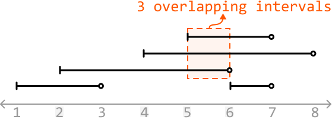
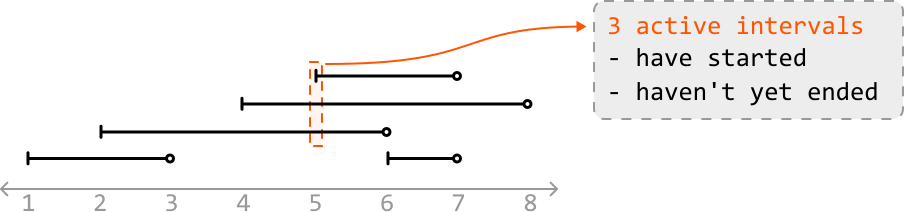
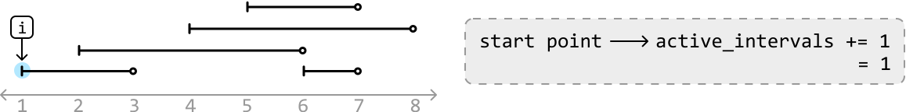
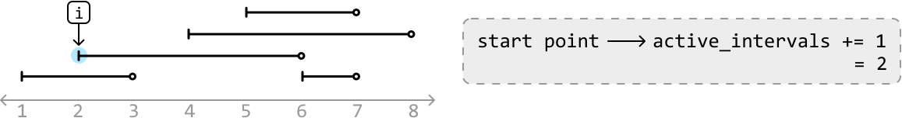
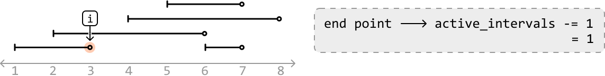
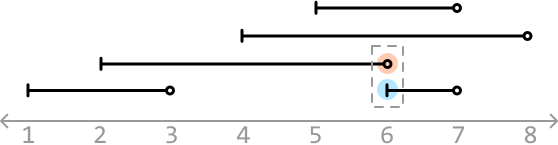
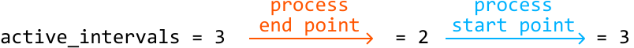
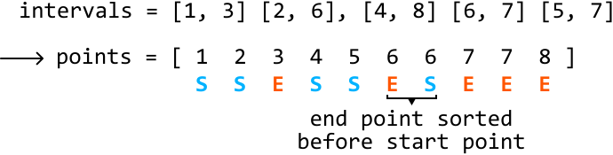

# Largest Overlap of Intervals

Given an array of intervals, determine the maximum number of intervals that overlap at any point. Each interval is half-open, meaning it includes the start point but excludes the end point.

#### Example:



```python
Input: intervals = [[1, 3], [5, 7], [2, 6], [4, 8]]
Output: 3

```

#### Constraints:

- The input will contain at least one interval.

- For every index `i` in the list, `intervals[i].start < intervals[i].end`.

## Intuition

Think about what it means when x intervals overlap at a certain point in time. This means at this point, there are x “**active**” intervals, where an interval is active if it has started but not ended.

In the example below, we see three active intervals at time 5 (intervals that started at or before this time, and haven’t yet ended):



To find the number of active intervals at any point in time, we need to identify when an interval has started and when an interval has ended. The start point of an interval indicates the start of a new active interval, whereas an end point represents an active interval finishing. This suggests an approach which looks at start and end points individually could be useful. Let’s explore this idea further.

**Processing start points and end points**

Let’s step through each point in the array of intervals in chronological order, and see if we can determine the number of active intervals at each point.

---

The first point is a start point, indicating the start of the first active interval. So, let’s increment our counter:



---

The next point is another start point. This is the start of the second active interval, so let’s increment our counter again. Now, the number of active intervals is 2, which correctly corresponds with the number of overlapping intervals at this point:



---

The next point is an end point, which means an active interval has just finished. So, let’s decrement our counter. Now, the number of active intervals is 1, which also corresponds with the current number of overlapping intervals:



---

We’ve now rationalized what we need to do whenever we encounter a start point or end point:

- If we encounter a **start point**: **increment `active_intervals`**.

- If we encounter an **end point**: **decrement `active_intervals`**.

Processing the remaining points allows us to attain the number of active intervals at each point. **The final answer is obtained by recording the largest value of `active_intervals`**.

**Edge case: processing concurrent start and end points**

An edge case to consider is when a start and end point occur simultaneously:



Which point should we process first? Keep in mind the value of `active_intervals` is 3 right before we reach time = 6 in the above example.

At time 6, if we process the start point first and increment `active_intervals`, we would update it to 4 first, which is incorrect as there are never 4 active intervals at this moment. This is an issue because our final answer is the largest value of `active_intervals` encountered, which means we’ll incorrectly record 4 as the answer.


If we process the end point first, we won’t encounter this issue:



Therefore, for start and end points that occur simultaneously, we should **process end points before start points**.

**Iterating over interval points in order**

We need a way to iterate through the start and end points in the order they should be processed. To do this, we can combine all start and end points into a single array and sort it. For start and end points of the same value, we ensure end points are prioritized before start points while the points are being sorted.

Let’s use ‘S’ and ‘E’ to differentiate between start and end points, respectively:



The algorithm we used to solve this problem is known as a ‘sweeping line algorithm.’ It works by processing the start and end points of intervals in order, as if a vertical line was sweeping across them. This method efficiently handles the dynamic nature of interval overlaps by specifically focusing on start and end points, rather than individual intervals.

## Implementation

```python
from typing import List
from ds import Interval
    
def largest_overlap_of_intervals(intervals: List[Interval]) -> int:
   points = []
   for interval in intervals:
       points.append((interval.start, 'S'))
       points.append((interval.end, 'E'))
   # Sort in chronological order. If multiple points occur at the same time, ensure
   # end points are prioritized before start points in the sorting order.
   points.sort(key=lambda x: (x[0], x[1]))
   active_intervals = 0
   max_overlaps = 0
   for time, point_type in points:
       if point_type == 'S':
           active_intervals += 1
       else:
           active_intervals -= 1
       max_overlaps = max(max_overlaps, active_intervals)
   return max_overlaps

```

```javascript
import { Interval } from './ds.js'

export function largest_overlap_of_intervals(intervals) {
  const points = []
  for (const interval of intervals) {
    points.push([interval.start, 'S'])
    points.push([interval.end, 'E'])
  }
  // Sort in chronological order. Prioritize 'E' before 'S' if times are equal
  points.sort((a, b) => {
    if (a[0] === b[0]) {
      return a[1] === 'E' ? -1 : 1
    }
    return a[0] - b[0]
  })
  let active_intervals = 0
  let max_overlaps = 0
  for (const [time, pointType] of points) {
    if (pointType === 'S') {
      active_intervals += 1
    } else {
      active_intervals -= 1
    }
    max_overlaps = Math.max(max_overlaps, active_intervals)
  }
  return max_overlaps
}

```

```java
import java.util.ArrayList;
import java.util.Collections;
import java.util.Comparator;
import core.Interval.Interval;

public class Main {
    public int largest_overlap_of_intervals(ArrayList<Interval> intervals) {
        ArrayList<EventPoint> points = new ArrayList<>();
        for (Interval interval : intervals) {
            points.add(new EventPoint(interval.start, 'S'));
            points.add(new EventPoint(interval.end, 'E'));
        }
        // Sort in chronological order. If multiple points occur at the same time, ensure
        // end points are prioritized before start points in the sorting order.
        Collections.sort(points, new Comparator<EventPoint>() {
            @Override
            public int compare(EventPoint a, EventPoint b) {
                if (a.time != b.time) {
                    return Integer.compare(a.time, b.time);
                }
                return Character.compare(a.type, b.type); // 'E' < 'S' in ASCII
            }
        });
        int active_intervals = 0;
        int max_overlaps = 0;
        for (EventPoint point : points) {
            if (point.type == 'S') {
                active_intervals += 1;
            } else {
                active_intervals -= 1;
            }
            max_overlaps = Math.max(max_overlaps, active_intervals);
        }
        return max_overlaps;
    }

    // Helper class to represent an event point (either start or end of an interval)
    class EventPoint {
        int time;
        char type;

        EventPoint(int time, char type) {
            this.time = time;
            this.type = type;
        }
    }
}

```

### Complexity Analysis

**Time complexity:** The time complexity of `largest_overlap_of_intervals` is O(nlog(n)), where n denotes the number of intervals. This is because we sort the points array of size 2n before iterating over it in O(n) time.

**Space complexity:** The space complexity is O(n) due to the space taken up by the `points` array.