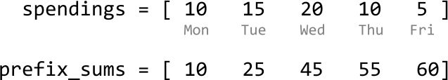
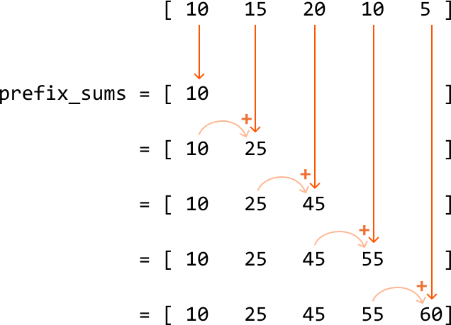
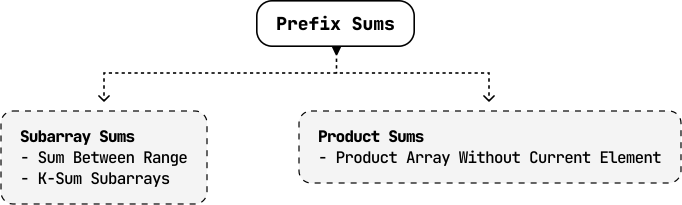

# Introduction to Prefix Sums

## Intuition

Imagine keeping track of how much money you spend on takeout meals each day over a period of days.


Let's say you want to know the total spent on takeout food up until a particular day. For example, you might like to know that the total you've spent up until Wednesday is $45 ($10 + $15 + $20). This is information which a prefix sum array can store. For an array of integers, **a prefix sum array maintains the running sum of values up to each index in the array**.



To obtain the prefix sum at each index, we just add the current number from the input array to the prefix sum from the previous index.



In code, the above process looks like this:

```python
def compute_prefix_sums(nums):
    # Start by adding the first number to the prefix sums array.
    prefix_sum = [nums[0]]
    # For all remaining indexes, add 'nums[i]' to the cumulative sum from the previous
    # index.
    for i in range(1, len(nums)):
        prefix_sum.append(prefix_sum[-1] + nums[i])

```

```javascript
function compute_prefix_sums(nums) {
  const prefix_sum = [nums[0]]
  for (let i = 1; i < nums.length; i++) {
    prefix_sum.push(prefix_sum[prefix_sum.length - 1] + nums[i])
  }
  return prefix_sum
}

```

```java
import java.util.ArrayList;

public class Main {
    public static ArrayList<Integer> compute_prefix_sums(ArrayList<Integer> nums) {
        ArrayList<Integer> prefix_sum = new ArrayList<>();
        // Start by adding the first number to the prefix sums array.
        prefix_sum.add(nums.get(0));
        // For all remaining indexes, add 'nums[i]' to the cumulative sum from the previous
        // index.
        for (int i = 1; i < nums.size(); i++) {
            prefix_sum.add(prefix_sum.get(i - 1) + nums.get(i));
        }
        return prefix_sum;
    }
}

```

As you can see, building a prefix sum array takes O(n) time and O(n) space, where n denotes the length of the array.

**Applications of prefix sums**

Aside from allowing us to have constant-time access to running sums at any index within an array, prefix sums are commonly used to efficiently **determine the sum of subarrays**. This application is examined in depth in the problems in this chapter.

Another interesting variant of prefix sums is prefix products, which populates an array with a running product instead of a running sum. Similar to prefix sums, prefix products provide an efficient way to determine the product of subarrays.

## Real-world Example

**Financial analysis:** As hinted at earlier, a real-world use of prefix sums is for financial analysis, particularly in calculating cumulative earnings or expenses over time.

For instance, consider a company's daily revenue over a month. A prefix sum array can be used to quickly calculate the total revenue for any given period within that month. By precomputing the prefix sums, the company can instantly determine the revenue from day 5 to day 20 without having to sum each day's revenue individually. This is especially useful for generating financial reports, where quick calculations over various periods are necessary to analyze trends.

## Chapter Outline

