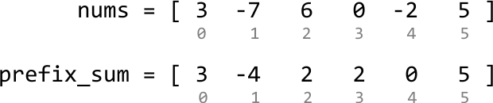
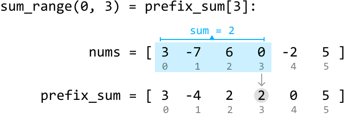
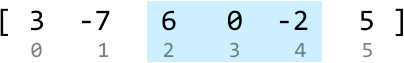
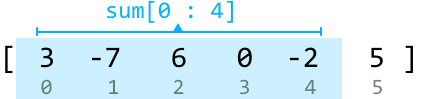

# Sum Between Range

Given an integer array, write a function which returns the **sum of values between two indexes**.

#### Example:

![Image represents three examples of a `sum_range` function operating on a numerical array `[3, -7, 6, 0, -2, 5]`.  Each e](./images/57caacaf_sum-between-range-YTKLP363.svg)

```python
Input: nums = [3, -7, 6, 0, -2, 5],
       [sum_range(0, 3), sum_range(2, 4), sum_range(2, 2)]
Output: [2, 4, 6]

```

#### Constraints:

- `nums` contains at least one element.

- Each `sum_range` operation will query a valid range of the input array.

## Intuition

We need to code a function `sum_range(i, j)`, where `i` and `j` are the indexes defining the boundaries of the range to be summed up.

A naive solution is to iteratively sum the array values from index `i` to `j`, which takes linear time for each call to `sum_range`. Since we have access to the input array before any calls to `sum_range` are made, we should consider if any **preprocessing** can be done to improve the efficiency of `sum_range`.

This problem deals with subarray sums, so it might be useful to think about how **prefix sums** can be applied to solve it. Consider the integer array below and its prefix sums:



We already notice that the prefix sum array has some use: the prefix sum up to any index `j` essentially gives the answer to `sum_range(0, j)`. For example, the sum of the range [0, 3] is just the prefix sum up to index 3:



Therefore, when `i == 0`:

> 
> 
> `sum_range(0, j) = prefix_sum[j]`
> 
> 

What about when the requested range doesn’t start at 0? Let's say we want to find the sum in the range [2, 4]:



Is there a way to get this using only prefix sums? All prefix sum values are sums for ranges that start at index 0. So, let’s see how we could make use of these ranges. Consider the sum of the range [0, 4], which corresponds to `prefix_sum[4]`:



The key observation here is that the sum of the range [2, 4] can be obtained by subtracting the sum of the range [0, 1] from the sum above. This can be visualized:

![Image represents a visual depiction of array summation.  A numerical array `[3, -7, 6, 0, -2, 5]` is shown, partitioned ](./images/85832c8c_image-10-01-5-BSWFQB25.svg)

Since the sums of ranges [0, 4] and [0, 1] are both values in our prefix sum array, we can obtain the sum of the range [2, 4] from the following expression: `prefix_sum[4] - prefix_sum[1]`.

Therefore, when `i > 0`:

> 
> 
> `sum_range(i, j) = prefix_sum[j] - prefix_sum[i - 1]`
> 
> 

## Implementation

```python
from typing import List
    
class SumBetweenRange:
    def __init__(self, nums: List[int]):
        self.prefix_sum = [nums[0]]
        for i in range(1, len(nums)):
            self.prefix_sum.append(self.prefix_sum[-1] + nums[i])
    
    def sum_range(self, i: int, j: int) -> int:
        if i == 0:
            return self.prefix_sum[j]
        return self.prefix_sum[j] - self.prefix_sum[i - 1]

```

```javascript
export class SumBetweenRange {
  constructor(nums) {
    this.prefixSum = [nums[0]]
    for (let i = 1; i < nums.length; i++) {
      this.prefixSum.push(this.prefixSum[i - 1] + nums[i])
    }
  }

  sumRange(i, j) {
    if (i === 0) {
      return this.prefixSum[j]
    }
    return this.prefixSum[j] - this.prefixSum[i - 1]
  }
}

```

```java
import java.util.ArrayList;

class SumBetweenRange {
    private ArrayList<Integer> prefixSum;

    public SumBetweenRange(ArrayList<Integer> nums) {
        // Start by adding the first number to the prefix sums array.
        prefixSum = new ArrayList<>();
        prefixSum.add(nums.get(0));
        // For all remaining indexes, add 'nums[i]' to the cumulative sum from the previous index.
        for (int i = 1; i < nums.size(); i++) {
            prefixSum.add(prefixSum.get(i - 1) + nums.get(i));
        }
    }

    public Integer sumRange(Integer i, Integer j) {
        // If i == 0, return the prefix sum directly.
        if (i == 0) {
            return prefixSum.get(j);
        }
        // Otherwise, subtract the prefix sum up to index i - 1.
        return prefixSum.get(j) - prefixSum.get(i - 1);
    }
}

```

### Complexity Analysis

**Time complexity:** The time complexity of the constructor is O(n), where n denotes the length of the array. This is because we populate a `prefix_sum` array of length n. The time complexity of `sum_range` is O(1).

**Space complexity:** The space complexity is O(n) due to the space taken up by the `prefix_sum` array.