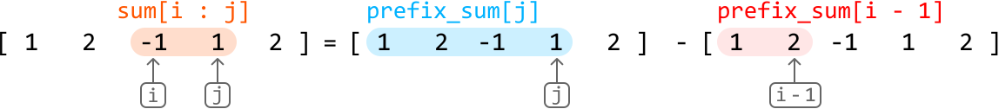
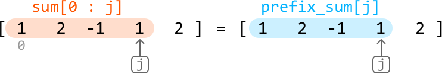
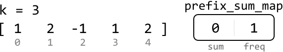
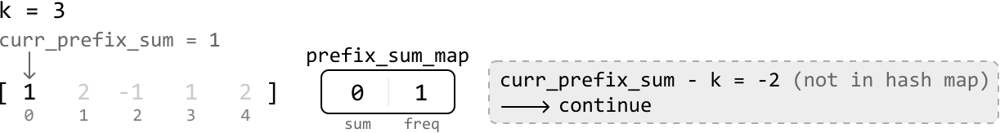
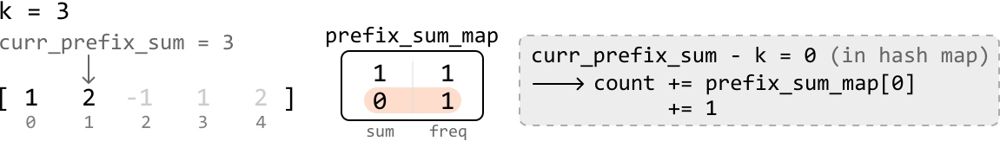
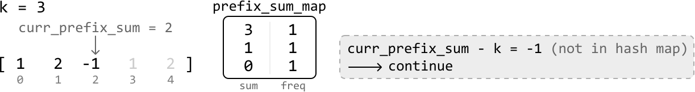
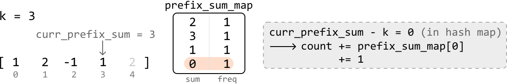
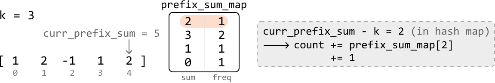

# K-Sum Subarrays

Find the number of subarrays in an integer array that sum to `k`.

#### Example:

![Image represents three identical arrays, each enclosed in square brackets `[]`, containing the integer sequence `[1, 2, ](./images/6cd52e7b_k-sum-subarrays-SGSPMDU3.svg)

```python
Input: nums = [1, 2, -1, 1, 2], k = 3
Output: 3

```

## Intuition

The brute force solution to this problem involves iterating through every possible subarray and checking if their sum equals k. It takes O(n^2) time to iterate over all subarrays, and finding the sum of each subarray takes O(n) time, resulting in an overall time complexity of O(n^3), where n denotes the length of the array. This solution is quite inefficient, so let’s think of something better.

Since we’re working with subarray sums, it’s worth considering how **prefix sums** can be used to solve this problem.

**Prefix sums**

As described in the *Sum Between Range* problem in this chapter, the sum of a subarray between two indexes, `i` and `j`, can be calculated with the following formula:



For subarrays which start at the beginning of the array (i.e., when `i = 0`), the formula is just:



In this problem, we already know the sum we’re looking for (k), meaning our goal is to find:

- All pairs of `i` and `j` such that **`prefix_sum[j] - prefix_sum[i - 1] == k`** when `i > 0`.

- All values of `j` such that **`prefix_sum[j] == k`** when `i == 0`.

We can unify both cases by recognizing that the formula prefix_sum[j] == k is the same as the formula `prefix_sum[j] - prefix_sum[i - 1] == k` when `prefix_sum[i - 1]` equals 0 (i.e., `prefix_sum[j] - 0 == k`).

One issue with this is **when `i == 0`, index `i - 1` is invalid**. To make this unification possible while avoiding the out-of-bounds issue, we can **prepend '[0]' to the prefix sums array**, making it possible for `prefix_sum[i - 1]` to equal 0 when `i - 1 == 0`.


Keep in mind that we should iterate over the array from index 1 because we added this 0 to the start of the prefix sum array.

Here’s the code snippet for this approach:

```python
from typing import List
    
def k_sum_subarrays(nums: List[int], k: int) -> int:
    n = len(nums)
    count = 0
    # Populate the prefix sum array, setting its first element to 0.
    prefix_sum = [0]
    for i in range(0, n):
        prefix_sum.append(prefix_sum[-1] + nums[i])
    # Loop through all valid pairs of prefix sum values to find all subarrays that sum
    # to 'k'.
    for j in range(1, n + 1):
        for i in range(1, j + 1):
            if prefix_sum[j] - prefix_sum[i - 1] == k:
                count += 1
    return count

```

```javascript
export function k_sum_subarrays(nums, k) {
  const n = nums.length
  let count = 0
  // Populate the prefix sum array, setting its first element to 0.
  const prefixSum = [0]
  for (let i = 0; i < n; i++) {
    prefixSum.push(prefixSum[prefixSum.length - 1] + nums[i])
  }
  // Loop through all valid pairs of prefix sum values to find all subarrays that sum to 'k'.
  for (let j = 1; j <= n; j++) {
    for (let i = 1; i <= j; i++) {
      if (prefixSum[j] - prefixSum[i - 1] === k) {
        count++
      }
    }
  }
  return count
}

```

```java
import java.util.ArrayList;

public class Main {
    public int k_sum_subarrays(ArrayList<Integer> nums, int k) {
        int n = nums.size();
        int count = 0;
        // Populate the prefix sum array, setting its first element to 0.
        ArrayList<Integer> prefixSum = new ArrayList<>();
        prefixSum.add(0);
        for (int i = 0; i < n; i++) {
            prefixSum.add(prefixSum.get(prefixSum.size() - 1) + nums.get(i));
        }
        // Loop through all valid pairs of prefix sum values to find all subarrays that sum to 'k'.
        for (int j = 1; j <= n; j++) {
            for (int i = 1; i <= j; i++) {
                if (prefixSum.get(j) - prefixSum.get(i - 1) == k) {
                    count++;
                }
            }
        }
        return count;
    }
}

```

This is an improvement on the brute force solution, which reduces the time complexity to O(n^2). Can we optimize this solution further?

**Optimization - hash map**

An important point is that we don't need to treat both `prefix_sum[j]` and `prefix_sum[i - 1]` as unknowns in the formula. If we know the value of `prefix_sum[j]`, we can find `prefix_sum[i - 1]` using `prefix_sum[i - 1] = prefix_sum[j] - k`.

Therefore, for each prefix sum (`curr_prefix_sum`), we need to find the number of times `curr_prefix_sum - k` previously appeared as a prefix sum before.

This is similar to the problem presented in *Pair Sum - Unsorted* in the *Hash Maps and Sets* chapter, where we learn a **hash map** is useful for implementing the above idea efficiently. In this context, if we store encountered prefix sum values in a hash map, we can check if `curr_prefix_sum - k` was encountered before in constant time.

Note, it's also important to track the frequency of each prefix sum we encounter using the hash map, as the same prefix sum may appear multiple times.

---

Let’s try using a hash map (`prefix_sum_map`) on the example below with `k = 3`. Initialize `prefix_sum_map` with one zero for the same reason we prepended 0 to the prefix sum array in the O(n^2) solution discussed earlier:



---

We’re using a hash map to keep track of prefix sums, we no longer need a separate array to store each individual prefix sum.

Initially, the prefix sum (`curr_prefix_sum`) is equal to 1. Its complement, -2, is not in the hash map as illustrated below. So, we continue:



Store the (`curr_prefix_sum`, `freq`) pair (1, 1) in the hash map before moving to the next prefix sum.

---

The next `curr_prefix_sum` value is 3 (1 + 2). Its complement, 0, exists in the hash map with a frequency of 1. This means we found 1 subarray of sum k. So, we add 1 to our count:



Store the (`curr_prefix_sum`, `freq`) pair (3, 1) in the hash map before moving on to the next value.

---

We now have a strategy for processing each value in the array:

- Update `curr_prefix_sum` by adding the current value of the array to it

- If `curr_prefix_sum - k` exists in the hash map, add its frequency (`prefix_sum_map[curr_prefix_sum - k`]) to count

- Add (`curr_prefix_sum`, `freq`) to the hash map. If the key is already present, increase its frequency; if not, set it to 1.

Repeat this process for the rest of the array:







---

Once we’ve processed all the prefix sum values, we return count, which stores the number of subarrays that sum to k.

## Implementation

```python
from typing import List
    
def k_sum_subarrays_optimized(nums: List[int], k: int) -> int:
    count = 0
    # Initialize the map with 0 to handle subarrays that sum to 'k' from the start of
    # the array.
    prefix_sum_map = {0: 1}
    curr_prefix_sum = 0
    for num in nums:
        # Update the running prefix sum by adding the current number
        curr_prefix_sum += num
        # If a subarray with sum 'k' exists, increment 'count' by the number of times
        # it has been found.
        if curr_prefix_sum - k in prefix_sum_map:
            count += prefix_sum_map[curr_prefix_sum - k]
        # Store the 'curr_prefix_sum' value in the hash map.
        prefix_sum_map[curr_prefix_sum] = prefix_sum_map.get(curr_prefix_sum, 0) + 1
    return count

```

```javascript
export function k_sum_subarrays_optimized(nums, k) {
  let count = 0
  const prefixSumMap = new Map()
  prefixSumMap.set(0, 1) // To handle subarrays that sum to 'k' from the start
  let currPrefixSum = 0
  for (const num of nums) {
    // Update the running prefix sum by adding the current number
    currPrefixSum += num
    // If a subarray with sum 'k' exists, increment 'count' by the number of times it has been found
    if (prefixSumMap.has(currPrefixSum - k)) {
      count += prefixSumMap.get(currPrefixSum - k)
    }
    // Store the 'currPrefixSum' value in the hash map
    prefixSumMap.set(currPrefixSum, (prefixSumMap.get(currPrefixSum) || 0) + 1)
  }
  return count
}

```

```java
import java.util.ArrayList;
import java.util.HashMap;
import java.util.Map;

public class Main {
    public int k_sum_subarrays(ArrayList<Integer> nums, int k) {
        int count = 0;
        // Initialize the map with 0 to handle subarrays that sum to 'k' from the start of the array.
        Map<Integer, Integer> prefixSumMap = new HashMap<>();
        prefixSumMap.put(0, 1);
        int currPrefixSum = 0;
        for (int num : nums) {
            // Update the running prefix sum by adding the current number
            currPrefixSum += num;
            // If a subarray with sum 'k' exists, increment 'count' by the number of times it has been found.
            if (prefixSumMap.containsKey(currPrefixSum - k)) {
                count += prefixSumMap.get(currPrefixSum - k);
            }
            // Store the 'currPrefixSum' value in the hash map.
            prefixSumMap.put(currPrefixSum, prefixSumMap.getOrDefault(currPrefixSum, 0) + 1);
        }
        return count;
    }
}

```

### Complexity Analysis

**Time complexity:** The time complexity of `k_sum_subarrays_optimized` is O(n) because we iterate through each value in the nums array.

**Space complexity:** The space complexity is O(n) due to the space taken up by the hash map.