# Product Array Without Current Element

Given an array of integers, return an array res so that `res[i]` is equal to the product of all the elements of the input array except `nums[i]` itself.

#### Example:

```python
Input: nums = [2, 3, 1, 4, 5]
Output: [60, 40, 120, 30, 24]

```

Explanation: The output value at index 0 is the product of all numbers except `nums[0]` (3⋅1⋅4⋅5 = 60). The same logic applies to the rest of the output.

## Intuition

The straightforward solution to this problem is to find the total product of the array and divide it by each of the values in nums individually to get the output array:

![Image represents a calculation demonstrating a coding pattern.  The left side shows an array `[2, 3, 1, 4, 5]` with each](./images/d0cc050e_image-10-03-1-N4GBWUNI.svg)

This approach allows us to solve the problem in linear time and constant space. However, a potential follow-up question by an interviewer is: **what if we can’t use division?** Let’s explore a solution to this.

**Avoiding division**

A brute force approach involves calculating the output value for each index one by one. This would take O(n) time per index, leading to an overall time complexity of O(n^2), where n denotes the length of the array. This is inefficient, so let's look at other approaches.

An important insight is that the output for any given index can be determined by multiplying two things:

- The product of all numbers to the left of the index.

- The product of all numbers to the right of the index.

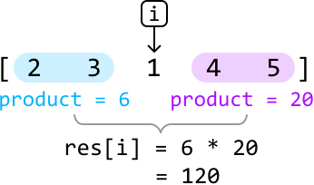

Why is this helpful? If we have precomputed the products of all values to the left and right of each index, we can quickly calculate the output for each index. More specifically, we would need two arrays that contain the left and right products of each index, respectively:

- `left_products`*:* an array where `left_products[i]` is the **product of all values to the left of i**.

- `right_products`: an array where `right_products[i]` is the **product of all values to the right of i**.

To obtain the `left_products` array, we need to keep track of a cumulative product of all elements we encounter as we move from left to right. The value of this product at a specific index should represent the product of all values to its left. The same is true of the `right_products` array, but the cumulative products start from the right. Once we have these arrays, multiplying the left and right product values at each index gives us the output value of that index.

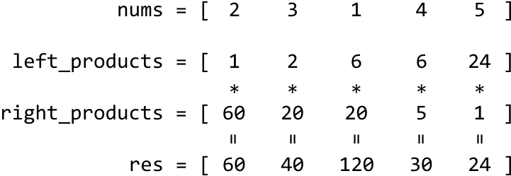

Since the left and right product arrays are formed through cumulative multiplication, this leads us to the concept of prefix products.

**Prefix products**

Prefix products are created in the same way as a prefix sum array, with two key differences:

- Instead of cumulative addition, we use cumulative multiplication.

- We initialize the prefix product array with 1 instead of 0, to avoid multiplying the cumulative products by 0.

Let’s try creating the `left_products` array, initializing it with 1 at index 0:

![Image represents a code snippet showcasing an array named `nums` initialized with the integer values [2, 3, 1, 4, 5].  B](./images/a6eed8a7_image-10-03-4-DZZMAPDB.svg)

---

For each subsequent index in the `left_products` array, we calculate its value by multiplying the running product by the previous value in the `nums` array:

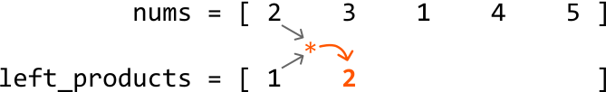


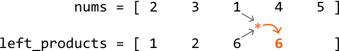

![Image represents a visual depiction of a calculation involving two arrays.  The top array, labeled 'nums = [2 3 1 4 5]',](./images/25d198e2_image-10-03-8-4SC67TAJ.svg)

---

The same can be done for the `right_products` array, but starting on the right and moving leftward:


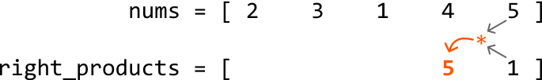

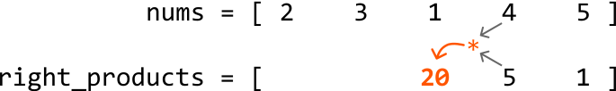

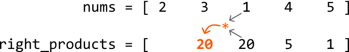

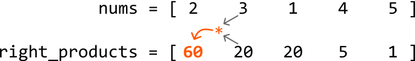

---

Once both arrays are populated, we can compute each value of the output array, where `res[i]` is equal to the product of `left_products[i]` and `right_products[i]`, as previously demonstrated.

**Reducing space**

We have successfully found a solution that doesn't involve division and runs in linear time. However, this solution takes up linear space due to the left and right product arrays. Can we compute the output array in place without taking up extra space?

An important thing to realize is that we don’t necessarily need to create the left and right product arrays to populate the output array. Instead, we can **directly compute and store the left and right products in the output array as we calculate them**.

This can be done in two steps:

1. First, populate the output array (`res`) the same way we populated `left_products`. This prepares the output array to be multiplied by the right products:

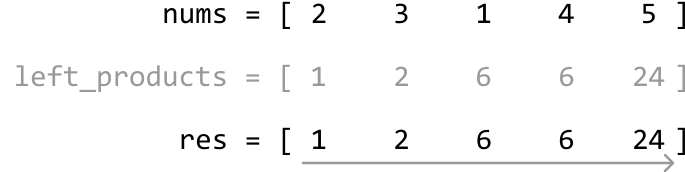

2. Then, instead of populating a `right_products` array, we directly multiply the running product from the right (`right_product`) into the output array:

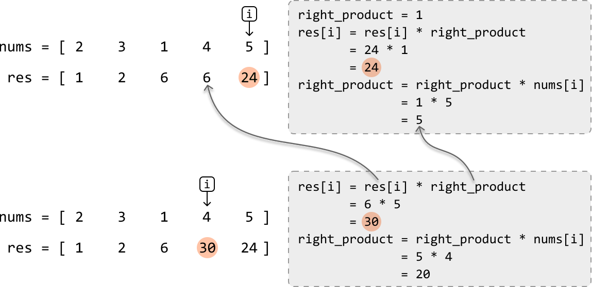


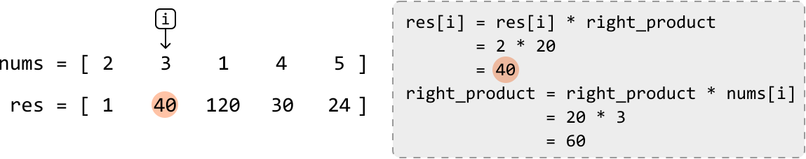

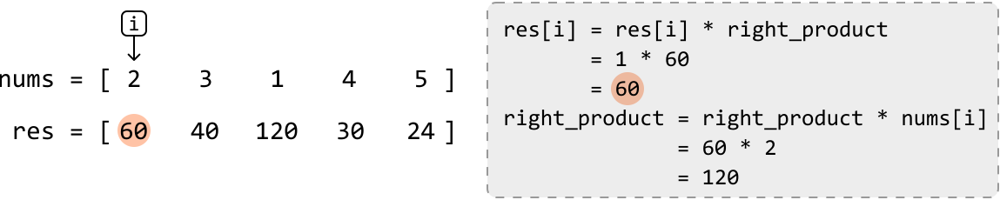

---

## Implementation

```python
from typing import List
    
def product_array_without_current_element(nums: List[int]) -> List[int]:
    n = len(nums)
    res = [1] * n
    # Populate the output with the running left product.
    for i in range(1, n):
        res[i] = res[i - 1] * nums[i - 1]
    # Multiply the output with the running right product, from right to left.
    right_product = 1
    for i in range(n - 1, -1, -1):
        res[i] *= right_product
        right_product *= nums[i]
    return res

```

```javascript
export function product_array_without_current_element(nums) {
  const n = nums.length
  const res = Array(n).fill(1)
  // Populate the output with the running left product.
  for (let i = 1; i < n; i++) {
    res[i] = res[i - 1] * nums[i - 1]
  }
  // Multiply the output with the running right product, from right to left.
  let rightProduct = 1
  for (let i = n - 1; i >= 0; i--) {
    res[i] *= rightProduct
    rightProduct *= nums[i]
  }
  return res
}

```

```java
import java.util.ArrayList;

class Main {
    public static ArrayList<Integer> product_array_without_current_element(ArrayList<Integer> nums) {
        int n = nums.size();
        ArrayList<Integer> res = new ArrayList<>();
        // Initialize result array with 1s
        for (int i = 0; i < n; i++) {
            res.add(1);
        }
        // Populate the output with the running left product.
        for (int i = 1; i < n; i++) {
            res.set(i, res.get(i - 1) * nums.get(i - 1));
        }
        // Multiply the output with the running right product, from right to left.
        int rightProduct = 1;
        for (int i = n - 1; i >= 0; i--) {
            res.set(i, res.get(i) * rightProduct);
            rightProduct *= nums.get(i);
        }
        return res;
    }
}

```

### Complexity Analysis

**Time complexity:** The time complexity of `product_array_without_current_element` is O(n) because we iterate over the `nums` array twice.

**Space complexity:** The space complexity is O(1). The `res` array is not included in the space complexity analysis.