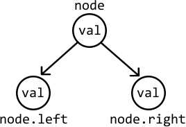
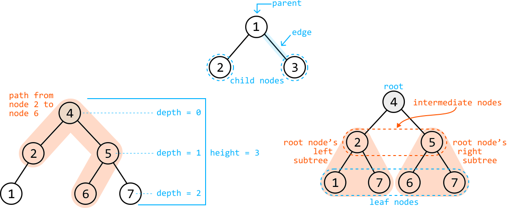
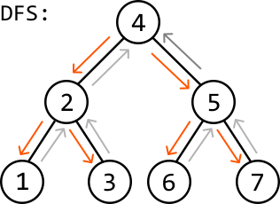
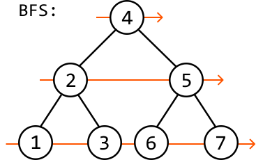
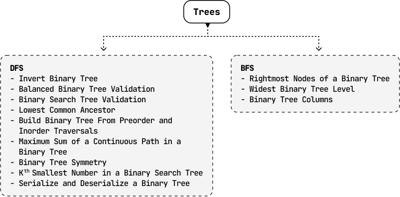

# Introduction to Trees

## Intuition

A tree is a hierarchical data structure composed of nodes, where each node connects to one or more child nodes. Each node in a tree contains the data it stores (`val`) and references to its child nodes. The most common type of tree is a **binary tree**, in which each node connects to up to two children: a left child and a right child.



Below is the implementation of the TreeNode class:

```python
class TreeNode:
    def __init__(self, val):
        self.val = val
        self.left = None
        self.right = None

```

```javascript
class TreeNode {
  constructor(val) {
    this.val = val
    this.left = null
    this.right = null
  }
}

```

```java
class TreeNode {
    int val;
    TreeNode left;
    TreeNode right;

    public TreeNode(int val) {
        this.val = val;
        this.left = null;
        this.right = null;
    }
}

```

**Terminology:**

- Parent: a node with one or more children.

- Child: a node that has a parent.

- Subtree: a tree formed by a node and its descendants.

- Path: a single, continuous sequence of nodes connected by edges.

- Depth: the number of edges from the root to a given node.

**Attributes of a tree:**

- Root: the topmost node of the tree and the only node without a parent.

- Intermediate node: a node with a parent node and at least one child.

- Leaf: a node with no children.

- Edge: the connection between two nodes. Trees usually have directed edges, meaning the edges only point from parent to child.

- Height: the length of the longest path from the root to a leaf.[1](#user-content-fn-1)



In the following discussions, we primarily focus on binary trees.

## Tree Traversals

**Depth-first search (DFS)**

DFS is a method for exploring all nodes of a tree by starting at the root and moving as far down a branch as possible, before backtracking to explore other branches.



DFS is typically implemented recursively, following a structure similar to the code snippet below:

```python
def dfs(node: TreeNode):
    if node is None:
        return
    process(node)       # Process the current node.
    dfs(node.left)      # Traverse the left subtree.
    dfs(node.right)     # Traverse the right subtree.

```

```javascript
function dfs(node) {
  if (node === null) {
    return
  }
  process(node) // Process the current node.
  dfs(node.left) // Traverse the left subtree.
  dfs(node.right) // Traverse the right subtree.
}

```

```java
public void dfs(TreeNode node) {
    if (node == null) {
        return;
    }
    process(node);       // Process the current node.
    dfs(node.left);      // Traverse the left subtree.
    dfs(node.right);     // Traverse the right subtree.
}

```

The above recursive implementation follows the order of preorder traversal. Two other common DFS traversal techniques include inorder traversal and postorder traversal. Here’s how they differ:

| **Preorder traversal** | **Inorder traversal** | **Postorder traversal** |
| --- | --- | --- |
| `process(node)` | `dfs(node.left)` | `dfs(node.left)` |
| `dfs(node.left)` | `process(node)` | `dfs(node.right)` |
| `dfs(node.right)` | `dfs(node.right)` | `process(node)` |

DFS has many use cases and is the most common choice for tree traversal.

- Preorder traversal is the most common type of DFS traversal. It’s also used when we need to process the root node of each subtree before its children.

- Inorder traversal is used when we want to process the nodes of a tree from left to right.

- Postorder traversal is the least frequently used traversal method, but is important when each node’s subtrees must be processed before their root.

The problems in this chapter explore the use cases of DFS in more detail, providing practical examples of when and how to apply these traversal methods.

**Breadth-first search (BFS)**

BFS traverses the nodes of a tree level by level. It processes the nodes at the present level before moving on to nodes at the next depth level.



BFS is typically implemented iteratively using a queue, and the reason for this will become clear as we explore the problems in this chapter. The basic structure of BFS is reflected in the following code snippet:

```python
def bfs(root: TreeNode):
    if root is None:
        return
    queue = deque([root])
    while queue:
        node = queue.popleft()
        process(node)  # Process the current node.
        if node.left:
            queue.append(node.left)  # Add the left child to the queue.
        if node.right:
            queue.append(node.right)  # Add the right child to the queue.

```

```javascript
function bfs(root) {
  if (root === null) {
    return
  }
  const queue = [root]
  while (queue.length > 0) {
    const node = queue.shift() // Remove the node from the front of the queue
    process(node) // Process the current node
    if (node.left) {
      queue.push(node.left) // Add the left child to the queue
    }
    if (node.right) {
      queue.push(node.right) // Add the right child to the queue
    }
  }
}

```

```java
public void bfs(TreeNode root) {
    if (root == null) {
        return;
    }
    Queue<TreeNode> queue = new LinkedList<>();
    queue.offer(root);
    while (!queue.isEmpty()) {
        TreeNode node = queue.poll();
        process(node); // Process the current node.
        if (node.left != null) {
            queue.offer(node.left); // Add the left child to the queue.
        }
        if (node.right != null) {
            queue.offer(node.right); // Add the right child to the queue.
        }
    }
}

```

BFS is commonly used to find the shortest path to a specific destination in a tree, or to process the tree level by level. When it’s important to know the specific level of each node during traversal, we use a variant of BFS called level-order traversal, which is discussed in detail in this chapter.

**Complexity breakdown**

Below, n denotes the number of nodes in the tree, and h denotes the height of the tree.

| Operation | Time | Space | Description |
| --- | --- | --- | --- |
| DFS | O(n) | O(h) | DFS visits each node, resulting in an O(n) time complexity. The space complexity is determined by the maximum depth of the recursive call stack, which can be as deep as the height of the tree, h. In the worst case, the height of the tree is n. In a balanced tree whose height is minimized, the height of the tree is approximately log(n). |
| BFS | O(n) | O(n) | BFS visits each node, resulting in an O(n) time complexity. The space complexity is determined by the maximum number of nodes stored in the queue at any time. In the worst case, the queue can store the entire bottom level of the tree, which could contain around n/2 nodes. |

## Real-world Example

**File systems:** In many operating systems, the file system is organized as a hierarchical tree structure. The root directory is the root of the tree, and every file or folder in the system is a node. Folders can have subfolders or files as child nodes, and this structure allows for efficient organization, navigation, and retrieval of files. When you browse through folders on a computer, you're essentially navigating a tree structure.

## Chapter Outline



Note that some of the problems listed under DFS can be solved using BFS or other traversal algorithms, too. The same applies to the problems under BFS.

## Footnotes

- Some sources may define the height of a tree differently. In this book, we use a definition that makes designing recursive algorithms more intuitive. Here, the height of a tree with just one node is considered 1. [↩](#user-content-fnref-1)