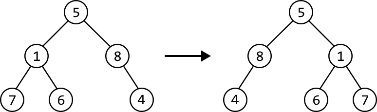
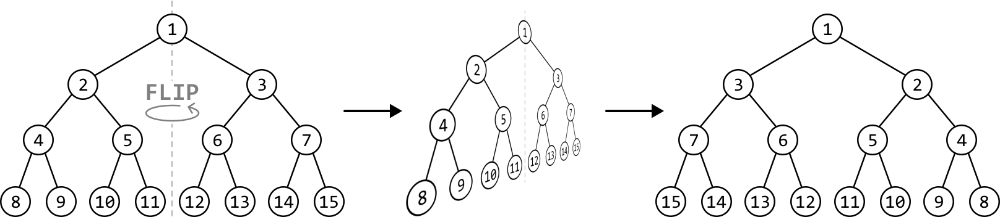
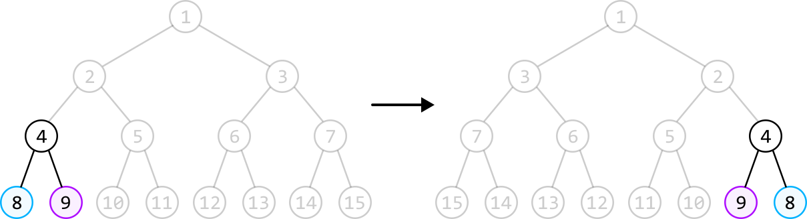
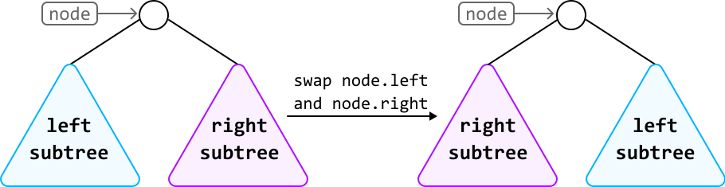
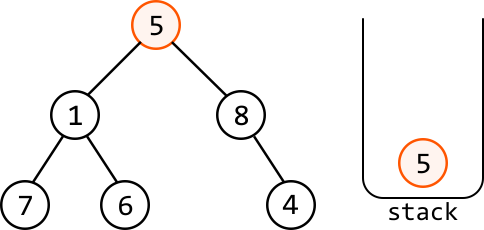
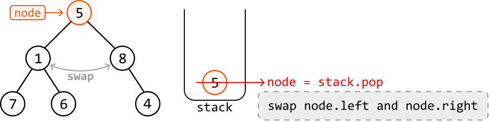
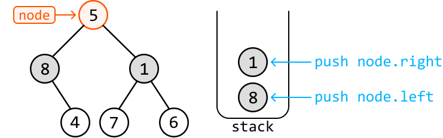
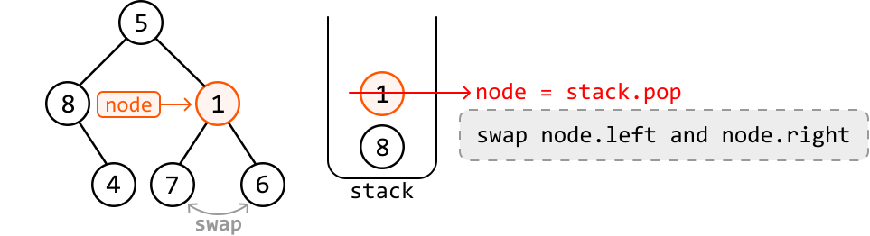
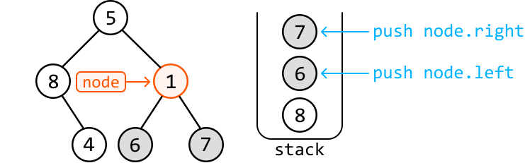

# Invert Binary Tree

**Invert** a binary tree and return its root. When a binary tree is inverted, it becomes the mirror image of itself.

#### Example:



**Intuition - Recursive**

To invert a binary tree is to essentially "flip" the tree along a vertical axis, as visualized below:



To understand how we invert a binary tree algorithmically, let’s focus on how the positions of nodes change after the inversion. For example, pay attention to nodes 8 and 9 in the above tree. After the tree is inverted, we see that they’ve swapped places relative to their parent node:



The key observation is that this swap of the left and right child happens to each node in the binary tree during inversion.

It’s also important to note that when a left child node moves to the right, all nodes under it move as well, and the same happens when a right child moves to the left. In other words, we swap the left subtree and the right subtree of each node. This indicates we’re not just swapping the left and right node values, but the nodes themselves.



Therefore, to invert a binary tree, we **swap the left and right children of every node**. Now, let’s explore a tree traversal algorithm that allows us to do this.

**Depth-first search**

Our strategy is to visit every node in the binary tree and swap its left and right children. There’s no particular order in which we need to visit the nodes. This means we can employ any tree traversal algorithm, as long as every node is visited.

Let’s tackle this problem recursively using DFS. After swapping the left and right children of the root node, we recursively call our invert function on the left and right children to invert their subtrees as well.

## Implementation - Recursive

```python
from ds import TreeNode
    
def invert_binary_tree_recursive(root: TreeNode) -> TreeNode:
    # Base case: If the node is null, there's nothing to invert.
    if not root:
        return None
    # Swap the left and right subtrees of the current node.
    root.left, root.right = root.right, root.left
    # Recursively invert the left and right subtrees.
    invert_binary_tree_recursive(root.left)
    invert_binary_tree_recursive(root.right)
    return root

```

```javascript
import { TreeNode } from './ds.js'

export function invert_binary_tree_recursive(root) {
  // Base case: If the node is null, there's nothing to invert.
  if (!root) {
    return null
  }
  // Swap the left and right subtrees of the current node.
  ;[root.left, root.right] = [root.right, root.left]
  // Recursively invert the left and right subtrees.
  invert_binary_tree_recursive(root.left)
  invert_binary_tree_recursive(root.right)
  return root
}

```

```java
import core.BinaryTree.TreeNode;

public class Main {
    public static TreeNode invert_binary_tree_recursive(TreeNode root) {
        // Base case: If the node is null, there's nothing to invert.
        if (root == null) {
            return null;
        }
        // Swap the left and right subtrees of the current node.
        TreeNode temp = root.left;
        root.left = root.right;
        root.right = temp;
        // Recursively invert the left and right subtrees.
        invert_binary_tree(root.left);
        invert_binary_tree(root.right);
        return root;
    }
}

```

### Complexity Analysis

**Time complexity:** The time complexity of `invert_binary_tree_recursive` is O(n), where n denotes the number of nodes in the tree. This is because the algorithm traverses each node of the binary tree exactly once.

**Space complexity:** The space complexity is O(n) due to the space taken up by the recursive call stack, which can grow as large as the height of the binary tree. The largest possible height of a binary tree is n.

## Intuition - Iterative

As a starting point, we can try developing an iterative DFS solution by using the recursive DFS solution as a reference. In the recursive solution, each time a call is made to the left or right child, it’s added to a recursive call stack.

Ultimately, the recursive call stack is a **stack**, which means we can use a stack to mimic the recursive approach. Let's try using a stack on the following tree. Start by adding the root node to the stack:



---

The top of the stack contains the root node, node 5. Let’s pop it off so we can swap its left and right subtrees:



After the swap, let’s add node 5’s left and right children to the stack so their subtrees can be inverted in future iterations:



---

The node at the top of the stack is now node 1, which we should pop off to swap its left and right subtrees and add its children to the stack:





---

We repeat the above process of iteratively swapping left and right subtrees until the stack is empty, indicating that all nodes have been processed.

```python
from ds import TreeNode
    
def invert_binary_tree_iterative(root: TreeNode) -> TreeNode:
    if not root:
        return None
    stack = [root]
    while stack:
        node = stack.pop()
        # Swap the left and right subtrees of the current node.
        node.left, node.right = node.right, node.left
        # Push the left and right subtrees onto the stack.
        if node.left:
            stack.append(node.left)
        if node.right:
            stack.append(node.right)
    return root

```

```javascript
import { TreeNode } from './ds.js'

export function invert_binary_tree_iterative(root) {
  if (!root) {
    return null
  }
  const stack = [root]
  while (stack.length > 0) {
    const node = stack.pop()
    // Swap the left and right subtrees of the current node.
    ;[node.left, node.right] = [node.right, node.left]
    // Push the left and right subtrees onto the stack.
    if (node.left) {
      stack.push(node.left)
    }
    if (node.right) {
      stack.push(node.right)
    }
  }
  return root
}

```

```java
import core.BinaryTree.TreeNode;
import java.util.Stack;

public class Main {
    public static TreeNode invert_binary_tree_iterative(TreeNode root) {
        if (root == null) {
            return null;
        }
        Stack<TreeNode> stack = new Stack<>();
        stack.push(root);
        while (!stack.isEmpty()) {
            TreeNode node = stack.pop();
            // Swap the left and right subtrees of the current node.
            TreeNode temp = node.left;
            node.left = node.right;
            node.right = temp;
            // Push the left and right subtrees onto the stack.
            if (node.left != null) {
                stack.push(node.left);
            }
            if (node.right != null) {
                stack.push(node.right);
            }
        }
        return root;
    }
}

```

### Complexity Analysis

**Time complexity:** The time complexity of `invert_binary_tree_iterative` is O(n) because it processes each node in the binary tree exactly once.

**Space complexity:** The space complexity is O(n) due to the space taken up by the stack, which can grow as large as the height of the binary tree. The largest possible height of a binary tree is n.

## Interview Tip

*Tip: Use a stack to convert a recursive solution to an iterative one.*

A common follow-up an interviewer may ask is to solve a problem iteratively rather than recursively. This approach is particularly useful when the tree’s height can be large, and we want to avoid potential stack overflow errors. For example, this could happen in Python, where the maximum recursion depth is set to 1000 by default. It's useful to understand that a stack can often be used to transform recursive solutions into iterative ones.