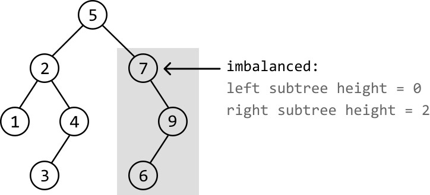
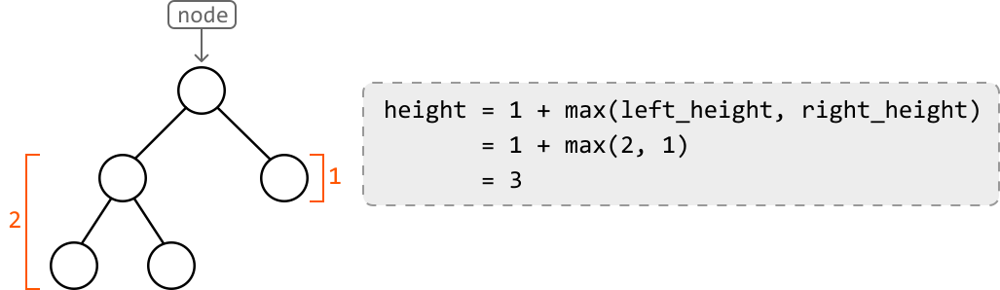
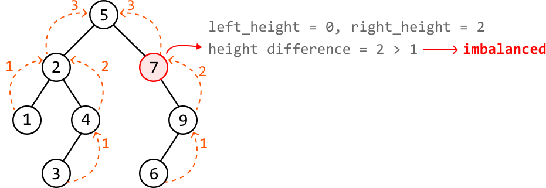
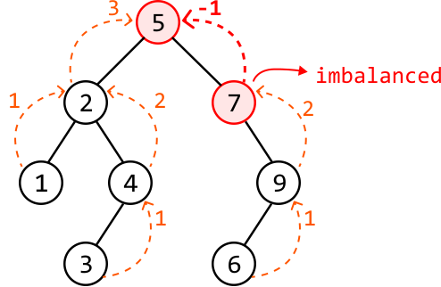

# Balanced Binary Tree Validation

Determine if a binary tree is **height-balanced**, meaning no node's left subtree and right subtree have a height difference greater than 1.

#### Example:



```python
Output: False

```

## Intuition

For a binary tree to be balanced, all its subtrees would need to be balanced too. This implies that the height difference between the left and right subtrees of each node should be at most 1. A difference greater than 1 indicates a height imbalance.

This suggests we need a way to determine the heights of the left and right subtrees at each node in order to evaluate if the subtree rooting from that node is balanced or not.

A key insight is that **the height of a tree is equal to the depth of its deepest subtree, plus 1,** to include the tree’s root node.



The above formula reveals a recursive relationship, where we can recursively determine the heights of the left and right subtrees to calculate the height of the current subtree. The **base case** of the recursion would be returning 0 upon encountering a null node, since they have a height of 0.

The diagram below displays the heights returned from the left and right children of each node, and shows how we determine if a subtree is imbalanced. This highlights the recursive process, where values bubble up from the bottom and make their way up to the root node. At each node, we also evaluate whether that node represents a height-balanced subtree. This reveals an imbalance at node 7:



However, there's a flaw in only returning the subtree’s height at each node: upon detecting node 7 is imbalanced, all we did about this was return its height to its parent node. This consequently means its parent node (node 5) could be mistakenly considered balanced.

An important thing to remember is that **if one subtree is imbalanced, the entire tree is considered imbalanced**. This means node 5 should also be marked as imbalanced. We can fix this by returning -1 upon encountering an imbalanced node, essentially informing parent nodes of this imbalance:



To finalize our answer, we return false if the root node of the binary tree returns -1, and true otherwise.

## Implementation

```python
from ds import TreeNode
    
def balanced_binary_tree_validation(root: TreeNode) -> bool:
    return get_height_imbalance(root) != -1
    
def get_height_imbalance(node: TreeNode) -> int:
    # Base case: if the node is null, its height is 0.
    if not node:
        return 0
    # Recursively get the height of the left and right subtrees. If either subtree
    # is imbalanced, propagate -1 up the tree.
    left_height = get_height_imbalance(node.left)
    right_height = get_height_imbalance(node.right)
    if left_height == -1 or right_height == -1:
        return -1
    # If the current node's subtree is imbalanced (height difference > 1), return -1.
    if abs(left_height - right_height) > 1:
        return -1
    # Return the height of the current subtree.
    return 1 + max(left_height, right_height)

```

```javascript
import { TreeNode } from './ds.js'

export function balanced_binary_tree_validation(root) {
  return getHeightImbalance(root) !== -1
}

function getHeightImbalance(node) {
  // Base case: if the node is null, its height is 0.
  if (!node) {
    return 0
  }
  // Recursively get the height of the left and right subtrees. If either subtree
  // is imbalanced, propagate -1 up the tree.
  const left_height = getHeightImbalance(node.left)
  const right_height = getHeightImbalance(node.right)
  // If either subtree is imbalanced, propagate -1 up the tree.
  if (left_height === -1 || right_height === -1) {
    return -1
  }
  // If the current node's subtree is imbalanced (height difference > 1), return -1.
  if (Math.abs(left_height - right_height) > 1) {
    return -1
  }
  // Return the height of the current subtree.
  return 1 + Math.max(left_height, right_height)
}

```

```java
import core.BinaryTree.TreeNode;

class Main {
    public static Boolean balanced_binary_tree_validation(TreeNode<Integer> root) {
        return get_height_imbalance(root) != -1;
    }

    public static int get_height_imbalance(TreeNode<Integer> node) {
        // Base case: if the node is null, its height is 0.
        if (node == null) {
            return 0;
        }
        // Recursively get the height of the left and right subtrees. If either subtree
        // is imbalanced, propagate -1 up the tree.
        int leftHeight = get_height_imbalance(node.left);
        int rightHeight = get_height_imbalance(node.right);
        if (leftHeight == -1 || rightHeight == -1) {
            return -1;
        }
        // If the current node's subtree is imbalanced (height difference > 1), return -1.
        if (Math.abs(leftHeight - rightHeight) > 1) {
            return -1;
        }
        // Return the height of the current subtree.
        return 1 + Math.max(leftHeight, rightHeight);
    }
}

```

### Complexity Analysis

**Time complexity:** The time complexity of `balanced_binary_tree_validation` is O(n), where n denotes the number of nodes in the tree. This is because it recursively traverses each node of the tree once.

**Space complexity:** The space complexity is O(n) due to the space taken up by the recursive call stack, which can grow as large as the height of the binary tree. The largest possible height of a binary tree is n.