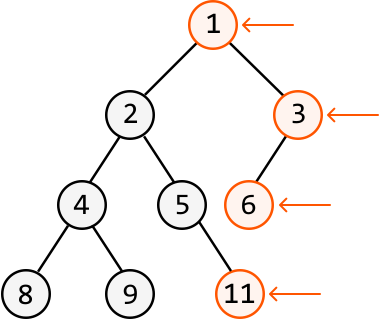
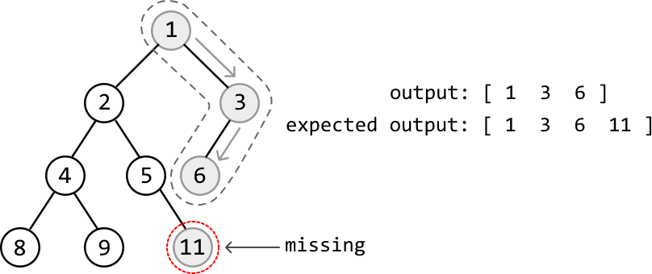
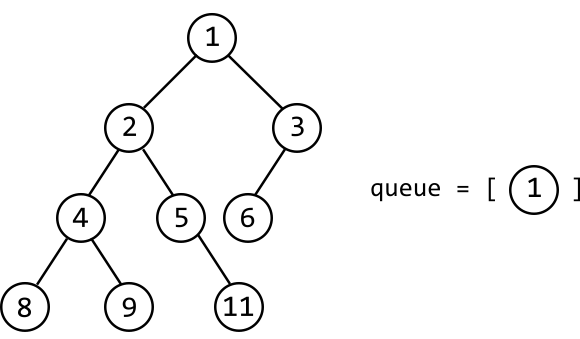
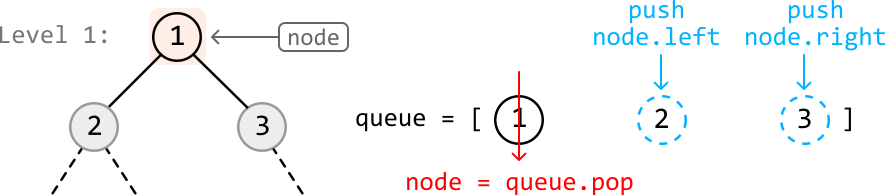
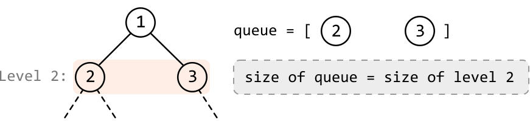
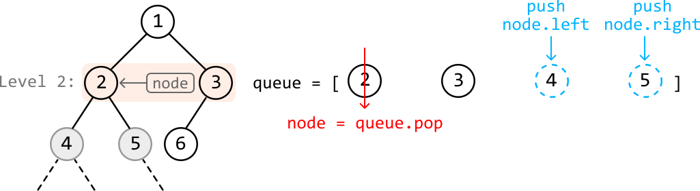
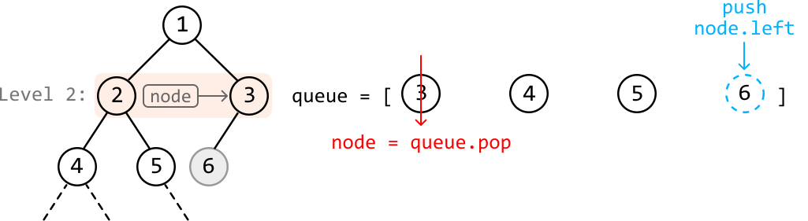
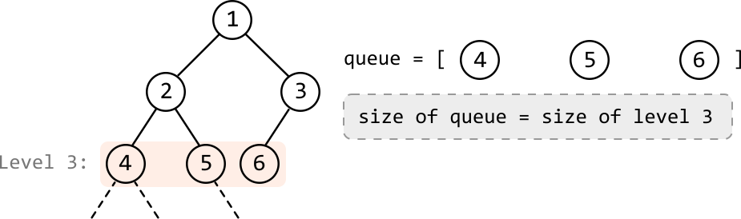
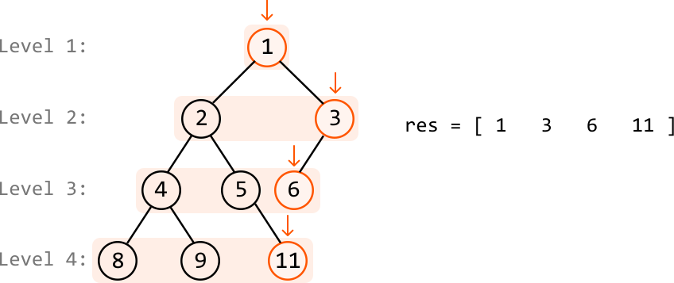

# Rightmost Nodes of a Binary Tree

Return an array containing the values of the rightmost nodes at each level of a binary tree.

#### Example:



```python
Output: [1, 3, 6, 11]

```

## Intuition

At first glance, the solution to this problem might seem as simple as traversing the rightmost branch of the tree until we reach a leaf node. But this doesn’t work. Why not? Consider the tree below. We see that traversing just the rightmost branch results in missing the rightmost node at the fourth level of the tree:



This means we need to consider the entire tree to attain the correct output, and not just a single branch. What would be useful is a way to traverse the tree level by level, allowing us to identify and retrieve the last (i.e., rightmost) node at each level.

We know BFS traverses nodes level by level. However, standard BFS doesn't provide explicit markers for when one level ends and another begins. In contrast, there is a type of BFS traversal that allows us to process one level at a time. This algorithm is called level-order traversal.

**Level-order traversal**

The core idea of level-order traversal is that at any level of the tree, the children of the nodes at that level comprise the next level. This means the children of level 1’s nodes make up level 2, and likewise, the children of level 2’s nodes make up level 3, and so on. To see how this works, consider the binary tree below, with the BFS queue initialized with the tree’s root node:



We know level 1 consists of only the root node. So, the children of the root make up the nodes of the second level. Let’s pop the root node off and then add its children to the queue:



Since we've removed the only level 1 node from the queue and added its children, the queue now only contains the nodes of level 2. Therefore, **the size of the queue currently corresponds to the number of nodes in level 2**.



---

The current queue size is 2, indicating the second level has 2 nodes. So, let’s pop off the next 2 nodes in the queue and add their children to the queue:





After the two nodes on the second level have been popped off the queue, the remaining nodes in the queue represent the third level.



The size of the queue is 3, meaning that to process the third level, we must process the next 3 nodes.

---

To summarize this process, we start by placing the root node in the queue, where the root node represents the first level. Then, begin BFS by entering a while-loop that continues until the queue is empty, meaning all nodes in the tree have been visited. For level-order traversal:

- **Determine the level size**: Collect the current size of the queue (`level_size`) to find the number of nodes in the current level. Initially, the queue will only contain the root node, indicating the first level is of size 1.

- **Process the current level**: For each node at this level, pop it from the queue and add its children to the queue.

After processing all nodes of the current level, the queue contains all the nodes of the next level. Repeat steps 1 and 2 to process the next level. When the queue is empty, all levels have been processed.

Once we know how to traverse the tree level by level, the rightmost node at each level is obtained by collecting that level’s last node:



## Implementation

```python
from ds import TreeNode
    
def rightmost_nodes_of_a_binary_tree(root: TreeNode) -> List[int]:
    if not root:
        return []
    res = []
    queue = deque([root])
    while queue:
        level_size = len(queue)
        # Add all the non-null child nodes of the current level to the queue.
        for i in range(level_size):
            node = queue.popleft()
            if node.left:
                queue.append(node.left)
            if node.right:
                queue.append(node.right)
            # Record this level's last node to the result array.
            if i == level_size - 1:
                res.append(node.val)
    return res

```

```javascript
import { TreeNode } from './ds.js'

export function rightmost_nodes_of_a_binary_tree(root) {
  if (!root) {
    return []
  }
  const res = []
  const queue = [root]
  while (queue.length > 0) {
    const levelSize = queue.length
    // Add all the non-null child nodes of the current level to the queue.
    for (let i = 0; i < levelSize; i++) {
      const node = queue.shift()
      if (node.left) {
        queue.push(node.left)
      }
      if (node.right) {
        queue.push(node.right)
      }
      // Record this level's last node to the result array.
      if (i === levelSize - 1) {
        res.push(node.val)
      }
    }
  }
  return res
}

```

```java
import java.util.ArrayList;
import java.util.LinkedList;
import java.util.Queue;
import core.BinaryTree.TreeNode;

class Main {
    public static ArrayList<Integer> rightmost_nodes_of_a_binary_tree(TreeNode<Integer> root) {
        // If the tree is empty, return an empty list.
        if (root == null) {
            return new ArrayList<>();
        }
        ArrayList<Integer> res = new ArrayList<>();
        Queue<TreeNode<Integer>> queue = new LinkedList<>();
        queue.offer(root);
        while (!queue.isEmpty()) {
            int levelSize = queue.size();
            // Add all the non-null child nodes of the current level to the queue.
            for (int i = 0; i < levelSize; i++) {
                TreeNode<Integer> node = queue.poll();
                if (node.left != null) {
                    queue.offer(node.left);
                }
                if (node.right != null) {
                    queue.offer(node.right);
                }
                // Record this level's last node to the result array.
                if (i == levelSize - 1) {
                    res.add(node.val);
                }
            }
        }
        return res;
    }
}

```

### Complexity Analysis

**Time complexity:** The time complexity of `rightmost_nodes_of_a_binary_tree` is O(n), where n denotes the number of nodes in the tree. This is because we process each node of the tree once during the level-order traversal.

**Space complexity:** The space complexity is O(n) due to the space taken up by the queue. The queue’s size will grow as large as the level with the most nodes. In the worst case, this occurs at the final level when all the last-level nodes are non-null, totaling approximately n/2 nodes. Note that the `res` array does not contribute to the space complexity.