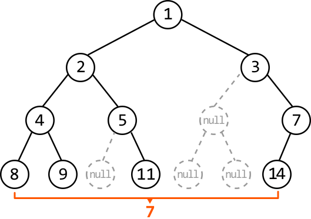
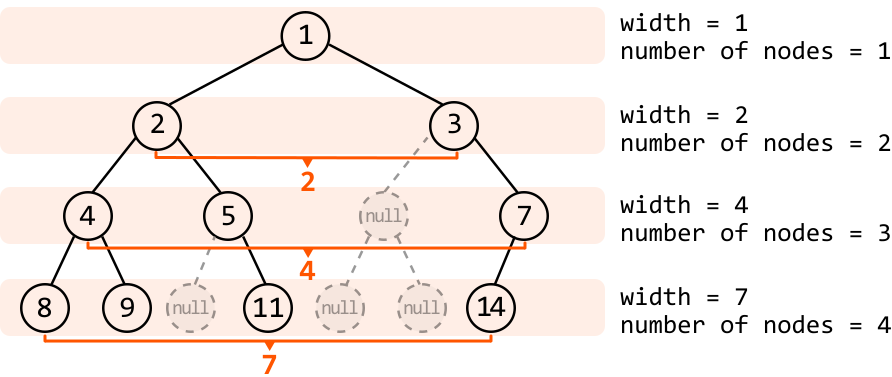
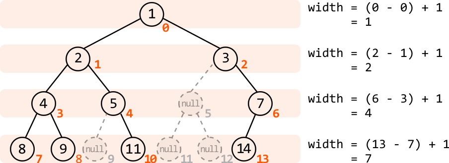

# Widest Binary Tree Level

Return the width of the **widest level** in a binary tree, where the width of a level is defined as the distance between its leftmost and rightmost non-null nodes.

#### Example:



```python
Output: 7

```

## Intuition

Let's first understand how width is defined in a binary tree. An important distinction to make is that the width of a level is not necessarily equivalent to the number of nodes in that level.



As we can see, the null nodes between the leftmost and rightmost nodes are considered in the width, as well.

Think about a data structure in which determining the width or distance between two elements is simple, such as an array, where the distance of two elements can be obtained by the difference between their indexes. If our binary tree also has indexes, it would similarly be possible to obtain the width between two nodes at a level. Let’s explore a method to assign an index to each node.

**Indexing a binary tree**

Below, we see how indexes can be assigned at each node, starting with index 0 for the root node:



These indexes enable us to calculate the width of a level using **`rightmost_index - leftmost_index + 1`**, as shown in the diagram above. Note, the indexes at the null nodes are added only for visualization.

But how can we set up something like this? The key observation is that each node's index can be determined from its parent's index. We can derive the following relationship for any node at index `i`:

- Its **left child** will be at index **`2*i + 1`**.

- Its **right child** will be at index **`2*i + 2`**.

Now, we just need a way to traverse each level of the tree to determine the width at individual levels, allowing us to obtain the width of the widest level in the tree. We can use level-order traversal for this.

**Level-order traversal**

If you're unfamiliar with the level-order traversal algorithm, study the *Rightmost Nodes of a Binary Tree* problem before continuing.

Remember, level-order traversal utilizes a queue to process the binary tree nodes. In this problem, whenever we push a node into this queue, we also push its respective index along with it, to know which index it’s associated with.

The width of a level can be calculated using `rightmost_index - leftmost_index + 1`. To perform this calculation, we need the index of the first (leftmost) and last (rightmost) nodes of that level. Here’s how we obtain these indexes:

- Set `leftmost_index` to the index at the first node of the level.

- Start `rightmost_index` at the same point as `leftmost_index` and update it as we traverse the level. This way, it will eventually be set to the last index after traversing the level.


As we calculate the width at each level, we keep track of the largest width using `max_width`, representing the width of the widest level in the binary tree.

## Implementation

```python
from ds import TreeNode
    
def widest_binary_tree_level(root: TreeNode) -> int:
    if not root:
        return 0
    max_width = 0
    queue = deque([(root, 0)])  # Stores (node, index) pairs.
    while queue:
        level_size = len(queue)
        # Set the 'leftmost_index' to the index of the first node in this level. Start
        # 'rightmost_index' at the same point as 'leftmost_index' and update it as we
        # traverse the level, eventually positioning it at the last node.
        leftmost_index = queue[0][1]
        rightmost_index = leftmost_index
        # Process all nodes at the current level.
        for _ in range(level_size):
            node, i = queue.popleft()
            if node.left:
                queue.append((node.left, 2*i + 1))
            if node.right:
                queue.append((node.right, 2*i + 2))
            rightmost_index = i
        max_width = max(max_width, rightmost_index - leftmost_index + 1)
    return max_width

```

```javascript
import { TreeNode } from './ds.js'

export function widest_binary_tree_level(root) {
  if (!root) {
    return 0
  }
  let maxWidth = 0
  const queue = [[root, 0]] // Stores [node, index] pairs
  while (queue.length > 0) {
    const levelSize = queue.length
    // Set the 'leftmost_index' to the index of the first node in this level. Start
    // 'rightmost_index' at the same point as 'leftmost_index' and update it as we
    // traverse the level, eventually positioning it at the last node.
    let leftmostIndex = queue[0][1]
    let rightmostIndex = leftmostIndex
    // Process all nodes at the current level.
    for (let i = 0; i < levelSize; i++) {
      const [node, index] = queue.shift()
      if (node.left) {
        queue.push([node.left, 2 * index + 1])
      }
      if (node.right) {
        queue.push([node.right, 2 * index + 2])
      }
      rightmostIndex = index
    }
    maxWidth = Math.max(maxWidth, rightmostIndex - leftmostIndex + 1)
  }
  return maxWidth
}

```

```java
import java.util.LinkedList;
import java.util.Queue;
import core.BinaryTree.TreeNode;

class Pair<K, V> {
    public K key;
    public V val;

    public Pair(K key, V val) {
        this.key = key;
        this.val = val;
    }
}

class Main {
    public int widest_binary_tree_level(TreeNode<Integer> root) {
        // If the tree is empty, return width 0.
        if (root == null) {
            return 0;
        }
        int maxWidth = 0;
        // Queue stores (node, index) pairs.
        Queue<Pair<TreeNode<Integer>, Integer>> queue = new LinkedList<>();
        queue.offer(new Pair<>(root, 0));
        while (!queue.isEmpty()) {
            int levelSize = queue.size();
            // Set the 'leftmostIndex' to the index of the first node in this level.
            int leftmostIndex = queue.peek().val;
            int rightmostIndex = leftmostIndex;
            // Process all nodes at the current level.
            for (int i = 0; i < levelSize; i++) {
                Pair<TreeNode<Integer>, Integer> pair = queue.poll();
                TreeNode<Integer> node = pair.key;
                int index = pair.val;

                if (node.left != null) {
                    queue.offer(new Pair<>(node.left, 2 * index + 1));
                }
                if (node.right != null) {
                    queue.offer(new Pair<>(node.right, 2 * index + 2));
                }
                rightmostIndex = index;
            }
            maxWidth = Math.max(maxWidth, rightmostIndex - leftmostIndex + 1);
        }
        return maxWidth;
    }
}

```

### Complexity Analysis

**Time complexity:** The time complexity of `widest_binary_tree_level` is O(n), where n denotes the number of nodes in the tree. This is because we process each node once during level-order traversal.

**Space complexity:** The space complexity is O(n) due to the space taken up by the queue. The queue’s size will grow as large as the level with the most nodes. In the worst case, this occurs at the last level when all the last-level nodes are non-null, totaling approximately n/2 nodes.