# Binary Search Tree Validation

Verify whether a binary tree is a **valid binary search tree** (BST). A BST is a binary tree where each node meets the following criteria:

- A node's **left** subtree contains only nodes of **lower** values than the node's value.

- A node's **right** subtree contains only nodes of **greater** values than the node's value.

#### Example:

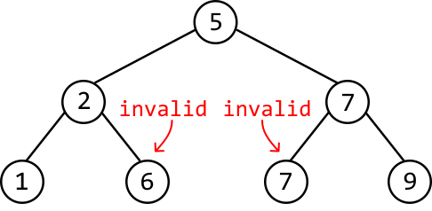

```python
Output: False

```

Explanation: This tree has two violations of the BST criteria:

- Node 5's left subtree contains node 6, and node 6's value is greater than 5.

- Node 7 has a left child with the same value of 7.

## Intuition

A BST maintains a logically sorted order of values by complying with the criteria specified in the problem description. That is, the left subtree of a node with value x must consist of values less than x, and its right subtree must consist of values strictly greater than x.

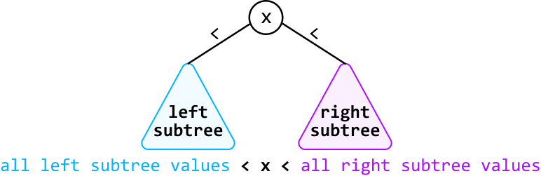

In addition, all nodes in the left and right subtrees of the above diagram must follow these criteria, too.

Since evaluating subtrees is important in determining if a tree is a BST, let’s try a recursive DFS approach to solve this problem.

Consider this example:

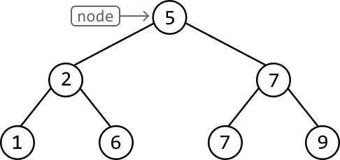

There’s nothing to assess at the root node because it can contain any value. So, let’s have a look at its children. Here’s how we assess these nodes based on the BST rules:

- All nodes to the left of node 5 should be less than 5. So, when we make a recursive call to its left child, we pass in an upper bound of 5.

- All nodes to the right of node 5 should be greater than 5. So, when we make a recursive call to its right child, we pass in a lower bound of 5.

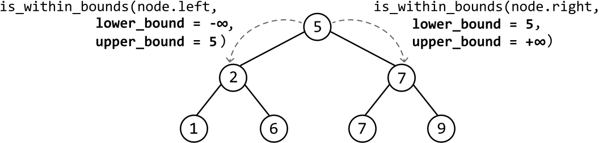

Let’s now consider node 2. It satisfies its specified lower and upper bounds of - and 5, respectively. So, let’s verify its subtrees. Applying the same logic as before, node 2’s left child should have an upper bound of 2, while its right child should have a lower bound of 2.

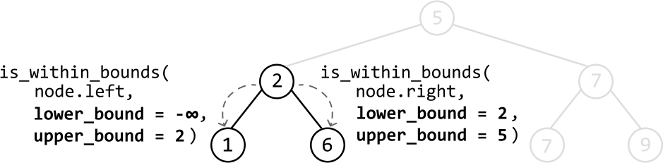

Above, we see that node 6 violates its expected upper bound of 5 (since 6 > 5). This violation indicates we’re dealing with an invalid binary tree. Note, node 6 has an upper bound of 5 because it’s a left descendant of node 5.

We now have a strategy for our DFS function, `is_within_bounds(node, lower_bound, upper_bound)`:

- Check if the `node.val` falls between `lower_bound` and `upper_bound`. If it does, continue to the next step. If not, the tree is an invalid BST: return false.

- Call `is_within_bounds` on the left child with an updated upper bound set to the current node’s value: `is_within_bounds(node.left, `**`lower_bound`**`, `**`node.val`**`)`.

- Call is_within_bounds on the right child with an updated lower bound set to the current node’s value: `is_within_bounds(node.right, `**`node.val`**`, `**`upper_bound`**`)`.

- If both recursive calls return true, then the current node’s subtree is a valid BST: return true.

A minor optimization to make here is to check if the value we get from the recursive call at step 2 is false. If it’s false, we don’t have to perform step 3 and can just return false straight away, as we already know this tree isn’t a BST.

## Implementation

```python
from ds import TreeNode
    
def binary_search_tree_validation(root: TreeNode) -> bool:
    # Start validation at the root node. The root node can contain any value, so set
    # the initial lower and upper bounds to -infinity and +infinity, respectively.
    return is_within_bounds(root, float('-inf'), float('inf'))
    
def is_within_bounds(node: TreeNode, lower_bound: int, upper_bound: int) -> bool:
    # Base case: if the node is null, it satisfies the BST condition.
    if not node:
        return True
    # If the current node's value is not within the valid bounds, this tree is not a
    # valid BST.
    if not lower_bound < node.val < upper_bound:
        return False
    # If the left subtree isn't a BST, this tree isn't a BST.
    if not is_within_bounds(node.left, lower_bound, node.val):
        return False
    # Otherwise, return true if the right subtree is also a BST.
    return is_within_bounds(node.right, node.val, upper_bound)

```

```javascript
import { TreeNode } from './ds.js'

export function binary_search_tree_validation(root) {
  // Start validation at the root node. The root node can contain any value, so set
  // the initial lower and upper bounds to -infinity and +infinity, respectively.
  return isWithinBounds(root, -Infinity, Infinity)
}

function isWithinBounds(node, lowerBound, upperBound) {
  // Base case: if the node is null, it satisfies the BST condition.
  if (!node) {
    return true
  }
  // If the current node's value is not within the valid bounds, this tree is not a
  // valid BST.
  if (node.val <= lowerBound || node.val >= upperBound) {
    return false
  }
  // If the left subtree isn't a BST, this tree isn't a BST.
  if (!isWithinBounds(node.left, lowerBound, node.val)) {
    return false
  }
  // Otherwise, return true if the right subtree is also a BST.
  return isWithinBounds(node.right, node.val, upperBound)
}

```

```java
import core.BinaryTree.TreeNode;

class Main {
    public static boolean binary_search_tree_validation(TreeNode<Integer> root) {
        // Start validation at the root node. The root node can contain any value, so set
        // the initial lower and upper bounds to -infinity and +infinity, respectively.
        return is_within_bounds(root, Long.MIN_VALUE, Long.MAX_VALUE);
    }

    public static boolean is_within_bounds(TreeNode<Integer> node, long lower_bound, long upper_bound) {
        // Base case: if the node is null, it satisfies the BST condition.
        if (node == null) {
            return true;
        }
        // If the current node's value is not within the valid bounds, this tree is not a
        // valid BST.
        if (!(lower_bound < node.val && node.val < upper_bound)) {
            return false;
        }
        // If the left subtree isn't a BST, this tree isn't a BST.
        if (!is_within_bounds(node.left, lower_bound, node.val)) {
            return false;
        }
        // Otherwise, return true if the right subtree is also a BST.
        return is_within_bounds(node.right, node.val, upper_bound);
    }
}

```

### Complexity Analysis

**Time complexity:** The time complexity of `binary_search_tree_validation` is O(n), where n denotes the number of nodes in the tree. This is because we process each node recursively at most once.

**Space complexity:** The space complexity is O(n) due to the space taken up by the recursive call stack, which can grow as large as the height of the binary tree. The largest possible height of a binary tree is n.

## Detailed Recursive Demonstration

You may be curious why recursion works for problems like this. When we make a recursive DFS call in the middle of the code, how is the program able to return to this code and continue running the rest of it, after this recursive call finishes? This problem provides an excellent opportunity to demonstrate how this is possible.

The answer is that recursion makes use of a **recursive call stack** to manage each instance of a recursive function call. To illustrate this, we'll revisit the binary tree example discussed earlier, stepping through the recursive calls for the first few nodes. We'll also display the recursive call stack to help track the state of each call more clearly.

---

The first DFS call is made to the root node, which is given a lower and upper bound of -`∞` and +`∞`, respectively:

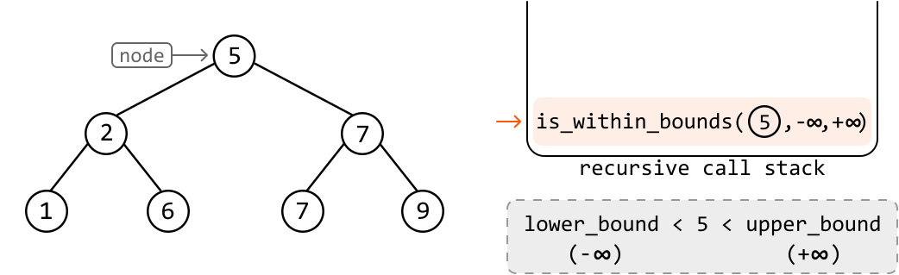

We see that node 5 satisfies its specified lower and upper bounds.

---

At each node, after we confirm that its value falls within its expected lower and upper bounds, we make a recursive call to its left child before any right children are processed:

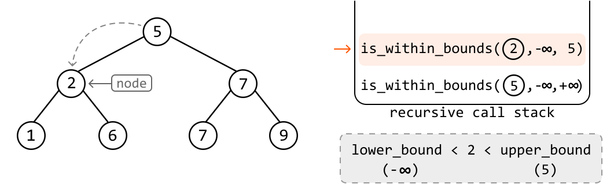

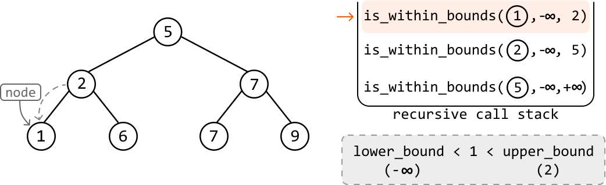

---

After processing node 1, which has no children, recursion naturally progresses back to the recursive call to node 2, which is now at the top of the stack:

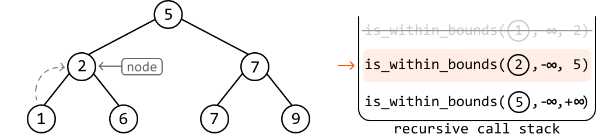

Continuing from where we left off at this instance, it now processes its right child by making a recursive call to it:

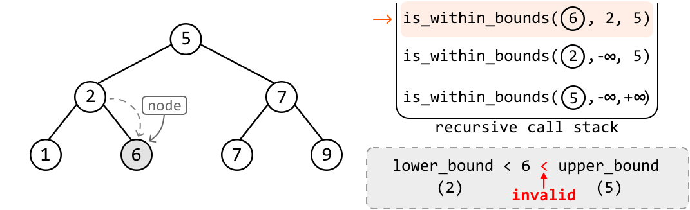

Once we reach node 6, the algorithm notices that its value violates its expected upper bound. As such, it returns false.

---

In this DFS solution, the recursion starts at the root node, but values start being returned from the leaf nodes and bubble upwards to their parent nodes. Below is a diagram showing how the boolean result at each node moves up from the leaf nodes to the root:

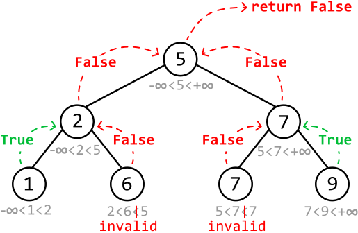

Note that nodes 5, 2, and 7 return false because, while their values fall within their bounds, at least one node in their subtrees does not.