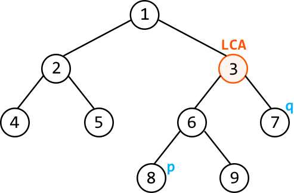
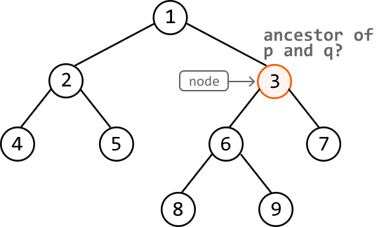
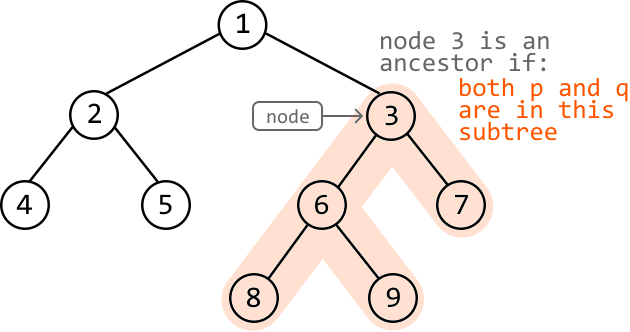
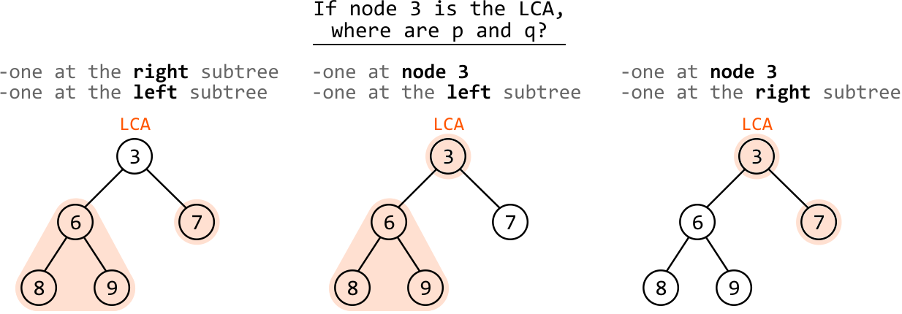
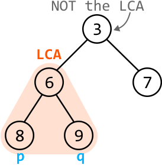
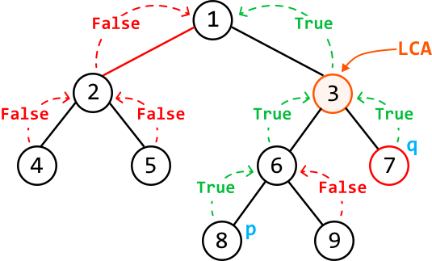

# Lowest Common Ancestor

Return the lowest common ancestor (LCA) of two nodes, `p` and `q`, in a binary tree. The LCA is defined as the **lowest node that has both `p` and `q` as descendants**. A node can be considered an ancestor of itself.

#### Example:



#### Constraints:

- The tree contains at least two nodes.

- All node values are unique.

- `p` and `q` represent different nodes in the tree.

## Intuition

One strategy to solve this problem is to traverse each node in the tree and evaluate whether the current node at any point is the LCA of p and q. To make this evaluation, it’s crucial to know the conditions a node needs to meet to be the LCA.

Let’s start by discussing where p or q would need to be for the current node to be at least an ancestor of both.

**Identifying when the current node is an ancestor of p and q**

Consider the following binary tree. Let's explore where p and q would need to be for node 3 to be an ancestor.



Node 3 is only an ancestor of p and q when both nodes are in node 3’s subtree. If they were anywhere else, they would not be descendants of node 3.



Now, let’s examine the conditions in which a node is the *lowest* common ancestor of p and q.

**Identifying when the current node is the LCA of p and q**

Let’s identify where in the subtree p and q should be to qualify node 3 as the *lowest* ancestor of them both.



As we can see above, there are three possible cases where node 3 is the LCA. This is because in each case, there isn’t a node lower than node 3 that contains both p and q as descendants, making node 3 the LCA.

Note that if both p and q were in just one of node 3’s subtrees (e.g., the left subtree), node 3 would not be the LCA because there would be a node lower in the left subtree that’s an ancestor of both p and q:



What can we derive from these observations? In the three cases where the current node is the LCA, **p and q were found in exactly two of the following three locations**:

- The current node itself.

- The current node’s left subtree.

- The current node’s right subtree.

This indicates that by traversing the tree and checking if p and q are present in two of these locations for each node, we can effectively identify the LCA.

**Depth-first search**

Recursive DFS is well-suited for traversal in this problem, as it enables us to recursively check each node’s left and right subtrees to determine if they contain p or q.

In the implementation, we can assess the existence of p and q in the three locations previously mentioned, by attaining the following three boolean variables at each node:

- `node_is_p_or_q = (node == p or node == q)`

- `left_contains_p_or_q = dfs(node.left)`

- `right_contains_p_or_q = dfs(node.right)`

Again, two of these variables need to be true for the current node to be the LCA.

Return statement

Whenever we make a recursive DFS call, such as `dfs(node.left)`, we expect that call to return true if the subtree rooting from `node.left` contains p or q. This means the return statement of our DFS function should return true if either p or q exists anywhere in the current subtree.

To do this, we **return true if any of the above three variables are true**, as this would indicate either p or q is somewhere in the current subtree.

The diagram below shows how the boolean values returned from each node's left and right subtrees help to identify the LCA:



## Implementation

Note, this implementation uses a global variable because it leads to a more readable solution. However, it's important to confirm with your interviewer that global variables are acceptable. If not, you may need to adjust the solution to avoid using them, such as passing the variable as an argument, or finding an alternative approach.

```python
from ds import TreeNode
    
def lowest_common_ancestor(root: TreeNode, p: TreeNode, q: TreeNode) -> TreeNode:
    dfs(root, p, q)
    return lca
    
def dfs(node: TreeNode, p: TreeNode, q: TreeNode) -> bool:
    global lca
    # Base case: a null node is neither p nor q.
    if not node:
        return False
    node_is_p_or_q = node == p or node == q
    # Recursively determine if the left and right subtrees contain 'p' or 'q'.
    left_contains_p_or_q = dfs(node.left, p, q)
    right_contains_p_or_q = dfs(node.right, p, q)
    # If two of the above three variables are true, the current node is the LCA.
    if node_is_p_or_q + left_contains_p_or_q + right_contains_p_or_q == 2:
        lca = node
    # Return true if the current subtree contains 'p' or 'q'.
    return node_is_p_or_q or left_contains_p_or_q or right_contains_p_or_q

```

```javascript
import { TreeNode } from './ds.js'

let lca = null

export function lowest_common_ancestor(root, p, q) {
  dfs(root, p, q)
  return lca
}

function dfs(node, p, q) {
  // Base case: a null node is neither p nor q.
  if (!node) return false
  const nodeIsPOrQ = node === p || node === q
  // Recursively determine if the left and right subtrees contain 'p' or 'q'.
  const leftContainsPOrQ = dfs(node.left, p, q)
  const rightContainsPOrQ = dfs(node.right, p, q)
  // If two of the above three variables are true, the current node is the LCA.
  if (
    (nodeIsPOrQ ? 1 : 0) +
      (leftContainsPOrQ ? 1 : 0) +
      (rightContainsPOrQ ? 1 : 0) ===
    2
  ) {
    lca = node
  }
  // Return true if the current subtree contains either 'p' or 'q'.
  return nodeIsPOrQ || leftContainsPOrQ || rightContainsPOrQ
}

```

```java
import core.BinaryTree.TreeNode;

class UserCode {
    private static TreeNode<Integer> lca = null;

    public static TreeNode<Integer> lowestCommonAncestor(TreeNode<Integer> root, TreeNode<Integer> p, TreeNode<Integer> q) {
        dfs(root, p, q);
        return lca;
    }

    private static boolean dfs(TreeNode<Integer> node, TreeNode<Integer> p, TreeNode<Integer> q) {
        // Base case: a null node is neither p nor q.
        if (node == null) {
            return false;
        }
        boolean nodeIsPOrQ = (node == p || node == q);
        // Recursively determine if the left and right subtrees contain 'p' or 'q'.
        boolean leftContainsPOrQ = dfs(node.left, p, q);
        boolean rightContainsPOrQ = dfs(node.right, p, q);
        // If two of the above three variables are true, the current node is the LCA.
        if ((nodeIsPOrQ ? 1 : 0) + (leftContainsPOrQ ? 1 : 0) + (rightContainsPOrQ ? 1 : 0) == 2) {
            lca = node;
        }
        // Return true if the current subtree contains 'p' or 'q'.
        return nodeIsPOrQ || leftContainsPOrQ || rightContainsPOrQ;
    }
}

```

### Complexity Analysis

**Time complexity:** The time complexity of `lowest_common_ancestor` is O(n), where n denotes the number of nodes in the tree. This is because the algorithm traverses each node of the tree once.

**Space complexity:** The space complexity is O(n) due to the space taken up by the recursive call stack, which can grow as large as the height of the binary tree. The largest possible height of a binary tree is n.