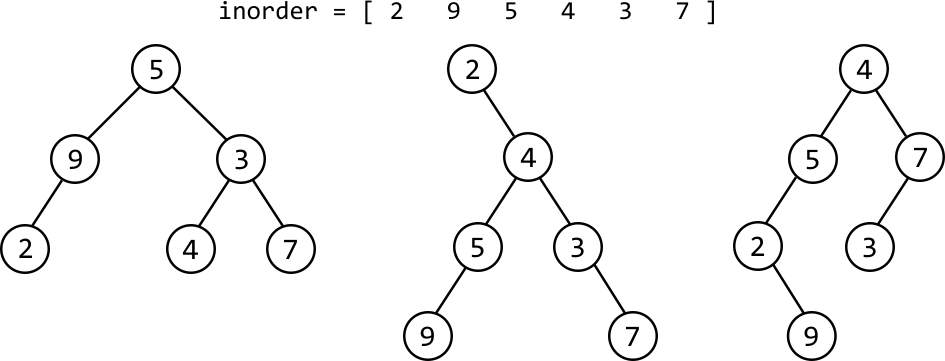
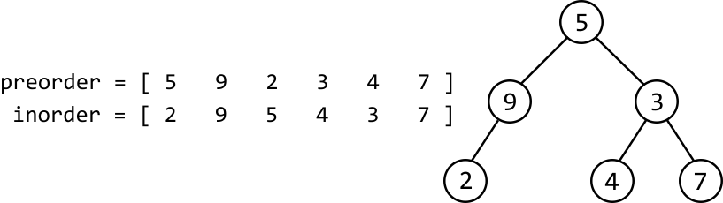
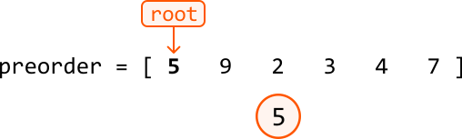
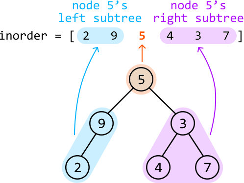
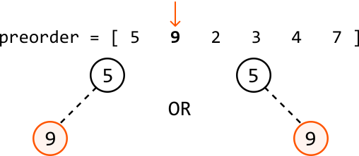
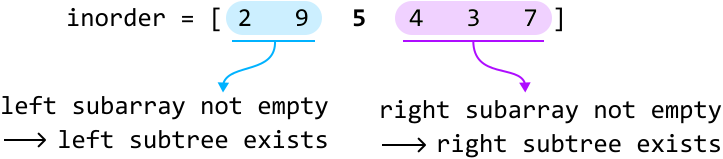
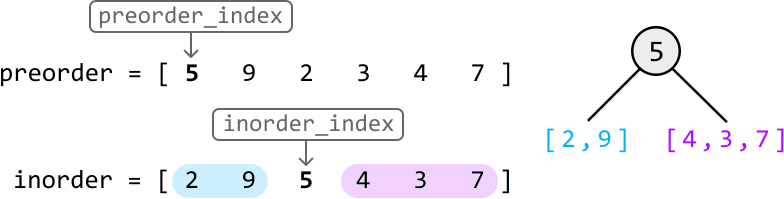
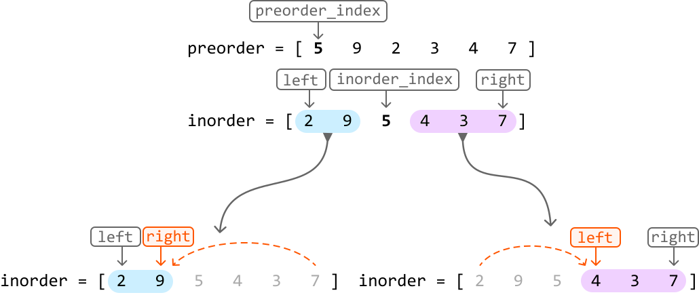

# Build Binary Tree From Preorder and Inorder Traversals

Construct a binary tree using arrays of values obtained after a **preorder** traversal and an **inorder** traversal of the tree.

#### Example:


```python
Input: preorder = [5, 9, 2, 3, 4, 7], inorder = [2, 9, 5, 4, 3, 7]

```

#### Constraints:

- The tree consists of unique values.

## Intuition

The first question that might come to mind is why both the preorder and inorder arrays are needed to solve this problem. Can’t we just use one of them? The reason is that each individual traversal order could represent multiple possible trees. For example, below are some trees that correspond to the following inorder traversal:



If one traversal array isn’t enough, it might be possible to build the tree using an additional traversal array as a reference point, to help identify how each node should be placed.

**The root node**

Whatever our approach, we initially need a way to access the root node since the root node is necessary to construct the rest of the tree.

To identify where the root node is, let’s first remind ourselves how nodes are processed during each traversal algorithm.

| Preorder traversal | Inorder traversal |
| --- | --- |
| 1. Process the current node | 1. Process the left subtree |
| 2. Process the left subtree | 2. Process the current node |
| 3. Process the right subtree | 3. Process the right subtree |

 

Notice that during preorder traversal, the current node is processed before its subtrees. From this, we can infer that preorder traversal processes the root node first, meaning **the first value in the preorder array is the value of the root node.**

With this established, let’s find a method to build the rest of the tree.

**Building the tree**

Consider the preorder and inorder traversal arrays below and the corresponding binary tree:



As mentioned above, we know the first value of the preorder array, 5, is the value of the root node.



Now the question is, what node should be placed next? The preorder array alone isn’t enough to determine this. So, we should consult the inorder array.

Inorder traversal first visits a node’s left subtree before processing the node itself, so we can deduce that all values in the inorder array to the left of 5 are part of its left subtree. Similarly, all values to the right of 5 in the inorder array belong to its right subtree:



Now what? With the root node placed, we have two subtrees to build: node 5’s left and right subtrees.

If we build the tree starting with the already-created root node, followed by the left subtree and then the right subtree, we’re effectively **building the tree using preorder traversal**. This is useful because we happen to have an array of values from a preorder traversal, which means we know the exact order in which the nodes should be created.

> 
> 
> As we’re building the tree using preorder traversal, the next node to be created at any point will be the next value in the preorder array. This means we can iterate through the preorder array to place each new node.
> 
> 

Based on this, we know the next node to be placed will have a value of 9. But how do we know if node 9 is a left child or a right child of 5?



This is where the inorder array comes in, as it helps us determine the structure of the tree. Consider the left subtree:

- When we want to build the left subtree of a node, we look at the part of the inorder array that corresponds to the left subtree. In our example, this is the subarray [2, 9].

- If this subarray is not empty, we proceed to build the left subtree, starting with node 9.

- If this subarray is empty, it means there is no left subtree, so the current node’s left child is null.



The same logic applies to the right subtree: we only build it if its corresponding inorder subarray isn’t empty.

Now, let’s devise a strategy for our algorithm. To utilize the two traversal arrays, we can assign a pointer to each:

- A **`preorder_index`** points to the value of the current subtree’s root node. Once this node is created, increment `preorder_index` so it points to the value of the next node to be created.

- An **`inorder_index`** is used to determine the position of the same value in the inorder array. We can find the index of this value by searching through the inorder array.



At each recursive call, once these indexes are obtained, we:

- Create the current node using the value pointed at by `preorder_index`.

- Increment `preorder_index` so it points to the value of the next node to be created.

- Make a recursive call to build the current node’s left and right subtrees:
  
  
  
  - Pass in the subarray `inorder[0, inorder_index - 1]` to build the left subtree.
  
  - Pass in the subarray `inorder[inorder_index + 1, n - 1]` to build the right subtree.

**Optimization - left and right pointers**

One inefficiency of the above approach is that we extract entire subarrays out of the inorder array whenever we make a recursive call, which takes O(n) time each time we do this, where n denotes the length of each input array. A more efficient approach is to **define the range of each inorder subarray using left and right pointers**. Specifically:

- The left subtree contains the values in the range **`[left, inorder_index - 1]`**.

- The right subtree contains the values in the range **`[inorder_index + 1, right]`**.



This allows us to define subarrays by just moving pointers, as opposed to creating completely new subarrays.

**Optimization - hash map**

At each node, it’s necessary to set `inorder_index` to the position of the same value pointed at by `preorder_index`. Performing a linear search for this value would take O(n) time for each node. Instead, we can use a **hash map** to store the inorder array values and their indexes, allowing us to retrieve any value's index from the inorder array in O(1) time.

## Implementation

```python
from ds import TreeNode
from typing import List
    
preorder_index = 0
inorder_indexes_map = {}
    
def build_binary_tree(preorder: List[int], inorder: List[int]) -> TreeNode:
    global inorder_indexes_map
    # Populate the hash map with the inorder values and their indexes.
    for i, val in enumerate(inorder):
        inorder_indexes_map[val] = i
    # Build the tree and return its root node.
    return build_subtree(0, len(inorder) - 1, preorder, inorder)
    
def build_subtree(left, right, preorder, inorder):
    global preorder_index, inorder_indexes_map
    # Base case: if no elements are in this range, return None.
    if left > right:
        return None
    val = preorder[preorder_index]
    # Set 'inorder_index' to the index of the same value pointed at by
    # 'preorder_index'.
    inorder_index = inorder_indexes_map[val]
    node = TreeNode(val)
    # Advance 'preorder_index' so it points to the value of the next node to be
    # created.
    preorder_index += 1
    # Build the left and right subtrees and connect them to the current node.
    node.left = build_subtree(left, inorder_index - 1, preorder, inorder)
    node.right = build_subtree(inorder_index + 1, right, preorder, inorder)
    return node

```

```javascript
import { TreeNode } from './ds.js'

let preorderIndex = 0
let inorderIndexesMap = new Map()

export function build_binary_tree(preorder, inorder) {
  preorderIndex = 0
  inorderIndexesMap.clear()
  // Populate the map with inorder values and their indexes.
  for (let i = 0; i < inorder.length; i++) {
    inorderIndexesMap.set(inorder[i], i)
  }
  // Build the tree and return its root node.
  return buildSubtree(0, inorder.length - 1, preorder, inorder)
}

export function buildSubtree(left, right, preorder, inorder) {
  // Base case: if no elements are in this range, return null.
  if (left > right) {
    return null
  }
  const val = preorder[preorderIndex]
  // Set 'inorder_index' to the index of the same value pointed at by
  // 'preorder_index'.
  const inorderIndex = inorderIndexesMap.get(val)
  const node = new TreeNode(val)
  // Advance preorderIndex to point to the next node to be created.
  preorderIndex++
  // Build the left and right subtrees and connect them to the current node.
  node.left = buildSubtree(left, inorderIndex - 1, preorder, inorder)
  node.right = buildSubtree(inorderIndex + 1, right, preorder, inorder)
  return node
}

```

```java
import core.BinaryTree.TreeNode;
import java.util.ArrayList;
import java.util.HashMap;
import java.util.Map;

public class Main {
    private int preorderIndex = 0;
    private Map<Integer, Integer> inorderIndexesMap = new HashMap<>();

    public TreeNode<Integer> build_binary_tree(ArrayList<Integer> preorder, ArrayList<Integer> inorder) {
        // Populate the hash map with the inorder values and their indexes.
        for (int i = 0; i < inorder.size(); i++) {
            inorderIndexesMap.put(inorder.get(i), i);
        }
        // Build the tree and return its root node.
        return build_subtree(0, inorder.size() - 1, preorder);
    }

    private TreeNode<Integer> build_subtree(int left, int right, ArrayList<Integer> preorder) {
        // Base case: if no elements are in this range, return null.
        if (left > right) {
            return null;
        }
        int val = preorder.get(preorderIndex);
        // Set 'inorderIndex' to the index of the same value pointed at by 'preorderIndex'.
        int inorderIndex = inorderIndexesMap.get(val);
        TreeNode<Integer> node = new TreeNode<>(val);
        // Advance 'preorderIndex' so it points to the value of the next node to be created.
        preorderIndex++;
        // Build the left and right subtrees and connect them to the current node.
        node.left = build_subtree(left, inorderIndex - 1, preorder);
        node.right = build_subtree(inorderIndex + 1, right, preorder);
        return node;
    }
}

```

### Complexity Analysis

**Time complexity:** The time complexity of `build_binary_tree` is O(n), as it makes one call to the `build_subtree` function, which recursively traverses each element in the `preorder` and `inorder` arrays once, resulting in an O(n) runtime.

**Space complexity:** The space complexity is O(n) due to the space taken up by the recursive call stack, which can grow as large as the height of the binary tree. The largest possible height of a binary tree is n. The hash map `inorder_indexes_map` also takes up O(n) space.