# Maximum Sum of a Continuous Path in a Binary Tree

Return the **maximum sum of a continuous path** in a binary tree. A path is defined by the following characteristics:

- Consists of a sequence of nodes that can begin and end at any node in the tree.

- Each consecutive pair of nodes in the sequence is connected by an edge.

- The path must be a **single continuous sequence** of nodes that doesn't split into multiple paths.

#### Example:

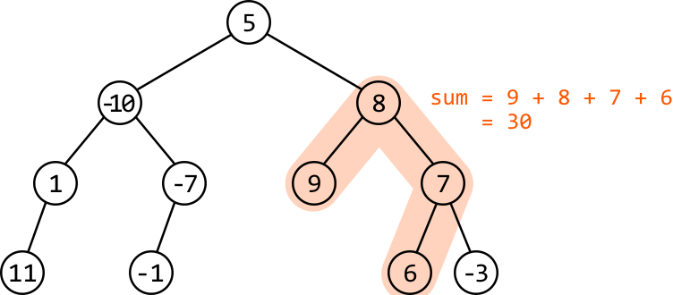

```python
Output: 30

```

#### Constraints:

- The tree contains at least one node.

## Intuition

Let’s first understand what a path is in a binary tree. An important thing to note is that all paths have a root node. Consider the following binary tree:

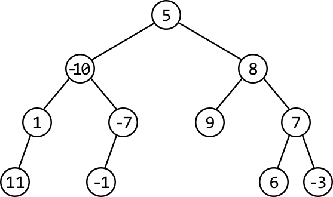

Every path that exists in this tree has a corresponding root node, as shown in the three examples below:

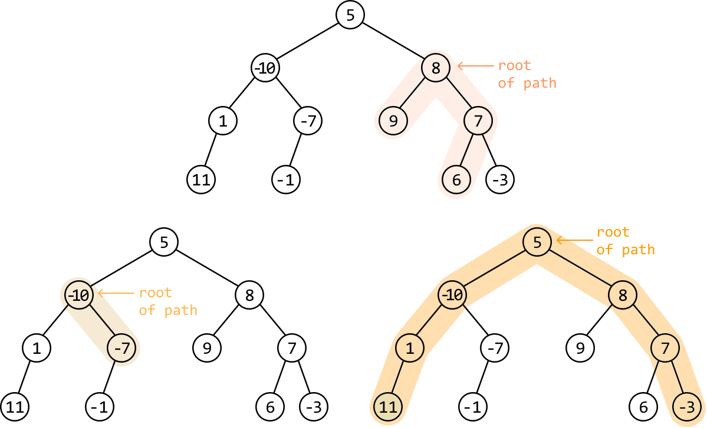

Inversely, this means that every node in the tree is the root of some path(s). For example, node 7 in the tree below is the root of four paths. The largest sum rooting from node 7 is 13:

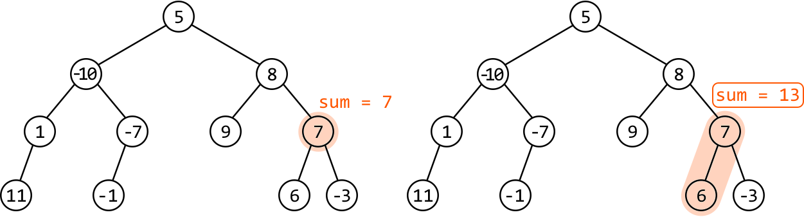

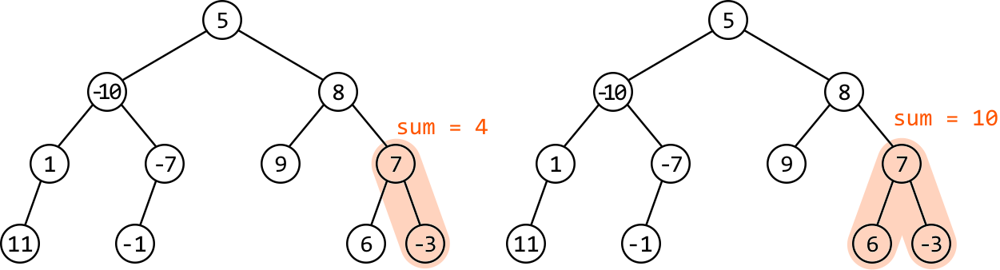

So, to find the maximum path sum, we calculate the maximum sum rooting from each node and return the largest of these sums.

**Calculating the maximum path sum at any node**

Let’s try adopting a recursive strategy for this. Consider the root node of our example. The maximum sum of a path rooting from node 5 involves the maximum gain we can attain from its left subtree and its right subtree.

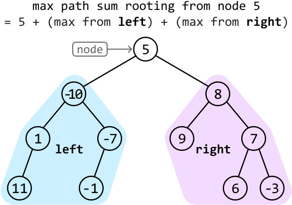

Which sums do we expect node 5’s left and right subtrees to return? Consider what happens when the maximum path sums of these subtrees are returned to node 5:

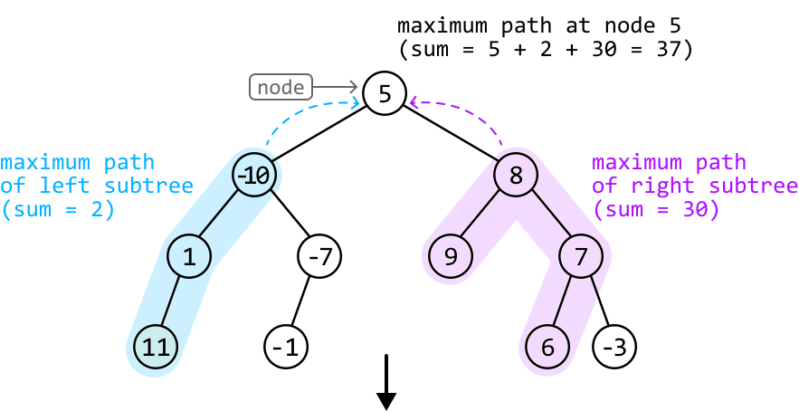

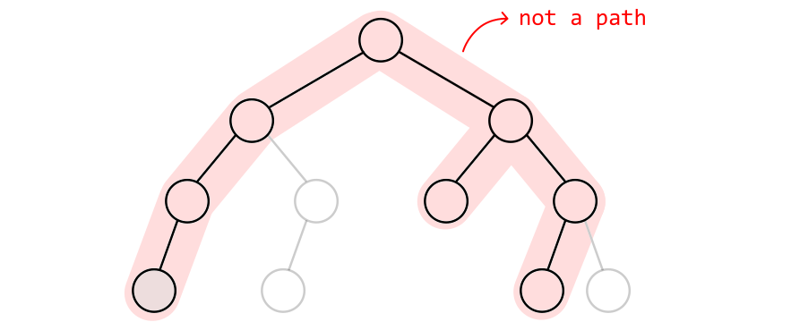

As we can see, when we received the maximum path sum from a recursive call made to node 8, we received the sum of a path with multiple branches. This results in an invalid path formed at node 5.

Below, we can see what we actually want. The sums of the two paths returned here correctly give us the maximum path sum rooting from node 5:

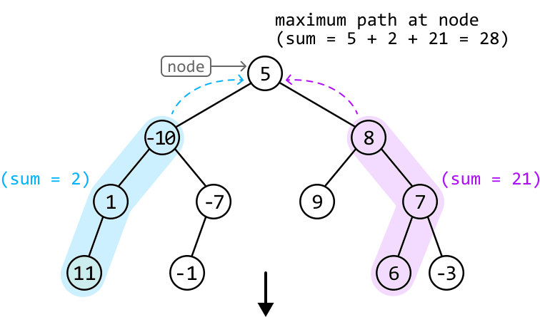

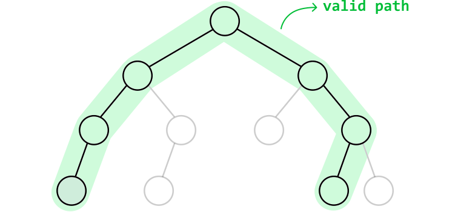

The difference between the valid and invalid paths above lies in the type of path returned by the recursive call to node 8. We can see this difference clearly in the diagram below.

- In the left diagram below, an invalid path is formed at node 5 because at node 8, we return node 8’s maximum path sum, which is from a path with two branches.

- In the right diagram, a valid path is formed at node 5 because we return the largest sum of a path with a single branch.

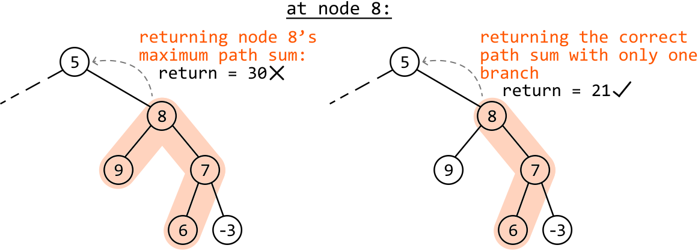

This observation highlights that we can’t just return the maximum path sum of a node. So, let’s have a closer look at which path sum we should return, instead.

**Identifying the value returned during recursion**

Consider node 8 from the above example. The maximum path sum rooting from node 8 is 30. We know from the discussion above that we can’t just return this maximum path sum value:

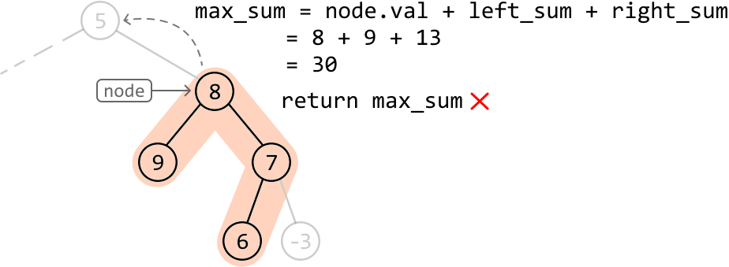

We know we need to make sure we **return a single, continuous path** from node 8. This would mean **returning a path with node 8 as an end point**, which leaves us with two main choices for values we could return:

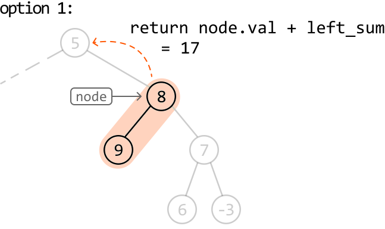

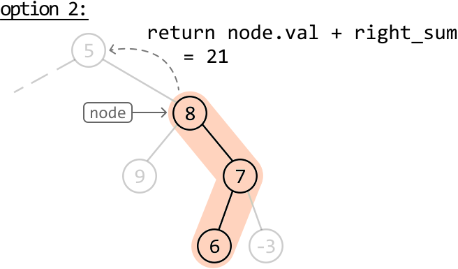

Between the above two paths, we just return whichever of their sums is larger. Therefore, our return statement is:

> 
> 
> `return node.val + max(left_sum, right_sum)`
> 
> 

Now that we’re getting single continuous path sums from the left and right subtrees, **the maximum path sum rooting from a node** can be calculated using **`node.val + left_sum + right_sum`**. This is done separately from the return statement.

The maximum path sum of the entire tree is found by keeping track of the largest path sum formed at every node.

**Handling negative path sums**

One final thing to note is that we shouldn’t include the values of `left_sum` or `right_sum` if either is negative, as they wouldn’t contribute to a maximum sum. We can do this by setting their values to 0 if they’re negative, which is the same as excluding the left or right path from the sum.

## Implementation

```python
from ds import TreeNode
    
max_sum = float('-inf')
    
def max_path_sum(root: TreeNode) -> int:
   global max_sum
   max_path_sum_helper(root)
   return max_sum
    
def max_path_sum_helper(node: TreeNode) -> int:
   global max_sum
   # Base case: null nodes have no path sum.
   if not node:
       return 0
   # Collect the maximum gain we can attain from the left and right subtrees, setting
   # them to 0 if they’re negative.
   left_sum = max(max_path_sum_helper(node.left), 0)
   right_sum = max(max_path_sum_helper(node.right), 0)
   # Update the overall maximum path sum if the current path sum is larger.
   max_sum = max(max_sum, node.val + left_sum + right_sum)
   # Return the maximum sum of a single, continuous path with the current node as an
   # endpoint.
   return node.val + max(left_sum, right_sum)

```

```javascript
import { TreeNode } from './ds.js'

let maxSum = -Infinity

export function max_path_sum(root) {
  maxSum = -Infinity
  maxPathSumHelper(root)
  return maxSum
}

function maxPathSumHelper(node) {
  // Base case: null nodes have no path sum.
  if (!node) return 0
  // Collect the maximum gain we can attain from the left and right subtrees,
  // setting them to 0 if they’re negative.
  const leftSum = Math.max(maxPathSumHelper(node.left), 0)
  const rightSum = Math.max(maxPathSumHelper(node.right), 0)

  // Update the overall maximum path sum if the current path sum is larger.
  maxSum = Math.max(maxSum, node.val + leftSum + rightSum)
  // Return the maximum sum of a single, continuous path with the current node
  // as an endpoint.
  return node.val + Math.max(leftSum, rightSum)
}

```

```java
import core.BinaryTree.TreeNode;

class Main {
    private static int maxSum = Integer.MIN_VALUE;

    public static int max_path_sum(TreeNode<Integer> root) {
        // Start the recursive traversal and return the maximum path sum.
        max_path_sum_helper(root);
        return maxSum;
    }

    private static int max_path_sum_helper(TreeNode<Integer> node) {
        // Base case: null nodes have no path sum.
        if (node == null) {
            return 0;
        }
        // Collect the maximum gain we can attain from the left and right subtrees, setting
        // them to 0 if they’re negative.
        int leftSum = Math.max(max_path_sum_helper(node.left), 0);
        int rightSum = Math.max(max_path_sum_helper(node.right), 0);
        // Update the overall maximum path sum if the current path sum is larger.
        maxSum = Math.max(maxSum, node.val + leftSum + rightSum);
        // Return the maximum sum of a single, continuous path with the current node as an
        // endpoint.
        return node.val + Math.max(leftSum, rightSum);
    }
}

```

### Complexity Analysis

**Time complexity:** The time complexity of `max_path_sum` is O(n), where n denotes the number of nodes in the tree. This is because it traverses each node of the tree once.

**Space complexity:** The space complexity is O(n) due to the space taken up by the recursive call stack, which can grow as large as the height of the binary tree. The largest possible height of a binary tree is n.