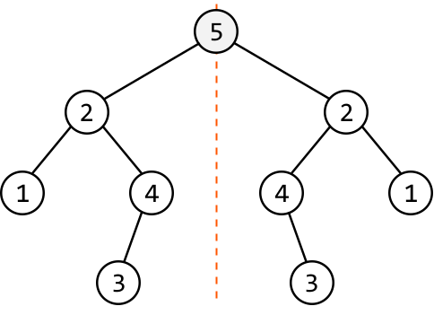
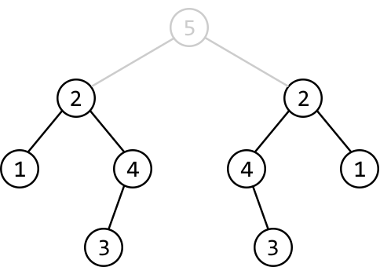
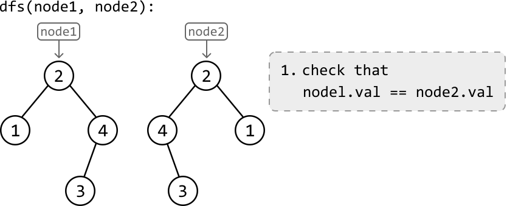
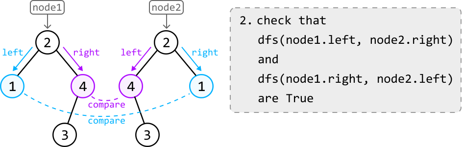

# Binary Tree Symmetry

Determine if a binary tree is **vertically symmetric**. That is, the left subtree of the root node is a mirror of the right subtree.

#### Example:



```python
Output: True

```

## Intuition

To check a binary tree's symmetry, we need to assess its left and right subtrees. The first thing to note is that the root node itself doesn’t affect the symmetry of the tree. Therefore, we don't need to consider the root node. We now have the task of comparing two subtrees to check if one vertically mirrors the other.

Consider the root node’s left and right subtrees in the following example:



The key observation here is that **the right subtree is an inverted version of the left subtree**.

We’ve learned from the problem *Invert Binary Tree* that an inversion is performed by swapping the left and right child of every node. This suggests the value of each node's left child in the left subtree should match the value of the right child of the corresponding node in the right subtree, and vice versa.

We can start by using DFS to traverse both subtrees. During this traversal, we compare the left and right children of each node in the left subtree with the right and left children of its corresponding node in the right subtree, respectively.

- If the values of any two nodes being compared are not the same, the tree is not symmetric.

- If, at any point, one of the child nodes being compared is null while the other isn’t, the tree is also not symmetric.

Initially, we see the values of the root nodes of the left and right subtrees are equal:



Since they’re equal, proceed by comparing their children through recursive DFS calls. Specifically, make two recursive DFS calls to compare the left child of one node with the right child of the other. This checks that node2’s children contain the same values as node1’s children, but inverted.



If either DFS call returns false, the subtrees are not symmetric. If both DFS calls return true, the subtrees are symmetric. This process is repeated for the entire tree.

## Implementation

```python
from ds import TreeNode
    
def binary_tree_symmetry(root: TreeNode) -> bool:
    if not root:
        return True
    return compare_trees(root.left, root.right)
    
def compare_trees(node1: TreeNode, node2: TreeNode) -> bool:
    # Base case: if both nodes are null, they're symmetric.
    if not node1 and not node2:
        return True
    # If one node is null and the other isn't, they aren't symmetric.
    if not node1 or not node2:
        return False
    # If the values of the current nodes don't match, trees aren't symmetric.
    if node1.val != node2.val:
        return False
    # Compare the 'node1's left subtree with 'node2's right subtree. If these
    # aren't symmetric, the whole tree is not symmetric.
    if not compare_trees(node1.left, node2.right):
        return False
    # Compare the 'node1's right subtree with 'node2's left subtree.
    return compare_trees(node1.right, node2.left)

```

```javascript
import { TreeNode } from './ds.js'

export function binary_tree_symmetry(root) {
  if (!root) {
    return true
  }
  return compare_trees(root.left, root.right)
}

function compare_trees(node1, node2) {
  // Base case: if both nodes are null, they're symmetric.
  if (!node1 && !node2) {
    return true
  }
  // If one node is null and the other isn't, they aren't symmetric.
  if (!node1 || !node2) {
    return false
  }
  // If the values of the current nodes don't match, trees aren't symmetric.
  if (node1.val !== node2.val) {
    return false
  }
  // Compare the 'node1's left subtree with 'node2's right subtree.
  if (!compare_trees(node1.left, node2.right)) {
    return false
  }
  // Compare the 'node1's right subtree with 'node2's left subtree.
  return compare_trees(node1.right, node2.left)
}

```

```java
import core.BinaryTree.TreeNode;

class Main {
    public static Boolean binary_tree_symmetry(TreeNode<Integer> root) {
        // A null tree is symmetric.
        if (root == null) {
            return true;
        }
        // Start the recursive comparison of left and right subtrees.
        return isMirror(root.left, root.right);
    }

    private static boolean isMirror(TreeNode<Integer> node1, TreeNode<Integer> node2) {
        // Both nodes are null – it's symmetric at this level.
        if (node1 == null && node2 == null) {
            return true;
        }
        // One is null and the other isn't – not symmetric.
        if (node1 == null || node2 == null) {
            return false;
        }
        // The values must match, and the outer and inner children must be symmetric.
        return node1.val.equals(node2.val) &&
               isMirror(node1.left, node2.right) &&
               isMirror(node1.right, node2.left);
    }
}

```

### Complexity Analysis

**Time complexity:** The time complexity of `binary_tree_symmetry` is O(n), where n denotes the number of nodes in the tree. This is because we process each node recursively at most once.

**Space complexity:** The space complexity is O(n) due to the space taken up by the recursive call stack, which can grow as large as the height of the binary tree. The largest possible height of a binary tree is n.

## Interview Tip

Tip: Cover null cases. Always check for null or empty inputs before using their attributes in a function. In this problem, the main `binary_tree_symmetry` function itself accesses the left and right attributes of the input node, necessitating an initial null check.