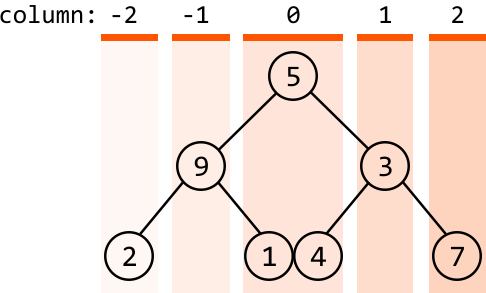
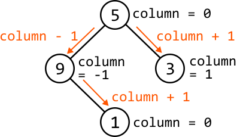
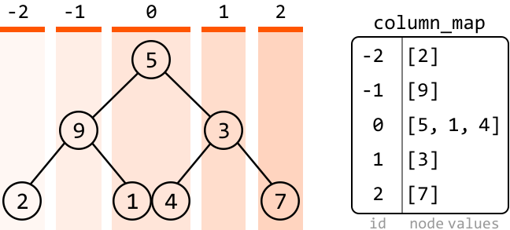
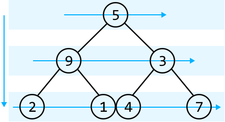
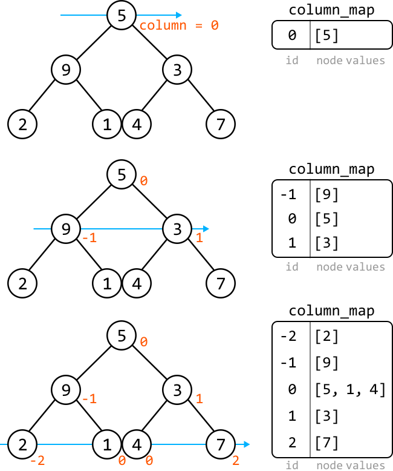
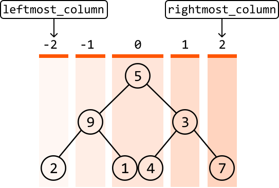

# Binary Tree Columns

Given the root of a binary tree, return a list of arrays where each array represents a **vertical column of the tree**. Nodes in the same column should be ordered from top to bottom. Nodes in the same row and column should be ordered from left to right.

#### Example:

```python
Output: [[2], [9], [5, 1, 4], [3], [7]]

```

## Intuition

First and foremost, to get the columns of a binary tree, we'll need a way to identify what column each node is in.

**Column ids**

One way to distinguish between different columns is to represent each column by a distinct numerical value: an id. Initially, we don't know how many columns there are to the left or to the right of the root node, but we at least know the column which contains the root node itself. Let's give this column an id of 0. This lets us set positive column ids for nodes to the right of the root and negative ids to the left:



How can we identify what column id a node is associated with? A handy observation is that every time we move to the right, the column id increases by 1, and every time we move to the left, it decreases by 1. This allows us to assign ids as we traverse the tree: for any node, the column ids of `node.left` and `node.right` are `column - 1` and `column + 1`, respectively:



**Tracking node values by their column id**

Now that we have a way to determine a node’s column, we’ll need a way to keep track of which node values belong to which columns. This can be done using a **hash map** where keys are column ids and the value of each column id is a list of the node values at that column.



Now, let’s consider what traversal algorithm we should use to populate this hash map.

**Breadth-first search**

In general, we can employ any traversal method to assign column ids to each node, as long as we increment the column id whenever we move right and decrement it whenever we move left. However, we need to be cautious about the following two requirements:

- Nodes in the same column should be ordered from top to bottom.

- Nodes in the same row and column should be ordered from left to right.

So, we’ll need an algorithm that traverses the tree from top to bottom and then from left to right. This calls for **BFS**.

BFS processes nodes level by level, starting from the root and moving horizontally across the tree at each level. This method ensures nodes are visited from top to bottom, and for nodes in the same row (level), they are visited from left to right.



Traversing the tree this way ensures node values are added to the hash map in the desired order, complying with the two requirements above.

We can see how the hash map is populated level by level below:



Once BFS concludes, the hash map is populated with lists of values for each column id. However, the hash map itself is not the expected output. So, let’s discuss what to do next.

**Creating the output**

This problem expects us to return the column ids from left to right. As we know, a hash map does not inherently maintain the order of its keys (column ids), which means we’ll need to find a way to attain the output in the desired order.

To retrieve the column ids in the desired order, it would be useful to know the **leftmost column id** and the **rightmost column id**. This allows us to increment through all ids in the range [`leftmost_column`, `rightmost_column`], ensuring we can build the output in the desired order.



## Implementation

```python
from ds import TreeNode
from typing import List
from collections import defaultdict, deque
    
def binary_tree_columns(root: TreeNode) -> List[List[int]]:
    if not root:
        return []
    column_map = defaultdict(list)
    leftmost_column = rightmost_column = 0
    queue = deque([(root, 0)])
    while queue:
        node, column = queue.popleft()
        if node:
            # Add the current node's value to its corresponding list in the hash
            # map.
            column_map[column].append(node.val)
            leftmost_column = min(leftmost_column, column)
            rightmost_column = max(rightmost_column, column)
            # Add the current node's children to the queue with their respective
            # column ids.
            queue.append((node.left, column - 1))
            queue.append((node.right, column + 1))
    # Construct the output list by collecting values from each column in the hash
    # map in the correct order.
    return [column_map[i] for i in range(leftmost_column, rightmost_column + 1)]

```

```javascript
import { TreeNode } from './ds.js'

export function binary_tree_columns(root) {
  if (!root) {
    return []
  }
  const columnMap = new Map()
  let leftmostColumn = 0
  let rightmostColumn = 0
  const queue = [[root, 0]]
  while (queue.length > 0) {
    const [node, column] = queue.shift()
    if (node) {
      // Add the current node's value to its corresponding list in the hash
      // map.
      if (!columnMap.has(column)) {
        columnMap.set(column, [])
      }
      columnMap.get(column).push(node.val)
      leftmostColumn = Math.min(leftmostColumn, column)
      rightmostColumn = Math.max(rightmostColumn, column)
      // Add the current node's children to the queue with their respective
      // column ids.
      queue.push([node.left, column - 1])
      queue.push([node.right, column + 1])
    }
  }
  // Construct the output list by collecting values from each column in the hash
  // map in the correct order.
  const result = []
  for (let i = leftmostColumn; i <= rightmostColumn; i++) {
    result.push(columnMap.get(i))
  }
  return result
}

```

```java
import java.util.ArrayList;
import java.util.HashMap;
import java.util.LinkedList;
import java.util.Queue;
import java.util.Map;
import core.BinaryTree.TreeNode;

// Helper class to store a node and its column index.
class Pair {
    TreeNode<Integer> node;
    int column;

    public Pair(TreeNode<Integer> node, int column) {
        this.node = node;
        this.column = column;
    }
}

class Main {
    public ArrayList<ArrayList<Integer>> binary_tree_columns(TreeNode<Integer> root) {
        if (root == null) {
            return new ArrayList<>();
        }
        // Add the current node's value to its corresponding list in the hash map.
        Map<Integer, ArrayList<Integer>> columnMap = new HashMap<>();
        int leftmostColumn = 0, rightmostColumn = 0;
        // Use a queue to perform BFS; store (node, column index) pairs.
        Queue<Pair> queue = new LinkedList<>();
        queue.offer(new Pair(root, 0));
        while (!queue.isEmpty()) {
            Pair current = queue.poll();
            TreeNode<Integer> node = current.node;
            int column = current.column;
            columnMap.putIfAbsent(column, new ArrayList<>());
            columnMap.get(column).add(node.val);
            leftmostColumn = Math.min(leftmostColumn, column);
            rightmostColumn = Math.max(rightmostColumn, column);
            // Add the current node's children to the queue with their respective column ids.
            if (node.left != null) {
                queue.offer(new Pair(node.left, column - 1));
            }
            if (node.right != null) {
                queue.offer(new Pair(node.right, column + 1));
            }
        }
        // Construct the output list by collecting values from each column in the hash map in the correct order.
        ArrayList<ArrayList<Integer>> result = new ArrayList<>();
        for (int i = leftmostColumn; i <= rightmostColumn; i++) {
            result.add(columnMap.get(i));
        }
        return result;
    }
}

```

### Complexity Analysis

**Time complexity:** The time complexity of `binary_tree_columns` is O(n) where n denotes the number of nodes in the tree. This is because we process each node of the tree once during the level‐order traversal.

**Space complexity:** The space complexity is O(n) due to the space taken up by the queue. The queue’s size will grow as large as the level with the most nodes. In the worst case, this occurs at the final level when all the last‐level nodes are non‐null, totaling approximately n/2 nodes. Note that the output array created at the return statement does not contribute to the space complexity.