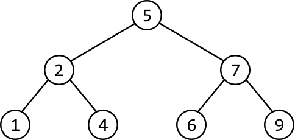
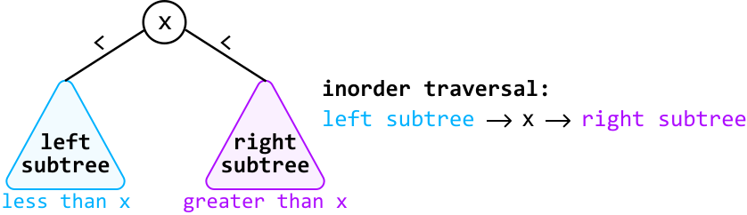

# Kth Smallest Number in a Binary Search Tree

Given the root of a binary search tree (BST) and an integer `k`, find the **`k`th smallest node** value.

#### Example:

Given the BST below and k = 5:



```python
Output: 6

```

### Constraints:

- `n ≥ 1`, where `n` denotes the **number** of nodes in the tree.

- `1 ≤ k ≤ n`

## Intuition - Recursive

A naive approach to this problem is to traverse the tree and store all the nodes in an array, sort the array, and return the kth element. This approach, however, does not take advantage of the fact that we're dealing with a BST.

Consider again the BST from the example:


We know that in a BST, each node’s value is larger than all the nodes to its left and smaller than all the nodes to its right. This structure means that BSTs inherently possess a sorted order. Given this, it should be possible to construct a sorted array of the tree's values by traversing the tree, without the need for additional sorting.

We now need a method to traverse the binary tree that allows us to encounter the nodes in their sorted order.

What are our options? We can immediately rule out any traversal algorithms that process the root node first, such as breadth-first search and preorder traversal, since the root node is not guaranteed to have the smallest value in a BST. This also indicates that we need an algorithm that starts with the leftmost node since this is always the smallest node in a BST. Additionally, the algorithm should end at the rightmost node since this would be the largest node.

This leads us to an ideal traversal algorithm: **inorder traversal**, where for each node, the left subtree is processed first, followed by the current node, and then the right subtree.



To build the sorted list of values using inorder traversal, we can design a recursive function. When called on the root node, it returns a sorted list of all the values in the BST.

When the function is called for any node during the recursive process, it constructs a sorted list of the values in the subtree rooting from that node. This is achieved by first obtaining the sorted values from its left subtree, then adding the current node's value, and finally appending the sorted values from its right subtree. This process is carried out through recursive calls to the left and right children.

Once we have the full list of sorted values, we can simply return the value at the (`k - 1`)th index to get the `k`th smallest value.

## Implementation - Recursive

```python
from ds import TreeNode
    
def kth_smallest_number_in_BST_recursive(root: TreeNode, k: int) -> int:
    sorted_list = inorder(root)
    return sorted_list[k - 1]
    
# Inorder traversal function to attain a sorted list of nodes from the BST.
def inorder(node: TreeNode) -> List[int]:
    if not node:
        return []
    return inorder(node.left) + [node.val] + inorder(node.right)

```

```javascript
import { TreeNode } from './ds.js'

export function kth_smallest_number_in_BST_recursive(root, k) {
  const sortedList = inorder(root)
  return sortedList[k - 1]
}

// Inorder traversal function to attain a sorted list of nodes from the BST.
function inorder(node) {
  if (!node) {
    return []
  }
  return [...inorder(node.left), node.val, ...inorder(node.right)]
}

```

```java
import java.util.ArrayList;
import core.BinaryTree.TreeNode;

class Main {
    public int kth_smallest_number_in_BST_recursive(TreeNode<Integer> root, int k) {
        // Perform an inorder traversal to collect nodes in sorted order.
        ArrayList<Integer> sortedList = inorder(root);
        // Return the (k - 1)th element since list indexing is 0-based.
        return sortedList.get(k - 1);
    }

    // Inorder traversal function to attain a sorted list of nodes from the BST.
    private ArrayList<Integer> inorder(TreeNode<Integer> node) {
        ArrayList<Integer> result = new ArrayList<>();
        if (node == null) {
            return result;
        }
        result.addAll(inorder(node.left));
        result.add(node.val);
        result.addAll(inorder(node.right));
        return result;
    }
}

```

### Complexity Analysis

**Time complexity:** The time complexity of `kth_smallest_number_in_BST_recursive` is O(n), where n denotes the number of nodes in the tree. This is because we need to traverse through all n nodes of the tree to attain the sorted list.

**Space complexity:** The space complexity is O(n) due to the space taken up by `sorted_list`, as well as the recursive call stack, which can grow as large as the height of the binary tree. The largest possible height of a binary tree is n.

## Intuition - Iterative

Since we only need the kth smallest value, storing all n values in a list might not be necessary. Ideally, we’d like to find a way to traverse through k nodes instead of n. How can we modify our approach to achieve this?

If we had a way to stop inorder traversal once we've reached the kth node in the traversal, we would land on our answer. An iterative approach would allow for this since we’d be able to exit traversal once we’ve reached the kth node — something that’s quite difficult to achieve using recursion.

We know inorder traversal is a DFS algorithm and that DFS algorithms can be implemented iteratively using a stack. Let’s explore this idea further.

---

Consider what happened during recursive inorder traversal in the previous approach:

- Make a recursive call to the left subtree.

- Process the current node.

- Make a recursive call to the right subtree.

Let’s replicate the above steps iteratively using a stack.

- Move as far **left** as possible, adding each node to the stack as we move left.

- We do this because, at the start of each recursive call in the recursive approach, a new call is made to the current node’s left subtree, continuing until the base case (a null node) is reached. This implies that to mimic this process iteratively, we’ll need to move as far left as possible.

- The reason we push nodes onto the stack as we go is so they can be processed later.
  
  
  The code snippet for this can be seen below:
  
  
  ```python
  while node:
      stack.append(node)
      node = node.left
  
  ```
  
  ```javascript
  while (node) {
    stack.push(node)
    node = node.left
  }
  
  ```

- Once we can no longer move left, we pop the node off the top of the stack. Let's call it the **current node**. Initially, this node will represent the smallest node. After this, the current node will subsequently represent the next smallest node, and so on until we reach the kth smallest node.
  
  
  
  - Decrement `k`, indicating that we now have one less node to visit until we reach the `k`th smallest node.
  
  - Once `k == 0`, we found the `k`th smallest node. Return the value of this node.

- Move to the current node’s **right** child.

## Implementation - Iterative

```python
def kth_smallest_number_in_BST_iterative(root: TreeNode, k: int) -> int:
    stack = []
    node = root
    while stack or node:
        # Move to the leftmost node and add nodes to the stack as we go so they
        # can be processed in future iterations.
        while node:
            stack.append(node)
            node = node.left
        # Pop the top node from the stack to process it, and decrement 'k'.
        node = stack.pop()
        k -= 1
        # If we have processed 'k' nodes, return the value of the 'k'th smallest
        # node.
        if k == 0:
            return node.val
        # Move to the right subtree.
        node = node.right

```

```javascript
export function kth_smallest_number_in_BST_iterative(root, k) {
  const stack = []
  let node = root
  while (stack.length > 0 || node !== null) {
    // Move to the leftmost node and add nodes to the stack as we go so they
    // can be processed in future iterations.
    while (node !== null) {
      stack.push(node)
      node = node.left
    }
    // Pop the top node from the stack to process it, and decrement 'k'.
    node = stack.pop()
    k -= 1
    // If we have processed 'k' nodes, return the value of the 'k'th smallest
    // node.
    if (k === 0) {
      return node.val
    }
    // Move to the right subtree.
    node = node.right
  }
  return -1 // Return -1 if k is invalid.
}

```

```java
import java.util.Stack;
import core.BinaryTree.TreeNode;

class Main {
    public int kth_smallest_number_in_BST_iterative(TreeNode<Integer> root, int k) {
        Stack<TreeNode<Integer>> stack = new Stack<>();
        TreeNode<Integer> node = root;
        while (!stack.isEmpty() || node != null) {
            // Move to the leftmost node and add nodes to the stack as we go so they
            // can be processed in future iterations.
            while (node != null) {
                stack.push(node);
                node = node.left;
            }
            // Pop the top node from the stack to process it, and decrement 'k'.
            node = stack.pop();
            k--;
            // If we have processed 'k' nodes, return the value of the 'k'th smallest
            // node.
            if (k == 0) {
                return node.val;
            }
            // Move to the right subtree.
            node = node.right;
        }
        return -1; // This line should never be reached if input is valid.
    }
}

```

### Complexity Analysis

**Time complexity:** The time complexity of `kth_smallest_number_in_BST_iterative` is O(k+h), where h denotes the height of the tree. Here’s why:

- Iterative inorder traversal ensures we traverse k nodes, which takes at least O(k) time.

- Additionally, traversing to the leftmost node takes up to O(h) time, which should be considered separately since it’s possible that h > k. In the worst case, the height of the tree is n, resulting in a time complexity of O(n), where n denotes the number of nodes in the tree.

**Space complexity:** The space complexity is O(h) since the stack can store up to O(h) during the traversal to the leftmost node. In the worst case, the height of the tree is n, resulting in a space complexity of O(n).