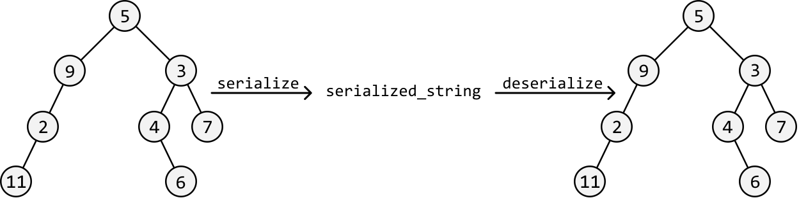
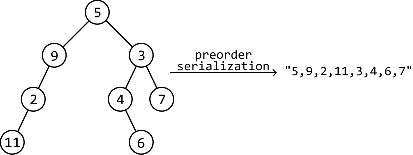
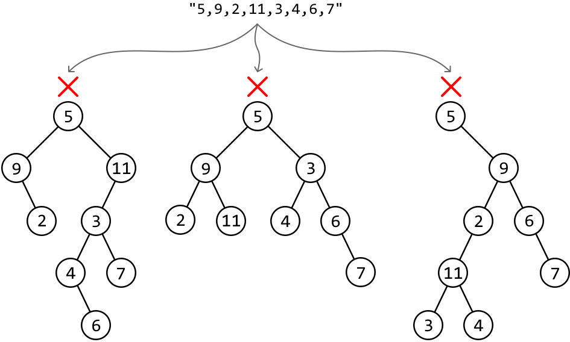
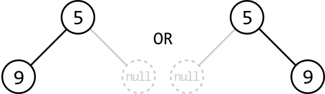
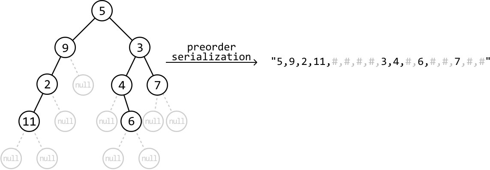
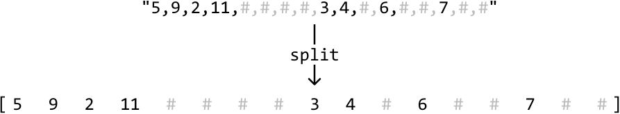
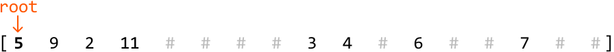
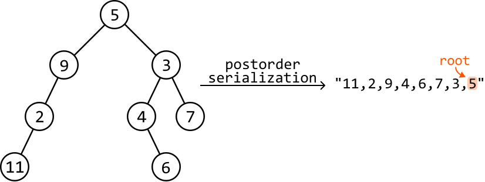
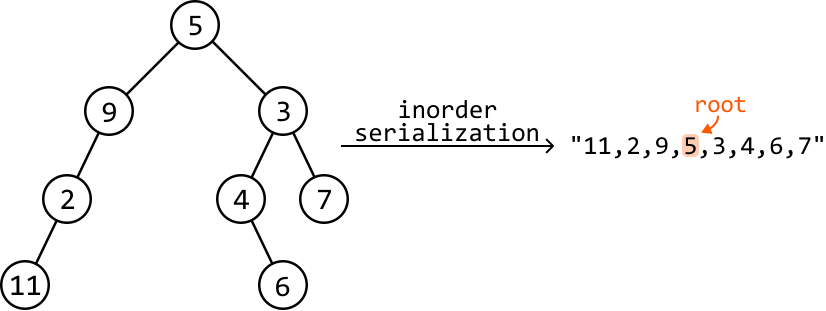
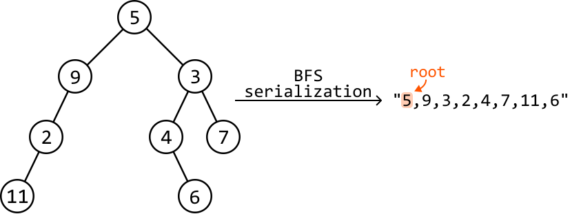

# Serialize and Deserialize a Binary Tree

Write a function to **serialize** a binary tree into a string, and another function to **deserialize** that string back into the original binary tree structure.



## Intuition

The primary challenge of this problem lies in how we serialize the tree into a string since this will determine if it’s possible to reconstruct the tree using this string alone.

Let's first decide on a traversal strategy because the method we use to serialize the tree will impact how we deserialize the string. Two options:

- Use BFS to serialize the tree level by level.

- Use DFS. In this case, we’d need to choose between inorder, preorder, and postorder traversal.

There’s flexibility in choosing the traversal algorithm because serializing with a specific traversal method allows us to rebuild (deserialize) the tree using the same traversal algorithm.

**Serialization**

An important piece of information needed in our serialized string is the node values. In addition, we’ll need to **ensure we can identify the root node's value**, since this is the first node to create when we deserialize the string.

As such, a traversal algorithm like preorder traversal is a good choice because it processes the root node first, then the left subtree, and finally the right subtree. This ensures the first value in our serialized string is the root node's value.

So, let’s try serializing the following binary tree using preorder traversal, separating each node with a comma:



The issue with this serialization is that it doesn't guarantee we can reconstruct the exact original tree from its serialized string representation. This is because the string could represent multiple different trees, which means preorder deserialization could result in the creation of an invalid tree:



This is because the string is missing crucial information: **null child nodes**. For instance, after placing the root node with a value of 5 in the above example, we don't yet know where to place the node of value 9, which is the next value in the string. That is, we can't determine whether node 9 should be the left or right child of node 5:



If the string indicates where the null child nodes are, we can correctly deserialize the tree because we have a complete representation of the tree’s structure. Let's use the character '#' to represent a null node:



**Deserialization**

To deserialize a string created with preorder traversal, we also need to use preorder traversal to reconstruct the tree.

The first step is to split the string using the comma delimiter, so each node value and ‘#’ is in a list:



The first value in the list is the root node of the tree:



Starting from this root value, recursively construct the tree node by node using preorder traversal. Each new node will be created with the next value in the list of preorder values. Whenever we encounter a ‘#’, we return null. The code snippet for this:

```python
# Helper function to construct the tree using preorder traversal.
def build_tree(values: List[str]) -> TreeNode:
    val = next(values)
    # Base case: '#' indicates a null node.
    if val == '#':
        return None
    # Use preorder traversal to create the current node first, then the left and
    # right subtrees.
    node = TreeNode(int(val))
    node.left = build_tree(values)
    node.right = build_tree(values)
    return node

```

```javascript
// Helper function to construct the tree using preorder traversal.
export function buildTree(values) {
  const next = () => values.shift() // Simulates Python's next()
  function helper() {
    const val = next()
    // Base case: '#' indicates a null node.
    if (val === '#') {
      return null
    }
    // Use preorder traversal to create the current node first, then the left and right subtrees.
    const node = new TreeNode(parseInt(val))
    node.left = helper()
    node.right = helper()
    return node
  }
  return helper()
}

```

```java
// Helper function to construct the tree using preorder traversal.
private static TreeNode<Integer> buildTree(Queue<String> values) {
    String val = values.poll();
    // Base case: '#' indicates a null node.
    if (val.equals("#")) {
        return null;
    }
    // Use preorder traversal processes the current node first, then the left and
    // right children.
    TreeNode<Integer> node = new TreeNode<>(Integer.parseInt(val));
    node.left = buildTree(values);
    node.right = buildTree(values);
    return node;
}

```

**Follow-up: what if you must use a different traversal algorithm?**

It’s possible to serialize and deserialize a binary tree using other traversal algorithms than preorder traversal. Let’s explore some alternatives.

\underline{\text{Postorder Traversal:}}

When we serialize the tree using postorder traversal, we get the following string (ignoring the null nodes in this discussion to focus on the node values and their order):



As we see, one big difference is that the root node will be the final value in the string, since postorder traversal processes the left subtree, then the right subtree, and finally the root node.

During deserialization, we’d build the tree by iterating through the node values from right to left instead of left to right, since the root value is at the right. In addition, we’d need to create each node’s right subtree before we create its left subtree, as we go through the string in reverse.

\underline{\text{Inorder traversal:}}

A lot more care needs to be taken when serializing a tree using inorder traversal. The main reason is that it’s unclear where the root node of the tree is in the string, and where the root node of each subtree is, as we can see below:



This doesn’t make it impossible to use inorder traversal. It just means significantly more information needs to be provided in the serialized string to make deserialization possible. In particular, we need to include details about which value serves as the root node for each subtree as we iterate through them.

\underline{\text{Breadth-first search (BFS):}}

BFS starts processing each node from the root of the tree, and traverses through it level by level, and from left to right. Serializing the tree using BFS gives the following order of values:



Similarly to preorder traversal, we just need to follow the exact traversal order for reconstructing the tree when deserializing the string.

## Implementation

In the following implementation, we opt for preorder traversal for serialization and deserialization.

```python
from ds import TreeNode
    
def serialize(root: TreeNode) -> str:
    # Perform a preorder traversal to add node values to a list, then convert the
    # list to a string.
    serialized_list = []
    preorder_serialize(root, serialized_list)
    # Convert the list to a string and separate each value using a comma
    # delimiter.
    return ','.join(serialized_list)
    
# Helper function to perform serialization through preorder traversal.
def preorder_serialize(node, serialized_list) -> None:
    # Base case: mark null nodes as '#'.
    if node is None:
        serialized_list.append('#')
        return
    # Preorder traversal processes the current node first, then the left and right
    # children.
    serialized_list.append(str(node.val))
    preorder_serialize(node.left, serialized_list)
    preorder_serialize(node.right, serialized_list)
    
def deserialize(data: str) -> TreeNode:
    # Obtain the node values by splitting the string using the comma delimiter.
    node_values = iter(data.split(','))
    return build_tree(node_values)
    
# Helper function to construct the tree using preorder traversal.
def build_tree(values: List[str]) -> TreeNode:
    val = next(values)
    # Base case: '#' indicates a null node.
    if val == '#':
        return None
    # Use preorder traversal processes the current node first, then the left and
    # right children.
    node = TreeNode(int(val))
    node.left = build_tree(values)
    node.right = build_tree(values)
    return node

```

```javascript
import { TreeNode } from './ds.js'

export function serialize(root) {
  const serializedList = []
  preorderSerialize(root, serializedList)
  return serializedList.join(',')
}

// Helper function to perform serialization through preorder traversal.
function preorderSerialize(node, serializedList) {
  if (node === null) {
    serializedList.push('#')
    return
  }
  serializedList.push(String(node.val))
  preorderSerialize(node.left, serializedList)
  preorderSerialize(node.right, serializedList)
}

export function deserialize(data) {
  // Obtain the node values by splitting the string using the comma delimiter.
  const nodeValues = data.split(',')
  return buildTree(nodeValues)
}

// Helper function to construct the tree using preorder traversal.
function buildTree(values) {
  const val = values.shift()
  # Base case: '#' indicates a null node.
  if (val === '#') {
    return null
  }
  // Use preorder traversal processes the current node first, then the left and
  // right children.
  const node = new TreeNode(parseInt(val))
  node.left = buildTree(values)
  node.right = buildTree(values)
  return node
}

```

```java
import core.BinaryTree.TreeNode;
import java.util.ArrayList;
import java.util.Arrays;
import java.util.LinkedList;
import java.util.List;
import java.util.Queue;

class UserCode {
    public static String serialize(TreeNode<Integer> root) {
        // Perform a preorder traversal to add node values to a list, then convert the
        // list to a string.
        List<String> serializedList = new ArrayList<>();
        preorderSerialize(root, serializedList);
        // Convert the list to a string and separate each value using a comma
        // delimiter.
        return String.join(",", serializedList);
    }

    // Helper function to perform serialization through preorder traversal.
    private static void preorderSerialize(TreeNode<Integer> node, List<String> serializedList) {
        // Base case: mark null nodes as '#'.
        if (node == null) {
            serializedList.add("#");
            return;
        }
        // Preorder traversal processes the current node first, then the left and right
        // children.
        serializedList.add(String.valueOf(node.val));
        preorderSerialize(node.left, serializedList);
        preorderSerialize(node.right, serializedList);
    }

    public static TreeNode<Integer> deserialize(String data) {
        // Obtain the node values by splitting the string using the comma delimiter.
        Queue<String> values = new LinkedList<>(Arrays.asList(data.split(",")));
        return buildTree(values);
    }

    // Helper function to construct the tree using preorder traversal.
    private static TreeNode<Integer> buildTree(Queue<String> values) {
        String val = values.poll();
        // Base case: '#' indicates a null node.
        if (val.equals("#")) {
            return null;
        }
        // Use preorder traversal processes the current node first, then the left and
        // right children.
        TreeNode<Integer> node = new TreeNode<>(Integer.parseInt(val));
        node.left = buildTree(values);
        node.right = buildTree(values);
        return node;
    }
}

```

### Complexity Analysis

**Time complexity:** The time complexity of both serialize and deserialize is O(n), where n denotes the number of nodes in the tree. This is because we visit each of the n nodes in the binary tree exactly once during preorder traversal. The serialize function additionally converts the serialized list to a string, which also takes O(n) time.

**Space complexity:** The space complexity of both serialize and deserialize is O(n) due to the space taken up by the recursive call stack, which can grow as large as the height of the binary tree. The largest possible height of a binary tree is 𝑛.