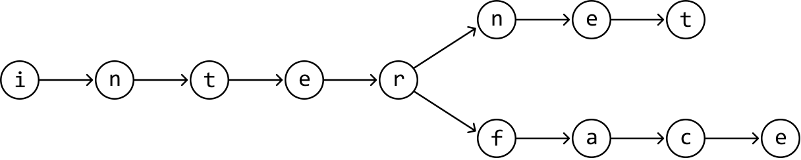
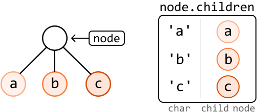
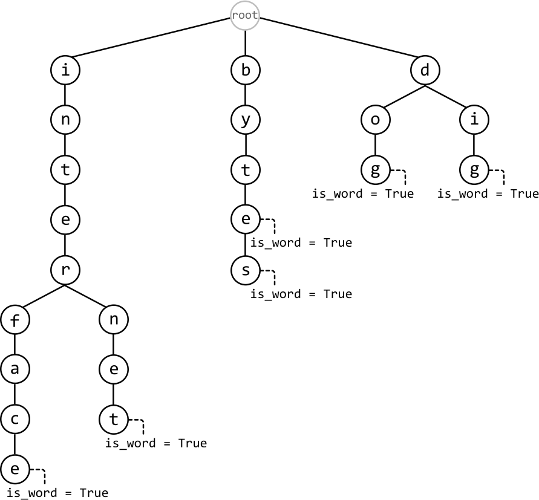
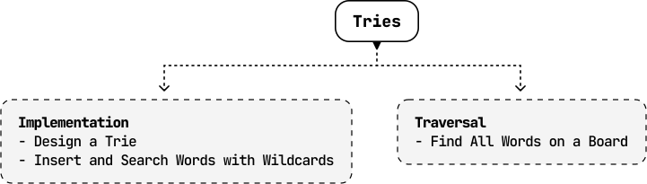

# Introduction to Tries

## Intuition

Tries, also known as prefix trees, are specialized tree-like data structures that efficiently store strings by taking advantage of shared prefixes.

To understand how a trie works, consider the string "internet". We can store this string as a sequence of connected nodes, where each node represents a character in the string:

Now, let's say we also want to store the word "interface". Instead of creating a separate sequence of nodes, we take advantage of their common prefix "inter". Both words can share the nodes for "inter", and the remainder of "interface" can branch out from the node 'r':

This is, in essence, how a trie works: by allowing words to reuse existing nodes based on shared prefixes, it efficiently stores strings in a way that minimizes redundancy.

**TrieNode**

There are two attributes each `TrieNode` should have.

1. Children: Each `TrieNode` has a data structure to store references to its child nodes. A **hash map** is typically used for this, with a character as the key and its corresponding child node as the value.

Sometimes, an array is used instead of a hash map if the possible characters of words in the trie are limited and known in advance. For example, if they only contain lowercase English letters, an array of size 26 can be used, instead.

2. End of word indicator: Each `TrieNode` needs an attribute to indicate whether it marks the end of a word. This can be done in two ways:

- A boolean attribute (`is_word`) to confirm if the node is the end of a word.

- A string variable (`word`) that stores the word itself at the node. This is usually used if we also want to know the specific word that ends at this node.

**Trie structure**

This is an example of a trie that’s been populated by inserting the words "internet", "interface", "byte", "bytes", "dog", and "dig". Every word represented by the trie branches out of a **root `TrieNode`**, which does not represent any character.

Below is the time complexity breakdown for trie operations involving a word of length k:

| Operation | Complexity | Description |
| --- | --- | --- |
| Insert | O(k) | Insert a word into the trie. |
| Search | O(k) | Search for a word in the trie. |
| Search prefix | O(k) | Check if any word in the trie starts with a given prefix. |
| Delete | O(k) | Delete a word from the trie |

 

The implementation details of most of these functions are discussed in detail in the *Design a Trie* problem.

**When to use tries**

The primary use of a trie is to handle efficient prefix searches. If an interview problem asks you to find all strings that share a common prefix, a trie is likely the ideal data structure. Tries are also useful for word validation, allowing us to quickly verify the existence of words within a set of strings. They also help optimize data storage by reducing redundancy through shared prefixes among strings.

## Real-world Example

**Autocomplete:** When you start typing a word, some systems use a trie to quickly suggest possible completions. Each node in the trie represents a character, and as you type, the system traverses the trie based on the input characters. This allows the system to efficiently retrieve all possible words or phrases that start with the entered prefix, enabling fast autocomplete suggestions.

## Chapter Outline

