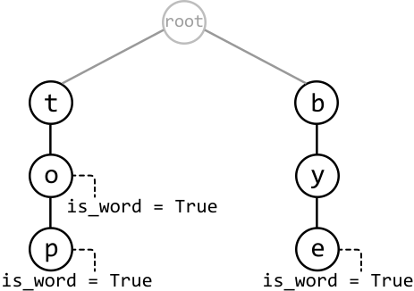
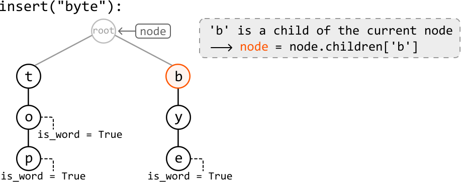
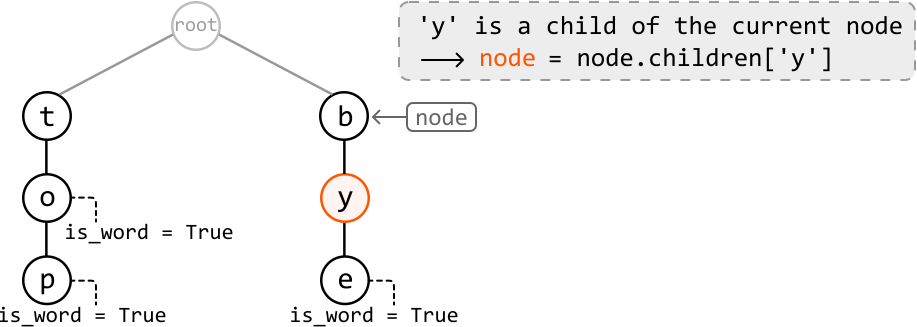
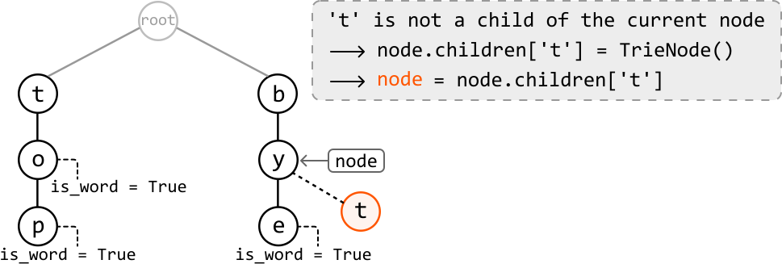
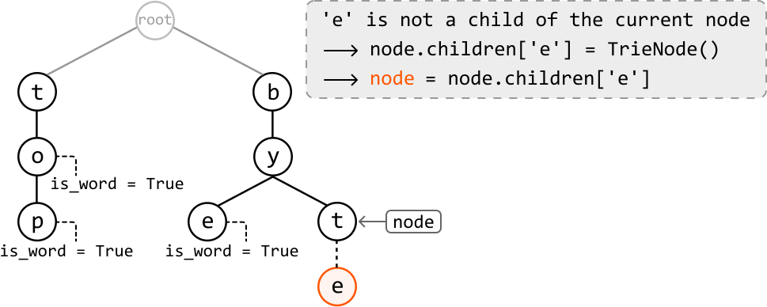
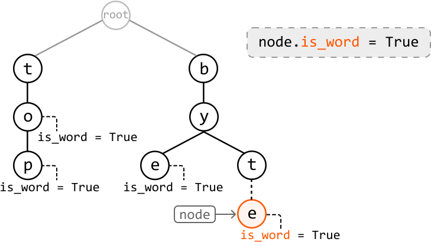
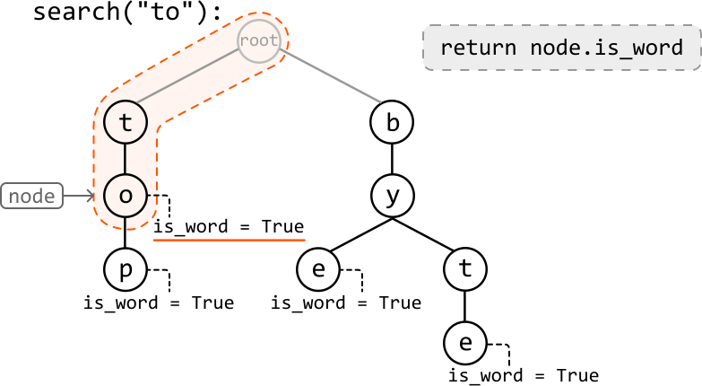

# Design a Trie

Design and implement a **trie** data structure that supports the following operations:

- `insert(word: str) -> None`: Inserts a word into the trie.

- `search(word: str) -> bool`: Returns true if a word exists in the trie, and false if not.

- `has_prefix(prefix: str) -> bool`: Returns true if the trie contains a word with the given prefix, and false if not.

#### Example:

```python
Input: [
  insert('top'),
  insert('bye'),
  has_prefix('to'),
  search('to'),
  insert('to'),
  search('to')
]
Output: [True, False, True]

```

Explanation:

```python
insert("top")    # trie has: "top"
insert("bye")    # trie has: "top" and "bye"
has_prefix("to") # prefix "to" exists in the string "top": return True
search("to")     # trie does not contain the word "to": return False
insert("to")     # trie has: "top", "bye", and "to"
search("to")     # trie contains the word "to": return True

```

### Constraints:

- The words and prefixes consist only of lowercase English letters.

- The length of each word and prefix is at least one character.

## Intuition

Let’s define a `TrieNode` using the same definition introduced in the introduction. In this implementation, the `is_word` attribute will be used to indicate whether a `TrieNode` marks the end of a word.

**Initializing the trie**

To initialize the Trie, we define the **root `TrieNode`** in the constructor. All words inserted into the trie will branch out from this root node.

**Inserting a word into the trie**

The insert function builds the trie word by word. What makes a trie useful is that it reduces redundancy by reusing existing nodes when possible. For example, if we insert “byte” when “bye” already exists in the trie, these two words should share the nodes that make up the prefix “by” to save space. This is an important point that will shape our implementation of this function.

---

To understand the insertion logic, let's walk through an example. Consider inserting the word "byte" into the trie below.



We first check if 'b', the first letter of the string, exists as a child of the root node by querying the hash map containing its children. In this case, it does. So, move to node 'b':



---

Now consider the second letter, ‘y’. Similarly, node 'y' exists as a child of node 'b', so let's move to node 'y':



---

Now consider the next letter, ‘t’. Since node 't' doesn't exist as a child of node 'y', we need to create it and add it to node 'y’s children hash map. Then, we can move to this newly created node 't':



---

The last letter is ‘e’, which doesn’t exist as a child of node ‘t’. So, let’s create node ‘e’ and add it to node ‘t’s children:



Now that we've reached the end of the word, we should set the `is_word` attribute of node 'e' to true, indicating that it marks the end of a word.



---

**Searching for a word**

Searching for a word involves the same strategy as insertion, where we move node by node down the trie. The two main differences are:

- If a node corresponding to the current character in the word isn't found at any point, we return false because this would indicate the word doesn't exist in the trie.

- After traversing all characters of the search term, we return true only if the final node's `is_word` attribute is true.



**Searching for a prefix**

The logic for finding a prefix is nearly identical to the logic discussed above for the search function. The only difference is after successfully traversing all characters in our search term, we can just return true without checking the final node's `is_word` attribute, as a prefix doesn’t need to end at the end of a word.


## Implementation

```python
class TrieNode:
    def __init__(self):
        self.children = {}
        self.is_word = False

```

```javascript
class TrieNode {
  constructor() {
    this.children = {}
    this.isWord = false
  }
}

```

```java
class TrieNode {
    public HashMap<Character, TrieNode> children;
    public boolean isWord;

    public TrieNode() {
        this.children = new HashMap<>();
        this.isWord = false;
    }
}

```

```python
class Trie:
   def __init__(self):
       self.root = TrieNode()
    
   def insert(self, word: str) -> None:
       node = self.root
       for c in word:
           # For each character in the word, if it’s not a child of the current node,
           # create a new TrieNode for that character.
           if c not in node.children:
               node.children[c] = TrieNode()
           node = node.children[c]
       # Mark the last node as the end of a word.
       node.is_word = True
    
   def search(self, word: str) -> bool:
       node = self.root
       for c in word:
           # For each character in the word, if it’s not a child of the current node,
           # the word doesn't exist in the Trie.
           if c not in node.children:
               return False
           node = node.children[c]
       # Return whether the current node is marked as the end of the word.
       return node.is_word
    
   def has_prefix(self, prefix: str) -> bool:
       node = self.root
       for c in prefix:
           if c not in node.children:
               return False
           node = node.children[c]
       # Once we’ve traversed the nodes corresponding to each character in the
       # prefix, return True.
       return True

```

```javascript
export class Trie {
  constructor() {
    this.root = new TrieNode()
  }

  insert(word) {
    let node = this.root
    for (const c of word) {
      // For each character in the word, if it’s not a child of the current node,
      // create a new TrieNode for that character.
      if (!(c in node.children)) {
        node.children[c] = new TrieNode()
      }
      node = node.children[c]
    }
    // Mark the last node as the end of a word.
    node.isWord = true
  }

  search(word) {
    let node = this.root
    for (const c of word) {
      // For each character in the word, if it’s not a child of the current node,
      // the word doesn't exist in the Trie.
      if (!(c in node.children)) {
        return false
      }
      node = node.children[c]
    }
    // Return whether the current node is marked as the end of the word.
    return node.isWord
  }

  has_prefix(prefix) {
    let node = this.root
    for (const c of prefix) {
      if (!(c in node.children)) {
        return false
      }
      node = node.children[c]
    }
    // Once we’ve traversed the nodes corresponding to each character in the
    // prefix, return True.
    return true
  }
}

```

```java
import java.util.HashMap;

class Trie {
    private TrieNode root;

    public Trie() {
        this.root = new TrieNode();
    }

    public void insert(String word) {
        TrieNode node = root;
        for (char c : word.toCharArray()) {
            // For each character in the word, if it’s not a child of the current node,
            // create a new TrieNode for that character.
            if (!node.children.containsKey(c)) {
                node.children.put(c, new TrieNode());
            }
            node = node.children.get(c);
        }
        // Mark the last node as the end of a word.
        node.isWord = true;
    }

    public boolean search(String word) {
        TrieNode node = root;
        for (char c : word.toCharArray()) {
            // For each character in the word, if it’s not a child of the current node,
            // the word doesn't exist in the Trie.
            if (!node.children.containsKey(c)) {
                return false;
            }
            node = node.children.get(c);
        }
        // Return whether the current node is marked as the end of the word.
        return node.isWord;
    }

    public boolean hasPrefix(String prefix) {
        TrieNode node = root;
        for (char c : prefix.toCharArray()) {
            if (!node.children.containsKey(c)) {
                return false;
            }
            node = node.children.get(c);
        }
        // Once we’ve traversed the nodes corresponding to each character in the
        // prefix, return True.
        return true;
    }
}

```

### Complexity Analysis

**Time complexity:**

- The time complexity of `insert` is O(k), where k is the length of the word being inserted. This is because we traverse through or insert up to k nodes into the trie in each iteration.

- The time complexity of `search` and `has_prefix` is O(k) because we search through at most k characters in the trie.

**Space complexity:**

- The space complexity of `insert` is O(k) because in the worst case, the inserted word doesn’t share any prefix with words already in the trie. In this case, k new nodes are created.

- The space complexity of `search` and `has_prefix` is O(1) because no additional space is used to traverse the search term in the trie.