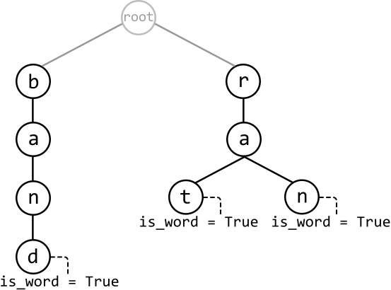
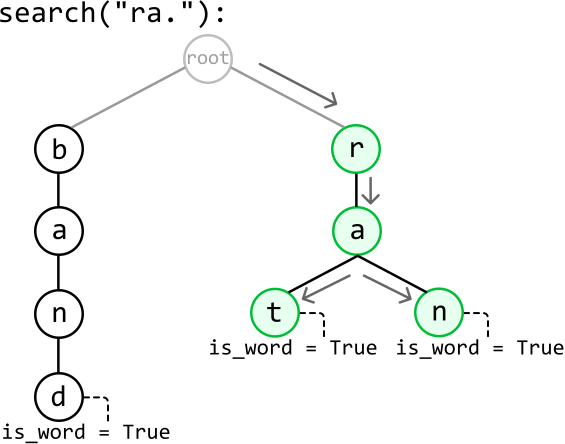
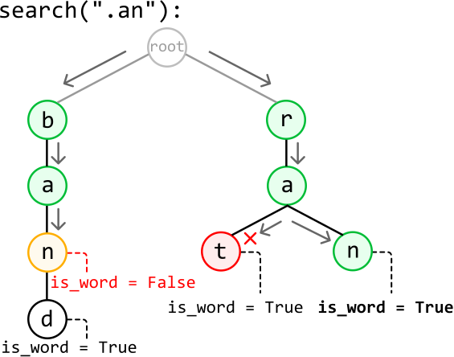

# Insert and Search Words with Wildcards

Design and implement a data structure that supports the following operations:

- `insert(word: str) -> None`: Inserts a word into the data structure.

- `search(word: str) -> bool`: Returns true if a word exists in the data structure and false if not. The word may contain **wildcards** (`'.'`) that can represent any letter.

#### Example:

```python
Input: [
  insert('band'),
  insert('rat'),
  search('ra.'),
  search('b..'),
  insert('ran'),
  search('.an')
]
Output: [True, False, True]

```

Explanation:

```python
insert("band") # data structure has: "band"
insert("rat")   # data structure has: "band" and "rat"
search("ra.")   # "ra." matches "rat": return True
search("b..")   # no three-letter word starting with ‘b' in the
               # data structure: return False
insert("ran")  # data structure has: "band", "rat", and "ran"
search(".an")  # ".an" matches "ran": return True

```

#### Constraints:

- Words will only contain lowercase English letters and `'.'` characters.

## Intuition

The requirements of this data structure closely resemble those of a **trie**, as it needs to facilitate the insertion and search of words. What makes this problem unique is the requirement to support wildcards ('.') in searches. Let’s learn how we would need to modify our trie functions to support wildcards.

**Inserting a word into the trie**

The requirements for insertion in this problem match the requirements in a traditional trie. So, let’s use the same implementation of insert as in the *Design a Trie* problem.

**Searching with wildcards**

What does it mean to encounter a wildcard? Consider the following trie:



---

If we perform a search for "ra.", we know we can traverse down nodes 'r' and 'a' until we reach the wildcard character. Since the last letter is a wildcard, it could represent any letter. So, as long as there exists a node branching out from 'a' that represents the end of a word (i.e., has `is_word == True`), the word "ra." exists in the trie. In this case, both nodes 't' and 'n' meet the requirements of this wildcard:



---

Now, let’s say we perform a search for “.an”. Since the first character is a wildcard, we need to cover all branches starting from every node representing the first character in the trie. This means starting a search from each child node of the root. We can do this by recursively calling the search function on these nodes, passing in the substring “an” because this substring contains the remaining characters to be searched for.



Notice the nodes forming the string "ban" will not satisfy the search term because node 'n' does not mark the end of a word.

---

So, at any point in the search, we need to handle two scenarios:

- When we encounter a letter, we proceed to the child of the current node that corresponds with this letter in the trie.

- When we encounter a wildcard, we explore all child nodes, as the '.' may match any character. We can perform a recursive call for each child node to search for the remainder of the word.

This strategy for handling wildcards allows us to search every possible branch for a word that matches the search term. As soon as we find one branch that represents a word matching the search term, we return true.

## Implementation

In this implementation, we use a helper function (`search_helper`) for searching because we need to pass in two extra parameters at each recursive call:

- An index that defines the start of the remaining substring that needs to be searched. We pass in an index instead because passing in the substring itself would necessitate creating that substring, which would take linear time for each recursive call.

- The `TrieNode` we’re starting the search from. This ensures we don’t restart each recursive call from the root node.

```python
class InsertAndSearchWordsWithWildcards:
   def __init__(self):
       self.root = TrieNode()
    
   def insert(self, word: str) -> None:
       node = self.root
       for c in word:
           if c not in node.children:
               node.children[c] = TrieNode()
           node = node.children[c]
       node.is_word = True
    
   def search(self, word: str) -> bool:
       # Start searching from the root of the trie.
       return self.search_helper(0, word, self.root)
    
   def search_helper(self, word_index: int, word: str, node: TrieNode) -> bool:
       for i in range(word_index, len(word)):
           c = word[i]
           # If a wildcard character is encountered, recursively search for the rest
           # of the word from each child node.
           if c == '.':
               for child in node.children.values():
                   # If a match is found, return true.
                   if self.search_helper(i + 1, word, child):
                       return True
               return False
           elif c in node.children:
               node = node.children[c]
           else:
               return False
       # After processing the last character, return true if we've reached the end
       # of a word.
       return node.is_word

```

```javascript
export class InsertAndSearchWordsWithWildcards {
  constructor() {
    this.root = new TrieNode()
  }

  insert(word) {
    let node = this.root
    for (const c of word) {
      if (!(c in node.children)) {
        node.children[c] = new TrieNode()
      }
      node = node.children[c]
    }
    node.isWord = true
  }

  search(word) {
    // Start searching from the root of the trie.
    return this._searchHelper(0, word, this.root)
  }

  _searchHelper(wordIndex, word, node) {
    for (let i = wordIndex; i < word.length; i++) {
      const c = word[i]
      // If a wildcard character is encountered, recursively search for the rest
      // of the word from each child node.
      if (c === '.') {
        for (const child of Object.values(node.children)) {
          // If a match is found, return true.
          if (this._searchHelper(i + 1, word, child)) {
            return true
          }
        }
        return false
      } else if (c in node.children) {
        node = node.children[c]
      } else {
        return false
      }
    }
    // After processing the last character, return true if we've reached the end
    // of a word.
    return node.isWord
  }
}

```

```java
import java.util.HashMap;

class Trie {
    private TrieNode root;

    public Trie() {
        this.root = new TrieNode();
    }

    public void insert(String word) {
        TrieNode node = root;
        for (char c : word.toCharArray()) {
            if (!node.children.containsKey(c)) {
                node.children.put(c, new TrieNode());
            }
            node = node.children.get(c);
        }
        node.isWord = true;
    }

    public boolean search(String word) {
        // Start searching from the root of the trie.
        return searchHelper(0, word, root);
    }

    private boolean searchHelper(int wordIndex, String word, TrieNode node) {
        for (int i = wordIndex; i < word.length(); i++) {
            char c = word.charAt(i);
            // If a wildcard character is encountered, recursively search for the rest
            // of the word from each child node.
            if (c == '.') {
                for (TrieNode child : node.children.values()) {
                    // If a match is found, return true.
                    if (searchHelper(i + 1, word, child)) {
                        return true;
                    }
                }
                return false;
            } else if (node.children.containsKey(c)) {
                node = node.children.get(c);
            } else {
                return false;
            }
        }
        // After processing the last character, return true if we've reached the end
        // of a word.
        return node.isWord;
    }
}

```

### Complexity Analysis

**Time complexity:**

- The time complexity of `insert` is O(k), where k denotes the length of the word being inserted. This is because we traverse through or insert up to k nodes into the trie in each iteration.

- The time complexity of `search` is:
  
  
  - O(k) when word contains no wildcards because we search through at most k characters in the trie.
  
  - O(26k) in the worst case, when word contains only wildcards. For each wildcard, we potentially need to explore up to 26 different characters (one for each lowercase English letter). With k wildcards, approximately 26k recursive calls are made.

**Space complexity:**

- The space complexity of `insert` is O(k) because in the worst case, the inserted word doesn’t share a prefix with words already in the trie. In this case, k new nodes are created.

- The space complexity of `search` is:
  
  
  - O(1) when word contains no wildcards.
  
  - O(k) in the worst case when word contains only wildcards due to the space taken up by the recursive call stack, which can grow up to k in size.