# Find All Words on a Board

Given a 2D board of characters and an array of words, **find all the words in the array** that can be formed by tracing a path through adjacent cells in the board. Adjacent cells are those which horizontally or vertically neighbor each other. We can't use the same cell more than once for a single word.

#### Example:

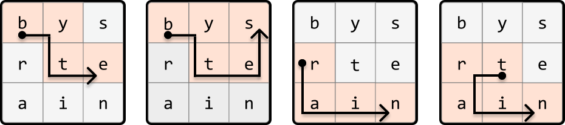

```python
Input: board = [['b', 'y', 's'], ['r', 't', 'e'], ['a', 'i', 'n']],
       words = ['byte', 'bytes', 'rat', 'rain', 'trait', 'train']
Output: ['byte', 'bytes', 'rain', 'train']

```

## Intuition

There are many layers to this problem, so let's start by considering a simpler version where we’re only required to search for one word on the board.

**Simplified problem: words array contains one word**

With only one word to find, a straightforward approach is to iterate through each cell of the board. If any cell contains the first letter of the word, perform a DFS from that cell in all four directions (left, right, up, down) to find the rest of the word. This process involves backtracking from a cell when we cannot find the next letter of the word in any of its adjacent cells. The process continues until the word is found, or we can no longer find any more letters on the board.

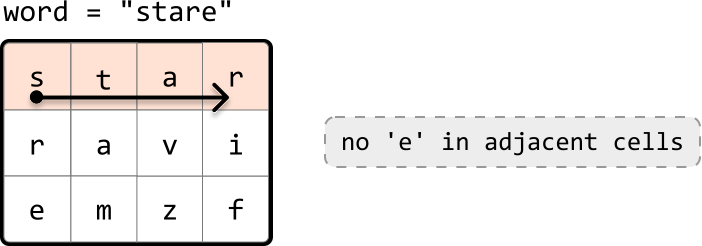

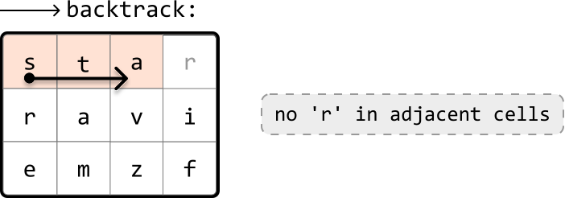

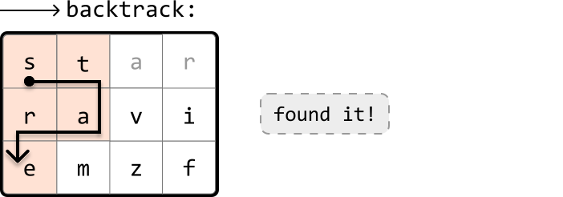

If you're not familiar with backtracking, it might be useful to review the *Backtracking* chapter before continuing with this problem.

**Original problem - words array contains multiple words**

The above approach works well for one word, but repeating this process for every word in the array is quite expensive. Let’s devise a way to make our search more efficient. Consider the following board:

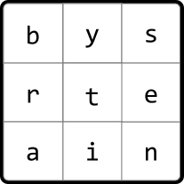

Let’s say the words array contains the words “byte” and “bytes”. Once we've found "byte", we'd ideally like to extend the search by just one more cell to also find the word "bytes":

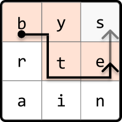

However, with our initial algorithm, we’d need to restart the search entirely to find "bytes." This is quite inefficient. What we want is a data structure that allows us to efficiently search words with shared prefixes, allowing us to find multiple words without restarting the search for each of them. This is where the **trie** data structure comes into play, as it is excellent for managing prefixes.

Let's begin creating the trie by inserting each word from the provided words array:

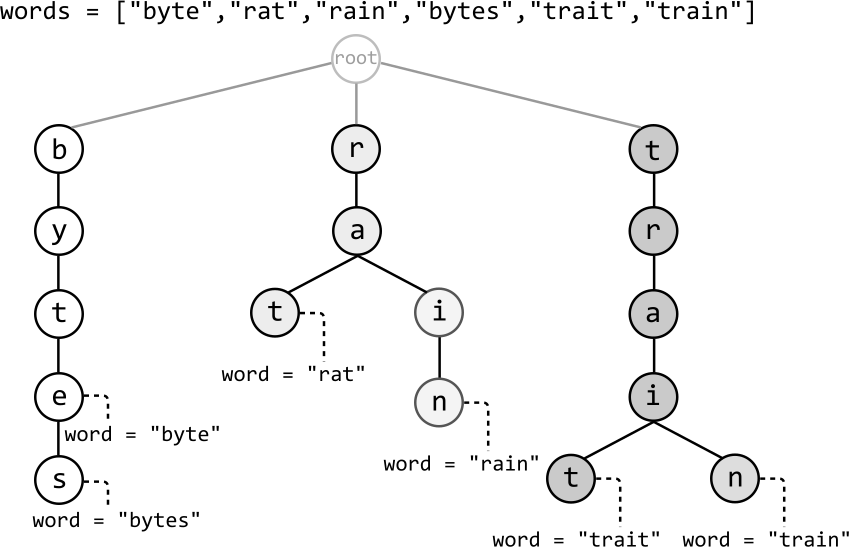

In this chapter's introduction, we discussed two options to mark the end of a word in a `TrieNode`. Here, we use the `word` attribute instead of `is_word` to determine if a `TrieNode` represents the end of a word, and to know which specific word has ended. This will be important later.

Let’s now use this trie to search for words over the board. We do this by seeing if any paths in the trie correspond with any paths on the board:

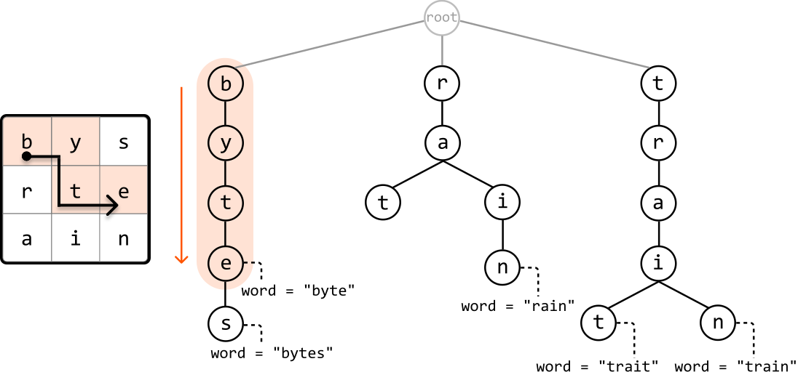

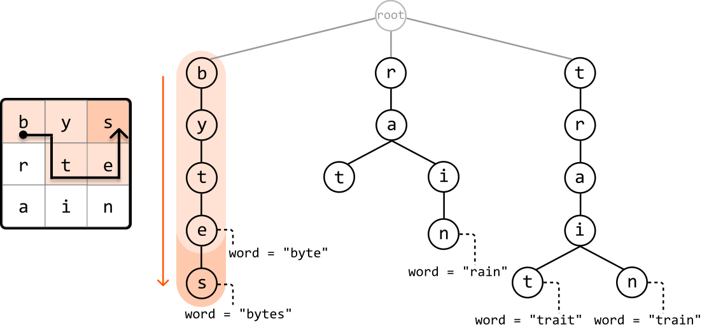

Similarly to how we used backtracking to search through the board when looking for a single word, we can also use backtracking here. Let’s have a closer look at how this works.

**Backtracking using a trie**

The first step is similar to what was discussed earlier: we go through the board until we find a cell whose character matches any of the root node's children in the trie, representing the first letter of a word.

As soon as we start going through the board, we notice that the top-left of the board, cell (0, 0), contains the character 'b', which is a child of the trie's root node.

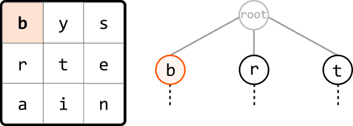

We can initiate DFS starting from this cell to see if the board contains the words formed by any of the paths branching from node ‘b’.

---

Checking through the adjacent cells of cell ‘b’, we notice that one contains ‘y’, which corresponds to a child of node ‘b’. So, let’s make a DFS call to this cell to continue looking for the rest of this trie path on the board.

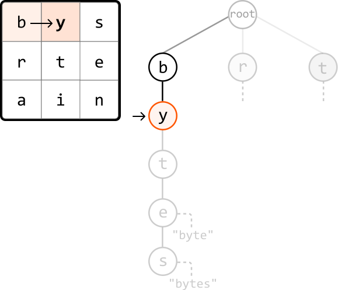

---

We continue this process until no more trie nodes can be found at an adjacent cell on the board. When this happens, we backtrack to the previous cell on the board to explore a different path.

If we ever reach a node that represents the end of the word (i.e., contains a non-null `word` attribute), we can record that word in our output:

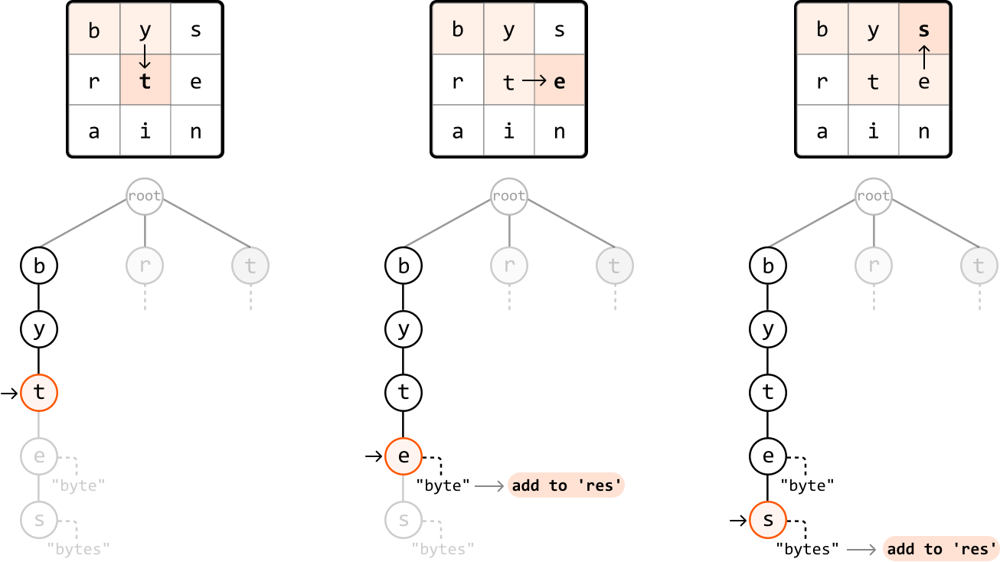

As shown, we found two words on the board from the DFS call that started at cell (0, 0). Now, we restart this process for any other cells on the board that match the character of one of the root node’s children.

---

One important aspect of this backtracking approach is keeping track of visited cells as we explore the board. Without this, we might revisit a cell unintentionally. For example, when exploring both children of node ‘i’, we could end up revisiting cell ‘t’:

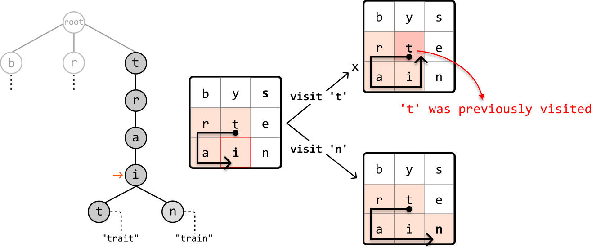

The remedy for this is to either keep track of visited cells using a hash set, or keep track of them in place by changing the visited cell to a special character (like '#') as we traverse:

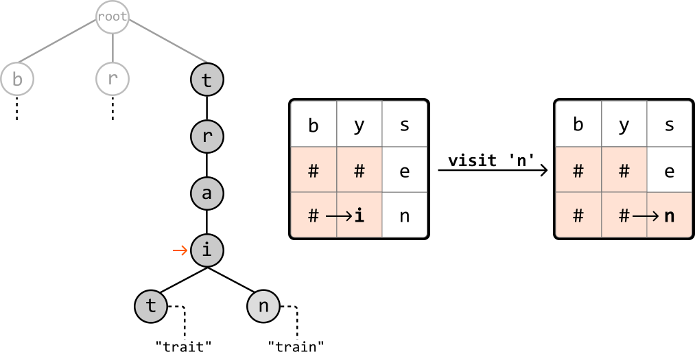

This shouldn’t be a permanent change to the board. So, we should undo this change at the end of each recursive call, as demonstrated in the following code snippet:

```python
def dfs(r, c, board, node):
    temp = board[r][c]
    board[r][c] = '#'  # Mark as visited.
    for next_r, next_c in adjacent_cells:
        if board[next_r][next_c] in node.children:
            dfs(next_r, next_c, board, node.children[board[next_r][next_c]])
    board[r][c] = temp  # Mark as unvisited.

```

```javascript
function dfs(r, c, board, node, adjacentCells) {
  const temp = board[r][c]
  board[r][c] = '#' // Mark as visited.
  for (const [nextR, nextC] of adjacentCells) {
    if (
      board[nextR] &&
      board[nextR][nextC] &&
      node.children[board[nextR][nextC]]
    ) {
      dfs(
        nextR,
        nextC,
        board,
        node.children[board[nextR][nextC]],
        adjacentCells
      )
    }
  }
  board[r][c] = temp // Mark as unvisited.
}

```

```java
public void dfs(int r, int c, char[][] board, TrieNode node) {
    char temp = board[r][c];
    board[r][c] = '#'; // Mark as visited.
    for (int[] direction : adjacent_cells) {
        int nextR = r + direction[0];
        int nextC = c + direction[1];
        if (nextR >= 0 && nextR < board.length && nextC >= 0 && nextC < board[0].length
                && board[nextR][nextC] != '#' && node.children.containsKey(board[nextR][nextC])) {
            dfs(nextR, nextC, board, node.children.get(board[nextR][nextC]));
        }
    }
    board[r][c] = temp; // Mark as unvisited.
}

```

---

Now, let’s walk through this process in detail.

For each cell on the board that matches a character of one of the root node’s children, make a recursive DFS call to that cell, passing in the corresponding node. At each of these DFS calls:

- Check if the current node represents the end of a word. If it does, add that word to the output.

- Mark the current cell as visited by setting the cell to ‘#’.

- Recursively explore all adjacent cells that correspond with a child of the current `TrieNode`.

- Backtrack by reverting the cell back to its original character (i.e., marking it as unvisited).

**Handling multiple occurrences of the same word on the board**

We need to be aware of the risk of adding duplicate words to the output, as the board may contain the same word in multiple locations. Remember that we use the word attribute on each `TrieNode` to check if it represents the end of a word. After recording a word in our output, we can set that node’s `word` attribute to null, ensuring we cannot record the same word again.

## Implementation

```python
class TrieNode:
    def __init__(self):
        self.children = {}
        self.word = None

```

```javascript
class TrieNode {
  constructor() {
    this.children = {}
    this.word = null
  }
}

```

```java
class TrieNode {
    public HashMap<String, TrieNode> children;
    public boolean isWord;
    public String word;

    public TrieNode() {
        this.children = new HashMap<>();
        this.isWord = false;
        word = null;
    }
}

```

```python
from typing import List
    
def find_all_words_on_a_board(board: List[List[str]], words: List[str]) -> List[str]:
    root = TrieNode()
    # Insert every word into the trie.
    for word in words:
        node = root
        for char in word:
            if char not in node.children:
                node.children[char] = TrieNode()
            node = node.children[char]
        node.word = word
    res = []
    # Start a DFS call from each cell of the board that contains a child of the root
    # node, which represents the first letter of a word in the trie.
    for r in range(len(board)):
        for c in range(len(board[0])):
            if board[r][c] in root.children:
                dfs(board, r, c, root.children[board[r][c]], res)
    return res
    
def dfs(board: List[List[str]], r: int, c: int, node: TrieNode, res: List[str]) -> None:
    # If the current node represents the end of a word, add the word to the result.
    if node.word:
        res.append(node.word)
        # Ensure the current word is only added once.
        node.word = None
    temp = board[r][c]
    # Mark the current cell as visited.
    board[r][c] = '#'
    # Explore all adjacent cells that correspond with a child of the current TrieNode.
    dirs = [(-1, 0), (1, 0), (0, -1), (0, 1)]
    for d in dirs:
        next_r, next_c = r + d[0], c + d[1]
        if is_within_bounds(next_r, next_c, board) and board[next_r][next_c] in node.children:
            dfs(board, next_r, next_c, node.children[board[next_r][next_c]], res)
    # Backtrack by reverting the cell back to its original character.
    board[r][c] = temp
    
def is_within_bounds(r: int, c: int, board: List[str]) -> bool:
    return 0 <= r < len(board) and 0 <= c < len(board[0])

```

```javascript
export function find_all_words_on_a_board(board, words) {
  const root = new TrieNode()
  // Insert every word into the trie.
  for (const word of words) {
    let node = root
    for (const char of word) {
      if (!node.children[char]) {
        node.children[char] = new TrieNode()
      }
      node = node.children[char]
    }
    node.word = word
  }
  const res = []
  // Start a DFS call from each cell of the board that contains a child of the root
  // node, which represents the first letter of a word in the trie.
  for (let r = 0; r < board.length; r++) {
    for (let c = 0; c < board[0].length; c++) {
      const char = board[r][c]
      if (root.children[char]) {
        dfs(board, r, c, root.children[char], res)
      }
    }
  }
  return res
}

function dfs(board, r, c, node, res) {
  // If the current node represents the end of a word, add the word to the result.
  if (node.word !== null) {
    res.push(node.word)
    // Ensure the current word is only added once.
    node.word = null
  }
  const temp = board[r][c]
  // Mark the current cell as visited.
  board[r][c] = '#'
  const dirs = [
    [-1, 0],
    [1, 0],
    [0, -1],
    [0, 1],
  ]
  // Explore all adjacent cells that correspond with a child of the current TrieNode.
  for (const [dr, dc] of dirs) {
    const nr = r + dr
    const nc = c + dc
    if (isWithinBounds(nr, nc, board) && node.children[board[nr][nc]]) {
      dfs(board, nr, nc, node.children[board[nr][nc]], res)
    }
  }
  // Backtrack by reverting the cell back to its original character.
  board[r][c] = temp // Backtrack
}

function isWithinBounds(r, c, board) {
  return r >= 0 && r < board.length && c >= 0 && c < board[0].length
}

```

```java
import java.util.ArrayList;
import java.util.HashMap;

public class Main {
    public static ArrayList<String> find_all_words_on_a_board(ArrayList<ArrayList<String>> board, ArrayList<String> words) {
        TrieNode root = new TrieNode();
        // Insert every word into the trie.
        for (String word : words) {
            TrieNode node = root;
            for (int i = 0; i < word.length(); i++) {
                String ch = String.valueOf(word.charAt(i));
                if (!node.children.containsKey(ch)) {
                    node.children.put(ch, new TrieNode());
                }
                node = node.children.get(ch);
            }
            node.word = word;
        }
        ArrayList<String> res = new ArrayList<>();
        int m = board.size();
        int n = board.get(0).size();
        // Start a DFS call from each cell of the board that contains a child of the root
        // node, which represents the first letter of a word in the trie.
        for (int r = 0; r < m; r++) {
            for (int c = 0; c < n; c++) {
                String start = board.get(r).get(c);
                if (root.children.containsKey(start)) {
                    dfs(board, r, c, root.children.get(start), res);
                }
            }
        }
        return res;
    }

    public static void dfs(ArrayList<ArrayList<String>> board, int r, int c, TrieNode node, ArrayList<String> res) {
        // If the current node represents the end of a word, add the word to the result.
        if (node.word != null) {
            res.add(node.word);
            // Ensure the current word is only added once.
            node.word = null;
        }
        String temp = board.get(r).get(c);
        // Mark the current cell as visited.
        board.get(r).set(c, "#");
        // Explore all adjacent cells that correspond with a child of the current TrieNode.
        int[][] dirs = { {-1, 0}, {1, 0}, {0, -1}, {0, 1} };
        for (int[] d : dirs) {
            int next_r = r + d[0];
            int next_c = c + d[1];
            if (isWithinBounds(next_r, next_c, board)) {
                String next = board.get(next_r).get(next_c);
                if (node.children.containsKey(next)) {
                    dfs(board, next_r, next_c, node.children.get(next), res);
                }
            }
        }
        // Backtrack by reverting the cell back to its original character.
        board.get(r).set(c, temp);
    }

    public static boolean isWithinBounds(int r, int c, ArrayList<ArrayList<String>> board) {
        return r >= 0 && r < board.size() && c >= 0 && c < board.get(0).size();
    }
}

```

### Complexity Analysis

**Time complexity:** The time complexity of `find_all_words_on_a_board` is O(L+m· n· 3L) where N denotes the number of words in the `words` array, L denotes the length of the longest word, and m· n denotes the size of the board. Here’s why:

- To build the trie, we insert each word from the input array into it, with each word containing a maximum of L characters. This takes O(N· L) time.

- Then, in the main search process, we perform a DFS for each of the mn cells on the board. Each DFS call takes O(3L) time because, at each point in the DFS, we make up to 3 recursive calls: one for each of the 3 adjacent cells (this excludes the cell we came from). This is repeated for, at most, the length of the longest word, L.

Therefore, the overall time complexity is O(N· L)+m· n· O(3· L)=O(N· L+m· n· 3L).

**Space complexity:** The space complexity is O(N· L). Here’s why:

- The trie has a space complexity of O(N· L). In the worst case, if all words have unique prefixes, we store every character of every word in the trie. Each `word` attribute stored at the end of a path in the trie takes O(L) space, and with N words. This contributes an additional O(N· L) space.

- The maximum depth of the recursive call stack is L.

Therefore, the overall space complexity is O(N· L)+O(L)=O(N· L).