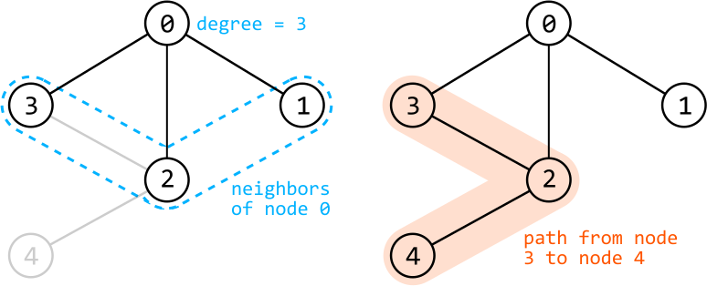
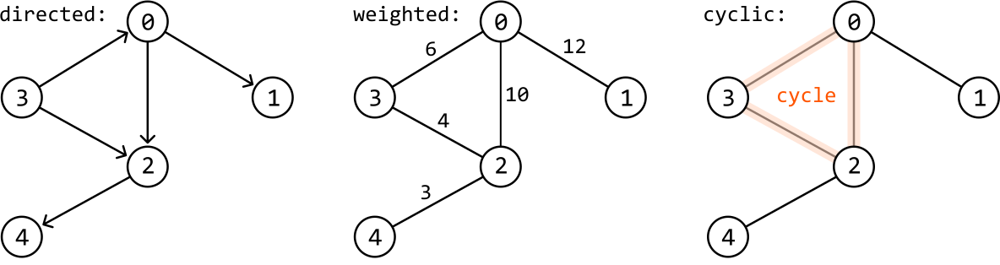
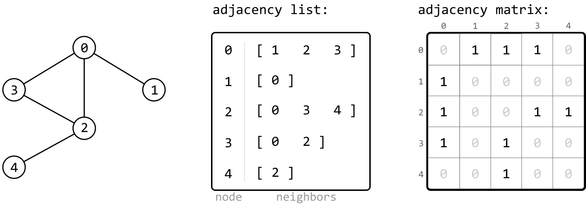
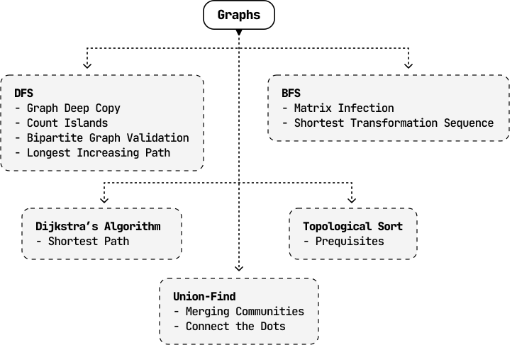

# Introduction to Graphs

## Intuition

A graph is a data structure composed of nodes (vertices) connected by edges. Graphs are used to model relationships, where the edges define the relationships.

Below is the implementation of the `GraphNode` class:

```python
class GraphNode:
    def __init__(self, val):
        self.val = val
        self.neighbors = []

```

```javascript
class GraphNode {
  constructor(val) {
    this.val = val
    this.neighbors = []
  }
}

```

```java
class GraphNode<T> {
    public T val;
    public List<GraphNode> neighbors;

    public GraphNode(int val) {
        this.val = val;
        this.neighbors = new ArrayList<GraphNode>();
    }
}

```

**Terminology:**

- Adjacent node/neighbor: two nodes are adjacent if there’s an edge connecting them.

- Degree: the number of edges connected to a node.

- Path: a sequence of nodes connected by edges.



**Attributes:**

- Directed vs. undirected: in a directed graph, edges have a direction associated with them.

- Weighted vs. unweighted: in a weighted graph, edges have a weight associated with them, such as distance or cost.

- Cyclic vs. acyclic: A cyclic graph contains at least one cycle, which is a path that starts and ends at the same node.



**Representations**

In some problems, you might not be given the graph directly. In these situations, it’s usually necessary to create your own representation of the graph. The two most common representations to choose from are an adjacency list and an adjacency matrix.

In an **adjacency list**, the neighbors of each node are stored as a list. Adjacency lists can be implemented using a hash map, where the key represents the node, and its corresponding value represents the list of that node’s neighbors.

In an **adjacency matrix**, the graph is represented as a 2D matrix where matrix[i][j] indicates an edge between nodes i and j.



Adjacency lists are the most common choice for most implementations. They are preferred when representing sparse graphs and when we need to iterate over all the neighbors of a node efficiently.

Adjacency matrices are preferred when representing dense graphs, and frequent checks are needed for the existence of specific edges.

**Traversals**

The primary graph traversal techniques are DFS and BFS, both of which have similar use cases when they’re used on trees.

When traversing a graph, it might also be necessary to **keep track of visited nodes** using a data structure such as a hash set, to ensure each node is only visited once.

DFS is typically implemented recursively, as demonstrated in the code snippet below:

```python
def dfs(node: GraphNode, visited: Set[GraphNode]):
    visited.add(node)
    process(node)
    for neighbor in node.neighbors:
        if neighbor not in visited:
            dfs(neighbor, visited)

```

```javascript
function dfs(node, visited = new Set()) {
  visited.add(node)
  process(node)
  for (const neighbor of node.neighbors) {
    if (!visited.has(neighbor)) {
      dfs(neighbor, visited)
    }
  }
}

```

```java
public void dfs(GraphNode node, Set<GraphNode> visited) {
    visited.add(node);
    process(node);
    for (GraphNode neighbor : node.neighbors) {
        if (!visited.contains(neighbor)) {
            dfs(neighbor, visited);
        }
    }
}

```

BFS is typically implemented iteratively, as demonstrated in the code snippet below:

```python
def bfs(node: GraphNode):
    visited = set()
    queue = deque([node])
    while queue:
        node = queue.popleft()
        if node not in visited:
            visited.add(node)
            process(node)
            for neighbor in node.neighbors:
                queue.append(neighbor)

```

```javascript
function bfs(node) {
  const visited = new Set()
  const queue = [node]
  while (queue.length > 0) {
    const current = queue.shift()
    if (!visited.has(current)) {
      visited.add(current)
      process(current)
      for (const neighbor of current.neighbors) {
        queue.push(neighbor)
      }
    }
  }
}

```

```java
public void bfs(GraphNode node) {
   Set<GraphNode> visited = new HashSet<>();
   Queue<GraphNode> queue = new LinkedList<>();
   queue.add(node);
   while (!queue.isEmpty()) {
       GraphNode current = queue.poll();
       if (!visited.contains(current)) {
           visited.add(current);
           process(current);
           for (GraphNode neighbor : current.neighbors) {
               queue.add(neighbor);
           }
       }
   }
}

```

Both DFS and BFS have a **time complexity** of O(n+e), where n denotes the number of nodes and e denotes the number of edges. This is because during traversal, each node is visited once, and each edge is explored once.

They both also share a **space complexity** of O(n). For DFS, this is due to the space taken up by the recursive call stack, and for BFS, it’s due to the space taken up by the queue.

## Real-world Example

**Social networks:** Users of social media sites like LinkedIn are typically represented as nodes, and connections or friendships between users are represented as edges. The graph structure allows platforms to analyze relationships, suggest new connections, and identify groups or communities within their networks.

## Chapter Outline

