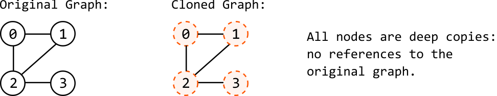
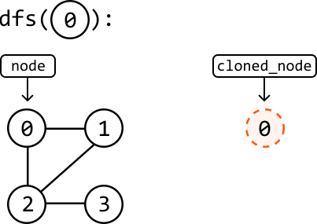
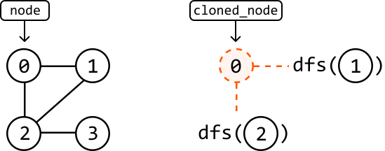
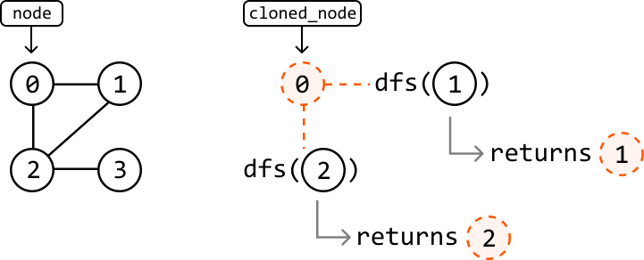
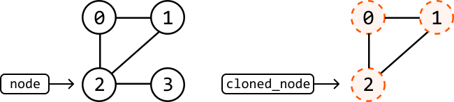
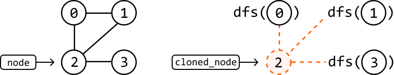
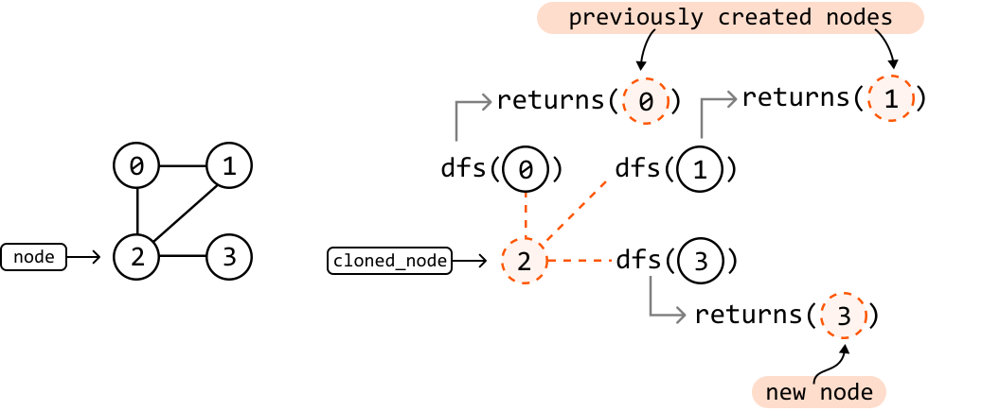

# Graph Deep Copy

Given a reference to a node within an undirected graph, create a **deep copy** (clone) of the graph. The copied graph must be completely independent of the original one. This means you need to make new nodes for the copied graph instead of reusing any nodes from the original graph.

#### Example:



#### Constraints:

- The value of each node is unique.

- Every node in the graph is reachable from the given node.

## Intuition

Our strategy for this problem is to traverse the original graph and create the deep copy during the traversal, effectively cloning each node while we traverse. Any traversal method will suffice for this strategy. In this explanation, we’ll use **DFS**.

**Traversing the graph**

Start by defining exactly what we want our DFS function to do. When we call DFS on the input node, we expect it to create a deep copy of that node and all its neighbors. Let’s break down this process.

The first thing our function will do is create a copy of its input node:



Next, we want to ensure this cloned node is connected to a clone of all its neighbors, mirroring the original node’s neighbors. To achieve this, we'll call the DFS function on each of the original node's neighbors:



Each of these DFS instances will also do the same thing by creating a clone of their input node and returning it when it has been connected to its neighbors:



In pseudocode, this is what the process looks like:

```python
dfs(node):
    cloned_node = new GraphNode(node)
    for neighbor in node.neighbors:
        cloned_neighbor = dfs(neighbor)
        cloned_node.neighbors.add(cloned_neighbor)
    return cloned_node

```

One more thing we should be mindful of is the possibility of cloning nodes that have already been cloned.

**Handling previously-cloned nodes**

Consider node 2 in the following graph and cloned graphs. Its neighbors are nodes 0, 1, and 3. Let’s say nodes 0 and 1 have already been cloned, but not node 3:



To link the cloned node 2 to its neighbors, we perform a DFS call to node 0, node 1, and node 3:



Since cloned copies of nodes 0 and 1 already exist, our DFS function should return these previously created nodes, instead of creating new ones:



We can manage this by using a **hash map** where each original node is a key, and the corresponding cloned node is the value. This way, whenever we perform a DFS call on a node, we first check if it already has a clone in our hash map. If it does, we just return the existing clone. If it doesn't, we create a new clone and add it to the hash map.

## Implementation

```python
from ds import GraphNode
    
def graph_deep_copy(node: GraphNode) -> GraphNode:
    if not node:
        return None
    return dfs(node)
    
def dfs(node: GraphNode, clone_map = {}) -> GraphNode:
    # If this node was already cloned, then return this previously cloned node.
    if node in clone_map:
        return clone_map[node]
    # Clone the current node.
    cloned_node = GraphNode(node.val)
    # Store the current clone to ensure it doesn't need to be created again in future
    # DFS calls.
    clone_map[node] = cloned_node
    # Iterate through the neighbors of the current node to connect their clones to the
    # current cloned node.
    for neighbor in node.neighbors:
        cloned_neighbor = dfs(neighbor, clone_map)
        cloned_node.neighbors.append(cloned_neighbor)
    return cloned_node

```

```javascript
import { GraphNode } from './ds.js'

export function graphDeepCopy(node) {
  if (!node) return null
  return dfs(node, new Map())
}

function dfs(node, cloneMap) {
  // If this node was already cloned, then return this previously cloned node.
  if (cloneMap.has(node)) {
    return cloneMap.get(node)
  }
  // Clone the current node.
  const clonedNode = { val: node.val, neighbors: [] }
  // Store the current clone to ensure it doesn't need to be created again in future
  // DFS calls.
  cloneMap.set(node, clonedNode)
  // Iterate through the neighbors of the current node to connect their clones to the
  // current cloned node.
  for (const neighbor of node.neighbors) {
    const clonedNeighbor = dfs(neighbor, cloneMap)
    clonedNode.neighbors.push(clonedNeighbor)
  }
  return clonedNode
}

```

```java

import core.Graph.GraphNode;
import java.util.Map;
import java.util.HashMap;

class UserCode {
    public static GraphNode<Integer> graph_deep_copy(GraphNode<Integer> node) {
        if (node == null) {
            return null;
        }
        Map<GraphNode<Integer>, GraphNode<Integer>> visited = new HashMap<>();
        return dfs(node, visited);
    }

    private static GraphNode<Integer> dfs(GraphNode<Integer> node, Map<GraphNode<Integer>, GraphNode<Integer>> visited) {
        if (visited.containsKey(node)) {
            return visited.get(node);
        }
        GraphNode<Integer> clone = new GraphNode<>(node.val);
        visited.put(node, clone);
        for (GraphNode<Integer> neighbor : node.neighbors) {
            clone.neighbors.add(dfs(neighbor, visited));
        }
        return clone;
    }
}

```

### Complexity Analysis

**Time complexity:** The time complexity of `graph_deep_copy` is O(n+e), where n is the number of nodes and e is the number of edges of the graph. This is because we traverse through and create a clone of all n nodes of the original graph, and traverse across e edges during DFS.

**Space complexity:** The space complexity is O(n) due to the space taken up by the recursive call stack, which can grow as large as n. In addition, the `clone_map` hash map stores a key-value pair for each of the n nodes.