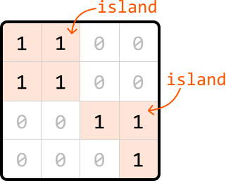
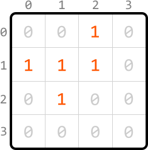
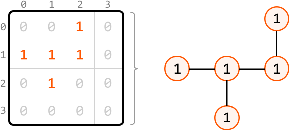
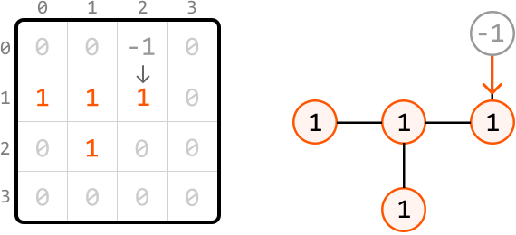
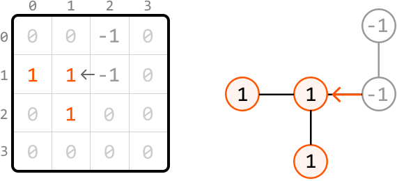
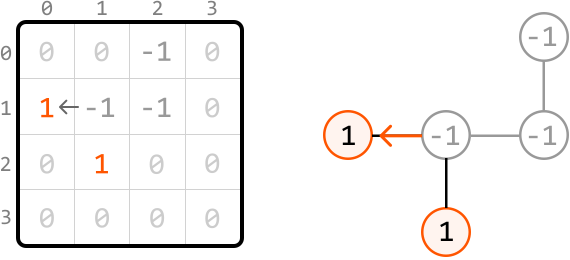
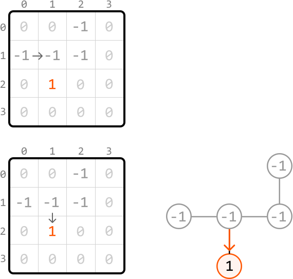
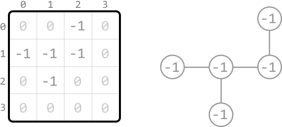
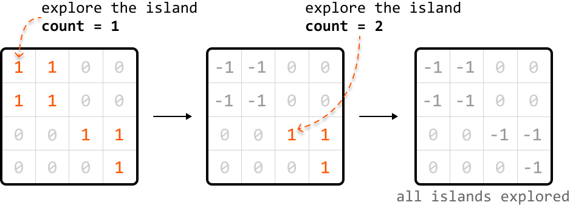
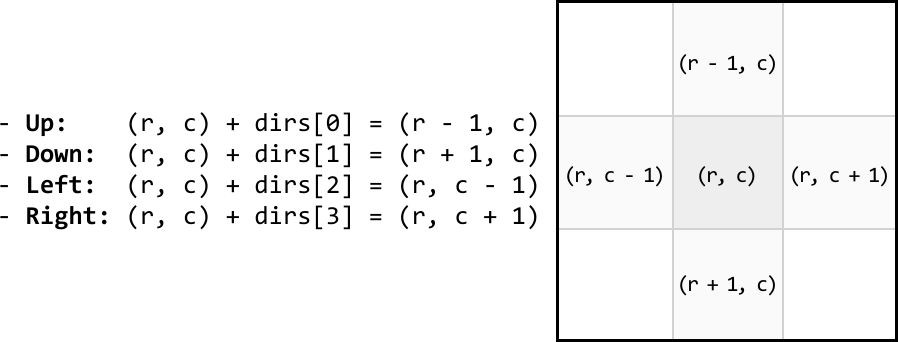

# Count Islands

Given a binary matrix representing 1s as land and 0s as water, **return the number of islands**.

An island is formed by connecting adjacent lands 4-directionally (up, down, left, and right).

#### Example:



```python
Output: 2

```

## Intuition

Before determining how to find all the islands in a matrix, let’s consider an input that contains only one island.

**Matrix with just one island**

Consider the following matrix containing one island:



When we iterate through the matrix starting from the top left, the first land cell we encounter is cell (0, 2). From here, we’d like to find the rest of the island.

The key observation is that we should be able to access every land cell on the same island by moving horizontally or vertically through neighboring land cells. This means that all 1s forming an island are connected either directly or indirectly through adjacent 1s. Conceptually, this is similar to a graph, where each cell is a node, and each connection to an adjacent cell is an edge:



This demonstrates that we can identify the rest of the island by performing a graph traversal algorithm. Most traversal algorithms will suit this purpose. In this explanation, we'll use DFS.

**Depth-first search**

For each cell we visit during the traversal, we need to mark that cell as visited to ensure it’s not visited again. There are two ways to do this:

- Use a separate data structure, such as a hash set, to keep track of the coordinates of visited cells.

- Modify the matrix by **changing the value of a visited cell from 1 to -1**, ensuring it doesn’t get revisited.

We’ll proceed with the second option because it doesn’t require the use of extra space.

---

Now, let’s begin DFS traversal. Mark the first cell, (0, 2), as visited by modifying its value to -1. Then, continue exploring by calling DFS on any neighboring land cells. Here, the only neighboring land cell is cell (1, 2):



---

From cell (1, 2), we similarly mark it as visited and explore its neighboring land cells. Again, there's only one neighboring land cell: (1, 1). So, let's make a recursive DFS call to it:



---

From cell (1, 1), mark it as visited and explore both of its neighboring land cells. Let’s continue exploring from cell (1, 0) first:



At (1, 0), there's no neighboring land. So, the recursive process naturally goes back to cell (1, 1) to continue exploring any other neighboring land cells:



---

We've now finished exploring this island:



With this island completely explored, let’s increment a variable count to indicate that one new island has been found. Now, let’s consider the main problem where there could be multiple islands in the matrix.

**Matrix with multiple islands**

We can identify all islands using the following steps:

- Search through the matrix, starting from cell (0, 0), until we find a land cell.

- Upon encountering a land cell, explore its island using DFS, marking each land cell we encounter as visited (-1) to avoid visiting them again.

- Increment count by 1, indicating the discovery of the island we just explored.

- Keep searching the matrix for any unvisited land cells. When we find one, repeat steps 2 to 4.



## Implementation

To traverse the matrix 4-directionally, we can use an array of **direction vectors**:

> 
> 
> `dirs = [(-1, 0), (1, 0), (0, -1), (0, 1)]`
> 
> 

Each pair in the array represents the changes needed to move one step in a specific direction:



```python
from typing import List
    
def count_islands(matrix: List[List[int]]) -> int:
    if not matrix:
        return 0
    count = 0
    for r in range(len(matrix)):
        for c in range(len(matrix[0])):
            # If a land cell is found, perform DFS to explore the full island, and
            # include this island in our count.
            if matrix[r][c] == 1:
                dfs(r, c, matrix)
                count += 1
    return count
    
def dfs(r: int, c: int, matrix: List[List[int]]) -> None:
    # Mark the current land cell as visited.
    matrix[r][c] = -1
    # Define direction vectors for up, down, left, and right.
    dirs = [(-1, 0), (1, 0), (0, -1), (0, 1)]
    # Recursively call DFS on each neighboring land cell to continue exploring this
    # island.
    for d in dirs:
        next_r, next_c = r + d[0], c + d[1]
        if is_within_bounds(next_r, next_c, matrix) and matrix[next_r][next_c] == 1:
            dfs(next_r, next_c, matrix)
    
def is_within_bounds(r: int, c: int, matrix: List[List[int]]) -> bool:
    return 0 <= r < len(matrix) and 0 <= c < len(matrix[0])

```

```javascript
export function count_islands(matrix) {
  if (!matrix || matrix.length === 0) return 0
  let count = 0
  for (let r = 0; r < matrix.length; r++) {
    for (let c = 0; c < matrix[0].length; c++) {
      // If a land cell is found, perform DFS to explore the island.
      if (matrix[r][c] === 1) {
        dfs(r, c, matrix)
        count++
      }
    }
  }
  return count
}

function dfs(r, c, matrix) {
  matrix[r][c] = -1 // Mark current cell as visited
  // Define direction vectors for up, down, left, and right.
  const dirs = [
    [-1, 0], // up
    [1, 0], // down
    [0, -1], // left
    [0, 1], // right
  ]
  // Recursively call DFS on each neighboring land cell to continue exploring this
  // island.
  for (const [dr, dc] of dirs) {
    const nextR = r + dr
    const nextC = c + dc
    if (isWithinBounds(nextR, nextC, matrix) && matrix[nextR][nextC] === 1) {
      dfs(nextR, nextC, matrix)
    }
  }
}

function isWithinBounds(r, c, matrix) {
  return r >= 0 && r < matrix.length && c >= 0 && c < matrix[0].length
}

```

```java
import java.util.ArrayList;

public class Main {
    public int count_islands(ArrayList<ArrayList<Integer>> matrix) {
        if (matrix == null || matrix.isEmpty()) return 0;
        int rows = matrix.size();
        int cols = matrix.get(0).size();
        int count = 0;
        for (int r = 0; r < rows; r++) {
            for (int c = 0; c < cols; c++) {
                // If a land cell is found, perform DFS to explore the full island,
                // and include this island in our count.
                if (matrix.get(r).get(c) == 1) {
                    dfs(r, c, matrix);
                    count++;
                }
            }
        }
        return count;
    }

    private void dfs(int r, int c, ArrayList<ArrayList<Integer>> matrix) {
        // Mark the current land cell as visited.
        matrix.get(r).set(c, -1);
        // Define direction vectors for up, down, left, and right.
        int[][] dirs = { {-1, 0}, {1, 0}, {0, -1}, {0, 1} };
        // Recursively call DFS on each neighboring land cell to continue exploring this island.
        for (int[] d : dirs) {
            int nextR = r + d[0];
            int nextC = c + d[1];
            if (isWithinBounds(nextR, nextC, matrix) && matrix.get(nextR).get(nextC) == 1) {
                dfs(nextR, nextC, matrix);
            }
        }
    }

    private boolean isWithinBounds(int r, int c, ArrayList<ArrayList<Integer>> matrix) {
        return r >= 0 && r < matrix.size() && c >= 0 && c < matrix.get(0).size();
    }
}

```

### Complexity Analysis

**Time complexity:** The time complexity of `count_islands` is O(m· n), where m denotes the number of rows and n denotes the number of columns. This is because each cell of the matrix is visited at most twice: once when searching for land cells in the `count_islands` function, and up to one more time during DFS.

**Space complexity:** The space complexity is O(m· n) mostly due to the recursive call stack during DFS, which can grow up to m· n in size.

## Interview Tip

*Tip: Check with an interviewer if modifications to the input are acceptable.*

During DFS, we marked cells as visited by modifying the input directly. However, in some situations, input modification may not be desirable. As such, it’s worth confirming this with the interviewer before making in-place modifications to the input.