# Matrix Infection

You are given a matrix where each cell is either:

`0`: Empty

`1`: Uninfected

`2`: Infected

With each passing second, every infected cell (2) infects its uninfected neighboring cells (1) that are 4-directionally adjacent. Determine the number of seconds required **for all uninfected cells to become infected**. If this is impossible, return ‐1.

#### Example:

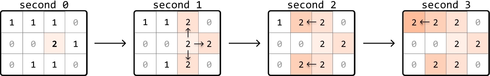

```python
Input: matrix = [[1, 1, 1, 0], [0, 0, 2, 1], [0, 1, 1, 0]]
Output: 3

```

## Intuition

Let’s begin tackling this problem by considering a simple case where the initial matrix contains only one infected cell.

**Matrix with one infected cell**

Consider the following matrix, containing just one 2:

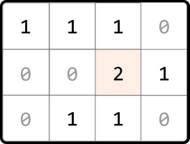

An observation is that each infected (2) and uninfected (1) cell can be considered as nodes in a graph, where edges exist between cells that are 4-directionally adjacent. Therefore, we can visualize these cells as a connected graph:

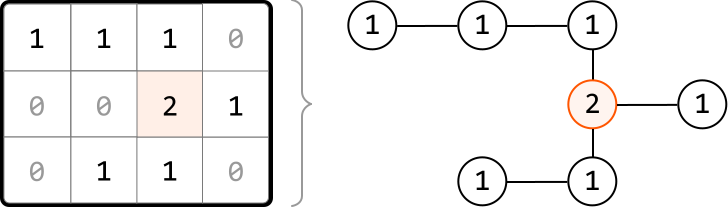

This helps us think about this problem as a graph traversal problem. Which traversal algorithm will allow us to simulate the infection process? To find out, let’s observe how cells get infected each second.

---

After the first second, the adjacent uninfected neighbors of the first infected cell become infected. These cells are a distance of 1 away from the initially infected cell:

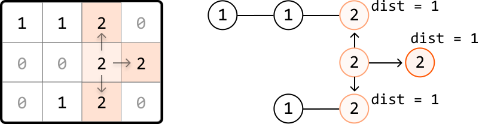

---

One second later, the neighbors of the most recently infected cells get infected. These cells are a distance of 2 from the initial infected cell:

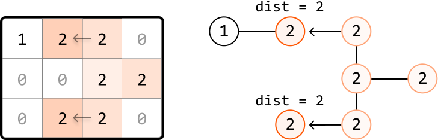

---

As we can see, the outward expansion from the initially infected cell is similar to how level-order traversal works in a tree, where each level represents nodes that are at a specific distance from the initially infected node.

So, let’s perform a level-order traversal to infect cells, starting at the infected cell. **Each level that gets traversed corresponds to 1-second passing in the infection process**.

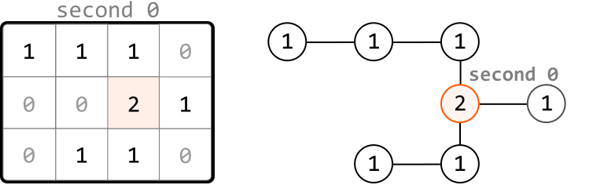

 

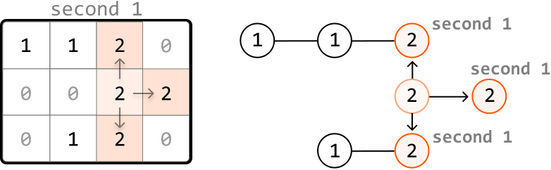

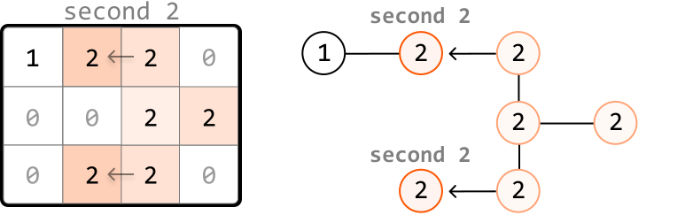

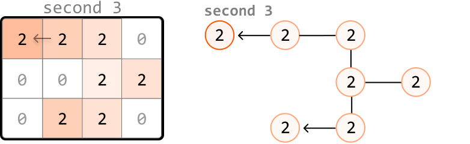

Regarding the implementation of this traversal, we know that level-order traversal is a modified version of BFS. So, we use a queue to implement this traversal. If you're unfamiliar with how this works, review the *Rightmost Nodes of a Binary Tree* problem from the *Tree* chapter, which implements a level-order traversal on a binary tree.

Now, let’s consider how we would handle a matrix which initially contains multiple infected cells.

**Matrix with multiple infected cells**

Consider the following example and its corresponding graph visualization:

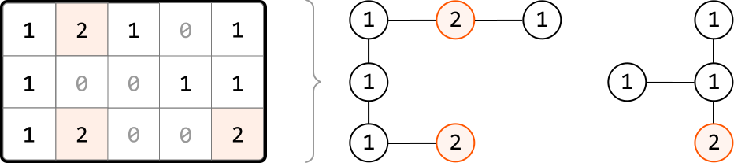

In this example, multiple cells are initially infected, meaning there are multiple cells at level 0 of the traversal.

To handle this, we use a pattern known as **multi-source BFS**. Instead of adding just one cell to the queue before performing level-order traversal, we add every initially infected cell to the queue. This way, the traversal starts with all initially infected cells as level 0, allowing the infection process to begin simultaneously from multiple starting points:

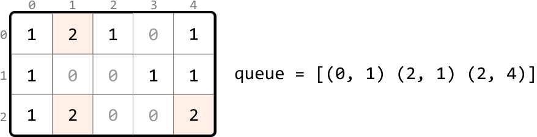

When we start with multiple cells in the queue, we can see what the level order process looks like:

 

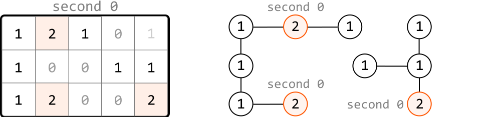

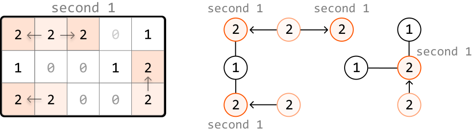

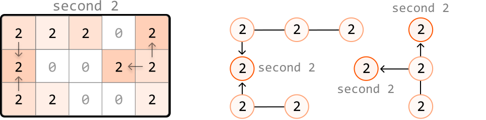

**Unreachable uninfected cells**

It's important to keep in mind that it's not always possible to infect all uninfected cells. We could encounter situations where it's impossible to reach an uninfected cell, such as in the following example:

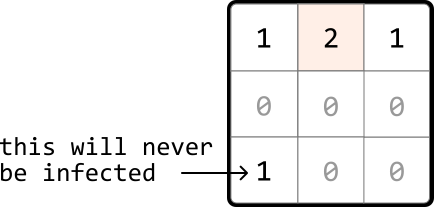

One way to account for this is to search through the matrix after level-order traversal and check if any 1s remain. However, there’s a cleaner way to accomplish this. First, in the loop where we search for all the level 0 infected cells, we can also count how many 1s there are:

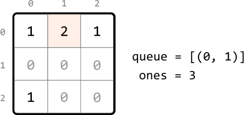

Then, as we perform the level-order traversal, we can decrement this count for each uninfected cell we infect. This way, the value of this count after the traversal will represent the number of cells that remained uninfected. We return -1 if this count is greater than 0:

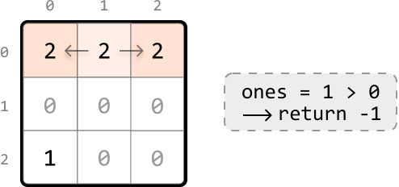

## Implementation

```python
from typing import List
from collections import deque
    
def matrix_infection(matrix: List[List[int]]) -> int:
   dirs = [(-1, 0), (1, 0), (0, -1), (0, 1)]
   queue = deque()
   ones = seconds = 0
   # Count the total number of uninfected cells and add each infected cell to the
   # queue to represent level 0 of the level-order traversal.
   for r in range(len(matrix)):
       for c in range(len(matrix[0])):
           if matrix[r][c] == 1:
               ones += 1
           elif matrix[r][c] == 2:
               queue.append((r, c))
   # Use level-order traversal to determine how long it takes to infect the
   # uninfected cells.
   while queue and ones > 0:
       # 1 second passes with each level of the matrix that's explored.
       seconds += 1
       for _ in range(len(queue)):
           r, c = queue.popleft()
           # Infect any neighboring 1s and add them to the queue to be processed in
           # the next level.
           for d in dirs:
               next_r, next_c = r + d[0], c + d[1]
               if is_within_bounds(next_r, next_c, matrix) and matrix[next_r][next_c] == 1:
                   matrix[next_r][next_c] = 2
                   ones -= 1
                   queue.append((next_r, next_c))
   # If there are still uninfected cells left, return -1. Otherwise, return the time
   # passed.
   return seconds if ones == 0 else -1
    
def is_within_bounds(r: int, c: int, matrix: List[List[int]]) -> bool:
    return 0 <= r < len(matrix) and 0 <= c < len(matrix[0])

```

```javascript
export function matrix_infection(matrix) {
  const dirs = [
    [-1, 0], // up
    [1, 0], // down
    [0, -1], // left
    [0, 1], // right
  ]
  const queue = []
  let ones = 0
  let seconds = 0
  // Count the total number of uninfected cells and add each infected cell to the
  // queue to represent level 0 of the level-order traversal.
  for (let r = 0; r < matrix.length; r++) {
    for (let c = 0; c < matrix[0].length; c++) {
      if (matrix[r][c] === 1) {
        ones++
      } else if (matrix[r][c] === 2) {
        queue.push([r, c])
      }
    }
  }
  // Use level-order traversal to determine how long it takes to infect the
  // uninfected cells.
  while (queue.length > 0 && ones > 0) {
    // 1 second passes with each level of the matrix that's explored.
    seconds++
    const levelSize = queue.length
    for (let i = 0; i < levelSize; i++) {
      const [r, c] = queue.shift()
      // Infect any neighboring 1s and add them to the queue to be processed in
      // the next level.
      for (const [dr, dc] of dirs) {
        const nextR = r + dr
        const nextC = c + dc
        if (
          isWithinBounds(nextR, nextC, matrix) &&
          matrix[nextR][nextC] === 1
        ) {
          matrix[nextR][nextC] = 2
          ones--
          queue.push([nextR, nextC])
        }
      }
    }
  }
  // If there are still uninfected cells left, return -1. Otherwise, return the time
  // passed.
  return ones === 0 ? seconds : -1
}

function isWithinBounds(r, c, matrix) {
  return r >= 0 && r < matrix.length && c >= 0 && c < matrix[0].length
}

```

```java
import java.util.ArrayList;
import java.util.LinkedList;
import java.util.Queue;

public class Main {
    public static int matrix_infection(ArrayList<ArrayList<Integer>> matrix) {
        int rows = matrix.size();
        if (rows == 0) return 0;
        int cols = matrix.get(0).size();
        int[][] dirs = { {-1, 0}, {1, 0}, {0, -1}, {0, 1} };
        Queue<int[]> queue = new LinkedList<>();
        int ones = 0, seconds = 0;
        // Count uninfected cells and enqueue infected cells
        for (int r = 0; r < rows; r++) {
            for (int c = 0; c < cols; c++) {
                int cell = matrix.get(r).get(c);
                if (cell == 1) {
                    ones++;
                } else if (cell == 2) {
                    queue.offer(new int[] {r, c});
                }
            }
        }
        // Multi-source BFS
        while (!queue.isEmpty() && ones > 0) {
            seconds++;
            int size = queue.size();
            for (int i = 0; i < size; i++) {
                int[] current = queue.poll();
                int r = current[0];
                int c = current[1];
                for (int[] dir : dirs) {
                    int nextR = r + dir[0];
                    int nextC = c + dir[1];
                    if (isWithinBounds(nextR, nextC, rows, cols) && matrix.get(nextR).get(nextC) == 1) {
                        matrix.get(nextR).set(nextC, 2);
                        ones--;
                        queue.offer(new int[] {nextR, nextC});
                    }
                }
            }
        }
        return ones == 0 ? seconds : -1;
    }

    private static boolean isWithinBounds(int r, int c, int rows, int cols) {
        return r >= 0 && r < rows && c >= 0 && c < cols;
    }
}

```

### Complexity Analysis

**Time complexity:** The time complexity of `matrix_infection` is O(m· n), where m denotes the number of rows, and n denotes the number of columns. This is because in the worst case, every cell in the matrix is explored during level-order traversal.

**Space complexity:** The space complexity is O(m· n), primarily due to the queue, which can store up to m· n cells.