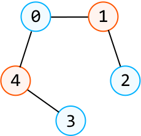
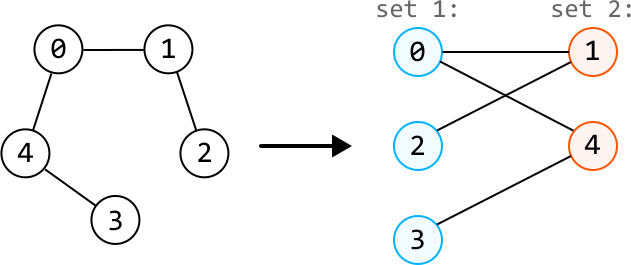
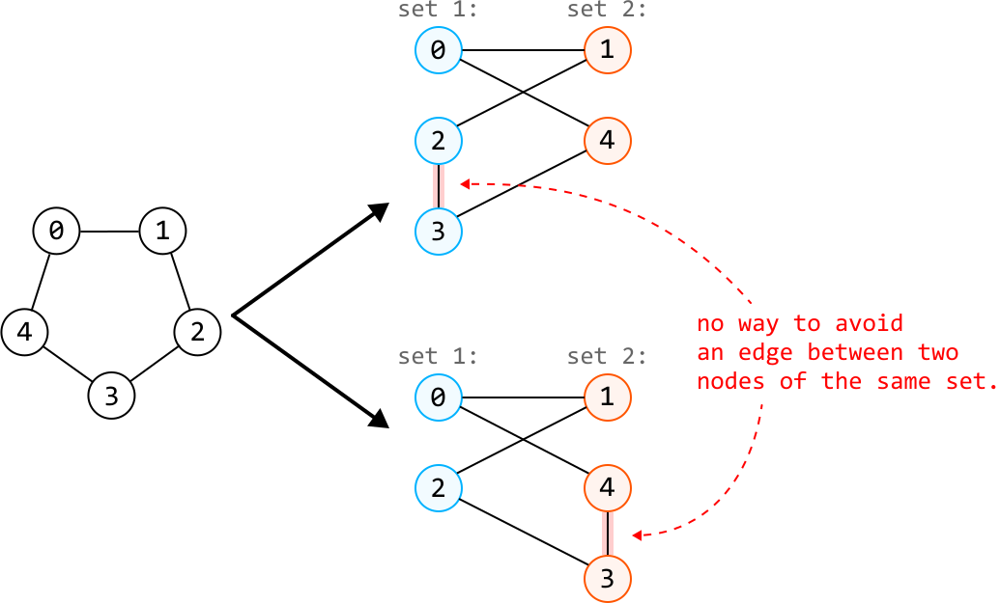
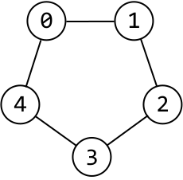
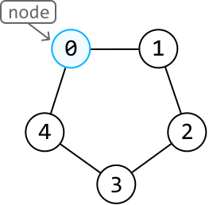
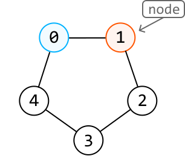
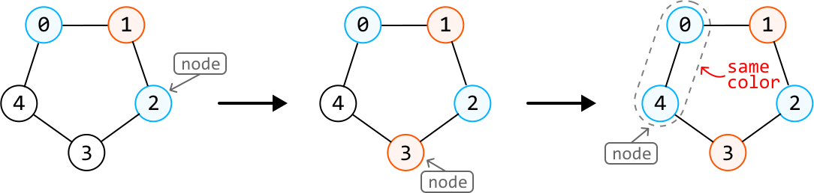
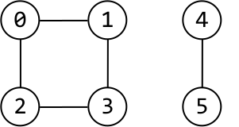
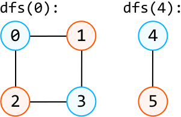

# Bipartite Graph Validation

Given an undirected graph, determine if it's bipartite. A graph is bipartite if the nodes can be colored in one of two colors, so that **no two adjacent nodes are the same color**.

The input is presented as an adjacency list, where `graph[i]` is a list of all nodes adjacent to node `i`.

#### Example:



```python
Input: graph = [[1, 4], [0, 2], [1], [4], [0, 3]]
Output: True

```

## Intuition

Before diving into a solution, let’s first understand what makes a graph bipartite. If the nodes of a graph can be divided into two distinct sets, with the edges only running between nodes from different sets, then the graph is bipartite. We can visually rearrange the nodes of the following graph to demonstrate this:



With a graph that isn’t bipartite, it’s impossible to arrange the nodes this way without an edge existing between two nodes of the same set:



To determine if a graph is bipartite, we can use graph coloring, where we attempt to color one set of nodes with one color, and the other set of nodes with another color, while ensuring no adjacent nodes share the same color. Let’s explore this idea.

**Graph coloring**

Let's use blue and orange in our coloring process. One potential strategy is: **for each node we color blue, color all of its neighbors orange, and vice versa**. Most traversal algorithms allow us to color neighboring nodes in this way. In this explanation, we use **DFS**.

Let’s try applying this coloring process to the example below and see how it works:



---

Start by coloring node 0 blue:



---

Using DFS, we explore the neighbors of node 0, starting with node 1. All of its neighbors need to be colored orange, so let’s make a DFS call to node 1 to color it orange:



---

Let’s continue doing this for the next few nodes in the DFS process:



Above, we encountered an issue. We needed to color node 4 blue, but one of node 4’s neighbors, node 0, is also colored blue. This means the graph cannot be colored using our graph coloring strategy. In other words, the graph is not bipartite.

---

We now have a strategy to confirm if a graph is bipartite using the two-coloring technique. But how can we be sure that it always works? We’ve been coloring adjacent nodes in alternating colors from the beginning of the DFS. This means if we encounter a situation where two adjacent nodes are the same color, it means there’s no way to color the graph differently, since we’ve been following the rule of using different colors for neighboring nodes all along.

**Handling multiple components**

Keep in mind the input isn't necessarily a graph that's fully connected. It could be a graph with multiple components, such as this:



As such, we need to ensure we color all components of the graph by calling DFS on every uncolored node:



If we can confirm that all components can be colored using two colors, the graph is bipartite. However, if any of these components cannot be colored this way, the graph is not bipartite.

## Implementation

In this implementation, we color the nodes blue and orange using the numbers 1 and -1 to represent these colors, respectively. To keep track of each node's color, we use an array called colors, initialized with all 0s, where 0 represents an unvisited node. As we explore the graph using DFS, we update the colors array by setting each node to either 1 (blue) or -1 (orange).

```python
def bipartite_graph_validation(graph: List[List[int]]) -> bool:
    colors = [0] * len(graph)
    # Determine if each graph component is bipartite.
    for i in range(len(graph)):
        if colors[i] == 0 and not dfs(i, 1, graph, colors):
           return False
    return True
    
def dfs(node: int, color: int, graph: List[List[int]], colors: List[int]) -> bool:
    colors[node] = color
    for neighbor in graph[node]:
        # If the current neighbor has the same color as the current node, the graph is
        # not bipartite.
        if colors[neighbor] == color:
            return False
        # If the current neighbor is not colored, color it with the other color and
        # continue the DFS.
        if colors[neighbor] == 0 and not dfs(neighbor, -color, graph, colors):
            return False
    return True

```

```javascript
export function bipartite_graph_validation(graph) {
  const colors = new Array(graph.length).fill(0)
  // Determine if each component is bipartite
  for (let i = 0; i < graph.length; i++) {
    if (colors[i] === 0 && !dfs(i, 1, graph, colors)) {
      return false
    }
  }
  return true
}

function dfs(node, color, graph, colors) {
  colors[node] = color
  for (const neighbor of graph[node]) {
    // If the current neighbor has the same color as the current node, the graph is
    // not bipartite.
    if (colors[neighbor] === color) {
      return false
    }
    // If the current neighbor is not colored, color it with the other color and
    // continue the DFS.
    if (colors[neighbor] === 0 && !dfs(neighbor, -color, graph, colors)) {
      return false
    }
  }
  return true
}

```

```java
import java.util.ArrayList;

public class Main {
    public boolean bipartite_graph_validation(ArrayList<ArrayList<Integer>> graph) {
        int[] colors = new int[graph.size()];
        // Determine if each graph component is bipartite.
        for (int i = 0; i < graph.size(); i++) {
            if (colors[i] == 0 && !dfs(i, 1, graph, colors)) {
                return false;
            }
        }
        return true;
    }

    private boolean dfs(int node, int color, ArrayList<ArrayList<Integer>> graph, int[] colors) {
        colors[node] = color;
        for (int neighbor : graph.get(node)) {
            // If the current neighbor has the same color as the current node, the graph is
            // not bipartite.
            if (colors[neighbor] == color) {
                return false;
            }
            // If the current neighbor is not colored, color it with the other color and
            // continue the DFS.
            if (colors[neighbor] == 0 && !dfs(neighbor, -color, graph, colors)) {
                return false;
            }
        }
        return true;
    }
}

```

### Complexity Analysis

**Time complexity:** The time complexity of `bipartite_graph_validation` is O(n+e) where n denotes the number of nodes and e denotes the number of edges. This is because we explore all nodes in the graph and traverse across e edges during DFS.

**Space complexity:** The space complexity is O(n) due to the space taken up by the recursive call stack, which can grow as large as n. In addition, the colors array also contributes O(n) space.